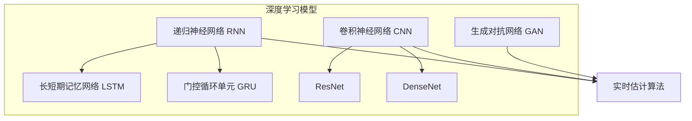
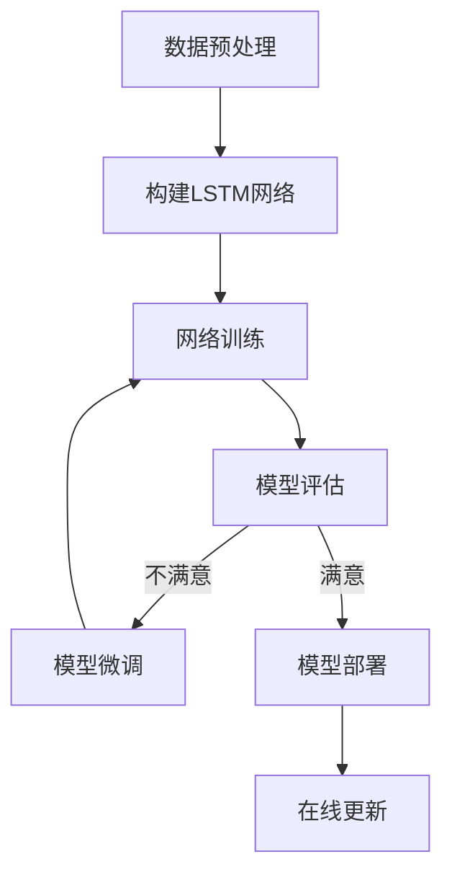

好的,我明白了您的要求。以下是以"AI人工智能深度学习算法:在实时估计中的应用"为题的技术博客文章正文内容:

# AI人工智能深度学习算法:在实时估计中的应用

## 1. 背景介绍

### 1.1 问题的由来

在当今快节奏的数字时代,实时数据处理和分析变得前所未有的重要。无论是金融交易、网络安全监控还是自动驾驶系统,都需要对大量的连续数据流进行高效、准确的实时估计和预测。传统的机器学习算法由于处理能力和时间延迟等限制,很难满足实时性的要求。因此,基于深度学习的实时估计算法应运而生,为解决这一挑战提供了新的思路。

### 1.2 研究现状  

近年来,深度学习在计算机视觉、自然语言处理等领域取得了巨大成功,并逐渐被应用到实时估计的场景中。研究人员提出了多种基于递归神经网络(RNN)、卷积神经网络(CNN)和生成对抗网络(GAN)等的实时估计模型,展现出优异的性能。但同时也面临一些挑战,如模型复杂度高、训练数据需求大、实时性能仍有待提高等。

### 1.3 研究意义

实时估计在工业自动化、智能交通、金融预测等诸多领域都有广泛的应用前景。通过深度学习算法,我们可以从海量动态数据中提取有价值的信息,及时做出精准的估计和决策,从而提高生产效率、优化资源配置、降低运营风险。本文将系统介绍基于深度学习的实时估计算法原理、模型及应用,为读者提供一个全面的认知。

### 1.4 本文结构

本文首先阐述实时估计的背景及深度学习在该领域的研究现状。接下来重点介绍几种核心的深度学习实时估计算法,包括原理、数学模型、实现步骤等。然后通过实例分析这些算法在不同场景下的应用。最后总结了该领域的发展趋势和面临的挑战。

## 2. 核心概念与联系

实时估计的核心目标是对连续的数据流进行动态分析和预测。深度学习为解决这一问题提供了有力的工具。

深度神经网络具有强大的特征提取和模式识别能力,能够从原始数据中自动学习到高阶抽象特征,从而对复杂的非线性系统进行有效的建模。与传统的机器学习方法相比,深度学习模型通常具有更高的容量和灵活性,能够更精准地捕捉数据内在的规律。

递归神经网络(RNN)是处理序列数据的有效模型,它引入了记忆机制,能够很好地捕捉数据序列中的长期依赖关系。长短期记忆网络(LSTM)和门控循环单元(GRU)等变体进一步提高了RNN在长序列场景下的性能。

卷积神经网络(CNN)凭借局部连接和权值共享的结构,在提取数据的局部特征方面表现出色,广泛应用于计算机视觉等领域。一些新型CNN架构如ResNet、DenseNet等,进一步增强了网络的表达能力。

生成对抗网络(GAN)则是通过生成器和判别器的对抗训练,学习数据的真实分布,从而对缺失或未知数据进行有效估计。

通过组合和创新应用这些核心的深度学习模型,研究人员提出了多种面向实时估计任务的新颖算法,展现出极大的应用潜力。

## 3. 核心算法原理及具体操作步骤

### 3.1 算法原理概述

实时估计中常用的深度学习算法主要有基于RNN/LSTM的序列建模方法、基于CNN的时序卷积网络模型,以及结合GAN的生成式估计模型等。

- **基于RNN/LSTM的序列建模**

RNN/LSTM网络通过引入记忆状态,能够很好地捕捉序列数据中的长期依赖关系,从而对时间序列进行精确的建模和预测。将当前时刻的观测数据和上一时刻的隐藏状态传入RNN单元,经过非线性变换后输出新的隐藏状态,并据此生成预测值。通过端到端的训练,RNN可以自动学习到最优的内部表示,从而对复杂的动态系统进行精确的估计。

- **基于CNN的时序卷积网络**  

CNN擅长从局部区域提取特征,因此可以应用于对时间序列数据进行建模。时序卷积网络(TCN)就是将卷积神经网络应用于序列数据的一种方法。TCN使用因果卷积核(casual convolution),确保网络在预测时刻t时,只利用了过去时间步的信息。TCN可以有效捕捉时间序列的局部模式,并通过层叠的卷积和池化操作学习多尺度的时间不变特征。

- **基于GAN的生成式估计**

生成对抗网络(GAN)通过生成器G和判别器D的对抗博弈,学习真实数据的分布。在实时估计中,我们可以将GAN应用于估计缺失或未知的部分数据。生成器G输入已知数据,输出估计的未知数据,判别器D则判断生成的数据是否真实。通过反向传播,G和D相互对抗地提高性能,最终G可以生成逼近真实数据分布的估计值。

上述算法均可以端到端的方式进行训练,自动从数据中学习最优参数,无需人工设计特征提取器。但也存在一些需要注意的问题,如模型复杂度高、训练数据需求量大、收敛性差等,往往需要一些改进和创新。

### 3.2 算法步骤详解

以LSTM为例,实时估计的基本流程如下:

1. **数据预处理**:对原始时间序列数据进行标准化、缺失值填充等预处理,将其转化为LSTM可以接受的格式。

2. **构建LSTM网络**:确定LSTM的层数、隐藏单元数量、激活函数等超参数,并根据问题的特点选择合适的LSTM变体(如带注意力机制的LSTM等)。

3. **网络训练**:将预处理后的数据输入LSTM,通过反向传播算法对网络参数进行端到端的训练,使用均方误差、平滑L1损失等作为损失函数,Adam等优化算法进行参数更新。

4. **模型评估**:在验证集上评估训练好的LSTM模型的性能,可以使用均方根误差(RMSE)、平均绝对百分比误差(MAPE)等指标。

5. **模型微调**:根据评估结果对模型进行微调,如调整学习率、正则化系数、提早停止等,以期获得更好的性能。

6. **模型部署**:将训练好的LSTM模型部署到实际的生产环境中,对实时到来的数据流进行连续估计和预测。

7. **在线更新**:在获得新的数据后,可以对LSTM模型进行增量式的在线学习,以适应数据分布的变化。

上述步骤同样适用于CNN、GAN等其他深度学习模型,只需对具体的网络结构和损失函数进行相应的修改。

### 3.3 算法优缺点

**优点:**

- 强大的建模能力,可以自动学习复杂非线性系统的内在规律
- 端到端的训练方式,无需人工设计特征提取器
- 通用性强,可以应用于多种类型的时间序列数据
- 利用GPU等硬件加速,可以实现实时的高效计算

**缺点:**

- 模型复杂度高,训练数据需求量大
- 存在参数爆炸、梯度消失等优化困难
- 对异常值和噪声敏感,需要数据清洗
- 模型可解释性较差,内部过程不透明

### 3.4 算法应用领域

基于深度学习的实时估计算法可以广泛应用于以下领域:

- **金融预测**:实时估计股票、外汇等金融资产的价格走势
- **网络安全**:检测和预测网络入侵、DDoS攻击等安全威胁
- **工业控制**:精确估计生产过程中的关键参数,实现智能控制
- **天气预报**:对气象大数据进行建模,提高天气预报的准确性  
- **医疗诊断**:从生理信号中实时检测患者的健康状况
- **自动驾驶**:对路况、车辆状态等进行实时估计,保障行车安全
- **语音识别**:实时估计语音信号,用于语音交互和控制
- **视频分析**:实时检测和跟踪视频中的目标对象

总的来说,任何需要对连续数据流进行动态分析和预测的场景,都可以考虑应用基于深度学习的实时估计算法。

## 4. 数学模型和公式及详细讲解与举例说明

### 4.1 数学模型构建

实时估计问题可以形式化为:给定历史观测序列$X = \{x_1, x_2, \cdots, x_t\}$,估计当前时刻$t$的目标值$y_t$。我们的目标是学习一个模型$f$,使其能够从$X$映射到$y_t$,即:

$$y_t = f(x_1, x_2, \cdots, x_t)$$

对于深度学习模型,上式可以具体化为:

$$y_t = \phi(h_t)$$
$$h_t = \psi(h_{t-1}, x_t; \theta)$$

其中$h_t$为时刻$t$的隐藏状态,通过递归地应用转移函数$\psi$获得。$\phi$是输出层,将隐藏状态映射到目标值。$\theta$为需要学习的模型参数。

不同的深度学习模型对$\psi$和$\phi$的具体形式有所不同。以LSTM为例:

$$\begin{align}
f_t &= \sigma(W_f \cdot [h_{t-1}, x_t] + b_f) \\
i_t &= \sigma(W_i \cdot [h_{t-1}, x_t] + b_i) \\
o_t &= \sigma(W_o \cdot [h_{t-1}, x_t] + b_o) \\
c_t &= f_t \odot c_{t-1} + i_t \odot \tanh(W_c \cdot [h_{t-1}, x_t] + b_c) \\
h_t &= o_t \odot \tanh(c_t)
\end{align}$$

上式中,$f_t, i_t, o_t$分别为遗忘门、输入门、输出门,控制隐藏状态$h_t$和记忆细胞$c_t$的更新。$\sigma$为sigmoid激活函数,控制门的值在0-1之间。$\odot$为元素wise乘积。$W$和$b$为待学习的权重和偏置参数。

对于给定的训练数据$\{X^{(i)}, y^{(i)}\}$,我们可以最小化损失函数(如均方误差):

$$\mathcal{L}(\theta) = \frac{1}{N}\sum_{i=1}^N \|y^{(i)} - \hat{y}^{(i)}\|^2$$

其中$\hat{y}^{(i)}$为模型对第$i$个样本的输出,通过反向传播算法计算梯度并更新$\theta$,使损失函数最小化。

### 4.2 公式推导过程

我们以LSTM为例,推导其反向传播公式。假设LSTM的输出为$y_t = W_y h_t + b_y$,损失函数为$\mathcal{L} = (y_t - \hat{y}_t)^2$,目标是计算$\frac{\partial \mathcal{L}}{\partial \theta}$,其中$