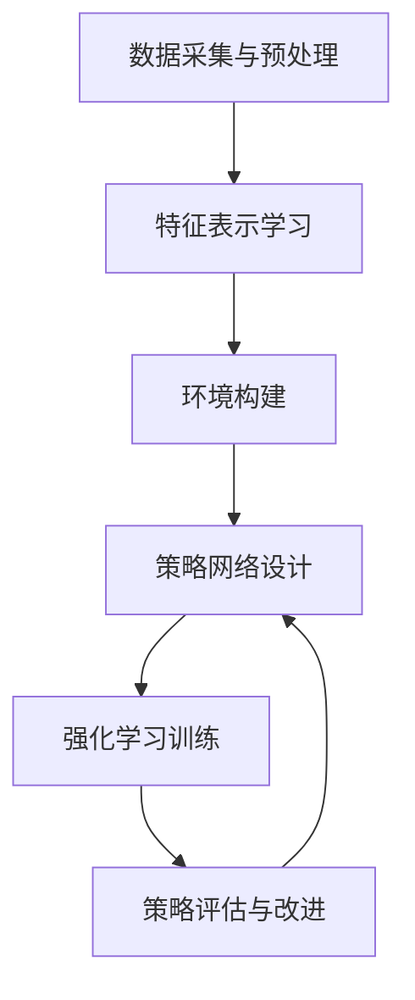

# AI人工智能深度学习算法：在电子商务中应用深度学习代理的策略

关键词：深度学习、强化学习、电子商务、推荐系统、个性化、用户体验

## 1. 背景介绍
### 1.1  问题的由来
随着电子商务的快速发展,如何为用户提供更加个性化和智能化的服务成为了电商平台面临的重要挑战。传统的基于规则和统计的推荐方法已经难以满足日益增长的用户需求。深度学习作为人工智能领域的前沿技术,为解决这一问题提供了新的思路和方法。
### 1.2  研究现状
目前,深度学习在计算机视觉、自然语言处理等领域取得了显著成果,但在电子商务领域的应用还处于起步阶段。一些研究者尝试将深度学习应用于推荐系统、用户行为预测、广告投放等方面,取得了一定效果。但如何构建高效的深度学习模型,并将其与电商业务深度融合,仍是亟待解决的问题。
### 1.3  研究意义 
本文旨在探索将深度学习,特别是深度强化学习应用于电子商务的策略和方法。通过构建智能代理,使其能够自主学习用户行为模式,优化决策过程,提升用户体验和转化率。这对于推动电商智能化发展,提升行业竞争力具有重要意义。
### 1.4  本文结构
本文首先介绍深度学习和强化学习的核心概念和联系,然后重点阐述将其应用于电商场景的核心算法原理和实现步骤。接着通过构建数学模型和案例分析,讲解算法的理论基础和实践效果。最后总结全文,并展望未来的发展方向和挑战。

## 2. 核心概念与联系
深度学习是一类模仿人脑结构和功能,利用多层神经网络对数据进行表征学习的机器学习方法。与传统的浅层学习模型相比,深度学习能够学习更加复杂和抽象的特征模式,在感知智能领域表现出色。

强化学习是一种让智能体通过与环境的交互来学习策略,以实现长期回报最大化的学习范式。与监督学习不同,强化学习并不需要预先标注数据,而是通过试错和反馈来不断优化策略。近年来,深度强化学习将深度学习与强化学习相结合,极大地提升了强化学习的表征和决策能力。

在电子商务场景中,我们可以将深度学习应用于对用户、商品、行为等信息的表征学习,挖掘隐含的特征模式。在此基础上,再利用强化学习构建智能代理,使其能够根据用户的实时反馈动态调整策略,优化用户的长期体验。二者的结合将为电商智能化注入新的动力。

## 3. 核心算法原理 & 具体操作步骤
### 3.1  算法原理概述
本文提出的核心算法是基于深度强化学习的电商智能代理算法(E-commerce Intelligent Agent based on Deep Reinforcement Learning, EIAD)。该算法以用户的长期满意度为优化目标,通过深度神经网络学习用户和商品的特征表示,并用强化学习算法优化代理的策略函数,最终实现智能推荐和个性化服务。
### 3.2  算法步骤详解
EIAD算法主要包含以下几个步骤:
1. 数据采集与预处理:收集用户行为数据(如点击、购买、评价等),对数据进行清洗和标准化。
2. 特征表示学习:利用深度神经网络(如CNN、RNN、GNN等)对用户和商品的原始特征进行表示学习,得到低维稠密向量。 
3. 环境构建:将电商场景抽象为马尔可夫决策过程(MDP),定义状态空间、动作空间和奖励函数。
4. 策略网络设计:设计策略网络(Actor)和值函数网络(Critic),它们分别用于生成动作概率分布和估计状态-动作值函数。
5. 强化学习训练:利用策略梯度等算法对策略网络和值函数网络进行端到端训练,不断更新和优化网络参数。
6. 策略评估与改进:在离线和在线环境中评估策略的效果,并持续迭代改进算法。

算法流程图如下:

### 3.3  算法优缺点
EIAD算法的优点在于:
- 端到端学习:无需人工设计特征和规则,通过端到端学习获得最优策略
- 非静态反馈:能够根据用户的实时反馈动态调整策略
- 长期优化:以用户的长期满意度为优化目标,避免短视行为

但它也存在一些局限性:
- 样本效率:深度强化学习通常需要大量的交互数据,样本效率较低
- 探索问题:平衡探索和利用是一个关键问题,需要精心设计探索策略
- 泛化能力:模型的泛化能力有待进一步提高,以应对冷启动等问题

### 3.4  算法应用领域
EIAD算法可以应用于电商的多个场景,例如:
- 个性化推荐:根据用户画像和行为历史,推荐用户可能感兴趣的商品
- 智能搜索:优化搜索排序策略,提高搜索的准确性和满意度
- 动态定价:根据市场供需和用户特征,动态调整商品价格
- 促销优化:针对不同用户群体,设计个性化促销策略
- 客服机器人:利用强化学习构建智能对话系统,提供个性化客服

## 4. 数学模型和公式 & 详细讲解 & 举例说明
### 4.1  数学模型构建
我们首先将电商场景抽象为一个马尔可夫决策过程(MDP),它由以下元素组成:
- 状态空间 $\mathcal{S}$:表示用户和系统所处的状态,包括用户特征、历史行为、当前页面等信息。
- 动作空间 $\mathcal{A}$:表示系统可以采取的动作,如推荐商品、调整排序、发送优惠券等。
- 转移概率 $\mathcal{P}$:表示在状态 $s$ 下采取动作 $a$ 后,转移到状态 $s'$ 的概率。
- 奖励函数 $\mathcal{R}$:表示系统采取动作后,获得的即时奖励,可以是点击率、转化率等指标。
- 折扣因子 $\gamma$:表示未来奖励的折扣系数,用于平衡即时奖励和长期奖励。

MDP的目标是寻找一个最优策略 $\pi^*$,使得累积期望奖励最大化:

$$\pi^* = \arg\max_\pi \mathbb{E}\left[\sum_{t=0}^{\infty} \gamma^t r_t | \pi \right]$$

其中,$r_t$ 表示在时刻 $t$ 获得的奖励。

### 4.2  公式推导过程
为了求解最优策略,我们引入值函数 $V^\pi(s)$ 和动作值函数 $Q^\pi(s,a)$,它们分别表示在状态 $s$ 下遵循策略 $\pi$ 的期望累积奖励,以及在状态 $s$ 下采取动作 $a$ 然后遵循策略 $\pi$ 的期望累积奖励:

$$V^\pi(s) = \mathbb{E}\left[\sum_{t=0}^{\infty} \gamma^t r_t | s_0=s, \pi \right]$$

$$Q^\pi(s,a) = \mathbb{E}\left[\sum_{t=0}^{\infty} \gamma^t r_t | s_0=s, a_0=a, \pi \right]$$

根据贝尔曼方程,值函数和动作值函数满足以下递推关系:

$$V^\pi(s) = \sum_{a} \pi(a|s) \sum_{s'} \mathcal{P}(s'|s,a) \left[ \mathcal{R}(s,a,s') + \gamma V^\pi(s') \right]$$

$$Q^\pi(s,a) = \sum_{s'} \mathcal{P}(s'|s,a) \left[ \mathcal{R}(s,a,s') + \gamma \sum_{a'} \pi(a'|s') Q^\pi(s',a') \right]$$

最优策略 $\pi^*$ 对应的值函数 $V^*$ 和动作值函数 $Q^*$ 满足最优贝尔曼方程:

$$V^*(s) = \max_{a} \sum_{s'} \mathcal{P}(s'|s,a) \left[ \mathcal{R}(s,a,s') + \gamma V^*(s') \right]$$

$$Q^*(s,a) = \sum_{s'} \mathcal{P}(s'|s,a) \left[ \mathcal{R}(s,a,s') + \gamma \max_{a'} Q^*(s',a') \right]$$

我们的目标就是通过策略迭代或值迭代等算法,求解最优值函数 $V^*$ 和最优动作值函数 $Q^*$,并据此得到最优策略 $\pi^*$。

### 4.3  案例分析与讲解
下面我们以一个简单的电商推荐案例来说明EIAD算法的执行过程。

假设有一个用户 $U$,他的特征向量为 $\mathbf{x}_u$,包含年龄、性别、购买力等信息。同时有一个商品集合 $\mathcal{I}$,每个商品 $i$ 的特征向量为 $\mathbf{x}_i$,包含类别、价格、评分等信息。

系统的状态 $s$ 由用户特征 $\mathbf{x}_u$ 和已推荐商品序列 $\mathcal{H}$ 组成。在每个时刻 $t$,系统根据当前状态 $s_t$,通过策略网络 $\pi_{\theta}(a_t|s_t)$ 生成一个推荐动作 $a_t$,即从商品集合 $\mathcal{I}$ 中选择一个商品 $i_t$ 推荐给用户。

用户对推荐商品 $i_t$ 的反馈(如点击、购买等)将作为奖励信号 $r_t$,系统根据奖励更新状态为 $s_{t+1}$,并利用critic网络 $Q_{\phi}(s_t,a_t)$ 估计动作值函数。

通过策略梯度算法,我们可以优化策略网络 $\pi_{\theta}$ 的参数 $\theta$,使其生成的动作能够获得更高的期望累积奖励:

$$\nabla_{\theta} J(\theta) = \mathbb{E}_{s \sim d^{\pi}, a \sim \pi_{\theta}} \left[ \nabla_{\theta} \log \pi_{\theta}(a|s) Q^{\pi}(s,a) \right]$$

同时,critic网络 $Q_{\phi}$ 的参数 $\phi$ 可以通过最小化时序差分(TD)误差来更新:

$$\mathcal{L}(\phi) = \mathbb{E}_{s \sim d^{\pi}, a \sim \pi_{\theta}} \left[ (r + \gamma Q_{\phi'}(s',a') - Q_{\phi}(s,a))^2 \right]$$

其中,$Q_{\phi'}$ 是目标网络,用于提高训练稳定性。

通过不断迭代更新策略网络和critic网络,系统最终可以学习到一个最优的推荐策略 $\pi^*$,使得用户的长期满意度最大化。

### 4.4  常见问题解答
Q: EIAD算法与传统的协同过滤推荐有何区别?
A: 传统的协同过滤主要利用用户或商品之间的相似性来生成推荐,而EIAD算法则通过强化学习来直接优化长期回报,可以考虑更加长远和全局的影响。此外,EIAD算法还可以融合更多类型的特征和反馈信号,具有更好的表达能力和适应性。

Q: EIAD算法是否需要大量的训练数据和计算资源?
A: 深度强化学习通常需要大量的交互数据和训练时间,这是其主要局限之一。但我们可以利用离线日志数据进行预训练,再通过在线实验进行微调,以缓解数据和计算瓶颈。此外,一些最新的样本效率优化技术