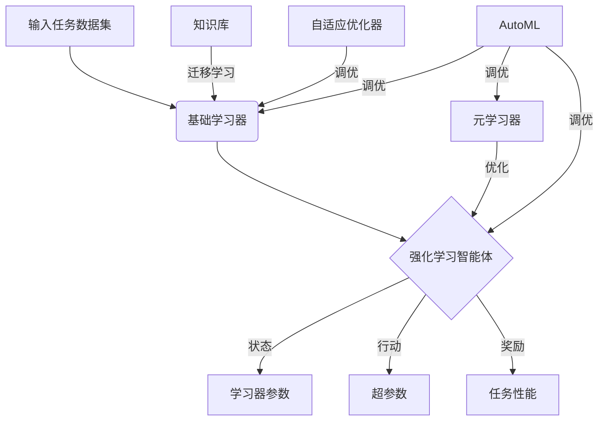

# AI人工智能深度学习算法：学习与适应的算法框架

作者：禅与计算机程序设计艺术 / Zen and the Art of Computer Programming

关键词：人工智能, 深度学习, 适应性, 学习算法, 神经网络, 强化学习, 迁移学习, 元学习, 自适应优化, 自动机器学习

## 1. 背景介绍
### 1.1 问题的由来
人工智能(Artificial Intelligence, AI)是计算机科学领域的一个重要分支,旨在研究如何让计算机模拟甚至超越人类的智能。近年来,随着计算机硬件性能的飞速发展和大数据时代的来临,AI技术取得了突破性的进展,尤其是深度学习(Deep Learning, DL)方法在计算机视觉、自然语言处理、语音识别等领域取得了超越人类的性能,引发了新一轮的AI热潮。

然而,现有的DL方法大多采用静态的模型结构和参数,缺乏对环境变化的适应能力。在实际应用中,AI系统往往需要在动态变化的环境中持续学习和优化,现有的DL方法难以满足这一需求。因此,研究具有学习和适应能力的AI算法框架,实现AI系统的持续进化,是当前AI领域亟需解决的关键问题之一。

### 1.2 研究现状 
针对AI系统的持续学习与优化问题,学术界已经开展了一些探索性的研究工作。比较有代表性的是强化学习(Reinforcement Learning)[1]、迁移学习(Transfer Learning)[2]、元学习(Meta Learning)[3]、自适应优化(Adaptive Optimization)[4]等方法。

强化学习通过智能体(Agent)与环境的交互,根据反馈信号(Reward)不断优化策略,实现了一定程度的在线学习和适应能力。但强化学习的收敛速度慢,样本效率低,且容易陷入局部最优,在实际应用中还面临诸多挑战。

迁移学习利用已有的知识来辅助新任务的学习,一定程度上提高了模型的泛化能力。但现有的迁移学习方法大多局限于同领域内的迁移,跨领域的知识迁移仍是一个难题。

元学习通过学习一个通用的学习器(Meta-Learner),可以快速适应新的任务,是实现Few-Shot Learning的重要手段。但元学习的训练过程复杂,计算开销大,且泛化能力有待进一步提高。

自适应优化根据模型在线训练过程中的反馈信息,自动调节超参数,减少了人工调参的成本。但现有的自适应优化方法大多针对特定的模型和任务,通用性不足。

总的来说,已有的研究工作在AI系统的持续学习与优化方面取得了一些进展,但在算法的通用性、鲁棒性、计算效率等方面还有很大的改进空间。

### 1.3 研究意义
研究AI系统的持续学习与优化算法,对于推动AI技术的进一步发展具有重要意义:

1. 实现AI系统的持续进化。通过持续学习与优化,AI系统可以不断适应环境变化,提高性能,实现从"弱人工智能"到"强人工智能"的跨越。

2. 降低AI开发与应用成本。通过算法自动优化和知识复用,可以减少人工参与,提高开发效率,降低应用门槛。

3. 拓展AI的应用领域。通过持续学习,AI系统可以快速适应不同的任务和环境,在更多领域得到应用,产生更大的经济和社会价值。

4. 探索通用人工智能。通过研究跨领域、跨任务的知识表示和迁移方法,为实现通用人工智能(Artificial General Intelligence, AGI)奠定基础。

### 1.4 本文结构
本文将重点研究一种基于学习和适应的AI深度学习算法框架。第2节介绍框架涉及的核心概念;第3节阐述算法的整体原理与流程;第4节建立算法的数学模型并推导关键公式;第5节给出算法的代码实现;第6节分析算法的应用场景;第7节介绍相关的工具和资源;第8节总结全文并展望未来;第9节列举常见问题解答。

## 2. 核心概念与联系
本文提出的学习与适应的深度学习算法框架,涉及以下核心概念:

1. 深度学习:一种基于深度神经网络(Deep Neural Network, DNN)的机器学习方法,通过多层非线性变换对高维数据进行特征提取和抽象,是当前AI领域的主流技术。

2. 强化学习:一种通过智能体与环境交互,根据反馈信号优化决策的学习范式。智能体根据当前状态采取行动,环境根据行动给出反馈,智能体根据反馈调整策略,不断提高决策的长期回报。

3. 迁移学习:一种通过复用已有知识来辅助新任务学习的方法。通过找到不同任务间的相似性,把已经学习到的知识迁移到新任务中,可以减少新任务所需的训练数据和训练时间。

4. 元学习:一种"学会学习"(Learning to Learn)的方法,通过学习一个通用的学习器,使其能够快速适应新的任务。元学习分为两个层次:基础学习器(Base-Learner)负责具体任务的学习,元学习器负责优化基础学习器的参数。

5. 自适应优化:一种根据学习过程的反馈信息,自动调节学习率等超参数的优化方法。通过自适应地调整参数更新的步长和方向,可以加速收敛并提高泛化性能。

6. 自动机器学习(AutoML):一种自动化机器学习流程的技术,包括自动特征工程、算法选择、超参数优化、模型评估等。通过AutoML技术可以降低机器学习的门槛,提高开发效率。

这些概念之间存在着紧密的联系。深度学习是当前AI的主流技术,但其适应能力不足。强化学习可以让智能体具备一定的适应能力,但存在收敛慢、样本效率低等问题。迁移学习和元学习是提高深度学习适应能力的重要手段,分别从知识复用和学习策略优化的角度来提高学习的效率和效果。自适应优化和AutoML技术可以简化深度学习算法的开发流程,提高算法的鲁棒性。本文提出的算法框架,将综合利用这些技术的优势,构建一个具备持续学习与适应能力的AI系统。

## 3. 核心算法原理 & 具体操作步骤
### 3.1 算法原理概述
本文提出的学习与适应的深度学习算法框架,其核心思想是:将深度学习与强化学习相结合,通过元学习来优化适应策略,同时利用迁移学习来复用知识,并使用自适应优化技术来提高训练效率。算法的整体原理可以概括为:

1. 基于深度神经网络构建一个基础学习器,用于完成特定的学习任务。学习器的输入为任务的训练数据,输出为任务的模型参数。

2. 将基础学习器嵌入到一个强化学习框架中,把学习器的参数作为智能体的状态,把学习器的超参数作为智能体的行动,把学习器在任务上的性能作为环境的反馈。通过智能体与环境的交互,学习一个超参数调节策略。

3. 使用元学习方法来优化超参数调节策略。将不同任务上学到的策略参数作为元学习器的训练数据,通过元学习器学习一个通用的策略。元学习器可以是一个RNN,编码任务的信息并解码出相应的策略参数。

4. 在学习新任务时,利用迁移学习方法,从已有的知识库中选择合适的知识进行复用。知识库中存储了从过去任务中学到的特征、模型架构、超参数等信息。迁移学习可以显著减少新任务的训练成本。

5. 在基础学习器训练过程中,使用自适应优化器(如Adam)来自动调节学习率,加速收敛。

6. 在整个学习过程中,遵循AutoML的理念,自动调节算法的各个组件和模块,力争以最小的人工干预来获得最优的性能。

算法原理可以用下面的Mermaid流程图直观地表示:

### 3.2 算法步骤详解
算法的具体步骤如下:

1. 输入:一批训练任务集合$\mathcal{T} = \{T_1, T_2, \dots, T_n\}$,每个任务$T_i$包含训练数据集$D_i$和测试数据集$\hat{D}_i$。另外还有一个知识库$\mathcal{K}$,存储历史学习到的知识。

2. 对每个训练任务$T_i$:
   
   a. 从知识库$\mathcal{K}$中检索与$T_i$相关的知识$k_i$(如特征、模型架构等),作为基础学习器$f_i$的先验。
   
   b. 初始化基础学习器$f_i$的参数$\theta_i$,将其作为强化学习智能体的初始状态$s_i^0$。
   
   c. 初始化智能体的策略网络$\pi_i(a|s;\omega_i)$,其中$\omega_i$为策略网络参数。
   
   d. 设置迭代次数$t=0$,最大迭代次数$t_{\max}$。
   
   e. while $t < t_{\max}$:
      
      i. 根据当前状态$s_i^t$(即$\theta_i^t$)和策略网络$\pi_i$,生成一个超参数配置$a_i^t$(如学习率、正则化系数等)。
      
      ii. 使用超参数$a_i^t$和自适应优化器,对基础学习器$f_i$在训练集$D_i$上进行训练,得到更新后的参数$\theta_i^{t+1}$。
      
      iii. 在测试集$\hat{D}_i$上评估$f_i(\theta_i^{t+1})$的性能$r_i^t$(如准确率)。
      
      iv. 将$(\theta_i^t, a_i^t, r_i^t, \theta_i^{t+1})$作为一个transition,存入经验回放池$\mathcal{B}_i$。
      
      v. 从$\mathcal{B}_i$中采样一批transition$\{(\theta_j, a_j, r_j, \theta'_j)\}_{j=1}^m$,计算策略网络$\pi_i$的梯度:
         
         $\nabla_{\omega_i} J(\omega_i) = \frac{1}{m} \sum_{j=1}^m \nabla_{\omega_i} \log \pi_i(a_j|\theta_j;\omega_i) (r_j - V_i(\theta_j))$
         
         其中$V_i(\theta)$为值函数,用于估计状态$\theta$的长期回报。
      
      vi. 使用梯度上升更新策略网络参数:
          
          $\omega_i \leftarrow \omega_i + \alpha \nabla_{\omega_i} J(\omega_i)$
      
      vii. $t \leftarrow t+1$
   
   f. 将任务$T_i$学到的知识$k_i'$(如特征、模型参数等)存入知识库$\mathcal{K}$。

3. 将所有任务学到的策略网络参数$\{\omega_1, \omega_2, \dots, \omega_n\}$作为元学习器$g$的训练数据,训练元学习器以得到通用策略$\omega^*$。

4. 输出:通用策略$\omega^*$和更新后的知识库$\mathcal{K}$。

5. 在新任务$T_{new}$上应用学到的通用策略$\omega^*$进行学习,并利用知识库$\mathcal{K}$中的知识辅助学习。

### 3.3 算法优缺点
算法的主要优点有:

1. 通过