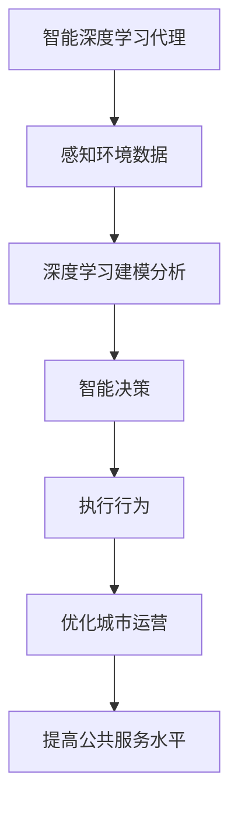
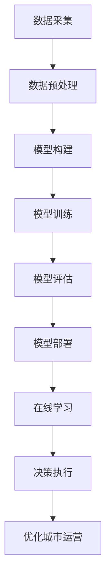

# AI人工智能深度学习算法：智能深度学习代理在智慧城市中的实践

## 1. 背景介绍

### 1.1 问题的由来

随着城市化进程的不断加速,城市面临着日益严峻的挑战,如交通拥堵、环境污染、能源浪费等。传统的城市管理方式已经无法满足现代城市的需求。为了应对这些挑战,智慧城市(Smart City)的概念应运而生。智慧城市旨在利用先进的信息和通信技术(ICT)来优化城市运营,提高城市管理效率,改善公共服务质量,从而提高城市的可持续发展能力。

在智慧城市的建设过程中,人工智能(AI)技术扮演着关键角色。AI技术可以帮助智慧城市实现智能化决策、优化资源配置、预测未来需求等,从而提高城市运营效率和公共服务水平。其中,深度学习(Deep Learning)作为AI技术的一个重要分支,因其强大的数据处理能力和模式识别能力,在智慧城市的多个领域得到了广泛应用。

### 1.2 研究现状

目前,深度学习在智慧城市中的应用主要集中在以下几个领域:

1. **交通管理**: 利用深度学习技术对交通数据进行分析,实现智能交通信号控制、路径规划、拥堵预测等,缓解城市交通压力。

2. **公共安全**: 通过深度学习对视频监控数据进行分析,实现人脸识别、行为检测、异常情况预警等,提高公共安全水平。

3. **环境监测**: 利用深度学习技术对环境数据(如空气质量、噪音等)进行建模和预测,为环境治理提供决策依据。

4. **能源管理**: 深度学习可以对能源消耗数据进行分析,优化能源配置,实现节能减排。

5. **城市规划**: 深度学习技术可以对城市数据进行挖掘和分析,为城市规划和土地利用提供决策支持。

虽然深度学习在智慧城市中的应用取得了一定进展,但仍然存在一些挑战和局限性,如数据质量问题、模型可解释性不足、隐私和安全风险等。

### 1.3 研究意义

本文旨在探讨深度学习在智慧城市中的实践应用,重点关注智能深度学习代理(Intelligent Deep Learning Agent)在智慧城市中的作用和应用场景。智能深度学习代理是一种基于深度学习技术的智能系统,它可以感知环境、学习知识、做出决策并执行相应的行为。通过研究智能深度学习代理在智慧城市中的应用,我们可以更好地利用深度学习技术来解决城市面临的挑战,提高城市运营效率和公共服务水平。

本文将介绍智能深度学习代理的核心概念和算法原理,并详细阐述其在智慧城市中的实际应用场景,如交通管理、公共安全、环境监测等。同时,本文还将探讨智能深度学习代理在智慧城市中面临的挑战和未来发展趋势。

### 1.4 本文结构

本文的结构安排如下:

1. 背景介绍
2. 核心概念与联系
3. 核心算法原理与具体操作步骤
4. 数学模型和公式详细讲解与举例说明
5. 项目实践:代码实例和详细解释说明
6. 实际应用场景
7. 工具和资源推荐
8. 总结:未来发展趋势与挑战
9. 附录:常见问题与解答

## 2. 核心概念与联系

在探讨智能深度学习代理在智慧城市中的应用之前,我们需要先了解一些核心概念及其相互关系。

### 2.1 人工智能(AI)

人工智能(Artificial Intelligence,AI)是一门致力于研究和开发能够模拟人类智能行为的理论、方法、技术及应用系统的学科。AI的目标是使机器能够模拟人类的感知、学习、推理、规划和操作等智能行为。

### 2.2 机器学习(Machine Learning)

机器学习(Machine Learning,ML)是AI的一个重要分支,它赋予了计算机在没有明确程序的情况下,通过学习数据获取知识或经验,并利用获取的知识或经验对复杂的环境做出智能反应的能力。

### 2.3 深度学习(Deep Learning)

深度学习(Deep Learning,DL)是机器学习的一种新的范式,其灵感来源于人脑的结构和功能。深度学习通过对数据的模型表示进行多层次的非线性变换,捕捉数据的高阶统计特性,从而学习出有效的模式表示。深度学习在图像识别、语音识别、自然语言处理等领域取得了突破性的进展。

### 2.4 智能代理(Intelligent Agent)

智能代理(Intelligent Agent)是AI领域的一个重要概念,它指的是一种能够感知环境、学习知识、做出决策并执行相应行为的智能系统。智能代理需要具备感知、学习、决策和执行等多种能力,以便在复杂的环境中完成特定的任务。

### 2.5 智能深度学习代理(Intelligent Deep Learning Agent)

智能深度学习代理(Intelligent Deep Learning Agent)是将深度学习技术与智能代理理论相结合的产物。它是一种基于深度学习技术的智能系统,能够通过深度神经网络感知环境、学习知识,并基于所学习的知识做出决策和执行相应的行为。

智能深度学习代理在智慧城市中扮演着重要角色。它可以感知城市环境中的各种数据(如交通数据、环境数据等),利用深度学习技术对这些数据进行建模和分析,从而做出智能决策,并执行相应的行为(如调度交通信号、控制能源使用等),以优化城市运营和提高公共服务水平。

下面是智能深度学习代理在智慧城市中的应用框架的Mermaid流程图:

## 3. 核心算法原理与具体操作步骤

### 3.1 算法原理概述

智能深度学习代理的核心算法原理是基于深度神经网络(Deep Neural Network,DNN)。深度神经网络是一种由多层神经元组成的非线性函数模型,它可以通过对输入数据进行多层次的非线性变换,自动学习出有效的特征表示,从而实现对复杂模式的建模和预测。

深度神经网络的基本结构包括输入层、隐藏层和输出层。输入层接收原始数据,隐藏层对数据进行非线性变换和特征提取,输出层则给出最终的预测或决策结果。在训练过程中,深度神经网络通过反向传播算法(Back Propagation)调整网络参数,使得输出结果逐渐接近期望值,从而实现对输入数据的建模和预测。

智能深度学习代理通过将深度神经网络应用于城市环境数据,实现对城市运营状态的感知、建模和预测,从而做出智能决策并执行相应的行为。

### 3.2 算法步骤详解

智能深度学习代理在智慧城市中的应用通常包括以下几个主要步骤:

1. **数据采集**: 从城市环境中采集相关数据,如交通数据、环境数据、能源数据等。数据采集是智能决策的基础,数据质量直接影响后续建模和决策的准确性。

2. **数据预处理**: 对采集的原始数据进行清洗、标准化、特征提取等预处理,以满足深度神经网络的输入要求。数据预处理对于提高模型性能至关重要。

3. **模型构建**: 根据具体应用场景,设计合适的深度神经网络结构,如卷积神经网络(CNN)、循环神经网络(RNN)等。模型结构的选择直接影响模型的表现能力。

4. **模型训练**: 利用预处理后的数据对深度神经网络进行训练,使用反向传播算法调整网络参数,使模型逐渐拟合训练数据。训练过程需要注意避免过拟合等问题。

5. **模型评估**: 在保留的测试数据集上评估训练好的模型,检验模型的泛化能力。根据评估结果,可能需要调整模型结构或超参数。

6. **模型部署**: 将训练好的模型部署到实际的智能深度学习代理系统中,用于感知环境、做出决策和执行行为。

7. **在线学习**: 智能深度学习代理在实际运行过程中,需要持续地从环境中获取新的数据,并根据新数据对模型进行在线调整和更新,以适应环境的动态变化。

8. **决策执行**: 根据深度神经网络模型的输出,智能深度学习代理做出相应的决策,并执行相应的行为,如调度交通信号、控制能源使用等,从而优化城市运营。

下面是智能深度学习代理在智慧城市中的应用流程的Mermaid流程图:

### 3.3 算法优缺点

智能深度学习代理算法的优点包括:

1. **强大的建模能力**: 深度神经网络能够自动学习出有效的特征表示,对复杂的非线性模式具有强大的建模能力。

2. **端到端学习**: 深度神经网络可以直接从原始数据中学习,无需人工设计特征,实现了端到端的学习过程。

3. **泛化能力强**: 经过充分训练,深度神经网络具有良好的泛化能力,可以对未见过的数据做出合理的预测。

4. **在线学习能力**: 智能深度学习代理可以持续地从环境中获取新数据,并对模型进行在线更新,适应环境的动态变化。

5. **决策执行一体化**: 智能深度学习代理将感知、学习、决策和执行行为集成在一个系统中,实现了决策执行的一体化。

智能深度学习代理算法的缺点包括:

1. **数据饥渴**: 深度神经网络通常需要大量的高质量数据进行训练,否则容易出现过拟合或欠拟合问题。

2. **黑箱性质**: 深度神经网络的内部工作机理往往难以解释,存在黑箱性质,缺乏可解释性。

3. **计算资源需求高**: 训练深度神经网络需要大量的计算资源,如GPU等加速硬件,对硬件要求较高。

4. **隐私和安全风险**: 智能深度学习代理需要采集和处理大量的城市数据,存在一定的隐私和安全风险。

5. **决策稳定性**: 智能深度学习代理的决策可能会受到噪声数据的影响,导致决策不够稳定。

### 3.4 算法应用领域

智能深度学习代理算法在智慧城市中的应用领域主要包括:

1. **交通管理**: 利用深度学习技术对交通数据进行建模和预测,实现智能交通信号控制、路径规划、拥堵预测等,缓解城市交通压力。

2. **公共安全**: 通过深度学习对视频监控数据进行分析,实现人脸识别、行为检测、异常情况预警等,提高公共安全水平。

3. **环境监测**: 利用深度学习技术对环境数据(如空气质量、噪音等)进行建模和预测,为环境治理提供决策依据。

4. **能源管理**: 深度学习可以对能源消耗数据进行分析,优化能源配置,实现节能减排。

5. **城市规划**: 深度学习技术可以对城市数据进行挖掘和分析,为城市规划和土地利用提供决策支持。

6. **公共服务优化**: 智能深度学习代理可以优化公共资