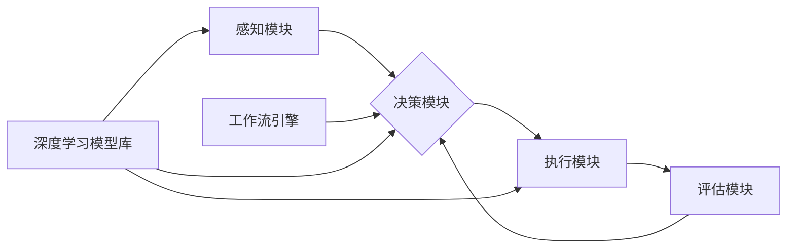

# AI人工智能深度学习算法：智能深度学习代理的工作流整合方法

关键词：人工智能, 深度学习, 智能代理, 工作流, 算法整合

## 1. 背景介绍
### 1.1  问题的由来
人工智能(Artificial Intelligence, AI)作为计算机科学的一个分支,其目标是开发能够模拟人类智能的计算机系统。近年来,随着大数据、云计算、高性能计算等技术的迅猛发展,AI技术取得了突破性进展,深度学习(Deep Learning, DL)算法更是成为AI领域的研究热点。DL通过构建多层次的神经网络模型,模拟人脑学习和信息处理机制,在图像识别、语音识别、自然语言处理等领域取得了超越人类的性能表现。

然而,当前的DL算法大多是针对特定任务而设计优化的,缺乏通用性和灵活性。如何将不同的DL模型和算法有机整合,构建一个智能的、自主学习的AI系统,实现跨领域、多任务的工作流程自动化,是亟待解决的关键问题。本文将重点探讨一种创新的智能DL代理工作流整合方法,为未来通用人工智能系统的实现提供新的思路。

### 1.2  研究现状
目前,工业界和学术界已经开始探索将DL与其他AI技术相结合,如强化学习、迁移学习、元学习等,以提升AI系统的智能化水平。一些代表性的研究成果包括:
- DeepMind的AlphaGo系统,将深度卷积神经网络与蒙特卡洛树搜索相结合,在围棋领域战胜了人类顶尖高手。
- 微软的MT-DNN(Multi-Task Deep Neural Network)模型,通过共享不同任务的隐层表示,实现了多任务学习,在GLUE基准测试中取得了最佳性能。
- Google Brain的AutoML系统,利用神经网络搜索(NAS)和强化学习技术,自动设计出适合特定任务的神经网络架构,大大减少了人工设计的工作量。
- OpenAI的GPT系列语言模型,通过在海量无标注文本上进行自监督预训练,掌握了丰富的语言知识,可以应用于多种自然语言处理任务。

尽管上述工作在特定领域取得了瞩目的成绩,但如何构建一个通用的智能DL代理,能够自主地整合多个DL模型和算法,完成复杂的工作流程,仍是一个悬而未决的难题。本文针对这一问题,提出了一种创新的解决方案。

### 1.3  研究意义
本文的研究意义主要体现在以下几个方面:

1. 探索通用人工智能的实现路径。通过研究智能DL代理的工作流整合方法,为未来构建通用AI系统奠定理论和技术基础。 

2. 提升AI系统的智能化水平。智能DL代理能够自主学习、动态优化工作流程,极大地提升了AI系统应对复杂任务的能力。

3. 推动AI技术在实际应用中的落地。智能工作流的自动化有助于提高企业生产效率,降低人力成本,为产业智能化升级赋能。

4. 丰富AI基础理论研究。本文的智能DL代理模型涉及机器学习、优化理论、博弈论等多个基础学科,对相关理论研究具有一定的启发意义。

### 1.4  本文结构
本文共分为9个章节,各章节的主要内容安排如下:
- 第1章 介绍研究背景、问题的提出、研究现状、研究意义及全文结构。
- 第2章 阐述智能DL代理涉及的核心概念,包括DL、智能代理、工作流等,分析其内在联系。
- 第3章 详细讲解智能DL代理的核心算法原理,给出算法的具体操作步骤。
- 第4章 建立智能DL代理的数学模型,推导相关公式,并结合案例进行分析讲解。
- 第5章 提供智能DL代理的代码实例,并对关键代码进行注释说明。
- 第6章 分析智能DL代理的实际应用场景,展望其未来应用前景。
- 第7章 推荐智能DL代理相关的学习资源、开发工具和文献资料。
- 第8章 总结全文的研究成果,分析智能DL代理未来的发展趋势和面临的挑战。
- 第9章 收录智能DL代理的常见问题解答作为附录。

## 2. 核心概念与联系
在探讨智能DL代理的工作流整合方法之前,有必要对其中涉及的几个核心概念进行界定和阐述,理清其内在的逻辑联系。

- 人工智能(Artificial Intelligence, AI):一门综合性学科,旨在研究、开发能够模拟、延伸和扩展人的智能的理论、方法、技术及应用系统。

- 机器学习(Machine Learning, ML):实现AI的主要方法,使计算机系统能够自动改进性能,无需进行明确编程。常见的ML范式包括监督学习、无监督学习、半监督学习、强化学习等。

- 深度学习(Deep Learning,DL):ML的一个分支,通过构建具有多个隐藏层的人工神经网络,模拟人脑的信息处理机制,从海量数据中自动提取高层次特征,解决复杂问题。

- 智能代理(Intelligent Agent):一种能够感知环境并采取行动以实现其目标的自治系统。智能代理通常具有感知、推理、规划、学习等核心能力。

- 工作流(Workflow):一系列结构化活动的集合,用于完成特定的业务目标。工作流定义了活动的执行顺序、条件约束、数据流向等,可以实现业务流程的自动化。

- 算法整合(Algorithm Integration):将多个不同的算法模型组合在一起,协同工作,发挥各自的优势,完成复杂任务的方法。

从上述概念的内涵可以看出,智能DL代理本质上是一种高级的AI系统,融合了DL、智能代理、工作流等多项前沿技术。通过将DL算法整合到智能代理的感知、决策、执行等核心模块中,并引入工作流机制对任务进行建模和调度,智能DL代理能够自主地完成复杂的业务流程,体现出较高的智能化水平。

下图给出了智能DL代理的总体架构,展示了各个核心组件之间的交互关系:

其中,感知模块负责收集和预处理环境信息,决策模块根据感知信息和历史经验制定行动策略,执行模块负责具体的任务执行,评估模块对执行效果进行评估并生成反馈信号,形成闭环控制。工作流引擎负责对任务进行建模和调度,协调各个模块的工作。深度学习模型库为感知、决策、执行等模块提供算法支持。

通过上述架构,智能DL代理能够灵活地整合不同的DL模型,动态调整工作流,不断优化自身的性能,从而实现复杂任务的自动化处理。接下来,本文将重点阐述智能DL代理的核心算法原理和关键技术。

## 3. 核心算法原理 & 具体操作步骤
### 3.1  算法原理概述
智能DL代理的核心算法可以概括为"感知-决策-执行-评估"的智能闭环控制。在这个过程中,深度学习模型被广泛应用于感知、决策、执行等各个环节,极大地提升了系统的智能化水平。本节将重点介绍智能DL代理中的几个关键算法。

### 3.2  算法步骤详解

#### 3.2.1 感知阶段的深度学习算法

在感知阶段,智能DL代理需要从环境中获取信息,并对原始数据进行理解和抽象。这里主要采用了以下几类深度学习模型:

1. 卷积神经网络(Convolutional Neural Network,CNN)。CNN通过局部连接和权值共享,能够自动提取图像、视频等数据的空间特征,广泛应用于计算机视觉领域。

2. 循环神经网络(Recurrent Neural Network,RNN)。RNN引入了时间维度上的连接,能够处理序列数据,在语音识别、自然语言处理等领域表现出色。

3. 图神经网络(Graph Neural Network,GNN)。GNN直接对图结构数据进行建模,通过聚合邻居节点的信息更新节点表示,可以用于社交网络、知识图谱等领域。

在实际应用中,往往需要将多个不同类型的深度学习模型进行组合,构建多模态感知系统。例如,可以将CNN用于图像特征提取,RNN用于文本特征提取,然后将两种特征进行融合,形成统一的表示。

#### 3.2.2 决策阶段的强化学习算法

在决策阶段,智能DL代理需要根据当前的状态信息,选择最优的行动策略。这里主要采用了深度强化学习(Deep Reinforcement Learning,DRL)算法,代表性的模型包括:

1. 深度Q网络(Deep Q-Network,DQN)。DQN将Q学习与深度神经网络相结合,通过函数拟合的方式逼近最优Q值函数,实现了连续状态空间下的最优决策。

2. 深度确定性策略梯度(Deep Deterministic Policy Gradient,DDPG)。DDPG是一种基于Actor-Critic框架的算法,通过策略梯度和Q学习的结合,可以直接优化连续动作空间的策略函数。

3. 近端策略优化(Proximal Policy Optimization,PPO)。PPO通过在策略更新时引入惩罚项,限制新旧策略之间的差异,提高了训练的稳定性和样本利用效率。

在智能DL代理中,强化学习模型通常与环境模型结合,通过自我博弈的方式进行训练优化。多个智能体之间还可以通过对抗学习、合作学习等机制进行协同,提升整体的决策水平。

#### 3.2.3 执行阶段的迁移学习算法

在执行阶段,智能DL代理需要将决策结果转化为具体的行动,完成实际任务。这里主要采用了迁移学习(Transfer Learning)算法,代表性的模型包括:

1. 微调(Fine-tuning)。微调是一种常见的迁移学习方法,通过在预训练模型的基础上添加新的任务专属层,并利用少量新数据进行训练,实现快速的模型适配。

2. 元学习(Meta-Learning)。元学习旨在学习如何学习的通用技能,通过在一系列相似任务上进行训练,模型能够在新任务上快速适应,实现小样本学习。

3. 领域自适应(Domain Adaptation)。领域自适应处理源域和目标域数据分布不一致的问题,通过特征对齐、对抗训练等技术,使模型能够适应新的数据领域。

迁移学习使得智能DL代理能够充分利用已有的知识和经验,在新的任务上实现快速的学习和适配,大大提高了执行效率和泛化能力。

#### 3.2.4 评估阶段的元学习算法

在评估阶段,智能DL代理需要对执行效果进行评估,生成反馈信号指导后续的决策优化。这里主要采用了元学习算法,代表性的模型包括:

1. MAML(Model-Agnostic Meta-Learning)。MAML通过元优化器调整模型参数的初始值,使其能够在新任务上快速收敛,实现了任务无关的元学习。

2. Reptile。Reptile是一种简化版的MAML,通过对不同任务上的梯度进行平均,更新初始参数,降低了计算复杂度。

3. LEO(Latent Embedding Optimization)。LEO在低维潜在空间中对任务进行建模,通过元优化器学习任务表示与优化策略之间的映射,提高了任务适应能力。

元学习使得智能DL代理能够从历史经验中总结规律,形成一套通用的学习策略。在面对新任务时,代理可以