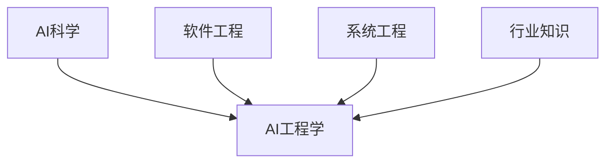
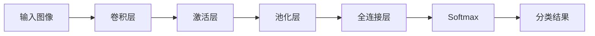

# AI工程学：应用开发实战手册

## 1. 背景介绍
### 1.1  问题的由来
人工智能(Artificial Intelligence,AI)是计算机科学的一个重要分支,它致力于研究如何让计算机模拟甚至超越人类的智能。近年来,随着计算机硬件性能的飞速发展和海量数据的积累,AI技术取得了突破性进展,在语音识别、图像识别、自然语言处理等领域达到甚至超越了人类的水平。

然而,目前AI技术的应用开发仍然面临诸多挑战。一方面,AI算法的复杂性和多样性使得工程实现难度很大。另一方面,缺乏成熟的AI应用开发流程和工具,导致AI项目的落地效率低下。因此,亟需总结AI工程实践经验,形成一套系统化的AI应用开发方法论和最佳实践,指导AI工程师更高效地开发出高质量的AI应用。

### 1.2  研究现状
目前,学术界和工业界已经开始重视AI工程化的研究和实践。一些大型科技公司如Google、Facebook等,基于自身的AI项目积累,总结了一些AI开发流程和工具。比如Google提出了"Machine Learning Ops"的概念,旨在将DevOps的理念引入机器学习系统的开发运维中。

学术界也在AI工程化领域展开了一些探索。比如加州大学伯克利分校提出了"RISE"AI工程方法,从需求(Requirement)、实现(Implementation)、服务(Service)、评估(Evaluation)等角度,系统地指导AI系统的设计开发。南加州大学的SAIL实验室也专门研究AI系统工程的理论与实践。

但总的来说,目前AI工程学尚处于起步阶段,还没有形成成熟的、普适的AI应用开发方法论和最佳实践。学术研究与工业实践之间也有一定脱节。亟需从工程实践的角度,系统总结AI应用开发全流程的关键技术、工具和经验。

### 1.3  研究意义
系统研究AI工程学,对于推动AI技术的落地应用具有重要意义:

1. 指导AI工程师以工程化的思维和方法来设计开发AI系统,提高AI项目的效率和成功率。

2. 总结AI应用开发全流程的关键技术、工具和经验教训,帮助后来者少走弯路。

3. 沉淀可复用的AI组件和工具链,提升AI开发的效率。

4. 建立AI系统开发的规范和标准,提高AI应用的质量和可维护性。

5. 促进AI技术与软件工程、系统工程等学科的交叉融合,形成新的AI工程学科。

### 1.4  本文结构
本文将系统阐述AI工程学的理念、方法和实践,主要内容安排如下:

第2部分介绍AI工程学的核心概念,厘清其与传统软件工程、AI科学的关系。

第3部分详细讲解AI工程的核心方法和流程,包括需求分析、数据准备、模型开发、系统集成、测试部署等关键环节。给出每个环节的最佳实践。

第4部分介绍AI系统开发中常用的数学模型,并以案例形式讲解其应用。

第5部分通过具体的代码实例,演示如何使用主流的AI框架和工具,开发实际的AI应用。

第6部分总结AI技术在各个行业领域的实际应用情况和典型案例。展望未来的应用前景。

第7部分推荐一些AI工程学习的资源,包括开源工具、课程、论文等。

第8部分总结全文,展望AI工程学未来的发展趋势和面临的挑战。

## 2. 核心概念与联系

AI工程学处于人工智能、软件工程、系统工程等多个学科的交叉点,因此有必要厘清其核心概念,理解各学科之间的关系。

**AI科学(AI Science)**聚焦于研究智能的本质和实现机理,探索类人智能的计算模型,属于理论层面。主要研究内容包括机器学习、知识表示、推理决策等。

**软件工程(Software Engineering)**是指导大规模软件系统开发的工程学科,强调开发过程的工程化、规范化。主要内容包括需求工程、设计与架构、编程实现、测试与质量保障等。

**AI工程学(AI Engineering)**则是将软件工程的理念和方法应用于AI系统的开发,旨在指导工程师以规范化、工程化的方式构建大型AI系统。它强调AI开发过程中的数据治理、模型设计、算法选择、系统集成等工程问题。

从知识体系上看,AI工程学需要融合AI科学的理论和算法,以及软件工程的方法和最佳实践。同时还需要吸收一些系统工程的思想,从全局视角设计和优化复杂的AI系统。

从应用目标看,AI科学侧重于研究通用的智能算法模型,而AI工程学则聚焦特定领域的实际应用,需要根据具体需求灵活选择和优化模型。因此工程性、落地性是AI工程学的重要特征。

从技能要求看,AI工程除了掌握扎实的编程能力,还需要具备数据分析、建模优化等AI专业技能。同时还要对业务领域有深刻理解,善于将AI技术与行业知识结合,创造商业价值。

下图描述了AI工程学与其他相关学科的关系:

可见,AI工程学是一门综合性很强的交叉学科,需要工程师全面掌握AI、软件工程、业务分析等多方面知识,并能灵活运用各种技能解决实际问题。这对从业者的综合素质提出了更高要求。

## 3. 核心算法原理 & 具体操作步骤
### 3.1  算法原理概述
AI工程实践中,需要根据具体的应用场景和需求,选择合适的AI算法。当前主流的AI算法包括:

- 监督学习:通过标注数据训练模型,代表算法有线性回归、逻辑回归、决策树、支持向量机、神经网络等。
- 无监督学习:从无标注数据中发现模式,代表算法有聚类、降维、关联规则等。 
- 强化学习:通过与环境的交互学习最优决策,代表算法有Q-Learning、SARSA、DQN等。
- 迁移学习:将一个领域学习到的知识迁移到相似的新领域,加速学习过程。

除了上述经典机器学习范式,近年来还涌现出一些前沿的AI算法,如元学习(Meta Learning)、联邦学习(Federated Learning)、图神经网络(Graph Neural Network)等。

针对不同的数据类型和任务,还衍生出一些专用的算法。比如计算机视觉领域的CNN、YOLO等;自然语言处理领域的RNN、LSTM、Transformer等。

AI工程师需要全面了解这些算法的原理和适用场景,根据手头的问题选择最佳的算法。同时还要掌握算法的调优技巧,优化模型性能。

### 3.2  算法步骤详解
以监督学习算法为例,其基本步骤如下:

1. 准备数据:收集和标注训练数据,划分训练集、验证集和测试集。

2. 特征工程:对原始数据进行清洗、特征提取、特征选择等预处理,转化为适合算法的输入。  

3. 选择模型:根据任务类型和数据特点,选择合适的模型架构,如决策树、神经网络等。

4. 训练模型:选择合适的损失函数,使用优化算法训练模型参数,如梯度下降法。

5. 评估模型:使用验证集评估模型性能,如准确率、召回率等指标。可视化分析模型预测结果。

6. 调优模型:通过调整超参数、修改网络结构、增加正则化等策略优化模型。不断迭代步骤4-6。

7. 测试模型:使用测试集评估模型的泛化性能,验证模型是否过拟合。

8. 部署模型:将训练好的模型集成到实际应用系统中,提供推理服务。

9. 监控模型:持续监控上线模型的性能,收集用户反馈数据,必要时重新训练模型。

可见,机器学习模型开发是一个反复迭代优化的过程。工程师需要不断尝试、比较不同的算法和策略,持续优化模型性能。同时还要权衡模型的精度、速度、资源占用等实际因素。

### 3.3  算法优缺点
每种算法都有其优缺点,需要根据实际任务权衡:

- 决策树:可解释性强,适合处理离散特征,但对连续特征和异常值敏感,易过拟合。

- 神经网络:强大的非线性拟合能力,适合复杂模式识别,但需要大量数据,训练耗时,可解释性差。

- SVM:非线性分类效果好,泛化能力强,但难以处理大规模数据,超参数调优复杂。

- 强化学习:适合序列决策问题,但需要大量的探索,训练不稳定,难以收敛。

工程师要全面评估算法的特点,选择最适合当前任务的模型。在实践中还要不断地尝试和迭代,优化算法性能。

### 3.4  算法应用领域
当前AI算法已经在多个领域取得了广泛应用,典型的应用场景包括:

- 计算机视觉:图像分类、目标检测、语义分割、人脸识别等
- 自然语言处理:文本分类、情感分析、命名实体识别、机器翻译、智能问答等  
- 语音处理:语音识别、声纹识别、语音合成等
- 推荐系统:电商推荐、个性化新闻推荐、广告点击预估等
- 智能决策:自动驾驶、智能调度、金融风控等

不同领域的算法选择有所差异。比如计算机视觉任务常用CNN等深度学习算法,NLP任务常用RNN、Transformer等。

工程师需要深入理解行业知识和业务逻辑,将AI算法与具体场景相结合,创造实际价值。后文将通过案例详细介绍一些应用实践。

## 4. 数学模型和公式 & 详细讲解 & 举例说明
### 4.1  数学模型构建
AI算法的核心是建立数学模型,刻画输入数据X到输出Y的映射关系。根据建模方法,可分为:

- 概率图模型:使用有向图或无向图表示变量间的依赖关系,如贝叶斯网络、马尔可夫网络等。
- 线性模型:假设输入输出满足线性关系,如线性回归、逻辑回归、SVM等。
- 非线性模型:使用非线性函数拟合复杂映射,如决策树、神经网络等。

模型的建立需要从数据出发,提炼关键特征,设计合理的网络结构。并根据任务类型(如分类、回归)选择合适的损失函数。

以图像分类任务为例,我们使用卷积神经网络(CNN)建模。CNN通过卷积、池化等操作提取图像特征,再使用全连接层对特征进行分类。其网络结构如下:

设计CNN时,需要合理设置卷积核大小、卷积层数、池化方式等超参数。还要选择恰当的激活函数(如ReLU)和损失函数(如交叉熵)。

### 4.2  公式推导过程
以线性回归为例,介绍其公式推导过程。假设数据集$D=\{(x_1,y_1),...,(x_N,y_N)\}$,线性回归模型为:

$$
h_\theta(x)=\theta_0+\theta_1x_1+...+\theta_dx_d
$$

其中$\theta_i$为模型参数。使用最小二乘法估计参数,即最小化损失函数:

$$
J(\theta)=\frac{1}{2}\sum_{i=1}^N(h_\theta(x^{(i)})-y^{(i)})^