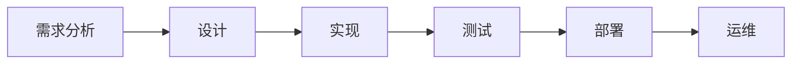

# AI测试与质量保证原理与代码实战案例讲解

关键词：AI测试, 质量保证, 测试原理, 代码实战

## 1. 背景介绍
### 1.1  问题的由来
随着人工智能技术的飞速发展,AI系统正在越来越多的领域得到应用。然而,与传统软件不同,AI系统具有自主学习、自适应、非确定性等特点,这给AI系统的测试和质量保证带来了巨大挑战。传统的软件测试方法和质量保证体系已经无法完全满足AI系统的需求。如何有效地对AI系统进行测试,确保其质量和可靠性,已经成为了一个亟待解决的问题。

### 1.2  研究现状
目前,国内外学者已经开始了对AI测试与质量保证的研究和探索。一些研究者提出了基于度量的AI测试框架,通过定义一系列度量指标来评估AI系统的性能和质量。另一些研究者则从AI系统的特点出发,提出了一些针对性的测试方法,如对抗性测试、可解释性测试等。此外,一些标准化组织如IEEE也成立了专门的工作组,致力于制定AI系统测试与质量保证的标准和规范。尽管如此,AI测试与质量保证依然处于起步阶段,还有许多问题有待进一步研究。

### 1.3  研究意义
AI系统已经开始在许多关键领域得到应用,如自动驾驶、医疗诊断、金融风控等,其质量和可靠性直接关系到人们的生命财产安全。因此,研究AI测试与质量保证具有重要的理论意义和实践价值。一方面,它可以推动AI测试理论和方法的发展,为AI系统的开发和应用提供理论指导和技术支撑。另一方面,它可以帮助提高AI系统的质量和可靠性,促进AI技术在各个领域的应用,造福人类社会。

### 1.4  本文结构
本文将围绕AI测试与质量保证这一主题展开论述。首先,我们将介绍AI测试与质量保证的核心概念,阐述它们之间的联系。然后,我们将重点介绍几种主流的AI测试方法,包括其核心算法原理和具体操作步骤。接着,我们将建立AI测试的数学模型,推导相关公式,并给出详细的案例分析。在此基础上,我们将通过实际项目,给出AI测试的代码实例和详细解释。此外,我们还将讨论AI测试在实际应用场景中的情况,介绍一些常用的工具和学习资源。最后,我们将总结全文,展望AI测试的未来发展趋势和面临的挑战。

## 2. 核心概念与联系
在讨论AI测试与质量保证之前,我们首先需要明确几个核心概念：

- AI系统:利用人工智能技术,具备感知、学习、推理、决策等智能化能力的系统。
- 测试:通过执行被测对象,检查其实际行为与预期行为是否一致的过程。
- 质量:产品满足明确和隐含需求的能力。
- 质量保证:在产品生命周期中采取的一系列活动,以确保产品满足质量要求。

AI测试是对AI系统进行测试的活动,其目的是发现AI系统中的缺陷和问题,评估其性能和质量。而AI质量保证则是一个更大的概念,它不仅包括测试,还包括需求分析、设计评审、静态分析、过程管理等一系列活动,以确保AI系统在其整个生命周期中满足质量要求。可以说,AI测试是AI质量保证的重要组成部分和手段。

下图展示了AI测试在AI系统开发过程中的位置和作用：



## 3. 核心算法原理 & 具体操作步骤
### 3.1  算法原理概述
AI测试的核心是评估AI系统的性能和行为。传统的软件测试主要关注功能和逻辑的正确性,而AI测试则更加关注模型的泛化能力、鲁棒性、公平性等非功能属性。针对AI系统的特点,研究者提出了一些新的测试方法,下面我们重点介绍其中几种主流方法的原理。

### 3.2  算法步骤详解

#### 3.2.1 对抗性测试
对抗性测试的基本思想是通过构造对抗样本来挑战AI模型,以发现其脆弱性。一个常见的算法是快速梯度符号法(FGSM),其步骤如下：

1. 选择一个正常样本 $x$,令 $\tilde{x}=x$
2. 计算损失函数 $J$ 关于输入 $\tilde{x}$ 的梯度 $\nabla_{\tilde{x}}J(\tilde{x},y_{true})$
3. 根据梯度生成对抗样本:
$\tilde{x} = \tilde{x} + \epsilon \cdot sign(\nabla_{\tilde{x}}J(\tilde{x},y_{true}))$
4. 重复步骤2-3,直到满足终止条件

攻击成功的对抗样本可以用来评估模型的鲁棒性,并指导模型的改进。

#### 3.2.2 变异测试
变异测试通过引入变异体来评估测试集的有效性。基本步骤如下:

1. 对被测模型的源代码或结构进行变异,生成变异体
2. 使用测试集对原始模型和变异体进行测试
3. 比较原始模型和变异体的测试结果,计算变异得分
4. 根据变异得分评估测试集的有效性,并改进测试集

一个理想的测试集应该能够区分原始模型和变异体,变异得分越高,说明测试集质量越好。

#### 3.2.3 覆盖率测试
覆盖率测试借鉴了传统软件测试的覆盖率概念,通过定义AI模型的覆盖率指标来指导测试生成。常见的覆盖率指标包括神经元覆盖、路径覆盖等。以神经元覆盖为例,其步骤如下:

1. 定义神经元激活条件,例如输出值大于0.5
2. 使用初始测试集对模型进行测试,统计每个神经元的激活情况
3. 计算神经元覆盖率,识别未覆盖的神经元
4. 生成针对未覆盖神经元的新测试用例,重复步骤2-4

通过不断提高神经元覆盖率,可以生成更全面的测试集,从而提高测试的有效性。

### 3.3  算法优缺点
上述算法各有优缺点。对抗性测试可以有效发现模型的脆弱性,但生成对抗样本需要一定的计算成本。变异测试可以评估测试集的有效性,但引入变异体也增加了测试的复杂度。覆盖率测试借鉴了成熟的软件测试理论,但如何定义有效的覆盖率指标仍是一个难题。

### 3.4  算法应用领域
这些测试算法可以应用于多个AI领域,包括图像分类、语音识别、自然语言处理等。例如,对抗性测试可以用于评估图像分类模型抵御对抗攻击的能力;变异测试可以用于评估机器翻译系统的测试集质量;覆盖率测试可以指导语音识别模型的测试生成。

## 4. 数学模型和公式 & 详细讲解 & 举例说明
### 4.1  数学模型构建
为了系统地研究AI测试问题,我们需要建立相应的数学模型。考虑一个简单的分类模型 $f:X\rightarrow Y$,其中 $X$ 是输入空间,$Y$ 是类别标签集合。我们可以定义模型的风险函数为:

$$
R(f)=\mathbb{E}_{(x,y)\sim D}[L(f(x),y)]
$$

其中 $D$ 是数据的分布,$L$ 是损失函数。模型的目标是最小化风险函数。

然而,在实际中,我们无法直接获得数据分布 $D$,只能通过有限的样本 $S=\{(x_i,y_i)\}_{i=1}^N$ 来估计风险函数,即经验风险:

$$
\hat{R}(f,S)=\frac{1}{N}\sum_{i=1}^N L(f(x_i),y_i)
$$

我们希望找到一组测试集 $S$,使得经验风险 $\hat{R}(f,S)$ 尽可能接近真实风险 $R(f)$。

### 4.2  公式推导过程
测试集的质量可以用泛化误差来衡量,即经验风险与真实风险之间的差距:

$$
\Delta = |\hat{R}(f,S)-R(f)|
$$

根据Hoeffding不等式,我们可以得到泛化误差的概率上界:

$$
P(\Delta \geq \epsilon) \leq 2\exp(-2N\epsilon^2)
$$

这意味着,如果我们想以至少 $1-\delta$ 的概率使泛化误差小于 $\epsilon$,则测试集的大小 $N$ 需要满足:

$$
N \geq \frac{1}{2\epsilon^2}\log\frac{2}{\delta}
$$

这个不等式给出了测试集大小与泛化能力之间的关系,可以指导我们选择合适的测试集。

### 4.3  案例分析与讲解
让我们以图像分类任务为例来说明。假设我们要测试一个二分类模型,输入为256x256的RGB图像,输出为{0,1}。我们选择交叉熵损失函数:

$$
L(f(x),y)=-ylogf(x)-(1-y)log(1-f(x))
$$

根据需求,我们希望以90%的概率使泛化误差小于0.1。代入公式,可以计算出需要的测试集大小:

$$
N \geq \frac{1}{2\times0.1^2}\log\frac{2}{0.1} \approx 150
$$

也就是说,我们需要至少150张图像作为测试集,才能以90%的把握保证模型的泛化误差不超过0.1。

当然,这只是一个简单的估计,实际情况要复杂得多。我们还需要考虑测试集的多样性、平衡性等因素,以确保测试的全面性。

### 4.4  常见问题解答
- 问:如何选择损失函数?
- 答:损失函数的选择需要考虑任务类型、优化目标等因素。对于分类任务,常用交叉熵损失;对于回归任务,常用均方误差损失。此外,还可以根据需求设计自定义的损失函数。

- 问:如何平衡测试集的大小和测试效率?
- 答:测试集越大,评估的置信度越高,但同时也意味着更高的计算开销。在实践中,我们需要权衡测试集大小和计算成本,选择合适的样本量。必要时,可以采用主动学习、增量学习等技术,动态调整测试集。

## 5. 项目实践：代码实例和详细解释说明
### 5.1  开发环境搭建
我们以PyTorch为例,演示如何进行AI测试。首先,需要安装PyTorch及相关依赖:

```bash
pip install torch torchvision tqdm numpy matplotlib
```

### 5.2  源代码详细实现
下面是一个简单的对抗性测试示例,目标是攻击一个预训练的ResNet18模型:

```python
import torch
import torchvision.models as models
from torchvision import transforms
from PIL import Image

# 加载预训练模型
model = models.resnet18(pretrained=True)
model.eval()

# 定义图像变换
transform = transforms.Compose([
    transforms.Resize((224, 224)),
    transforms.ToTensor()
])

# 加载图像
image = Image.open("test.jpg")
image = transform(image).unsqueeze(0)

# 定义FGSM攻击
def fgsm_attack(image, epsilon):
    # 获取图像的梯度
    image.requires_grad = True
    outputs = model(image)
    loss = outputs.max(1)[0]
    model.zero_grad()
    loss.backward()
    
    # 生成对抗样本
    grad_sign = image.grad.data.sign()
    perturbed_image = image + epsilon * grad_sign
    perturbed_image = torch.clamp(perturbed_image, 0, 1)
    return perturbed_image

# 生成对抗样本
epsilon = 0.1
perturbed_image = fgs