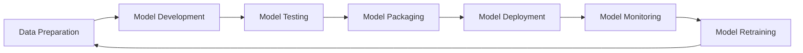

# AI系统MLOps原理与代码实战案例讲解

## 1. 背景介绍
### 1.1 问题的由来
随着人工智能技术的飞速发展,越来越多的企业开始将AI应用到实际生产环境中。然而,AI系统的开发与传统软件开发有很大不同,涉及数据处理、模型训练、模型部署等多个环节,如何有效管理AI系统的整个生命周期成为一个亟待解决的问题。MLOps(Machine Learning Operations)应运而生,它旨在将机器学习系统的构建、部署和监控自动化,提高AI项目的效率和成功率。

### 1.2 研究现状
目前,国内外已经有不少团队开始研究和实践MLOps。微软、谷歌、亚马逊等科技巨头都推出了自己的MLOps平台和工具。学术界也有很多关于MLOps的研究论文发表。但总的来说,MLOps还处于起步阶段,离大规模工业应用还有一定距离。现有的MLOps平台和工具大多针对特定场景,通用性和扩展性有待提高。

### 1.3 研究意义
MLOps的研究对于推动AI规模化应用具有重要意义:

1. 提高AI项目成功率:通过MLOps实践,可以减少AI系统开发过程中的错误和风险,提高项目的稳定性和可靠性。

2. 加速AI模型迭代:MLOps可以实现AI模型开发流程的自动化,缩短开发周期,加快迭代速度。

3. 促进AI民主化:MLOps使得非专业人员也能参与到AI开发中来,降低使用门槛。

4. 推动AI产业发展:MLOps是人工智能产业化的关键环节,其发展水平很大程度决定了AI能否真正落地应用。

### 1.4 本文结构
本文将重点介绍MLOps的核心原理和关键技术,并通过代码实战案例帮助读者深入理解MLOps的实现细节。全文分为以下几个部分:

1. MLOps的核心概念与关键环节介绍  
2. MLOps流程中的核心算法原理与操作步骤
3. MLOps系统架构与数学建模 
4. MLOps代码实战案例:模型CI/CD自动化
5. MLOps在工业界的实际应用场景
6. MLOps学习资源与工具推荐
7. MLOps未来趋势展望与面临的挑战
8. 常见问题解答与学习建议

## 2. 核心概念与联系
MLOps的核心理念是将机器学习(ML)和软件工程最佳实践(如CI/CD、测试、监控)相结合,高效、可靠地管理端到端的机器学习工作流。具体来说,MLOps主要包含以下几个关键环节:

- 数据准备(Data Preparation):收集、清洗、预处理数据,为模型训练做好准备。
- 模型开发(Model Development):选择合适的模型架构,调试模型超参数,进行模型训练和验证。  
- 模型测试(Model Testing):使用测试集数据评估模型性能,检测潜在错误和漏洞。
- 模型打包(Model Packaging):将训练好的模型转换为标准格式,封装为可部署的软件组件。
- 模型部署(Model Deployment):将打包好的模型部署到生产环境,配置必要的计算和存储资源。
- 模型监控(Model Monitoring):实时监控模型性能,发现异常情况并及时响应。
- 模型再训练(Model Retraining):根据实际反馈数据,定期对模型进行再训练,保持模型的有效性。

这些环节相互关联、循环迭代,最终形成一个自动化的生产级ML工作流。下图展示了MLOps的关键组件和典型工作流:



## 3. 核心算法原理 & 具体操作步骤
### 3.1 算法原理概述
MLOps中的关键算法主要包括机器学习算法和软件工程算法两大类。前者用于构建高质量的AI模型,后者用于实现ML工作流的自动化。

常见的机器学习算法有:
- 监督学习:线性回归、逻辑回归、决策树、支持向量机、神经网络等
- 无监督学习:K-means聚类、主成分分析、自编码器等  
- 强化学习:Q-learning、策略梯度、蒙特卡洛树搜索等

常见的MLOps自动化算法有:
- 超参数搜索:网格搜索、随机搜索、贝叶斯优化等
- 数据版本控制:Git、DVC等
- 容器化部署:Docker、Kubernetes等
- 模型服务化:TensorFlow Serving、Clipper等

### 3.2 算法步骤详解
下面我们以贝叶斯优化算法为例,详细讲解其原理和实现步骤。贝叶斯优化是一种高效的超参数搜索算法,通过构建目标函数的概率模型来指导下一个超参数的选择。

贝叶斯优化的主要步骤如下:

1. 定义搜索空间:确定需要优化的超参数及其取值范围。
2. 选择先验函数:一般选择高斯过程作为先验概率分布。  
3. 定义采集函数:如期望提升(Expected Improvement)等,用于平衡探索和利用。
4. 迭代优化:根据先验和采集函数选择下一组超参数,更新先验,直到达到预设的迭代次数。
5. 返回最优结果:输出验证集上性能最好的一组超参数。

贝叶斯优化算法可以用如下伪代码表示:

```
INPUT:
    f: 目标函数(如模型验证集准确率) 
    S: 搜索空间
    M: 先验概率模型(高斯过程)
    u: 采集函数 
    T: 迭代次数
    
OUTPUT:
    最优超参数 x*

Algorithm:
    H ← ∅
    for t = 1 to T do:
        x ← arg max u(x|M,H)
        y ← f(x)
        H ← H ∪ {(x,y)}
        M ← update(M,H)
    end for
    x* ← arg max f(x) for x in H
    return x*
```

### 3.3 算法优缺点
贝叶斯优化的主要优点有:
- 样本效率高,尤其适合计算成本高的目标函数
- 可以优化黑盒函数,不要求函数连续可导
- 可以添加先验知识,引入领域专家经验

缺点包括:
- 计算复杂度高,难以处理高维搜索空间
- 需要合理设置先验分布和采集函数,对参数敏感
- 只能找到局部最优,难以探索全局

### 3.4 算法应用领域  
贝叶斯优化在MLOps中主要用于自动化调优机器学习模型超参数,如神经网络的层数、每层神经元个数等。此外,它还可以用于优化系统配置参数,如资源分配、任务调度等。

除了贝叶斯优化,MLOps中还会用到多种其他优化算法,如进化算法、强化学习等,具体选择需要根据实际问题的特点。

## 4. 数学模型和公式 & 详细讲解 & 举例说明
### 4.1 数学模型构建
MLOps中的很多问题可以抽象为数学模型,通过求解模型来优化系统。以资源调度问题为例,我们可以建立如下的整数规划模型:

- 变量定义:
$x_{ij}$:任务i是否放置在服务器j上,取值为0或1
$y_j$:服务器j是否被使用,取值为0或1

- 参数定义:  
$c_i$:任务i的计算资源需求
$m_i$:任务i的内存资源需求
$C_j$:服务器j的计算资源容量
$M_j$:服务器j的内存资源容量

- 目标函数:最小化使用的服务器数量
$$
min \sum_{j=1}^n y_j
$$

- 约束条件:
  - 每个任务只能放置在一台服务器上:
$$
\sum_{j=1}^n x_{ij} = 1, \forall i
$$
  - 服务器计算资源容量限制:
$$
\sum_{i=1}^m c_i x_{ij} \leq C_j y_j, \forall j  
$$
  - 服务器内存资源容量限制:
$$
\sum_{i=1}^m m_i x_{ij} \leq M_j y_j, \forall j
$$
  - 变量取值范围:
$$
x_{ij} \in \{0,1\}, \forall i,j \\
y_j \in \{0,1\}, \forall j
$$

### 4.2 公式推导过程
以上模型可以用分支定界法求解,其核心是线性松弛和分支。首先,我们将整数约束 $x_{ij},y_j \in \{0,1\}$ 松弛为 $0 \leq x_{ij},y_j \leq 1$,得到一个线性规划问题。求解这个线性规划可以得到一个下界。

然后,我们选择一个取值为分数的变量,进行分支。例如,如果 $x_{11}=0.6$,我们就构造两个子问题:一个在原问题基础上添加约束 $x_{11}=0$,另一个添加约束 $x_{11}=1$。这样不断分支,直到所有变量取值都是整数,或者所有节点的目标值都不小于当前的上界。

在分支定界搜索的同时,每个整数可行解都可以更新上界,从而剪枝,提高搜索效率。

### 4.3 案例分析与讲解
我们以一个简单的例子来说明该模型的应用。假设有3个任务{T1,T2,T3},资源需求分别为:
```
T1: cpu=3, mem=2
T2: cpu=2, mem=4  
T3: cpu=4, mem=3
```

同时有2台服务器{S1,S2},资源容量分别为:
```
S1: cpu=6, mem=7
S2: cpu=5, mem=8
```

我们的目标是最小化服务器数量。根据上面的整数规划模型,可以得到如下求解结果:
```
x_11=1, x_22=1, x_32=1
y_1=1, y_2=1
```

即T1放在S1上,T2和T3放在S2上,最少需要2台服务器。这个结果是最优的,因为单个服务器的资源容量都不足以同时满足3个任务。

### 4.4 常见问题解答
Q: 整数规划问题的求解复杂度如何?  
A: 整数规划是一类NP难问题,求解复杂度随问题规模呈指数增长。但在实际应用中,很多启发式算法如分支定界法、切平面法等可以在可接受的时间内得到较好的次优解。

Q: 除了资源调度,整数规划还可以应用在哪些MLOps问题上?
A: 整数规划是一个非常通用的建模工具,可以用于求解MLOps中的多种组合优化问题,如模型选择、数据分割、工作流编排等。

Q: 使用数学建模的优势是什么?
A: 数学建模可以将复杂的系统问题抽象为规范的数学语言,有助于清晰地分析问题的结构特征。此外,在模型求解过程中,我们可以利用丰富的优化理论和算法,这比简单地枚举搜索要高效得多。

## 5. 项目实践：代码实例和详细解释说明
下面我们通过一个模型持续集成的代码实例,演示MLOps的核心实践。该示例基于Jenkins和Kubernetes实现模型训练流水线的自动化。

### 5.1 开发环境搭建
首先,我们需要搭建Jenkins和Kubernetes集群环境。可以使用云平台提供的托管服务,或者在本地通过工具如Minikube、Kind等快速部署测试环境。

然后,在Jenkins中安装必要的插件,如Kubernetes插件、Git插件等,并创建一个流水线项目。

### 5.2 源代码详细实现
下面是模型训练流水线的Jenkinsfile示例:

```groovy
pipeline {
    agent {
        kubernetes {
            yaml '''
apiVersion: v1
kind: Pod
spec:
  containers:
  - name: tensorflow
    image: tensorflow/tensorflow:latest
    command:
    - cat
    