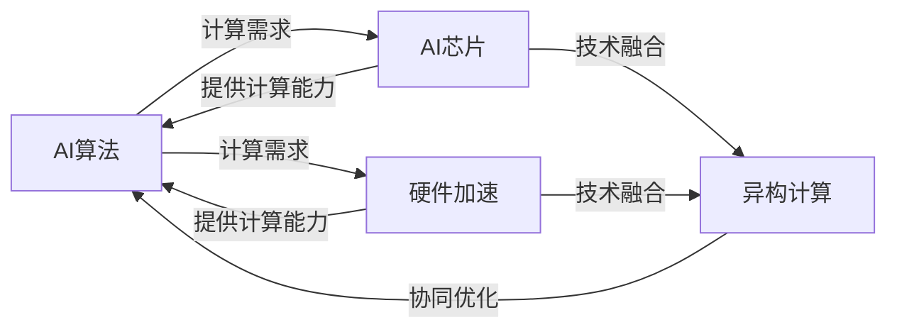

# AI芯片与硬件加速原理与代码实战案例讲解

关键词：AI芯片、硬件加速、深度学习、神经网络、FPGA、ASIC、异构计算、张量处理器、神经处理单元

## 1. 背景介绍
### 1.1  问题的由来
人工智能(AI)技术的快速发展,尤其是深度学习的兴起,对计算硬件提出了更高的要求。传统的通用CPU已经无法满足AI算法对计算性能和能效的需求。为了加速AI算法的运行,各大科技公司和研究机构纷纷投入到AI芯片和硬件加速技术的研发中。

### 1.2  研究现状 
目前,AI芯片和硬件加速主要有以下几种主流方案:
1. GPU:最早被用于深度学习加速的硬件,NVIDIA的CUDA平台占据主导地位。
2. FPGA:可编程逻辑器件,可以灵活配置硬件电路,实现高效的AI算法加速。
3. ASIC:专用集成电路,为特定AI算法定制硬件电路,性能和能效最优,但灵活性较差。
4. 异构计算:将多种不同的计算单元(如CPU、GPU、FPGA等)集成在一起,发挥各自的优势。
5. 先进的AI芯片架构:如谷歌的TPU(张量处理器)、寒武纪的NPU(神经处理单元)等。

### 1.3  研究意义
AI芯片与硬件加速技术的研究对于推动人工智能的发展具有重要意义:
1. 突破AI算法的性能瓶颈,实现更大规模、更复杂的模型训练和推理。
2. 降低AI应用的部署成本和能耗,促进AI技术在更广泛领域的应用。
3. 探索新的计算架构和器件技术,为未来的AI系统奠定基础。

### 1.4  本文结构
本文将从以下几个方面对AI芯片与硬件加速技术进行深入探讨:
1. 核心概念与关键技术
2. 主流硬件加速方案的原理与实现
3. AI芯片的架构设计与性能优化
4. 硬件加速在典型AI应用中的案例分析
5. 面向未来的AI硬件技术展望

## 2. 核心概念与联系



如上图所示,AI算法、AI芯片、硬件加速是相辅相成的。AI算法对计算硬件提出了更高的要求,而AI芯片和硬件加速技术则为AI算法提供了强大的计算能力支撑。同时,AI芯片和各种硬件加速技术还可以融合形成异构计算架构,进一步发挥协同优化的作用。

一些关键概念:
- AI芯片:专门为人工智能计算设计的处理器芯片,通常采用多核并行、数据复用、低精度等特殊优化。
- 硬件加速:利用专用硬件(如GPU、FPGA、ASIC等)对计算密集型任务进行加速,通过并行计算、流水线、数据重用等手段提高性能。
- 异构计算:将不同类型的处理器组合在一起协同工作,发挥各自的优势,如CPU负责通用计算和调度,GPU负责大规模并行计算。
- 深度学习:一种基于深度神经网络的机器学习方法,在图像、语音、自然语言等领域取得了突破性进展,但也带来了巨大的计算压力。
- 张量:多维数组,是深度学习中数据表示的基本形式。加速张量运算是AI芯片的重要任务之一。

## 3. 核心算法原理 & 具体操作步骤
### 3.1  算法原理概述
AI芯片和硬件加速的核心是对神经网络的加速优化。神经网络由大量的神经元节点组成,通过层次连接形成复杂的网络结构。前向推理时,每个节点接收来自上一层的输入,经过加权、求和、激活等操作后产生输出;反向传播时,根据损失函数求导,自上而下调整各层权重。这些计算具有高度的并行性和规律性,适合用专门硬件进行加速。

### 3.2  算法步骤详解
以卷积神经网络(CNN)为例,主要有以下计算步骤:
1. 卷积:对输入特征图进行滑动窗口式的局部卷积运算,提取特征。
2. 激活:对卷积结果进行非线性变换,增加网络的表达能力。常见的激活函数有ReLU、sigmoid等。
3. 池化:对激活后的特征图进行降采样,减小数据量,提高鲁棒性。常见的池化操作有最大池化、平均池化等。
4. 全连接:将提取到的特征展开成向量,经过若干个全连接层,生成最终的分类或预测结果。

在硬件加速实现时,可以针对这些步骤进行优化:
1. 将卷积操作转化为矩阵乘法,利用硬件的并行计算能力。
2. 对卷积的输入输出数据进行重排和分块,提高数据复用和访存效率。
3. 采用定点化、量化等技术,降低数据位宽,减少存储和计算开销。
4. 对激活、池化等操作设计专门的电路单元,实现高效计算。
5. 引入稀疏性优化,跳过零值计算,减少无效计算。

### 3.3  算法优缺点
AI芯片和硬件加速相比于传统的CPU和GPU实现,有以下优点:
1. 专门针对AI算法特点进行优化,计算效率更高。
2. 可以根据需求定制不同的硬件配置,灵活性更好。
3. 低功耗设计,更适合端侧部署。

但也存在一些局限:
1. 硬件设计复杂,开发周期长,成本较高。
2. 专用化程度高,通用性不如CPU和GPU。
3. 算法和模型的变化可能需要重新设计硬件。

### 3.4  算法应用领域
AI芯片和硬件加速技术在以下领域有广泛应用:
1. 智能手机、智能音箱等消费电子设备中的AI应用。
2. 自动驾驶、安防监控等嵌入式AI系统。
3. 云端大规模机器学习和深度学习平台。
4. 科学计算、医疗影像等专业领域的AI加速。

## 4. 数学模型和公式 & 详细讲解 & 举例说明
### 4.1  数学模型构建
以全连接层的矩阵乘法运算为例,假设输入矩阵为$A$,权重矩阵为$W$,偏置向量为$b$,激活函数为$f$,则输出矩阵$Y$为:

$$
Y = f(A \times W + b)
$$

其中,$A$的维度为$m \times n$,$W$的维度为$n \times p$,$b$的维度为$p \times 1$,则$Y$的维度为$m \times p$。

### 4.2  公式推导过程
对于矩阵乘法$C = A \times B$,传统的三重循环实现如下:

$$
C[i][j] = \sum_{k=1}^{n} A[i][k] \times B[k][j]
$$

其中,$i \in [1,m], j \in [1,p], k \in [1,n]$。

为了优化计算效率,可以采用分块矩阵乘法。假设分块大小为$b$,则$A$可以分为$m/b \times n/b$个子矩阵,B可以分为$n/b \times p/b$个子矩阵。每个$C$的子矩阵可以表示为若干个$A$和$B$子矩阵的乘积之和:

$$
C[i][j] = \sum_{k=1}^{n/b} A[i][k] \times B[k][j]
$$

其中,$i \in [1,m/b], j \in [1,p/b], k \in [1,n/b]$。

这样可以减少数据读写次数,提高缓存命中率和并行效率。

### 4.3  案例分析与讲解
下面以一个简单的全连接神经网络为例,说明硬件加速的过程。

假设输入向量为$x=[x_1,x_2,...,x_n]^T$,第一层权重矩阵为$W_1$,偏置向量为$b_1$,激活函数为ReLU,则第一层输出为:

$$
h_1 = ReLU(W_1 \times x + b_1)
$$

其中,ReLU函数定义为:

$$
ReLU(x) = max(0,x)
$$

类似地,假设第二层权重矩阵为$W_2$,偏置向量为$b_2$,激活函数为sigmoid,则第二层输出为:

$$
h_2 = sigmoid(W_2 \times h_1 + b_2)
$$

其中,sigmoid函数定义为:

$$
sigmoid(x) = \frac{1}{1+e^{-x}}
$$

最后,假设输出层权重矩阵为$W_3$,偏置向量为$b_3$,激活函数为恒等函数,则输出向量为:

$$
y = W_3 \times h_2 + b_3
$$

在硬件加速实现时,可以将这些矩阵乘法、加法、激活函数等操作映射到专门设计的电路单元中,通过流水线、并行、数据复用等技术实现高效计算。

### 4.4  常见问题解答
Q: AI芯片相比于GPU的优势是什么?
A: AI芯片通常采用更专门的体系结构和指令集,针对AI算法的特点进行了优化,如支持低精度计算、稀疏性加速等。而GPU虽然也能提供高并行度,但是仍然是一种通用计算架构,没有AI芯片那么"专精"。此外,AI芯片还具有功耗更低、可定制性更强等优点。

Q: 不同的硬件加速方案各有什么特点?
A: 
- GPU适合大规模并行计算,在训练大型神经网络时性能优势明显,但功耗较高。
- FPGA具有灵活的可编程性,可以根据不同算法定制电路,功耗相对较低,但开发难度大。
- ASIC专用性最强,性能和功耗最优,但灵活性差,设计周期长,成本高。
- 异构计算可以发挥不同硬件的优势,平衡性能和效率,但系统复杂度高。

Q: 未来AI芯片和硬件加速技术的发展趋势是什么?
A: 未来可能的发展趋势包括:
1. 更高的集成度和计算密度,支持更大规模的神经网络。
2. 更灵活的可重构架构,适应不断evolving的AI算法。
3. 更好的软硬件协同设计,实现端到端的优化。
4. 更多的新型器件和计算范式,如忆阻器、光子计算等。
5. 更广泛的应用场景,从云到端,从消费电子到工业制造。

## 5. 项目实践：代码实例和详细解释说明
### 5.1  开发环境搭建
以FPGA加速为例,需要准备以下开发环境:
- FPGA开发板,如Xilinx Zynq、Intel Arria等。
- FPGA开发工具,如Vivado、Quartus等,用于硬件设计和综合。
- 软件开发环境,如SDK、OpenCL等,用于编写加速器程序。
- 深度学习框架,如TensorFlow、PyTorch等,用于训练和部署模型。

### 5.2  源代码详细实现
下面是一个简化的FPGA加速矩阵乘法的Verilog代码示例:

```verilog
module mat_mul #(
    parameter WIDTH = 8,
    parameter DEPTH = 1024
)(
    input clk,
    input rst_n,
    input [WIDTH-1:0] mat_a[0:DEPTH-1],
    input [WIDTH-1:0] mat_b[0:DEPTH-1],
    output reg [2*WIDTH-1:0] mat_c[0:DEPTH-1]
);

integer i, j, k;

always @(posedge clk or negedge rst_n) begin
    if (!rst_n) begin
        for (i = 0; i < DEPTH; i = i + 1) begin
            mat_c[i] <= 0;
        end
    end else begin
        for (i = 