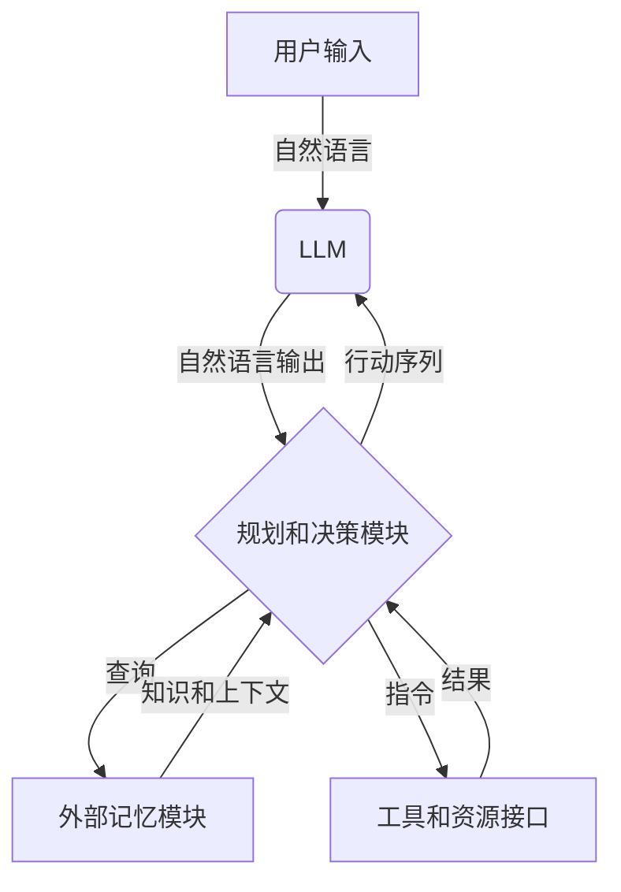
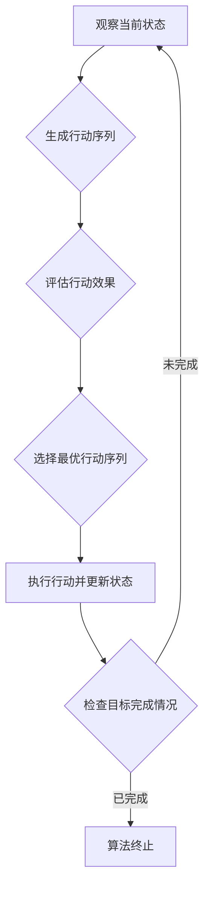

好的,我会严格按照您提供的要求和结构模板来撰写这篇技术博客文章。

# Agent = LLM（大型语言模型）+记忆+规划技能+工具使用

## 1. 背景介绍

### 1.1 问题的由来

随着人工智能技术的不断发展,大型语言模型(LLM)已经展现出了令人惊叹的能力。它们可以生成高质量的自然语言文本、回答复杂的问题、进行任务规划和推理等。然而,单独的LLM存在一些固有的局限性,例如缺乏持久的记忆能力、无法灵活地利用外部工具和资源、规划和决策能力有限等。因此,如何充分发挥LLM的优势,同时弥补其不足,成为了当前人工智能研究的一个重要课题。

### 1.2 研究现状

为了解决上述问题,研究人员提出了将LLM与其他组件相结合的方案,形成了所谓的"Agent"系统。这种Agent系统通常由以下几个核心组件构成:

- 大型语言模型(LLM)
- 外部记忆模块
- 规划和决策模块
- 工具和资源接口

通过将这些组件有机结合,Agent系统可以充分利用LLM的自然语言理解和生成能力,同时获得持久的记忆能力、灵活的工具使用能力以及强大的规划和决策能力。目前,已有一些初步的研究工作探索了这种Agent系统的构建方法和应用场景。

### 1.3 研究意义

构建高效、智能的Agent系统对于推进人工智能技术的发展具有重要意义。它可以帮助我们更好地利用LLM的强大能力,同时克服其固有的局限性。此外,Agent系统还可以在诸多领域发挥作用,例如智能助手、自动化决策系统、知识管理系统等。因此,深入研究Agent系统的构建方法和应用场景,对于推动人工智能技术的实际应用具有重要价值。

### 1.4 本文结构

本文将全面介绍Agent系统的核心概念、关键技术和实际应用。具体来说,第2部分将阐述Agent系统的核心概念及其与LLM、记忆、规划和工具使用之间的联系;第3部分将详细解释Agent系统中核心算法的原理和具体操作步骤;第4部分将构建数学模型并推导相关公式,并通过案例分析进行详细讲解;第5部分将提供代码实例并进行详细解释;第6部分将探讨Agent系统的实际应用场景;第7部分将推荐相关的工具和学习资源;最后,第8部分将总结研究成果、分析未来发展趋势并指出面临的挑战。

## 2. 核心概念与联系

Agent系统是一种集成了多种能力的智能系统,它由以下四个核心组件构成:

1. **大型语言模型(LLM)**: 作为Agent系统的核心,LLM负责自然语言的理解和生成。它可以根据给定的文本输入生成相应的自然语言输出,例如回答问题、生成文本等。常见的LLM包括GPT-3、PaLM、ChatGPT等。

2. **外部记忆模块**: 由于LLM本身缺乏持久的记忆能力,因此需要引入外部记忆模块来存储和管理相关的知识和上下文信息。常见的记忆模块包括基于向量数据库的记忆模块和基于神经网络的记忆模块等。

3. **规划和决策模块**: 这个模块负责根据当前的状态和目标,规划和决策Agent系统应该采取的行动。它可以利用搜索算法、强化学习等技术来生成行动序列,并评估每个行动的效果。

4. **工具和资源接口**: Agent系统需要与外部工具和资源进行交互,例如搜索引擎、计算器、文件系统等。工具和资源接口提供了与这些外部系统进行通信的能力,使Agent系统可以利用外部资源来完成特定任务。

这四个组件相互协作,共同赋予Agent系统智能化的能力。LLM为Agent系统提供自然语言理解和生成的能力;外部记忆模块保存了相关的知识和上下文信息;规划和决策模块负责生成行动序列并评估其效果;工具和资源接口则使Agent系统能够利用外部资源来完成复杂任务。

下面是一个简单的Mermaid流程图,展示了Agent系统的核心组件及其之间的交互:

在这个流程图中,用户的自然语言输入首先被LLM处理,生成初步的自然语言输出。然后,规划和决策模块根据当前状态和目标,查询外部记忆模块以获取相关的知识和上下文信息,并与工具和资源接口交互以利用外部资源。最终,规划和决策模块生成一系列行动,并将其传递回LLM,以生成最终的自然语言输出。

通过将这四个核心组件紧密集成,Agent系统可以充分发挥LLM的自然语言能力,同时获得持久的记忆、灵活的工具使用能力以及智能的规划和决策能力,从而更好地解决复杂的任务。

## 3. 核心算法原理与具体操作步骤

### 3.1 算法原理概述

Agent系统的核心算法是一种基于反馈循环的迭代算法,它不断地根据当前状态和目标生成行动序列,并根据行动的结果更新状态,直到达成目标为止。这个过程可以概括为以下几个关键步骤:

1. **观察当前状态**: Agent系统首先观察当前的状态,包括用户的输入、外部记忆中的知识和上下文信息、可用的工具和资源等。

2. **生成行动序列**: 根据当前状态和目标,规划和决策模块生成一系列潜在的行动,例如查询记忆、使用工具、生成自然语言输出等。

3. **评估行动效果**: 对于每个潜在的行动序列,Agent系统会模拟执行该序列,并评估其对于达成目标的效果。这个过程可以利用LLM的自然语言理解和生成能力,以及外部记忆和工具的支持。

4. **选择最优行动序列**: 根据评估结果,Agent系统选择效果最佳的行动序列执行。

5. **执行行动并更新状态**: Agent系统执行选定的行动序列,并根据行动的结果更新当前状态。例如,如果行动包括查询记忆,则会更新记忆状态;如果行动包括使用工具,则会更新工具的状态等。

6. **检查目标完成情况**: Agent系统检查当前状态是否已经达成目标。如果目标已经完成,则算法终止;否则,返回步骤1,重复上述过程。

这种基于反馈循环的迭代算法允许Agent系统根据动态变化的状态和目标,不断调整其行动策略,直到最终完成任务。下面是一个简化的Mermaid流程图,展示了该算法的核心流程:

### 3.2 算法步骤详解

下面我们将详细解释上述算法的每个步骤:

1. **观察当前状态**

   在这一步骤中,Agent系统需要收集当前任务的所有相关信息,包括:
   - 用户的输入和上下文信息
   - 外部记忆中存储的相关知识
   - 可用的工具和资源列表
   - 已经完成的子任务及其结果
   - 当前的目标和约束条件

   Agent系统通过与LLM、外部记忆模块和工具接口交互,获取这些信息。

2. **生成行动序列**

   根据当前状态和目标,规划和决策模块需要生成一系列潜在的行动序列。每个行动序列都是一组有序的行动,例如:
   - 查询外部记忆以获取相关知识
   - 使用特定的工具(如搜索引擎、计算器等)
   - 生成自然语言输出作为中间结果或最终结果
   - 分解任务为多个子任务,并递归地应用算法来完成子任务

   规划和决策模块可以利用各种技术来生成行动序列,例如启发式搜索算法、强化学习等。

3. **评估行动效果**

   对于每个潜在的行动序列,Agent系统需要评估其对于完成目标的效果。这个过程通常涉及模拟执行该行动序列,并预测其结果。

   评估过程可以利用LLM的自然语言理解和生成能力,以及外部记忆和工具的支持。例如,如果某个行动序列包括查询记忆,则Agent系统可以模拟查询记忆并获取相关知识;如果某个行动序列包括使用工具,则Agent系统可以模拟使用该工具并获取其输出结果。

   根据模拟执行的结果,Agent系统可以评估每个行动序列对于完成目标的贡献程度,并给出一个评分或效用值。

4. **选择最优行动序列**

   根据对每个行动序列的评估结果,Agent系统需要选择效果最佳的行动序列执行。这可以通过比较每个序列的评分或效用值来实现。

   在选择过程中,Agent系统还需要考虑一些其他因素,例如行动序列的长度、执行成本、风险等。通常,较短且风险较低的行动序列会被优先选择。

5. **执行行动并更新状态**

   一旦选定了最优的行动序列,Agent系统就需要执行该序列中的每个行动。执行过程中,Agent系统会与外部记忆模块和工具接口进行交互,例如查询记忆、使用工具等。

   根据每个行动的执行结果,Agent系统需要相应地更新当前状态。例如,如果某个行动是查询记忆,则需要更新记忆状态;如果某个行动是使用工具,则需要更新工具的状态等。

   此外,如果某个行动生成了自然语言输出(例如中间结果或最终结果),则该输出也需要被记录在当前状态中。

6. **检查目标完成情况**

   在执行完一个行动序列之后,Agent系统需要检查当前状态是否已经达成了最终目标。

   如果目标已经完成,则算法终止,Agent系统可以输出最终结果。否则,算法会返回到第一步,基于更新后的状态重新开始下一轮迭代。

通过不断地迭代上述步骤,Agent系统可以逐步完成复杂的任务,并充分利用LLM、外部记忆、工具和资源等各个组件的能力。

### 3.3 算法优缺点

上述算法具有以下优点:

- **灵活性**: 算法可以根据动态变化的状态和目标,灵活地调整行动策略,从而适应各种复杂任务。
- **可解释性**: 由于算法是基于明确的步骤和规则,因此其决策过程是可解释的,有助于提高系统的透明度和可信度。
- **可扩展性**: 算法的模块化设计使得它可以轻松地集成新的组件,例如新的LLM、记忆模块或工具接口,从而不断扩展系统的能力。
- **鲁棒性**: 通过评估多个潜在的行动序列,算法可以选择最优的策略,从而提高系统的鲁棒性和可靠性。

然而,该算法也存在一些缺点和挑战:

- **计算开销**: 评估多个行动序列的效果可能需要大量的计算资源,尤其是当任务复杂度增加时。
- **局部最优陷阱**: 算法可能会陷入局部最优解,无法找到全局最优的行动序列。
- **模拟精度**: 模拟执