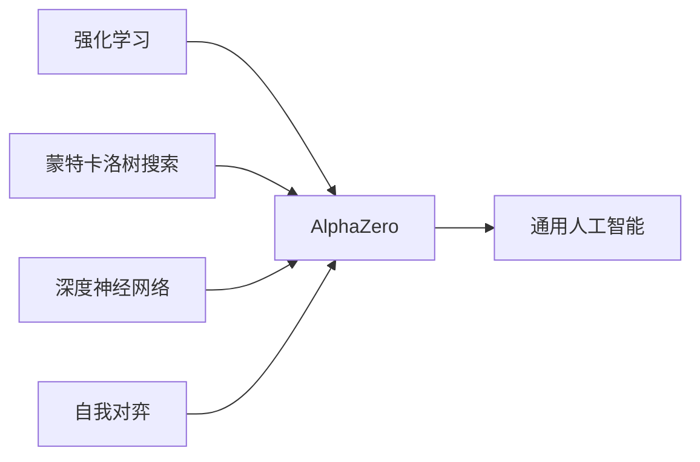

# AlphaZero原理与代码实例讲解

作者：禅与计算机程序设计艺术 / Zen and the Art of Computer Programming

## 1. 背景介绍

### 1.1 问题的由来
人工智能在博弈领域的研究由来已久。从1997年IBM深蓝战胜国际象棋世界冠军卡斯帕罗夫，到2016年AlphaGo击败围棋世界冠军李世石，再到2017年底DeepMind推出的AlphaZero横空出世，人工智能在博弈领域不断取得突破性进展。AlphaZero的出现引起了学术界和工业界的广泛关注，它以全新的思路解决了多个复杂博弈问题，展现了通用人工智能的巨大潜力。

### 1.2 研究现状
传统的博弈AI系统通常依赖大量的人工设计特征和领域知识。而AlphaZero摒弃了这种做法，完全从零开始学习，仅仅通过自我对弈，在国际象棋、日本将棋、围棋等多个领域达到了超人的水平。目前，AlphaZero的思想已经被广泛应用到其他领域，如组合优化、药物发现等。学术界对AlphaZero展开了深入研究，提出了许多改进和变种算法。

### 1.3 研究意义
AlphaZero是人工智能领域的里程碑式成果。它证明了通过深度强化学习和自我对弈，AI系统可以在极其复杂的问题上实现自我完善，而无需人工干预。AlphaZero的成功为通用人工智能的实现提供了新的思路。深入理解AlphaZero的原理，对于推动人工智能的发展具有重要意义。同时，AlphaZero所蕴含的思想也为其他领域的问题求解带来了启发。

### 1.4 本文结构
本文将全面解析AlphaZero的原理与实现。第2部分介绍AlphaZero涉及的核心概念。第3部分重点阐述AlphaZero的算法原理和具体步骤。第4部分从数学角度对AlphaZero的模型和公式进行推导和讲解。第5部分给出AlphaZero的代码实例并详细解释。第6部分讨论AlphaZero的实际应用场景。第7部分推荐AlphaZero相关的学习资源和工具。第8部分总结全文并展望AlphaZero的未来发展。第9部分列举AlphaZero的常见问题与解答。

## 2. 核心概念与联系

在探究AlphaZero原理之前，我们需要了解几个核心概念：

- **强化学习(Reinforcement Learning)**：一种机器学习范式，智能体(Agent)通过与环境的交互，学习如何采取行动(Action)以获得最大累积奖励(Reward)。AlphaZero正是一种强化学习算法。

- **蒙特卡洛树搜索(Monte Carlo Tree Search, MCTS)**：一种启发式搜索算法，通过随机模拟来评估每个决策分支的期望收益，进而指导决策过程。AlphaZero使用MCTS来进行博弈推理和决策。

- **深度神经网络(Deep Neural Network, DNN)**：一种强大的机器学习模型，可以从数据中学习复杂的非线性函数。AlphaZero使用DNN来逼近博弈的状态价值和策略。

- **自我对弈(Self-Play)**：AlphaZero通过自我对弈来生成训练数据，不断更新和优化自身的博弈策略。

- **通用人工智能(Artificial General Intelligence, AGI)**：一种能像人类一样进行学习、推理、解决问题的AI系统。AlphaZero展现了通用人工智能的特质。

下图展示了这些概念在AlphaZero中的关系：

AlphaZero融合了强化学习、MCTS、DNN等技术，通过自我对弈实现了从零开始的学习，体现了通用人工智能的思想。接下来，我们将详细解读AlphaZero的算法原理。

## 3. 核心算法原理 & 具体操作步骤

### 3.1 算法原理概述

AlphaZero的核心思想是将深度强化学习与MCTS相结合，通过自我对弈不断优化博弈策略。具体而言，AlphaZero包含以下关键组件：

- 一个深度残差网络(Deep Residual Network)，用于逼近博弈的状态价值函数和策略函数。
- 一个MCTS算法，用于在每个决策点上搜索最优行动。
- 一个自我对弈机制，通过自我对弈生成训练数据，优化深度残差网络。

AlphaZero的训练过程可以概括为：

1. 随机初始化深度残差网络的参数。
2. 重复以下步骤，直到满足终止条件：
   - 使用当前网络进行一定数量的自我对弈，生成训练数据。
   - 基于训练数据，更新深度残差网络的参数。
3. 返回训练好的网络作为最终的博弈策略。

在对弈过程中，AlphaZero使用MCTS来搜索最优行动。每次搜索包括多次模拟，每次模拟又包括选择、扩展、仿真、回溯四个阶段。通过这种搜索机制，AlphaZero可以高效地探索博弈树，评估每个决策分支的期望收益。

### 3.2 算法步骤详解

接下来，我们详细讲解AlphaZero的算法步骤。

**步骤1：初始化**

- 随机初始化深度残差网络 $f_\theta(s)$ 的参数 $\theta$，其中 $s$ 表示博弈状态。网络输出包括状态价值 $v$ 和策略概率 $\mathbf{p}$。

**步骤2：自我对弈**

- 重复以下过程 $N$ 次，生成训练数据：
  - 随机选择先手方 $player \in \{1,-1\}$。
  - 初始化博弈状态 $s$。
  - 当博弈未结束时：
    - 使用MCTS搜索最优行动 $a$。
    - 执行行动 $a$，更新博弈状态 $s$。
    - 将 $(s, \mathbf{p}, v)$ 添加到训练数据中，其中 $\mathbf{p}$ 为MCTS搜索返回的策略概率，$v$ 为博弈结果（胜1，负-1，平0）。

**步骤3：网络训练**

- 基于训练数据 $\{(s, \mathbf{p}, v)\}$，优化深度残差网络的参数 $\theta$，最小化损失函数：

$$\mathcal{L}(\theta) = (v - f_\theta(s)_v)^2 - \mathbf{p}^\top \log f_\theta(s)_{\mathbf{p}} + c \|\theta\|^2$$

其中，$f_\theta(s)_v$ 和 $f_\theta(s)_{\mathbf{p}}$ 分别表示网络预测的状态价值和策略概率，$c$ 为L2正则化系数。

**步骤4：终止条件判断**

- 如果满足终止条件（如训练轮数达到预设值），则返回当前网络作为最终策略，否则返回步骤2。

**MCTS搜索详解**

MCTS是AlphaZero的决策核心。每次搜索包括多次模拟，每次模拟又包括选择、扩展、仿真、回溯四个阶段：

1. **选择**：从根节点出发，递归选择子节点，直到叶子节点。选择过程基于如下公式：

$$a^* = \arg\max_{a} \left(Q(s,a) + U(s,a)\right)$$

其中，$Q(s,a)$ 为行动价值，$U(s,a)$ 为探索奖励，定义为：

$$U(s,a) = c_{puct} P(s,a) \frac{\sqrt{\sum_b N(s,b)}}{1 + N(s,a)}$$

$P(s,a)$ 为网络预测的先验概率，$N(s,a)$ 为行动访问次数，$c_{puct}$ 为探索常数。

2. **扩展**：将叶子节点扩展，加入其合法子节点。
3. **仿真**：对新扩展的节点，使用快速走子策略（如随机策略）模拟博弈至终局，得到评估值 $v$。
4. **回溯**：将评估值 $v$ 反向传播更新路径上的行动价值和访问次数。对于节点 $(s,a)$：

$$N(s,a) \leftarrow N(s,a) + 1$$
$$Q(s,a) \leftarrow Q(s,a) + \frac{v - Q(s,a)}{N(s,a)}$$

经过多次模拟后，根节点处访问次数最高的行动即为最优决策。

### 3.3 算法优缺点

AlphaZero算法的优点包括：

- 通过自我对弈学习，无需人工设计特征和领域知识。
- 将深度学习与MCTS相结合，兼顾了策略质量和计算效率。
- 展现了通用智能的潜力，可以应用于多个领域。

AlphaZero的缺点包括：

- 训练过程需要大量的计算资源和时间。
- 对博弈的状态空间和行动空间有一定要求，不易应用于状态行动空间极大的问题。
- 对博弈的奖励函数有一定要求，不易应用于奖励稀疏或延迟的问题。

### 3.4 算法应用领域

AlphaZero思想已被广泛应用于以下领域：

- 其他棋类博弈，如中国象棋、五子棋等。
- 组合优化问题，如旅行商问题、工作调度问题等。
- 自动化科学发现，如材料设计、药物发现等。
- 自然语言处理，如对话生成、机器翻译等。
- 计算机视觉，如物体检测、图像生成等。

## 4. 数学模型和公式 & 详细讲解 & 举例说明

### 4.1 数学模型构建

AlphaZero的数学模型可以用马尔可夫决策过程(Markov Decision Process, MDP)来描述。一个MDP由以下元素组成：

- 状态空间 $\mathcal{S}$：所有可能的博弈状态的集合。
- 行动空间 $\mathcal{A}$：在每个状态下可以采取的合法行动的集合。
- 转移概率 $\mathcal{P}(s'|s,a)$：在状态 $s$ 下采取行动 $a$ 后转移到状态 $s'$ 的概率。
- 奖励函数 $\mathcal{R}(s,a)$：在状态 $s$ 下采取行动 $a$ 后获得的即时奖励。
- 折扣因子 $\gamma \in [0,1]$：未来奖励的折扣率，用于平衡即时奖励和长期奖励。

MDP的目标是寻找一个策略 $\pi: \mathcal{S} \rightarrow \mathcal{A}$，使得期望累积奖励最大化：

$$\pi^* = \arg\max_{\pi} \mathbb{E}\left[\sum_{t=0}^{\infty} \gamma^t \mathcal{R}(s_t, \pi(s_t))\right]$$

其中，$s_t$ 表示第 $t$ 步的状态。

对于双人零和博弈，AlphaZero将MDP扩展为马尔可夫游戏(Markov Game)。马尔可夫游戏中，每个玩家的目标是最大化自己的期望累积奖励。

### 4.2 公式推导过程

**策略迭代**

AlphaZero通过策略迭代(Policy Iteration)来求解马尔可夫游戏。策略迭代交替执行策略评估(Policy Evaluation)和策略提升(Policy Improvement)两个步骤，直到策略收敛。

策略评估旨在计算给定策略 $\pi$ 下的状态价值函数 $v_\pi(s)$：

$$v_\pi(s) = \mathbb{E}\left[\sum_{t=0}^{\infty} \gamma^t \mathcal{R}(s_t, \pi(s_t)) | s_0 = s\right]$$

根据贝尔曼方程(Bellman Equation)，上式可以改写为：

$$v_\pi(s) = \mathcal{R}(s, \pi(s)) + \gamma \sum_{s'