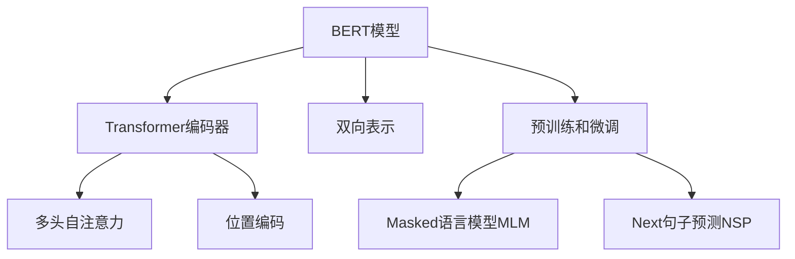
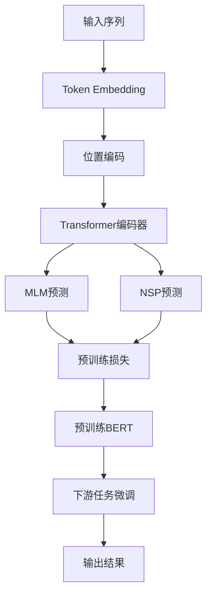

以下是《BERT原理与代码实例讲解》这篇技术博客文章的正文内容：

# BERT原理与代码实例讲解

## 1. 背景介绍

### 1.1 问题的由来

在自然语言处理(NLP)领域中,机器理解人类语言一直是一个巨大的挑战。传统的NLP模型通常采用单向语言模型,即从左到右或从右到左来处理文本序列,这种方式无法很好地捕捉上下文的双向关系。因此,需要一种新的语言表示模型来更好地理解上下文,并提高各种NLP任务的性能。

### 1.2 研究现状 

2018年,谷歌的AI研究员发表了一篇题为"BERT: Pre-training of Deep Bidirectional Transformers for Language Understanding"的论文,提出了BERT(Bidirectional Encoder Representations from Transformers)模型。BERT是第一个在预训练中使用深度双向transformer编码器的语言表示模型,能够更好地捕捉上下文信息。BERT在多个NLP任务上取得了state-of-the-art的性能,引起了学术界和工业界的广泛关注。

### 1.3 研究意义

BERT模型的出现为NLP领域带来了革命性的进步,其核心思想是通过预训练的方式学习通用的语言表示,然后将这些表示迁移到下游的NLP任务中进行微调,从而显著提高了模型的性能。BERT模型在机器阅读理解、文本分类、序列标注等多个任务中都取得了卓越的成绩,成为NLP领域的新基准模型。

### 1.4 本文结构

本文将全面介绍BERT模型的原理、算法细节、数学模型推导以及代码实现。首先介绍BERT模型的核心概念和与其他模型的联系,然后深入探讨BERT的算法原理和数学模型,接着通过代码实例详细讲解BERT的实现细节。最后,本文将讨论BERT在实际应用中的场景,以及未来的发展趋势和挑战。

## 2. 核心概念与联系

BERT是一种基于Transformer的双向语言表示模型,它的核心思想是通过预训练的方式学习通用的语言表示,然后将这些表示迁移到下游的NLP任务中进行微调。

BERT模型的核心概念包括:

1. **Transformer编码器**:BERT使用了Transformer的编码器部分,它是一种基于自注意力机制的神经网络结构,能够有效地捕捉长距离依赖关系。

2. **双向表示**:与传统的单向语言模型不同,BERT采用双向transformer编码器,可以同时捕捉左右上下文的信息,从而获得更好的语言表示。

3. **预训练和微调**:BERT采用了两阶段训练策略。首先在大规模无标注语料上进行预训练,学习通用的语言表示;然后将预训练的模型迁移到下游的NLP任务中,通过微调获得针对特定任务的模型。

4. **Masked Language Model(MLM)和Next Sentence Prediction(NSP)**:BERT在预训练阶段使用了两种任务,MLM用于捕捉单词级别的表示,NSP用于捕捉句子级别的表示。

BERT模型与之前的语言模型有着明显的区别。例如,ELMo使用的是单向语言模型,无法捕捉双向上下文信息;GPT只能从左到右生成文本,而BERT可以双向编码整个序列。BERT的创新之处在于引入了双向transformer编码器,并采用了预训练和微调的范式,从而获得了更好的语言表示能力。

## 3. 核心算法原理 & 具体操作步骤

### 3.1 算法原理概述

BERT的核心算法原理可以分为两个阶段:预训练(pre-training)和微调(fine-tuning)。

**预训练阶段**:BERT在大规模无标注语料上进行预训练,目的是学习通用的语言表示。预训练采用了两个任务:Masked语言模型(MLM)和Next句子预测(NSP)。

- MLM:随机掩蔽部分单词,要求模型预测被掩蔽的单词。这有助于学习单词级别的表示。
- NSP:给定两个句子,判断第二个句子是否为第一个句子的下一句。这有助于学习句子级别的表示。

**微调阶段**:将预训练好的BERT模型迁移到下游的NLP任务中,通过在特定任务的数据上进行微调,获得针对该任务的模型。微调过程中,只需要对BERT的输出层进行修改,其余部分的参数保持不变。

BERT的核心思想是:通过在大规模语料上预训练,学习通用的语言表示;然后将这些表示迁移到下游任务中进行微调,从而显著提高模型的性能。

### 3.2 算法步骤详解

1. **输入表示**:将输入序列(单词或子词)映射为embeddings向量表示。

2. **位置编码**:为每个位置添加位置编码,使transformer能够捕捉序列的位置信息。

3. **Transformer编码器**:输入embeddings和位置编码被送入transformer编码器进行编码,得到上下文表示。

4. **Masked LM**:对于MLM任务,随机选择一些token进行掩蔽,模型需要预测被掩蔽的token。

5. **Next Sentence Prediction**:对于NSP任务,给定两个句子A和B,需要判断B是否为A的下一句。

6. **预训练**:使用MLM和NSP两个任务的损失函数,在大规模语料上对BERT进行联合预训练。

7. **微调**:将预训练好的BERT模型迁移到下游NLP任务中,只需要替换输出层,保持其余部分参数不变,在特定任务的数据上进行微调。

8. **模型输出**:根据不同的下游任务,BERT模型会输出相应的结果,如分类标签、span预测等。

### 3.3 算法优缺点

**优点**:

1. 双向编码能力:与传统单向语言模型不同,BERT可以同时捕捉左右上下文的信息,获得更好的语言表示。

2. 通用语言表示:通过在大规模语料上预训练,BERT学习了通用的语言表示,可以迁移到多个下游任务中。

3. 显著提升性能:在多个NLP任务上,BERT都取得了state-of-the-art的性能,超过了之前的模型。

4. 灵活性强:BERT可以应用于多种NLP任务,如文本分类、阅读理解、序列标注等。

**缺点**:

1. 训练成本高:BERT的预训练需要消耗大量的计算资源,对硬件要求较高。

2. 模型大小庞大:BERT模型参数量很大,对内存和存储的要求较高,不利于部署。

3. 缺乏任务指导:BERT的预训练任务MLM和NSP与下游任务的相关性不强,可能会限制其性能上限。

4. 上下文长度限制:BERT只能处理长度有限的序列,无法很好地处理超长序列。

### 3.4 算法应用领域

BERT模型可以广泛应用于自然语言处理的各个领域,包括但不限于:

1. **文本分类**: 如新闻分类、情感分析、垃圾邮件过滤等。

2. **机器阅读理解**: 如问答系统、事实抽取、知识库构建等。

3. **序列标注**: 如命名实体识别、关系抽取、词性标注等。

4. **文本生成**: 如文本摘要、机器翻译、对话系统等。

5. **语义匹配**: 如信息检索、推荐系统、语义相似度计算等。

6. **其他领域**: 如代码理解、知识图谱构建、医疗自然语言处理等。

总的来说,BERT模型为NLP领域带来了革命性的进步,它的出现极大地推动了自然语言处理技术的发展。

## 4. 数学模型和公式 & 详细讲解 & 举例说明

### 4.1 数学模型构建

BERT的核心是基于Transformer的编码器结构,我们先来回顾一下Transformer的数学模型。

对于一个长度为n的输入序列$\boldsymbol{x} = (x_1, x_2, \ldots, x_n)$,Transformer首先将其映射为embeddings表示$\boldsymbol{e} = (e_1, e_2, \ldots, e_n)$,其中$e_i \in \mathbb{R}^{d_\text{model}}$是第i个token的embeddings向量。然后,embeddings被送入编码器进行编码,得到上下文表示$\boldsymbol{h} = (h_1, h_2, \ldots, h_n)$,其中$h_i \in \mathbb{R}^{d_\text{model}}$是第i个token的上下文向量。

Transformer编码器由多个相同的层组成,每一层包含两个子层:多头自注意力机制(Multi-Head Attention)和前馈神经网络(Feed-Forward Network)。

**多头自注意力机制**:

$$\begin{aligned}
\text{MultiHead}(Q, K, V) &= \text{Concat}(\text{head}_1, \ldots, \text{head}_h)W^O\\
\text{where } \text{head}_i &= \text{Attention}(QW_i^Q, KW_i^K, VW_i^V)
\end{aligned}$$

其中$Q$、$K$、$V$分别表示查询(Query)、键(Key)和值(Value)。$W_i^Q \in \mathbb{R}^{d_\text{model} \times d_k}$、$W_i^K \in \mathbb{R}^{d_\text{model} \times d_k}$和$W_i^V \in \mathbb{R}^{d_\text{model} \times d_v}$是可学习的投影矩阵。$\text{Attention}(\cdot)$是标准的缩放点积注意力机制。

**前馈神经网络**:

$$\text{FFN}(x) = \max(0, xW_1 + b_1)W_2 + b_2$$

其中$W_1 \in \mathbb{R}^{d_\text{model} \times d_\text{ff}}$、$W_2 \in \mathbb{R}^{d_\text{ff} \times d_\text{model}}$、$b_1 \in \mathbb{R}^{d_\text{ff}}$和$b_2 \in \mathbb{R}^{d_\text{model}}$是可学习的参数。

在BERT中,输入序列首先被映射为token embeddings、segment embeddings和position embeddings的总和,然后送入Transformer编码器进行编码,得到上下文表示。BERT在预训练阶段使用了两个任务:Masked语言模型(MLM)和Next句子预测(NSP)。

**Masked语言模型**:

对于MLM任务,BERT随机选择输入序列中的一些token进行掩蔽,然后使用编码器的输出对这些被掩蔽的token进行预测。具体来说,对于每个被掩蔽的token $x_i$,BERT需要最大化如下概率:

$$\log P(x_i | \boldsymbol{x}_{\backslash i}) = \log \text{softmax}(W_t h_i + b_t)$$

其中$W_t \in \mathbb{R}^{|V| \times d_\text{model}}$和$b_t \in \mathbb{R}^{|V|}$是可学习的参数,用于将上下文向量$h_i$映射到词汇表$V$上的概率分布。

**Next句子预测**:

对于NSP任务,BERT需要判断给定的两个句子是否为连续的句子对。具体来说,BERT将两个句子的embeddings拼接起来,然后使用句子A的第一个token的输出向量$h_\text{CLS}$来预测句子B是否为A的下一句:

$$P_\text{isNext} = \sigma(W_p h_\text{CLS} + b_p)$$

其中$W_p \in \mathbb{R}^{2