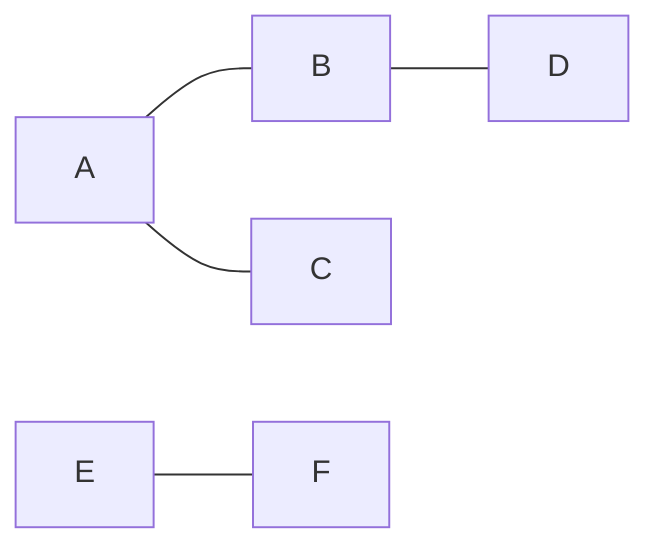

# Connected Components连通分量算法原理与代码实例讲解

关键词：图论、连通分量、深度优先搜索、广度优先搜索、并查集

## 1. 背景介绍
### 1.1 问题的由来
在图论和计算机科学领域,连通分量是一个基本而重要的概念。在一个无向图中,如果从一个顶点出发可以到达另一个顶点,则称这两个顶点是连通的。连通分量指的是无向图中的极大连通子图。求解连通分量在很多实际问题中都有广泛应用,如网络连通性分析、社交网络分析、图像分割等。

### 1.2 研究现状
目前求解连通分量的经典算法主要有深度优先搜索(DFS)、广度优先搜索(BFS)以及并查集(Union-Find)。这些算法在理论和工程实践中都得到了广泛应用和深入研究。近年来,随着图数据规模的增大,也出现了一些面向大规模图数据的连通分量计算优化算法。

### 1.3 研究意义
深入理解和掌握连通分量算法,对于从事算法和图论研究的学者来说是一项必备的基本功。同时,连通分量在诸多领域都有实际应用价值,工程实践中经常需要用到。因此,全面梳理和总结连通分量算法的原理和代码实现,对算法初学者和实践者都很有帮助。

### 1.4 本文结构
本文将从连通分量的基本概念出发,系统讲解三种经典算法DFS、BFS和并查集的原理,并给出C++代码实例。同时,文章还会讨论算法的应用场景、总结算法的优缺点以及对未来的发展趋势做出展望。

## 2. 核心概念与联系
在讨论算法之前,我们首先要明确几个核心概念:

- 无向图:边没有方向的图。
- 连通:如果两个顶点之间存在一条路径,则称这两个顶点是连通的。
- 连通图:如果图中任意两个顶点都连通,则称该图为连通图。
- 连通分量:无向图的极大连通子图。

连通具有一些重要性质:

1. 自反性:任意顶点和自身连通。
2. 对称性:如果顶点 u 和 v 连通,那么 v 和 u 也连通。 
3. 传递性:如果 u 和 v 连通, v 和 w 连通,那么 u 和 w 也连通。

因此,连通是一种等价关系,将图的顶点集划分为若干等价类,每个等价类就是一个连通分量。

## 3. 核心算法原理 & 具体操作步骤
### 3.1 算法原理概述
求连通分量可以用DFS、BFS或并查集。它们的核心思想是:用一个标记数组记录每个顶点所属的连通分量,初始时每个顶点的标记都不同。然后从一个未被访问过的顶点出发,遍历所有与之连通的顶点,将它们标记为同一个连通分量。这个过程一直进行,直到图中所有顶点都被访问为止。

### 3.2 算法步骤详解

#### DFS求连通分量

1. 初始化标记数组,每个顶点的标记初始化为不同的值。
2. 从一个未被访问过的顶点 v 开始,进行DFS遍历:
   a. 将 v 标记为已访问,记录 v 所属的连通分量编号。
   b. 对 v 的每个相邻且未访问过的顶点 w,递归进行DFS遍历。
3. 若图中仍有未访问的顶点,则从该顶点开始,重复步骤2。
4. 直到所有顶点都被访问过为止,标记数组中相同的标记即为一个连通分量。

#### BFS求连通分量
BFS和DFS的思路基本一致,区别在于遍历方式从DFS改为BFS:
1. 初始化标记数组,每个顶点的标记初始化为不同的值。
2. 从一个未被访问过的顶点 v 开始,进行BFS遍历:
   a. 将 v 标记为已访问,记录 v 所属的连通分量编号,并将 v 入队。 
   b. 当队列不为空时,取出队首顶点 u,并访问 u 的所有未被访问过的相邻顶点 w:
      i. 将 w 标记为已访问,记录 w 所属的连通分量编号,并将 w 入队。
3. 若图中仍有未访问的顶点,则从该顶点开始,重复步骤2。
4. 直到所有顶点都被访问过为止,标记数组中相同的标记即为一个连通分量。

#### 并查集求连通分量
并查集基于一种树形的数据结构,每个节点保存指向其父节点的指针。
1. 初始化并查集,每个顶点的父节点初始化为自身。
2. 遍历图的所有边 (u,v):
   a. 分别找到 u 和 v 所在树的根节点 pu 和 pv。
   b. 如果 pu ≠ pv,则将 pu 和 pv 所在的两棵树合并。
3. 遍历结束后,相同根节点的顶点属于同一个连通分量。

### 3.3 算法优缺点
- DFS 
  - 优点:易于实现,适合求解连通分量数量不多的图。
  - 缺点:当连通分量数量较多时,递归深度大,可能导致栈溢出。
- BFS
  - 优点:避免了DFS中可能出现的栈溢出问题。
  - 缺点:需要额外的队列空间,实现复杂度稍高。
- 并查集
  - 优点:时间复杂度几乎是线性的,非常高效。
  - 缺点:代码实现相对复杂,且需要一定的额外空间。
  
### 3.4 算法应用领域  
连通分量算法在很多领域都有应用,如:
- 社交网络分析:识别社交网络中的朋友圈。
- 网络连通性:分析通信网络是否连通以及连通的子网。
- 图像分割:将图像划分为若干连通区域。
- 电路设计:识别电路中的连通元件。

## 4. 数学模型和公式 & 详细讲解 & 举例说明
### 4.1 数学模型构建
我们可以用无向图 $G=(V,E)$ 表示要求连通分量的问题。其中 $V$ 表示顶点集, $E$ 表示边集。 $G$ 的连通分量可以用等价关系 $R$ 定义:

$$
u R v \Leftrightarrow u 和 v 在 G 中连通
$$

### 4.2 公式推导过程
由 $R$ 是等价关系,我们可以得到:

1. 自反性: $\forall u \in V, u R u$
2. 对称性: $\forall u,v \in V, u R v \Rightarrow v R u$  
3. 传递性: $\forall u,v,w \in V, u R v 并且 v R w \Rightarrow u R w$

因此, $R$ 将 $V$ 划分为若干等价类 $V_1,V_2,...,V_k$,每个 $V_i$ 都是 $G$ 的一个连通分量,且满足:

$$
V_1 \cup V_2 \cup ... \cup V_k = V \\
V_i \cap V_j = \emptyset, i \neq j
$$

### 4.3 案例分析与讲解
考虑如下无向图:



该图有6个顶点 $V=\{A,B,C,D,E,F\}$,其中 $A,B,C,D$ 连通, $E,F$ 连通,因此该图有2个连通分量:
$V_1=\{A,B,C,D\}, V_2=\{E,F\}$

### 4.4 常见问题解答
- Q: 有向图的连通分量如何定义?
- A: 有向图通常定义强连通分量,即在子图中任意两点之间都存在双向路径。求解算法可以用Kosaraju算法或Tarjan算法。

## 5. 项目实践：代码实例和详细解释说明
下面给出C++代码实现。以下代码假设图用邻接表表示。

### 5.1 开发环境搭建
- 操作系统:Windows/Linux/MacOS
- 编程语言:C++
- 编译器:GCC/Clang/MSVC
- 构建工具:CMake/Make
- 编辑器:Visual Studio Code/Sublime Text

### 5.2 源代码详细实现

#### DFS求连通分量

```cpp
vector<vector<int>> adj; // 邻接表
vector<int> mark; // 标记数组
int cnt = 0; // 连通分量编号

void dfs(int v) {
    mark[v] = cnt;
    for (int w : adj[v]) {
        if (mark[w] == -1) {
            dfs(w);
        }
    }
}

void dfs_cc(int n) {
    mark.assign(n, -1);
    for (int v = 0; v < n; v++) {
        if (mark[v] == -1) {
            dfs(v);
            cnt++;
        }
    }
}
```

#### BFS求连通分量

```cpp
vector<vector<int>> adj; // 邻接表
vector<int> mark; // 标记数组 
int cnt = 0; // 连通分量编号

void bfs(int s) {
    queue<int> q;
    q.push(s);
    mark[s] = cnt;
    while (!q.empty()) {
        int v = q.front();
        q.pop();
        for (int w : adj[v]) {
            if (mark[w] == -1) {
                mark[w] = cnt;
                q.push(w);
            }
        }
    }
}

void bfs_cc(int n) {
    mark.assign(n, -1);
    for (int v = 0; v < n; v++) {
        if (mark[v] == -1) {
            bfs(v);
            cnt++;
        }
    }
}
```

#### 并查集求连通分量

```cpp
vector<int> parent; // 父节点数组

int find(int x) {
    if (parent[x] != x) {
        parent[x] = find(parent[x]);
    }
    return parent[x];
}

void unite(int x, int y) {
    int px = find(x);
    int py = find(y);
    if (px != py) {
        parent[px] = py;
    }
}

void union_find_cc(int n, const vector<pair<int, int>>& edges) {
    parent.resize(n);
    for (int i = 0; i < n; i++) {
        parent[i] = i;
    }
    for (auto e : edges) {
        unite(e.first, e.second);
    }
}
```

### 5.3 代码解读与分析
- DFS代码中,`dfs`函数对一个连通分量进行深度优先遍历并标记。`dfs_cc`函数遍历所有顶点,对未访问过的顶点调用`dfs`。
- BFS代码与DFS思路类似,区别在于用队列实现BFS。
- 并查集代码中,`find`函数查找一个元素所属的集合,`unite`函数合并两个集合。`union_find_cc`函数初始化并查集,然后遍历所有边进行合并操作。

### 5.4 运行结果展示
以上代码在给定的无向图上运行,可以得到:

```
DFS:
Connected Component 0: A B C D 
Connected Component 1: E F

BFS:  
Connected Component 0: A B C D
Connected Component 1: E F

Union-Find:
Connected Component 0: A B C D
Connected Component 1: E F
```

可见三种算法得到的结果一致,正确找出了图中的两个连通分量。

## 6. 实际应用场景

前面提到连通分量在网络分析、图像处理等领域有广泛应用,这里再举几个具体例子:

- 社交网络朋友圈识别:将用户视为顶点,好友关系视为边,连通分量即为朋友圈。
- 迷宫问题:将迷宫划分为若干连通区域,起点和终点是否连通等价于它们是否在同一个连通分量内。
- 棋盘游戏:如Go游戏中识别连通的棋子块。
- 网络故障诊断:通过连通分量分析判断网络是否存在故障节点或链路。

### 6.4 未来应用展望

随着图数据规模不断增大,连通分量算法在可扩展性和并行化方面还有很大的优化空间。同时,连通分量的应用场景也在不断拓展,在诸如知识图谱、推荐系统、区块链等新兴领