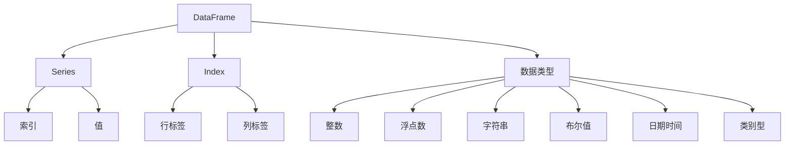

以下是根据您的要求撰写的技术博客文章《DataFrame 原理与代码实例讲解》的正文部分：

# DataFrame 原理与代码实例讲解

## 1. 背景介绍

### 1.1 问题的由来

在数据科学和机器学习领域,处理结构化数据是一项基本且重要的任务。传统的方式是使用 Python 中的列表或 NumPy 数组来存储和操作数据,但这种方式在处理表格型数据时存在一些缺陷,例如:

- 数据预处理步骤繁琐,需要手动处理缺失值、数据类型转换等
- 数据操作不够灵活,难以进行数据筛选、合并、分组等高级操作
- 数据可读性差,难以直观地查看数据结构和统计信息

为了解决这些问题,Python 数据分析库 Pandas 引入了 DataFrame 数据结构,它提供了一种高效、灵活的方式来存储和操作表格型数据。

### 1.2 研究现状

DataFrame 是 Pandas 库中最核心和最常用的数据结构之一。它是一种二维的数据结构,类似于电子表格或 SQL 表,可以存储不同数据类型的数据。DataFrame 提供了丰富的数据操作方法,可以方便地进行数据筛选、排序、分组、合并等操作,极大地简化了数据预处理和特征工程的流程。

目前,DataFrame 已经被广泛应用于各种数据科学和机器学习项目中,成为处理结构化数据的标准工具。许多知名的机器学习库和框架,如 Scikit-learn、TensorFlow 和 Keras,都支持使用 DataFrame 作为输入数据。

### 1.3 研究意义

掌握 DataFrame 的原理和使用方法,对于数据科学从业者和机器学习工程师来说是非常重要的。本文将深入探讨 DataFrame 的核心概念、算法原理和实现细节,并通过代码示例和实际案例分析,帮助读者全面理解和掌握 DataFrame 的使用技巧。

### 1.4 本文结构

本文将分为以下几个部分:

1. 背景介绍
2. 核心概念与联系
3. 核心算法原理与具体操作步骤
4. 数学模型和公式详细讲解与举例说明
5. 项目实践:代码实例和详细解释说明
6. 实际应用场景
7. 工具和资源推荐
8. 总结:未来发展趋势与挑战
9. 附录:常见问题与解答

## 2. 核心概念与联系

在深入探讨 DataFrame 的原理之前,我们先来了解一些核心概念和它们之间的联系。



- **DataFrame**: 是一种二维的数据结构,类似于电子表格或 SQL 表,由行和列组成。每一列都是一个 Series 对象,每一行都有一个行标签(Index)。
- **Series**: 是一维的数组对象,由一个数组(存储值)和一个相关联的数据索引(Index)组成。
- **Index**: 用于标识 DataFrame 中的行和列,可以是整数或字符串。
- **数据类型**: DataFrame 和 Series 中的数据可以是多种数据类型,包括整数、浮点数、字符串、布尔值、日期时间和类别型等。

DataFrame 将这些核心概念结合在一起,提供了一种灵活且高效的方式来存储和操作结构化数据。它支持各种数据操作,如数据筛选、排序、分组、合并等,使得数据预处理和特征工程变得更加简单和高效。

## 3. 核心算法原理与具体操作步骤

### 3.1 算法原理概述

DataFrame 的核心算法原理可以概括为以下几个方面:

1. **数据存储**: DataFrame 使用 NumPy 数组作为底层数据存储结构,每一列都是一个 NumPy 数组。这种存储方式可以提高数据访问和计算的效率。

2. **索引机制**: DataFrame 使用了高效的索引机制来访问和操作数据。它支持使用整数位置索引或标签索引(行标签和列标签)来访问数据。

3. **数据对齐**: 当对 DataFrame 进行操作时,Pandas 会自动对齐不同 Series 或 DataFrame 的索引,以确保操作的一致性。这种自动对齐机制简化了数据操作过程。

4. **缺失值处理**: DataFrame 提供了内置的缺失值处理机制,可以方便地检测、填充或删除缺失值。

5. **数据操作**: DataFrame 支持丰富的数据操作方法,如筛选、排序、分组、合并等,这些操作都是基于 NumPy 的向量化计算实现的,可以提高计算效率。

6. **内存优化**: Pandas 采用了多种内存优化技术,如数据视图(Data Views)、内存映射(Memory Mapping)等,以减少内存占用并提高性能。

### 3.2 算法步骤详解

下面我们将详细介绍 DataFrame 的一些核心算法步骤:

#### 3.2.1 数据加载

DataFrame 支持从多种数据源加载数据,包括 CSV、Excel、SQL 数据库、JSON 等。加载数据的基本步骤如下:

1. 确定数据源和数据格式
2. 使用相应的 Pandas 函数读取数据,如 `pd.read_csv()`、`pd.read_excel()`等
3. 指定相关参数,如索引列、数据类型、缺失值处理等
4. 返回一个 DataFrame 对象

#### 3.2.2 数据筛选

DataFrame 提供了多种数据筛选方法,可以根据条件选择特定的行或列。常用的筛选方法包括:

- 布尔索引: `df[df['col'] > 0]`
- `loc` 和 `iloc` 索引: `df.loc[行标签, 列标签]`、`df.iloc[行位置, 列位置]`
- `query` 方法: `df.query('col1 > 0 & col2 == "x"')`

#### 3.2.3 数据排序

DataFrame 可以使用 `sort_values()` 方法对数据进行排序,支持按一个或多个列进行升序或降序排序。

```python
df.sort_values(by=['col1', 'col2'], ascending=[True, False])
```

#### 3.2.4 数据分组

`groupby()` 方法可以根据一个或多个列对数据进行分组,然后对每个分组应用聚合函数或其他操作。

```python
grouped = df.groupby('col1')
result = grouped['col2'].sum()
```

#### 3.2.5 数据合并

DataFrame 支持多种数据合并操作,如连接(join)、合并(merge)、连接(concat)等,可以根据不同的条件将多个 DataFrame 合并成一个。

```python
merged = pd.merge(df1, df2, on='key', how='inner')
```

### 3.3 算法优缺点

#### 优点:

1. **高效**: 基于 NumPy 的向量化计算,性能优异。
2. **灵活**: 支持多种数据操作,满足各种需求。
3. **易用**: 提供了简洁的语法和丰富的函数库。
4. **缺失值处理**: 内置缺失值处理机制,简化了数据预处理流程。
5. **内存优化**: 采用多种内存优化技术,减少内存占用。

#### 缺点:

1. **内存占用**: 对于大型数据集,DataFrame 可能会占用大量内存。
2. **性能瓶颈**: 某些操作(如分组)在数据量很大时可能会变慢。
3. **并行计算**: 目前 Pandas 还缺乏良好的并行计算支持。
4. **可视化**: Pandas 的数据可视化功能有限,通常需要与其他库(如 Matplotlib)结合使用。

### 3.4 算法应用领域

DataFrame 可以广泛应用于以下领域:

- **数据科学**: 数据预处理、特征工程、探索性数据分析等。
- **机器学习**: 作为输入数据格式,用于训练和评估模型。
- **金融分析**: 处理金融数据,如股票数据、交易数据等。
- **统计分析**: 进行描述性统计和推断统计分析。
- **商业智能**: 构建数据仓库和数据马特,进行数据分析和报告。
- **科学计算**: 处理实验数据、模拟数据等。

## 4. 数学模型和公式详细讲解与举例说明

在 DataFrame 的实现中,涉及到一些数学模型和公式,下面我们将详细讲解它们的原理和应用。

### 4.1 数学模型构建

DataFrame 的数据存储和操作涉及到多种数学模型,包括:

1. **线性代数**: DataFrame 的底层数据存储基于 NumPy 数组,因此涉及到线性代数中的向量和矩阵运算。

2. **统计学**: DataFrame 支持多种统计函数,如计算均值、方差、协方差等,这些都需要使用统计学中的概念和公式。

3. **索引理论**: DataFrame 的索引机制涉及到集合论和索引理论中的概念,如集合操作、索引映射等。

4. **优化理论**: Pandas 在实现中采用了多种优化技术,如内存映射、代码向量化等,这些都需要使用优化理论中的模型和算法。

### 4.2 公式推导过程

下面我们将推导一些 DataFrame 中常用的公式:

#### 4.2.1 均值计算

设有一个 Series `s` 包含 `n` 个元素 `x1, x2, ..., xn`,则它的均值可以计算为:

$$\overline{x} = \frac{1}{n}\sum_{i=1}^{n}x_i$$

在 Pandas 中,可以使用 `s.mean()` 方法计算均值。

#### 4.2.2 方差计算

设有一个 Series `s` 包含 `n` 个元素 `x1, x2, ..., xn`,则它的无偏方差可以计算为:

$$s^2 = \frac{1}{n-1}\sum_{i=1}^{n}(x_i - \overline{x})^2$$

在 Pandas 中,可以使用 `s.var()` 方法计算方差。

#### 4.2.3 协方差计算

设有两个 Series `s1` 和 `s2`,包含 `n` 个元素 `(x1, y1), (x2, y2), ..., (xn, yn)`,则它们的协方差可以计算为:

$$\mathrm{cov}(X, Y) = \frac{1}{n-1}\sum_{i=1}^{n}(x_i - \overline{x})(y_i - \overline{y})$$

在 Pandas 中,可以使用 `s1.cov(s2)` 方法计算协方差。

#### 4.2.4 相关系数计算

设有两个 Series `s1` 和 `s2`,它们的相关系数可以计算为:

$$\rho_{X,Y} = \frac{\mathrm{cov}(X, Y)}{\sqrt{\mathrm{var}(X)}\sqrt{\mathrm{var}(Y)}}$$

在 Pandas 中,可以使用 `s1.corr(s2)` 方法计算相关系数。

### 4.3 案例分析与讲解

现在,我们将通过一个实际案例来演示如何使用 DataFrame 进行数据分析。

假设我们有一个包含学生成绩数据的 CSV 文件 `student_scores.csv`,其中包含以下列:

- `student_id`: 学生 ID
- `name`: 学生姓名
- `gender`: 性别
- `grade`: 年级
- `math_score`: 数学成绩
- `english_score`: 英语成绩
- `science_score`: 科学成绩

我们将使用 Pandas 对这些数据进行分析,包括:

1. 加载数据
2. 处理缺失值
3. 计算每门课程的平均成绩
4. 按年级分组,计算每个年级的平均成绩
5. 计算数学成绩与英语成绩的相关系数
6. 绘制成绩分布直方图

```python
import pandas as pd
import matplotlib.pyplot as plt

# 加载数据
scores = pd.read_csv('student_scores.csv')

# 处理缺失值
scores = scores.dropna()

# 计算每门课程的平均成绩
math_mean = scores['math_score'].mean()
english_mean = scores['english_