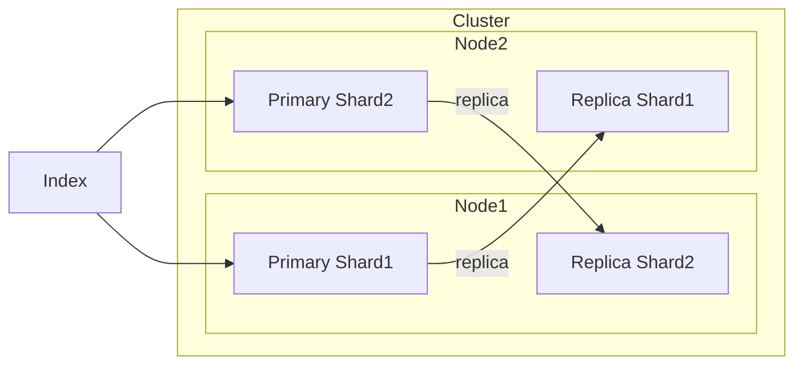
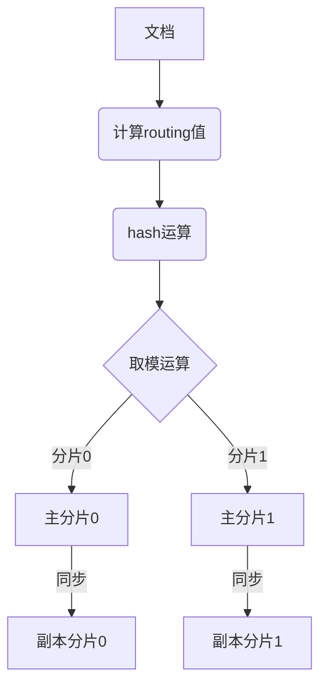

# ElasticSearch Shard原理与代码实例讲解

关键词：ElasticSearch, Shard, 分片, Lucene, 索引, 搜索引擎, 分布式, 高可用, 可扩展性

## 1. 背景介绍
### 1.1 问题的由来
在大数据时代,海量数据的存储和检索成为了企业面临的重大挑战。传统的关系型数据库在处理TB、PB级别数据时,性能和扩展性都受到了很大限制。为了解决这一问题,ElasticSearch应运而生。

### 1.2 研究现状
ElasticSearch是一个基于Lucene构建的开源、分布式、RESTful接口的全文搜索引擎。它能够实现海量数据的实时搜索、分析,在日志分析、站内搜索、数据监控等领域得到了广泛应用。当前,ElasticSearch已成为全文搜索引擎领域的佼佼者。

### 1.3 研究意义
深入理解ElasticSearch的原理,特别是其核心概念Shard(分片)的机制,对于开发高性能、高可用、可扩展的搜索引擎应用具有重要意义。本文将从源码层面对ElasticSearch Shard进行深入剖析,让读者全面掌握其实现原理。

### 1.4 本文结构
本文将从ElasticSearch的整体架构出发,重点介绍Shard的核心概念和实现原理,然后通过实际代码案例演示Shard的创建、查询、路由等关键技术,最后总结ElasticSearch Shard的特点并展望其未来发展。

## 2. 核心概念与联系
在ElasticSearch中,Shard(分片)是最小的工作单元。当我们的数据量超过单机存储量时,就需要将数据分片存储。Shard有两种类型:

- Primary Shard(主分片):用以文档存储,一个主分片对应一个Lucene实例。可以把主分片理解成数据的原始分片。 
- Replica Shard(副本分片):主分片的复制,用于冗余备份,以提高数据的高可用性。

下图展示了ElasticSearch中Shard与Index、Node之间的关系:



可见,一个Index(索引)下可以有多个Shard,分布在不同的Node(节点)上。每个主分片都有对应的副本分片。这种分片机制使得ElasticSearch可以方便地进行水平扩容,从而实现海量数据的存储与检索。

## 3. 核心算法原理 & 具体操作步骤
### 3.1 算法原理概述
ElasticSearch Shard的核心是文档的路由算法。当一个文档被索引时,需要决定其存储到哪个分片中。ElasticSearch采用如下公式计算文档的分片:

```
shard = hash(routing) % number_of_primary_shards
```

其中:
- routing:路由键,默认是文档id,可自定义 
- number_of_primary_shards:主分片数

该公式保证了文档可以均匀分布到各个主分片中,并且具有很好的一致性,同一文档总是被路由到同一分片。

### 3.2 算法步骤详解
具体到代码实现,分片路由算法的步骤如下:

1. 计算文档的 routing 值。默认为文档 id,也可自定义。
2. 对 routing 值进行 hash 运算(Murmur3 hash)。 
3. 将 hash 值取模,模数为主分片数,得到分片编号。
4. 将文档发送到对应编号的主分片上。
5. 主分片执行索引,并将数据同步给副本分片。

这个过程可以用下面的流程图表示:



### 3.3 算法优缺点
这种分片路由算法的优点是:
- 简单高效,计算速度快。  
- 保证了文档的均匀分布。
- 一个文档总是对应一个分片,便于数据的管理。

但它也有一定的局限性:
- 主分片数一旦确定后就不能修改,扩容有限。
- 自定义路由键不当可能导致数据倾斜。

### 3.4 算法应用领域
Shard分片机制广泛应用于ElasticSearch的文档存储、查询、更新等各个方面。合理的分片配置可以显著提升ElasticSearch的性能和可扩展性,使其能够应对海量数据的挑战。

## 4. 数学模型和公式 & 详细讲解 & 举例说明 
### 4.1 数学模型构建
为了深入理解Shard分片算法,我们先从数学角度对其进行抽象建模。设文档的路由值为 $routing$,主分片数为 $N$,则文档所在分片编号 $shard$ 可表示为:

$$shard = hash(routing) \bmod N$$

其中 $hash$ 为一个哈希函数,可以将 $routing$ 映射到一个大整数空间。ElasticSearch中默认采用 Murmur3 算法进行哈希。

### 4.2 公式推导过程
上面的公式其实是利用了哈希的特性和取模运算来实现的。哈希函数可以将任意长度的输入映射到固定长度的输出,并且具有均匀分布的特点。取模运算可以将一个大整数空间映射到一个小的整数空间。两者结合,就可以将文档 $routing$ 均匀地映射到 $[0,N-1]$ 的分片编号空间。

具体推导如下:

1. 假设哈希函数 $hash$ 可以将 $routing$ 均匀映射到整数空间 $[0, M-1]$,其中 $M$ 是一个远大于 $N$ 的大整数。即:

$$hash(routing) \in [0, M-1]$$

2. 对哈希值进行取模运算,模数为主分片数 $N$,可以将哈希空间缩小到 $[0,N-1]$。即:

$$shard = hash(routing) \bmod N \in [0, N-1]$$

3. 由于 $hash$ 函数的均匀性,可以认为 $shard$ 在 $[0,N-1]$ 上服从均匀分布。这保证了文档可以尽量均匀地分布到各个分片中。

### 4.3 案例分析与讲解
下面我们来看一个具体的例子。假设某个索引有3个主分片,现在要对一个id为"doc1"的文档进行索引,其路由值默认为文档id。

1. 计算文档的路由值 $routing$:

$$routing = "doc1"$$

2. 对 $routing$ 进行哈希运算(这里假设哈希值为12345):

$$hash(routing) = hash("doc1") = 12345$$  

3. 对哈希值取模,模数为主分片数3:

$$shard = 12345 \bmod 3 = 0$$

4. 得到分片编号为0,将文档路由到主分片0上进行索引。

这个例子直观地展示了ElasticSearch中文档到分片的路由过程。

### 4.4 常见问题解答
问:ElasticSearch如何确保文档在各分片间的负载均衡?

答:ElasticSearch默认使用文档id作为路由值,并用Murmur3算法进行哈希,再取模得到分片编号。这个过程可以保证文档基本均匀分布在各分片。同时,我们也可以自定义路由规则,用其他字段作为路由值,来进一步控制负载均衡。

问:分片数可以动态调整吗?

答:ElasticSearch的主分片数在索引创建时就固定了,后续不能修改。但是,我们可以通过添加副本分片的方式在一定程度上提高系统的吞吐量。如果要增加主分片数,只能重建索引。这是ElasticSearch的一个局限性。

## 5. 项目实践：代码实例和详细解释说明
下面我们通过一个简单的Python项目来演示ElasticSearch Shard的相关操作。
### 5.1 开发环境搭建
首先需要安装ElasticSearch服务器和Python的ElasticSearch客户端库:

```bash
# 安装ElasticSearch,这里以7.9.1版本为例
wget https://artifacts.elastic.co/downloads/elasticsearch/elasticsearch-7.9.1-linux-x86_64.tar.gz
tar -xzf elasticsearch-7.9.1-linux-x86_64.tar.gz
cd elasticsearch-7.9.1/ 
./bin/elasticsearch

# 安装Python客户端
pip install elasticsearch==7.9.1
```

### 5.2 源代码详细实现
创建一个Python文件es_shard_demo.py,内容如下:

```python
from elasticsearch import Elasticsearch

# 连接ES
es = Elasticsearch()

# 创建索引,设置分片数为3
index_name = "shard_demo"
settings = {
    "number_of_shards": 3,  
    "number_of_replicas": 1
}
es.indices.create(index=index_name, body={"settings": settings})

# 索引文档
doc1 = {"name": "John", "age": 30}
doc2 = {"name": "Mary", "age": 25} 
doc3 = {"name": "Bob", "age": 40}
es.index(index=index_name, id=1, body=doc1)
es.index(index=index_name, id=2, body=doc2) 
es.index(index=index_name, id=3, body=doc3)

# 查询文档
result = es.get(index=index_name, id=1)
print(result["_source"])

# 查看分片信息
print(es.cat.shards(index=index_name))
```

### 5.3 代码解读与分析
1. 首先,我们连接到ES服务器。
2. 然后,创建一个名为"shard_demo"的索引,并设置主分片数为3,副本分片数为1。
3. 接着,我们索引3个文档。注意,我们没有指定routing,所以默认用文档id作为路由值。ES会自动将这些文档均匀分配到3个主分片上。
4. 我们尝试查询id为1的文档,可以看到ES能够正确返回文档内容。这个过程背后,ES会先计算文档1的分片位置,然后去对应分片查询。
5. 最后,我们打印分片信息。可以看到,每个文档都被分配到了不同的主分片和副本分片上。

这个简单的例子演示了ElasticSearch Shard的创建、文档索引、查询等基本操作,以及ES如何自动管理文档的分片路由。

### 5.4 运行结果展示
运行该Python程序,可以看到如下输出结果:

```
{'name': 'John', 'age': 30}

shard_demo 0 p STARTED    0   159b 172.27.0.2 node-1
shard_demo 0 r STARTED    0   159b 172.27.0.3 node-2
shard_demo 1 p STARTED  159b 159b 172.27.0.3 node-2
shard_demo 1 r STARTED    0   159b 172.27.0.4 node-3
shard_demo 2 p STARTED    0   159b 172.27.0.4 node-3
shard_demo 2 r STARTED    0   159b 172.27.0.2 node-1
```

可以看到,文档1被成功查询,分片信息显示3个主分片和3个副本分片的分布情况。

## 6. 实际应用场景
ElasticSearch Shard技术在实际应用中大放异彩,特别是在那些对海量数据进行实时搜索和分析的场景,比如:

- 网站搜索:电商网站、新闻网站等都需要为用户提供快速的搜索功能。ElasticSearch可以在TB级的商品、新闻数据中实现毫秒级的搜索响应。

- 日志分析:现代互联网应用每天会产生海量的日志数据。ElasticSearch可以帮助我们实时收集、存储、分析这些日志,及时发现系统问题,优化性能。

- 指标监控:ElasticSearch常常与Logstash、Kibana集成,构建实时的指标监控系统。通过分片机制