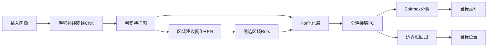

# Fast R-CNN原理与代码实例讲解

关键词：目标检测, Fast R-CNN, 卷积神经网络, 深度学习, 计算机视觉

## 1. 背景介绍
### 1.1  问题的由来
近年来，随着深度学习技术的快速发展，计算机视觉领域取得了重大突破。目标检测作为计算机视觉中的一个核心问题，旨在从图像或视频中定位和识别感兴趣的目标对象。传统的目标检测方法主要依赖手工设计的特征和分类器，存在泛化能力差、检测精度低等缺点。

### 1.2  研究现状
2014年，Ross Girshick等人提出了R-CNN算法，首次将深度学习应用于目标检测任务，大大提升了检测性能。但R-CNN存在计算速度慢、训练复杂等问题。随后，Ross Girshick在2015年提出了Fast R-CNN算法，通过引入RoI池化层和多任务损失，显著加快了检测速度，同时进一步提高了检测精度。

### 1.3  研究意义
Fast R-CNN的提出标志着深度学习目标检测进入了一个新的阶段。它不仅大幅提升了检测性能，而且为后续Faster R-CNN、YOLO等算法的发展奠定了基础。深入理解Fast R-CNN的原理和实现，对于掌握目标检测技术和开发实际应用具有重要意义。

### 1.4  本文结构
本文将从以下几个方面对Fast R-CNN进行详细讲解：首先介绍Fast R-CNN的核心概念与关键组件之间的联系；然后重点阐述Fast R-CNN的算法原理和具体操作步骤；接着通过数学模型和公式推导加深理解；再通过代码实例和详细解释说明Fast R-CNN的实现细节；最后总结Fast R-CNN的实际应用场景、未来发展趋势与面临的挑战。

## 2. 核心概念与联系
Fast R-CNN是一种基于深度卷积神经网络的目标检测算法。它主要由以下几个核心组件构成：

1. 卷积神经网络(CNN)：用于提取图像特征。Fast R-CNN采用VGG16作为骨干网络。
2. 区域建议网络(RPN)：用于生成候选目标区域(RoIs)。Fast R-CNN使用Selective Search算法。  
3. RoI池化层：对候选区域进行尺度归一化，将不同大小的RoIs映射为固定尺寸的特征图。
4. 全连接层：对RoI池化后的特征进行分类和回归，预测目标类别和边界框坐标。

下图展示了Fast R-CNN的整体架构和各组件之间的联系：

## 3. 核心算法原理 & 具体操作步骤
### 3.1  算法原理概述
Fast R-CNN的核心思想是利用卷积神经网络提取图像特征，然后对候选区域进行分类和回归。与R-CNN相比，Fast R-CNN有以下改进：

1. 采用RoI池化层，实现了特征共享，避免了R-CNN中的重复计算。
2. 引入多任务损失函数，同时优化分类和回归任务，提高了训练效率。
3. 使用SVD分解加速全连接层，减少了模型参数量。

### 3.2  算法步骤详解
Fast R-CNN的具体算法步骤如下：

1. 对输入图像进行预处理，缩放到固定尺寸(如600x1000)。
2. 将图像输入预训练的卷积神经网络，提取卷积特征图。
3. 使用Selective Search算法在原图上生成约2000个候选区域(RoIs)。
4. 对每个RoI进行RoI池化，将其映射为固定大小(如7x7)的特征图。
5. 将RoI池化后的特征图展平，送入全连接层进行分类和回归。
6. 使用Softmax函数预测RoI所属的目标类别(前景或背景)。
7. 对正样本RoI进一步预测其边界框坐标(x,y,w,h)的修正量。
8. 计算分类损失和回归损失，并使用反向传播算法优化网络参数。
9. 对预测结果进行非极大值抑制(NMS)，过滤重叠的检测框，得到最终检测结果。

### 3.3  算法优缺点
Fast R-CNN相比R-CNN有以下优点：
1. 检测速度更快。引入RoI池化层实现了特征共享，避免了重复计算。
2. 检测精度更高。多任务训练提高了特征表示能力，边界框回归使定位更准确。
3. 训练更简单。端到端的训练方式，避免了R-CNN的多阶段训练。
4. 模型更小。SVD分解减少了全连接层参数，模型更加紧凑。

Fast R-CNN的缺点主要有：
1. 仍然依赖于外部的区域建议算法(如Selective Search)，无法实现端到端的训练。
2. 对小目标的检测效果较差，主要原因是采用了固定大小的RoI池化。
3. 对遮挡、形变等情况鲁棒性不够，容易漏检。

### 3.4  算法应用领域
Fast R-CNN是一种通用的目标检测算法，可应用于多种场景，如：
1. 自动驾驶：检测车辆、行人、交通标志等目标。
2. 安防监控：检测可疑人员、违禁物品等目标。
3. 医学影像：检测病灶、器官等目标。
4. 工业视觉：检测缺陷、异物等目标。
5. 无人机航拍：检测建筑物、地物等目标。

## 4. 数学模型和公式 & 详细讲解 & 举例说明
### 4.1  数学模型构建
Fast R-CNN的数学模型主要包括以下几个部分：

1. 卷积神经网络：用于提取图像特征，可表示为一个函数$f(x;θ)$，其中$x$为输入图像，$θ$为卷积核参数。

2. RoI池化：将不同大小的候选区域映射为固定尺寸的特征图。设输入特征图为$U∈ℝ^{c×h×w}$，候选区域为$R=(x,y,w,h)$，RoI池化可表示为：

$$
v=f_{roi}(U,R;θ)
$$

其中$v∈ℝ^{c×H×W}$为池化后的特征图，$H$和$W$为固定大小，$θ$为池化层参数。

3. 全连接层：对RoI池化后的特征进行分类和回归。设全连接层参数为$W_c$和$W_r$，分类和回归输出分别为：

$$
p=softmax(W_c v+b_c)
$$
$$
t=W_r v+b_r
$$

其中$p∈ℝ^{K+1}$为类别概率分布，$K$为目标类别数，$t∈ℝ^{4K}$为边界框坐标修正量。

4. 损失函数：包括分类损失和回归损失两部分。分类损失采用交叉熵函数：

$$
L_{cls}(p,u)=-\log p_u
$$

其中$u$为真实类别标签。回归损失采用Smooth L1函数：

$$
L_{reg}(t,v)= \sum_{i∈\{x,y,w,h\}} smooth_{L1}(t_i-v_i)
$$

其中$v$为真实边界框坐标，$smooth_{L1}$为：

$$
smooth_{L1}(x)=
\begin{cases} 
0.5x^2& \text{if |x| < 1} \\
|x|-0.5& \text{otherwise}
\end{cases}
$$

最终的多任务损失为：

$$
L(p,u,t^u,v)=L_{cls}(p,u)+λ[u≥1]L_{reg}(t^u,v)
$$

其中$λ$为平衡因子，$[u≥1]$表示只对正样本计算回归损失。

### 4.2  公式推导过程
以上是Fast R-CNN中主要数学公式的定义，下面对其中的一些细节进行推导说明。

1. RoI池化公式$v=f_{roi}(U,R;θ)$的实现过程如下：
首先将候选区域$R$映射到特征图$U$上对应的区域$R'$：
$$
R'=(x',y',w',h')
$$
$$
x'=\lfloor x×w'/w \rfloor, y'=\lfloor y×h'/h \rfloor
$$
$$
w'=\lfloor (x+w)×w'/w \rfloor - x', h'=\lfloor (y+h)×h'/h \rfloor - y'
$$

然后将$R'$划分为$H×W$个子区域，对每个子区域进行最大池化，得到输出特征图$v$：

$$
v_{i,j}=\max_{(x,y)∈R'_{i,j}} U(x,y)
$$

其中$R'_{i,j}$表示第$(i,j)$个子区域。

2. Smooth L1损失函数$smooth_{L1}(x)$的目的是减少离群点的影响。当$|x|<1$时，它是一个二次函数；当$|x|≥1$时，它是一个线性函数。这样可以在保持稳定性的同时，对小误差进行更敏感的优化。

3. 多任务损失函数$L(p,u,t^u,v)$中，$[u≥1]$表示只对正样本($u≠0$)计算回归损失。这是因为只有正样本才有有效的边界框坐标，对负样本计算回归损失是没有意义的。$λ$用于平衡分类损失和回归损失的比例，通常取1。

### 4.3  案例分析与讲解
下面以一个具体的例子来说明Fast R-CNN的计算过程。假设输入图像大小为800x600，候选区域$R=(100,200,300,400)$，RoI池化输出尺寸为7x7，特征图通道数为512。

1. 将候选区域$R$映射到特征图上的$R'$：
假设特征图尺寸为50x37，则有：
$$
x'=\lfloor 100×37/600 \rfloor=6, y'=\lfloor 200×50/800 \rfloor=12 
$$
$$
w'=\lfloor 400×37/600 \rfloor - 6 = 18, h'=\lfloor 600×50/800 \rfloor - 12 = 25
$$

因此$R'=(6,12,18,25)$。

2. 对$R'$进行RoI池化：
将$R'$划分为7x7个子区域，每个子区域大小约为2x3。对每个子区域进行最大池化，得到尺寸为7x7x512的特征图$v$。

3. 进行分类和回归：
将$v$展平为一个长度为25088的向量，送入全连接层，得到类别概率分布$p$和边界框坐标修正量$t$。
假设$p=(0.1,0.2,0.7)$，表示候选区域属于背景、类别1、类别2的概率分别为0.1、0.2、0.7。
$t=(0.1,-0.2,0.3,0.4)$，表示将候选区域的坐标$(x,y,w,h)$修正为：
$$
\hat x=x+0.1×w=130
$$
$$
\hat y=y-0.2×h=120
$$
$$
\hat w=w×e^{0.3}≈407
$$
$$
\hat h=h×e^{0.4}≈596
$$

4. 计算损失：
假设真实类别为$u=2$，真实边界框为$v=(120,100,400,600)$，则分类损失为：
$$
L_{cls}=-\log 0.7=0.36
$$

回归损失为：
$$
L_{reg}=smooth_{L1}(130-120)+smooth_{L1}(120-100)+smooth_{L1}(407-400)+smooth_{L1}(596-600)
$$
$$
=0.5×10^2+20+0.5×7^2+0.5×(-4)^2=144.5
$$

因此总损失为$L=0.36+144.5=144.86$。

### 4.4  常见问题解答
1. Fast R-CNN的主要创新点是什么？
答：Fast R-CNN的主要创新点包括