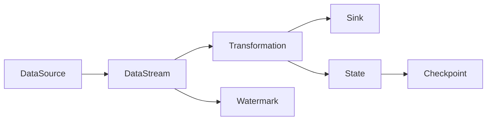

# Flink原理与代码实例讲解

## 1. 背景介绍

### 1.1 问题的由来
在大数据时代,海量数据的实时处理已成为各行各业的迫切需求。传统的批处理框架如Hadoop MapReduce已经无法满足实时计算的要求。因此,流式计算框架应运而生,其中Apache Flink以其优异的性能和灵活的使用方式脱颖而出,成为业界广泛使用的流式计算引擎之一。

### 1.2 研究现状
目前业界主流的流式计算框架包括Storm、Spark Streaming和Flink等。相比之下,Flink具有低延迟、高吞吐、exactly-once语义保证等优势。越来越多的公司开始将Flink应用到实际的生产环境中,如阿里巴巴、腾讯、滴滴等。同时,学术界也在Flink上做了大量研究工作,不断优化其性能和功能。

### 1.3 研究意义
深入研究Flink的原理和应用,对于掌握大数据实时计算技术具有重要意义。通过学习Flink的架构设计、执行机制、Flink SQL等,可以更好地理解流式计算的内在原理。同时,通过动手实践和代码分析,可以快速上手Flink开发,并将其应用到实际的项目中去。

### 1.4 本文结构
本文将从以下几个方面对Flink进行深入讲解：
- 第2节介绍Flink的核心概念和基本架构
- 第3节讲解Flink的核心原理,包括执行图、时间语义、状态管理等
- 第4节介绍Flink的窗口机制和CEP复杂事件处理
- 第5节通过代码实例讲解如何使用Flink API进行开发
- 第6节总结Flink的典型应用场景
- 第7节推荐Flink学习和开发过程中常用的工具和资源
- 第8节对Flink的未来发展趋势和面临的挑战进行展望

## 2. 核心概念与联系

Flink是一个分布式的流式和批式数据处理引擎。它的核心是流式计算,即将所有数据抽象为数据流,然后在数据流上定义计算操作。同时,Flink也支持批处理,可以将批数据看做一种特殊的流数据。

下面介绍Flink的几个核心概念：

- StreamExecutionEnvironment：Flink程序的入口,用于设置执行环境
- DataStream：数据流,代表一个数据集合,可以在上面进行各种转换操作
- Transformation：数据转换操作,如map、filter、keyBy、window等
- Sink：数据输出,将处理结果写入外部系统,如Kafka、Redis、Elasticsearch等
- Time：Flink支持三种时间语义,即Processing Time、Event Time和Ingestion Time
- State：状态,用于保存计算过程中的中间结果,支持Keyed State和Operator State
- Checkpoint：检查点,用于容错恢复,保证exactly-once语义
- Watermark：水位线,用于处理乱序事件,表示当前处理到的时间戳

下图展示了Flink的基本架构和各个组件之间的关系：



Flink程序从数据源读取数据,然后在DataStream上应用各种转换操作,中间结果保存在State中,通过Checkpoint机制实现容错。Watermark用于处理乱序数据,最终结果输出到外部系统。

## 3. 核心算法原理 & 具体操作步骤

### 3.1 算法原理概述
Flink基于一种叫做"执行图"的数据结构来执行计算任务。执行图是一个有向无环图（DAG）,由多个算子（Operator）组成,算子之间通过数据流相连。每个算子包含三个部分：
- 输入：接收上游算子发送的数据流
- 计算逻辑：对输入数据进行转换处理
- 输出：将处理结果发送给下游算子

Flink根据执行图来调度和部署任务,将算子分布到不同的TaskManager节点上执行。

### 3.2 算法步骤详解
1. 构建StreamGraph
用户通过调用DataStream API定义计算逻辑,形成一个StreamGraph。StreamGraph是对用户逻辑的一种抽象表示,还不能直接执行。

2. StreamGraph转换为JobGraph 
Flink将StreamGraph转换为JobGraph,JobGraph是Flink底层执行图的数据结构。在这个阶段会对算子进行一些优化,如算子链接、任务链接等。

3. 将JobGraph提交到JobManager
Client将JobGraph提交到集群的JobManager节点,JobManager负责协调任务的调度和部署。

4. JobManager生成ExecutionGraph
JobManager根据JobGraph生成ExecutionGraph。ExecutionGraph是JobGraph的并行化版本,表示实际的执行计划。

5. 将Task部署到TaskManager
JobManager将ExecutionGraph分解为多个Task,并将Task部署到TaskManager节点上执行。TaskManager启动Task线程来执行计算逻辑。

6. 数据在算子之间流动
每个算子接收上游算子发送的数据,然后对数据进行处理,并将结果发送给下游算子,形成一个数据流拓扑。

7. 任务执行完成
所有Source算子的数据都被处理完成后,Sink算子将最终结果输出,任务执行完成。

### 3.3 算法优缺点
Flink基于流式计算的执行模型具有以下优点：
- 低延迟：数据一旦到达就立即进行处理,而不用等待全部数据到齐,延迟通常在毫秒级别
- 高吞吐：基于内存计算,避免了不必要的磁盘IO,单机吞吐量可达数百万条/秒
- 强一致性：通过Checkpoint机制可以保证exactly-once语义,计算结果的准确性有保障
- 良好的容错性：支持多种状态恢复方式,可以从任务失败中自动恢复

但是Flink也存在一些局限性：
- 不支持迭代计算：Flink不支持循环迭代,不适合图计算、机器学习等场景
- 吞吐量受限于内存大小：Flink是基于内存计算的,内存不足可能会造成频繁的GC,影响性能
- 状态存储受限于本地磁盘：状态默认存储在本地磁盘,容量有限,超大状态可能溢出
- 窗口延迟较高：窗口计算结果需要等到窗口触发才能输出,对于较大的窗口延迟会比较高

### 3.4 算法应用领域
Flink广泛应用于流数据处理领域,典型应用场景包括：
- 实时ETL：将数据从数据源实时导入到目标存储系统,如实时数仓、实时数据湖
- 实时报表：对流数据进行实时统计分析,生成实时报表和大屏展示
- 实时风控：对交易数据、日志数据等进行实时特征提取和风险识别
- 实时推荐：根据用户的实时行为数据进行实时推荐
- 物联网数据分析：对传感器数据、设备数据等进行实时分析,实现智能运维和预测性维护

Flink也在一些新兴领域得到应用,如流图计算、流式机器学习等。

## 4. 数学模型和公式 & 详细讲解 & 举例说明

### 4.1 数学模型构建
Flink的流式计算可以抽象为一个数学模型。设输入数据流为一个无穷序列$X=(x_1,x_2,...)$,其中$x_i$表示一条数据记录。Flink上定义的转换操作可以看做一个函数$f$,输出数据流$Y$通过以下方式计算得到：

$$Y=f(X)=(f(x_1),f(x_2),...)$$

常见的转换操作包括：
- map: $f(x_i) = g(x_i)$
- flatMap: $f(x_i) = [y_1, y_2, ...]$
- filter: $f(x_i) = x_i$ if $p(x_i)$ else $[]$
- keyBy: $f(x_i) = (k,x_i)$ where $k=h(x_i)$ 

其中$g$表示一个映射函数,$p$表示一个布尔判断函数,$h$表示一个键选择函数。

### 4.2 公式推导过程
下面以WordCount为例,推导Flink程序的数学表示。WordCount的输入是一个句子流,输出是单词及其出现的次数。设第$i$条句子为$x_i$,其中包含$n$个单词$w_1,w_2,...,w_n$。定义转换函数$f$如下：

$$f(x_i) = [(w_1, 1), (w_2, 1), ..., (w_n, 1)]$$

然后按单词做keyBy操作,记为$keyBy(f(x_i))$,得到一个KeyedStream。接着在KeyedStream上应用sum聚合,记为$\sum$,最终输出流$Y$为：

$$Y=\sum(keyBy(f(X)))=[(w_1,c_1), (w_2,c_2), ...]$$

其中$c_i$表示单词$w_i$出现的总次数。

### 4.3 案例分析与讲解
下面通过一个具体的例子来说明。假设输入数据流$X$如下：

```
["hello world", "hello flink", "hello spark"]
```

应用转换函数$f$,得到：

$$
\begin{aligned}
f(x_1) &= [("hello", 1), ("world", 1)]\\
f(x_2) &= [("hello", 1), ("flink", 1)]\\  
f(x_3) &= [("hello", 1), ("spark", 1)]
\end{aligned}
$$

对$f(X)$做keyBy并应用sum聚合,得到输出流$Y$：

$$
Y = [("hello", 3), ("world", 1), ("flink", 1), ("spark", 1)]
$$

这就是WordCount程序的数学表示。

### 4.4 常见问题解答
Q: Flink能否保证处理结果的顺序与事件产生的顺序一致？
A: 默认情况下,Flink不保证结果顺序。但可以通过设置EventTime语义和Watermark机制,在一定程度上保证结果的顺序性。

Q: 如何理解Flink的exactly-once语义？
A: Exactly-once表示每条数据只被处理一次,不多也不少。Flink通过Checkpoint机制实现端到端的exactly-once。当出现故障时,Flink可以从最近的Checkpoint恢复状态,避免数据丢失或重复处理。

Q: Flink支持哪些类型的窗口？
A: Flink支持Time Window和Count Window两种类型,Time Window包括Tumbling Window、Sliding Window和Session Window,Count Window包括Tumbling Window和Sliding Window。

Q: Flink状态存储在哪里？如何保证状态的高可用？
A: Flink状态默认存储在TaskManager的内存中,Checkpoint时会将状态持久化到文件系统。为了保证高可用,建议将状态存储在分布式文件系统或远程KV存储。

## 5. 项目实践：代码实例和详细解释说明

### 5.1 开发环境搭建
首先需要搭建Flink开发环境,主要步骤如下：
1. 安装JDK 8+和Maven 3+
2. 下载Flink二进制包,解压缩
3. 导入Flink依赖到项目中

示例Maven依赖如下：

```xml
<dependency>
    <groupId>org.apache.flink</groupId>
    <artifactId>flink-java</artifactId>
    <version>1.12.0</version>
</dependency>
<dependency>
    <groupId>org.apache.flink</groupId>
    <artifactId>flink-streaming-java_2.12</artifactId>
    <version>1.12.0</version>
</dependency>
<dependency>
    <groupId>org.apache.flink</groupId>
    <artifactId>flink-clients_2.12</artifactId>
    <version>1.12.0</version>
</dependency>
```

### 5.2 源代码详细实现
下面通过一个实际的代码示例,演示如何使用Flink DataStream API进行流式计算。以下是一个实时WordCount程序：

```java
public class StreamWordCount {
    public static void main(String[] args) throws Exception {
        // 创建流处理环境
        StreamExecutionEnvironment env = StreamExecutionEnvironment.getExecutionEnvironment();
        
        // 设置数据源
        DataStream<String> text = env.socketTextStream("localhost", 9999);
        
        // 对数据流进行转换操作
        DataStream<Tuple2<String, Integer>> counts = text
            .flatMap(new Tokenizer())
            .keyBy(value -> value.f0)
            .sum(