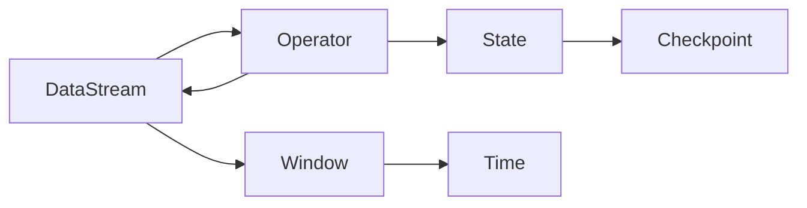

# Flink原理与代码实例讲解

## 1. 背景介绍
### 1.1 问题的由来
在大数据时代，数据的实时处理变得越来越重要。传统的批处理框架如Hadoop MapReduce已经无法满足实时计算的需求。因此，流式计算框架应运而生，Apache Flink就是其中的佼佼者。

### 1.2 研究现状
目前，国内外已经有很多公司和组织开始使用Flink进行实时计算，如阿里巴巴、腾讯、优步等。同时，学术界也在Flink上做了大量研究，发表了许多高质量的论文。

### 1.3 研究意义
深入研究Flink的原理和应用，对于推动实时计算的发展具有重要意义。通过对Flink核心概念、原理和代码实例的讲解，可以帮助更多的开发者和研究者理解和掌握这一前沿技术。

### 1.4 本文结构
本文将从以下几个方面对Flink进行深入讲解：
- 第二部分介绍Flink的核心概念及其联系
- 第三部分讲解Flink的核心算法原理和具体操作步骤
- 第四部分介绍Flink涉及的数学模型和公式
- 第五部分通过代码实例详细说明Flink的使用方法
- 第六部分探讨Flink的实际应用场景
- 第七部分推荐Flink相关的工具和学习资源
- 第八部分对Flink的研究现状做总结，并展望其未来发展趋势和面临的挑战
- 第九部分的附录给出了一些常见问题的解答

## 2. 核心概念与联系
要理解Flink的工作原理，首先需要了解其几个核心概念：
- **DataStream**：Flink的核心数据结构，表示一个无界的、持续增长的数据流。
- **Operator**：Flink中的基本处理单元，用于对DataStream进行转换操作，如map、filter等。
- **Time**：Flink支持三种时间语义：Processing Time、Event Time和Ingestion Time。
- **Window**：Flink提供了窗口机制，可以在无界数据流上进行有界的聚合计算。
- **State**：Flink支持有状态计算，可以在算子中维护状态信息。
- **Checkpoint**：Flink提供了分布式快照机制，能够保证exactly-once语义。

下图展示了这些核心概念之间的联系：



## 3. 核心算法原理 & 具体操作步骤
### 3.1 算法原理概述
Flink的核心是一个分布式流式计算引擎，其算法原理可以概括为：将输入的数据流通过一系列算子进行转换，得到输出的数据流。在这个过程中，算子可以维护状态，并通过checkpoint机制保证exactly-once语义。

### 3.2 算法步骤详解
Flink的计算过程可以分为以下几个步骤：
1. **Source**：数据源读取外部数据，并将其转换为DataStream。
2. **Transformation**：对DataStream进行一系列的转换操作，如map、filter、keyBy、window等。
3. **Sink**：将转换后的DataStream写入外部系统，如Kafka、HDFS等。

其中，Transformation是Flink计算的核心，常见的转换算子包括：
- **Map**：对每个元素进行一对一转换。
- **FlatMap**：对每个元素进行一对多转换。
- **Filter**：根据条件过滤元素。
- **KeyBy**：根据指定的key对数据流进行分区。
- **Window**：在无界数据流上定义一个有界的窗口，如滚动窗口、滑动窗口等。
- **Aggregate**：对窗口内的数据进行聚合计算，如sum、min、max等。

### 3.3 算法优缺点
Flink算法的主要优点包括：
- 支持高吞吐、低延迟的流式计算。
- 支持exactly-once语义，能够保证数据处理的一致性。
- 支持有状态计算和复杂的事件时间处理。
- 提供了丰富的算子和API，使用简单灵活。

但Flink也存在一些局限性，如：
- 对内存要求较高，可能出现OOM问题。
- 状态管理复杂，容易引入bug。
- 窗口的使用需要谨慎，否则可能影响性能。

### 3.4 算法应用领域
Flink广泛应用于多个领域，如：
- 实时数据分析，如实时大屏、实时报表等。
- 实时数据处理，如ETL、数据清洗等。
- 实时机器学习，如在线学习、增量学习等。
- 事件驱动应用，如实时推荐、欺诈检测等。

## 4. 数学模型和公式 & 详细讲解 & 举例说明
### 4.1 数学模型构建
Flink的很多算子都可以用数学公式来表示，下面以map和aggregate为例进行说明。

**Map算子：**

设输入数据流为 $\mathcal{D} = \{x_1, x_2, \cdots, x_n\}$，map算子的作用是对每个元素 $x_i$ 执行一个函数 $f$，得到输出数据流 $\mathcal{D}' = \{f(x_1), f(x_2), \cdots, f(x_n)\}$。

用数学公式可以表示为：

$$\mathcal{D}' = \text{map}(\mathcal{D}, f) = \{f(x) | x \in \mathcal{D}\}$$

**Aggregate算子：**

设输入数据流为 $\mathcal{D} = \{x_1, x_2, \cdots, x_n\}$，aggregate算子的作用是对数据流中的元素执行一个聚合函数 $g$，得到一个聚合结果 $y$。

用数学公式可以表示为：

$$y = \text{aggregate}(\mathcal{D}, g) = g(x_1, x_2, \cdots, x_n)$$

其中，$g$ 可以是sum、min、max等常见的聚合函数。

### 4.2 公式推导过程
以上数学公式的推导过程比较简单，主要是对算子的输入输出进行了数学化的描述。

对于map算子，将输入集合 $\mathcal{D}$ 中的每个元素 $x$ 都执行函数 $f$，得到输出集合 $\mathcal{D}'$。

对于aggregate算子，将输入集合 $\mathcal{D}$ 中的所有元素 $x_1, x_2, \cdots, x_n$ 执行聚合函数 $g$，得到一个聚合结果 $y$。

### 4.3 案例分析与讲解
下面以一个实际案例来说明map和aggregate算子的用法。

假设有一个数据流，包含一系列的温度数据：
```
25.5
24.3
26.1
25.8
...
```

现在需要对这些温度数据进行以下处理：
1. 将温度从摄氏度转换为华氏度，公式为：$F = C * 1.8 + 32$
2. 计算转换后的温度的平均值。

使用Flink可以很容易实现这个需求：

```scala
val temps: DataStream[Double] = ...

val fTemps = temps.map(new MapFunction[Double, Double] {
  override def map(value: Double): Double = value * 1.8 + 32
})

val avgTemp = fTemps.aggregate(new AggregateFunction[Double, Tuple2[Double, Int], Double] {
  override def createAccumulator(): (Double, Int) = (0.0, 0)
  
  override def add(value: Double, acc: (Double, Int)): (Double, Int) = (acc._1 + value, acc._2 + 1)
  
  override def getResult(acc: (Double, Int)): Double = acc._1 / acc._2
  
  override def merge(a: (Double, Int), b: (Double, Int)): (Double, Int) = (a._1 + b._1, a._2 + b._2)
})
```

在上面的代码中，首先使用map算子将摄氏温度转换为华氏温度，然后使用aggregate算子计算平均温度。Aggregate算子需要定义4个函数：
- `createAccumulator`：创建一个初始的累加器，这里使用一个二元组 `(sum, count)` 来保存温度总和和数量。
- `add`：将每个元素添加到累加器中，对 `sum` 进行累加，对 `count` 进行计数。
- `getResult`：从累加器中提取结果，这里就是计算平均值 `sum / count`。
- `merge`：合并两个累加器，分别将 `sum` 和 `count` 进行相加。

通过这个例子可以看出，Flink的算子使用非常灵活，能够方便地实现各种复杂的计算逻辑。

### 4.4 常见问题解答
**Q:** Flink能否支持机器学习算法？
**A:** 可以，Flink提供了一个机器学习库Flink ML，包含了常见的机器学习算法，如线性回归、逻辑回归、KMeans等。此外，Flink还可以与其他机器学习框架集成，如Python的scikit-learn和TensorFlow。

**Q:** Flink的exactly-once语义是如何实现的？
**A:** Flink通过checkpoint机制实现exactly-once语义。系统会定期对算子的状态做快照，当出现故障时，可以从最近的快照中恢复状态，避免数据丢失或重复处理。同时，Flink还使用了WAL（Write Ahead Log）机制，将状态变更持久化到磁盘上，保证了数据的一致性。

## 5. 项目实践：代码实例和详细解释说明
### 5.1 开发环境搭建
要运行Flink程序，首先需要搭建开发环境。以下是搭建步骤：
1. 安装JDK 8+
2. 安装Scala 2.11+（如果使用Scala API）
3. 下载Flink发行版，解压缩到本地目录
4. 将Flink的bin目录添加到系统PATH环境变量中
5. 安装IDE，如IntelliJ IDEA或Eclipse

### 5.2 源代码详细实现

下面是一个完整的Flink程序示例，实现了对文本文件中的单词进行计数：

```scala
import org.apache.flink.streaming.api.scala._

object WordCount {
  def main(args: Array[String]): Unit = {
    // 创建执行环境
    val env = StreamExecutionEnvironment.getExecutionEnvironment
    
    // 从文件读取数据
    val text = env.readTextFile("input.txt")
    
    // 对数据进行转换处理
    val counts = text.flatMap(_.toLowerCase.split("\\W+"))
      .filter(_.nonEmpty)
      .map((_, 1))
      .keyBy(0)
      .sum(1)
      
    // 打印结果
    counts.print()
    
    // 执行任务
    env.execute("WordCount")
  }
}
```

### 5.3 代码解读与分析
下面对上述代码进行详细解读：

1. 首先创建了一个StreamExecutionEnvironment，它是Flink程序的执行环境。
2. 然后使用env.readTextFile读取一个文本文件作为数据源。
3. 对数据源进行了一系列的转换操作：
   - 使用flatMap将文本按照非单词字符分割成单个单词，并转换为小写。
   - 使用filter过滤掉空字符串。
   - 使用map将每个单词转换为一个二元组 (word, 1)。
   - 使用keyBy按照二元组的第一个元素（即单词）进行分组。
   - 使用sum对每个单词的出现次数进行累加。
4. 使用print将结果打印到控制台。
5. 最后调用env.execute触发程序执行。

可以看到，Flink程序的编写非常简洁，通过一系列算子的组合就能完成复杂的计算任务。

### 5.4 运行结果展示
假设input.txt文件内容如下：
```
hello world
hello flink
hello scala
```

运行上述程序，控制台输出结果为：
```
(scala,1)
(world,1)
(hello,3)
(flink,1)
```

可以看到，程序正确地统计出了每个单词的出现次数。

## 6. 实际应用场景
Flink在实际生产中有非常广泛的应用，下面列举几个典型的场景：

### 实时ETL
在数据仓库的构建过程中，ETL（Extract-Transform-Load）是一个非常重要的环节。传统的ETL都是以批处理的方式运行，无法实现实时的数据同步。使用Flink可以很容易地实现实时ETL，将源系统的数据实时导入