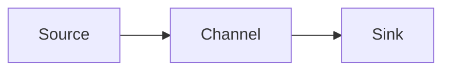
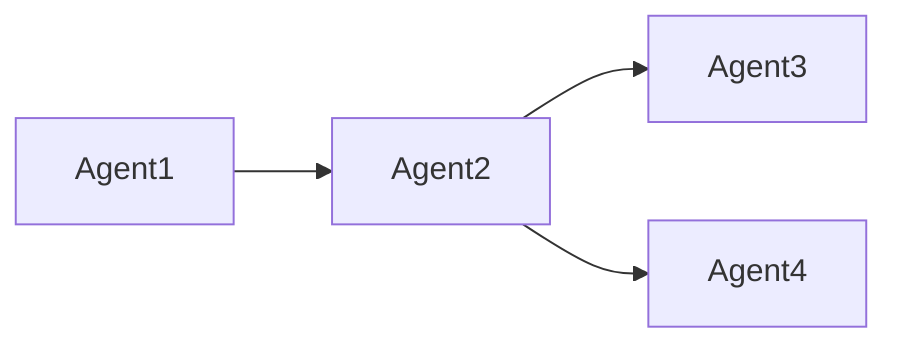

# Flume Sink原理与代码实例讲解

## 1. 背景介绍
### 1.1 问题的由来
在大数据处理领域,数据采集是一个非常重要的环节。我们需要从各种数据源收集原始数据,并将其传输到数据处理和存储系统中进行后续分析。然而,随着数据量的急剧增长和数据源的多样化,传统的数据采集方式已经无法满足实时性、可靠性和可扩展性的要求。这就需要一种高效灵活的数据采集框架来应对这些挑战,而Apache Flume正是一个优秀的解决方案。

### 1.2 研究现状
目前,Apache Flume已经成为大数据生态系统中广泛使用的数据采集工具之一。许多知名公司如Facebook、LinkedIn、eBay等都在生产环境中大规模部署了Flume。学术界和工业界也对Flume的原理和应用进行了深入研究。例如,有学者提出了基于Flume的改进方案,通过引入内存 channel和动态路由等机制来提升Flume的性能和可靠性。也有团队基于Flume构建了针对特定场景的数据采集系统。

### 1.3 研究意义
深入理解Flume的工作原理,特别是Sink组件的实现细节,对于优化数据采集流程、开发定制化的Sink插件都有重要意义。通过系统学习Flume Sink,我们可以更好地利用Flume满足业务需求,提升数据采集的效率和质量。同时,Flume Sink的设计思想和模式也为其他类似系统的开发提供了有益参考。

### 1.4 本文结构
本文将重点介绍Flume Sink的原理和代码实现。内容安排如下:第2节介绍Flume的核心概念;第3节重点剖析Sink的工作机制;第4节讲解Sink相关的数据模型;第5节通过代码实例演示Sink的开发;第6节总结Sink在实际场景中的应用;第7节推荐相关工具和学习资源;第8节讨论Flume未来的发展趋势和面临的挑战;第9节列举常见问题解答。

## 2. 核心概念与联系
在深入探讨Flume Sink之前,我们先来了解一下Flume的整体架构和几个核心概念。

Flume是一个分布式、可靠、高可用的数据采集系统。它的基本工作单元是Event,代表一条数据记录。Flume以Agent为单位进行部署,每个Agent由Source、Channel和Sink三个组件构成:
- Source:数据源,负责从外部数据源采集数据,并封装成Event传递给Channel
- Channel:数据管道,作为Event的缓冲区,存储由Source采集的Event直到它们被Sink消费
- Sink:下沉地,从Channel读取Event,并将其传输到下一跳的Agent或最终目的地

下图展示了Flume Agent的基本架构:



多个Agent可以串联成一个复杂的数据流拓扑:



Flume提供了多种内置的Source、Channel和Sink类型,可以灵活组合来满足不同的需求。同时,Flume也提供了插件机制,允许用户开发自定义组件。

## 3. 核心算法原理 & 具体操作步骤
### 3.1 算法原理概述
Flume Sink作为Event数据流的终点,其核心职责是从Channel读取Event,并将其发送到下一跳或最终目的地。Sink内部的工作流程可以概括为:
1. 连接管道:与 Channel建立连接,并告知 Channel自己已经准备好从中读取Event
2. 事务提取:启动事务从 Channel批量提取一组Event
3. 格式转换:将Event的格式和数据结构转换成目标系统要求的形式
4. 数据写入:将转换后的数据通过特定协议写入目标系统
5. 事务提交:如果数据成功写入,则提交事务并告知 Channel可以删除对应的Event;否则回滚事务,Event仍保留在 Channel中重试

### 3.2 算法步骤详解
接下来,我们详细说明Sink处理Event的关键步骤:

**步骤1:事务提取Event**
Sink首先要从 Channel中读取Event。为了保证数据传输的一致性,这个过程需要在事务中进行。具体而言:
1. Sink向 Channel发起事务,表示开始提取数据 
2. Channel返回当前可读的Event批次,并将它们锁定,防止其他消费者同时读取
3. Sink完成一批Event的处理后,向 Channel发起事务提交,Channel删除对应的Event
4. 如果Sink处理失败,则向 Channel发起事务回滚,Channel取消对Event的锁定,使得它们可以被重新读取

**步骤2:格式转换**
由于不同的目标系统接受的数据格式可能各不相同,Sink需要将Event中的数据转换成兼容的格式。常见的转换方式有:
- 序列化:将结构化数据转换成字节序列,如Avro、Protobuf等
- 字符串化:提取Event的字段,并按照一定格式(如JSON、CSV等)拼接成字符串
- 压缩:使用gzip、LZO等算法对数据进行压缩,减小传输和存储开销

**步骤3:数据写入**
转换后的数据需要通过特定的协议写入到目标系统,Sink在这个过程中起到了承上启下的作用。常见的写入方式包括:
- RPC调用:将数据作为参数,调用目标系统提供的远程接口写入,如RPC、HTTP等
- 文件写入:将数据按照约定的格式和路径,以文件的形式写入本地或分布式文件系统,如HDFS
- 消息队列:将数据发布到消息中间件,供其他系统订阅消费,如Kafka、RabbitMQ等
- 数据库写入:将数据以SQL或其他方式写入关系型或NoSQL数据库

### 3.3 算法优缺点
Flume Sink的设计有以下优点:
- 可靠性:事务机制保证了数据在传输过程中的一致性,避免数据丢失或重复
- 灵活性:插件化的Sink组件可以自由组合,支持多种数据目的地
- 可恢复性:临时故障发生时,数据会保留在 Channel中,待故障恢复后自动重传

同时,Sink也有一些局限性:
- 吞吐量:频繁的事务操作会带来一定性能开销,单个Sink的最大吞吐量受 Channel容量限制
- 延迟:为了实现事务性,Sink和 Channel之间的交互采用了同步模式,这会引入额外的延迟
- 单点瓶颈:单个Sink的处理能力毕竟有限,容易成为数据流的瓶颈

### 3.4 算法应用领域
Flume Sink广泛应用于各种数据采集和传输场景,比如:
- 日志收集:将分布在各个服务器上的日志文件实时采集到中心存储
- 数据库同步:将关系型数据库的变更实时同步到数据仓库或NoSQL数据库
- 消息缓冲:将突发的海量消息缓冲后,再批量发送给消费者处理
- 跨网络传输:将本地网络的数据安全高效地传输到异地机房

## 4. 数学模型和公式 & 详细讲解 & 举例说明
### 4.1 数学模型构建
我们可以用数学语言来刻画Flume Sink的工作过程。假设Sink每秒能处理 $\mu$ 个Event,Channel中有 $N$ 个Event等待处理,则单个Sink耗尽 Channel中Event的时间 $T$ 为:

$$ T = \frac{N}{\mu} $$

如果有 $k$ 个并行的Sink,则总的处理时间 $T_k$ 为:

$$ T_k = \frac{N}{k\mu} $$

可见,并行Sink的数量越多,处理时间就越短。

### 4.2 公式推导过程
上述公式其实是一个简单的除法模型,推导过程如下:

(1) 单个Sink处理时间:
$$ \frac{总Event数}{单位时间处理Event数} = \frac{N}{\mu} = T $$

(2) 并行Sink处理时间:
因为有 $k$ 个Sink,每秒处理的Event数变为 $k\mu$,所以:
$$ \frac{总Event数}{单位时间处理Event数} = \frac{N}{k\mu} = T_k $$

### 4.3 案例分析与讲解
举个具体的例子,假设一个Flume Sink每秒可以处理100个Event,现在 Channel中积压了100万个Event。
根据公式,单个Sink处理完这些Event需要的时间为:

$$ T = \frac{1,000,000}{100} = 10,000 (秒) \approx 2.78 (小时) $$

如果我们增加到10个并行的Sink,则处理时间缩短为:

$$ T_{10} = \frac{1,000,000}{10 \times 100} = 1,000 (秒) \approx 0.28 (小时) $$

可见,并行Sink可以显著提升Flume的数据传输效率。

### 4.4 常见问题解答
问:并行Sink会不会造成数据重复?
答:不会,因为Flume的事务机制保证了每个Event只会被一个Sink消费,不会重复处理。

问:并行Sink的数量是否越多越好?
答:并非如此。一方面,过多的Sink会加重 Channel的负担;另一方面,下游系统的接收能力也是有限的,盲目增加Sink反而会适得其反。

## 5. 项目实践:代码实例和详细解释说明
下面我们通过一个简单的代码实例,演示如何开发一个自定义的Flume Sink插件。

### 5.1 开发环境搭建
首先需要搭建Flume插件开发环境:
1. 安装JDK 8+和Maven 3+
2. 下载Flume源码或依赖包
3. 创建Maven项目,引入Flume相关依赖

pom.xml中引入Flume依赖:
```xml
<dependency>
  <groupId>org.apache.flume</groupId>
  <artifactId>flume-ng-core</artifactId>
  <version>1.9.0</version>
</dependency>
```

### 5.2 源代码详细实现
自定义Sink需要实现`Sink`接口,重写其中的`process()`方法来处理Event。

一个简单的示例代码如下:
```java
public class MySink extends AbstractSink implements Configurable {
  private String myProp;

  @Override
  public void configure(Context context) {
    String myProp = context.getString("myProp", "defaultValue");
  }

  @Override
  public Status process() throws EventDeliveryException {
    Status status = null;
    Channel channel = getChannel();
    Transaction tx = channel.getTransaction();
    try {
      tx.begin();
      Event event = channel.take();
      if (event != null) {
        // 处理事件
        byte[] body = event.getBody();
        String str = new String(body);
        System.out.println(str);
        
        // 提交事务
        tx.commit();
        status = Status.READY;
      } else {
        tx.commit();
        status = Status.BACKOFF;
      }
    } catch (Exception ex) {
      tx.rollback();
      throw new EventDeliveryException("Failed to deliver event", ex);
    } finally {
      tx.close();
    }
    return status;
  }
}
```

### 5.3 代码解读与分析
- 自定义Sink需继承`AbstractSink`抽象类,它预置了一些通用的功能
- 通过实现`Configurable`接口,可以获取配置文件中自定义的参数
- `process()`方法是Sink的核心,它定义了如何处理一个Event
- 首先通过`getChannel()`获取与Sink绑定的 Channel实例
- 然后在一个事务中,尝试从 Channel获取一个Event
- 如果获取成功,则对Event进行处理(此例中仅打印到控制台)
- 如果处理成功,则提交事务并返回`READY`状态,表示Sink已准备好处理下一个Event
- 如果 Channel暂时没有可读的Event,则提交事务并返回`BACKOFF`状态,表示Sink将会退避一段时间再次尝试读取
- 如果在处理过程中发生异常,则回滚事务,防止Event丢失,并抛出`EventDeliveryException`交给Flume框架处理

### 5.4 运行结果展示
将打包好的Sink插件放入Flume的