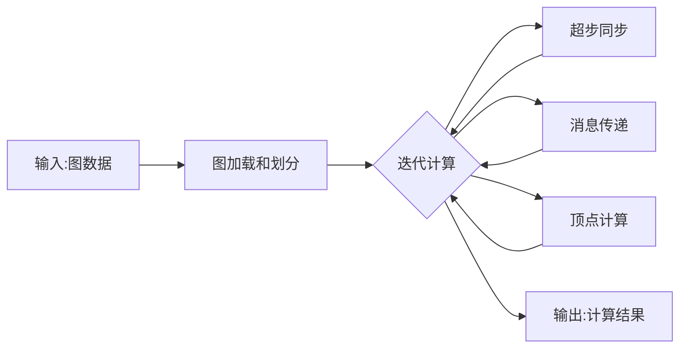
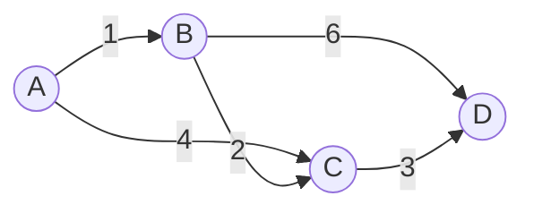

# Giraph原理与代码实例讲解

## 1. 背景介绍

### 1.1 问题的由来
随着大数据时代的到来,越来越多的企业和组织需要处理海量的数据集。传统的数据处理方式已经无法满足当前大规模数据处理的需求。在这种背景下,大规模图计算引起了人们的广泛关注。图计算是一种非常适合处理复杂关联数据的计算模型,在社交网络分析、推荐系统、网页排名等领域有着广泛的应用。然而,如何高效地进行大规模图计算是一个巨大的挑战。

### 1.2 研究现状
目前,已经有多个大规模图计算框架被提出,如Google的Pregel、Apache的Giraph、GraphLab等。其中,Giraph是一个基于Hadoop的开源大规模图计算框架,由Yahoo!和Apache软件基金会联合开发。Giraph采用了类似Google Pregel的图计算模型,支持增量迭代处理,可以非常高效地处理大规模图数据。越来越多的公司开始使用Giraph进行大规模图计算,如Facebook、Twitter等。

### 1.3 研究意义
深入研究Giraph的原理和应用,对于理解和掌握大规模图计算技术具有重要意义。通过学习Giraph,我们可以了解现代分布式图计算系统的核心理念和实现原理,学会如何使用Giraph进行大规模图计算,为解决实际问题提供有力的工具和思路。同时,对Giraph进行深入分析,也有助于我们设计和优化图计算算法,提升图计算的性能和效率。

### 1.4 本文结构
本文将全面介绍Giraph的原理和应用。第2节介绍Giraph的核心概念和基本架构。第3节重点讲解Giraph的核心算法原理和具体操作步骤。第4节给出Giraph计算的数学模型,并结合实例进行详细讲解。第5节通过一个完整的代码实例,演示如何使用Giraph进行图计算。第6节总结Giraph的实际应用场景。第7节推荐Giraph相关的学习资源和开发工具。第8节对Giraph的研究现状进行总结,展望其未来的发展趋势和面临的挑战。

## 2. 核心概念与联系

在深入学习Giraph之前,我们首先需要了解一些核心概念：

- 图(Graph):由节点(Vertex)和边(Edge)组成的数据结构,用于表示事物之间的关联关系。
- 顶点(Vertex):图中的基本单元,包含唯一标识符(ID)和属性值。
- 边(Edge):连接两个顶点,表示它们之间的关系,可以是有向的或无向的。
- 图计算:以图数据结构为基础,通过对图的顶点和边进行并行计算,得到所需的结果,如最短路径、PageRank等。
- BSP(Bulk Synchronous Parallel):由Leslie Valiant提出的一种并行计算模型,将计算过程分为若干个超步(Superstep),每个超步内各个处理单元并行执行,超步之间进行同步。
- 消息传递:在分布式图计算中,各个顶点可以通过发送消息与其他顶点通信,协同完成计算任务。

下图展示了Giraph的基本架构和核心组件之间的关系:



Giraph基于Hadoop平台,充分利用了Hadoop的分布式存储和计算能力。在Giraph中,图数据被划分成多个分区,分布在不同的计算节点上。每个计算节点负责处理若干个分区中的顶点。整个计算过程被组织成一系列超步。在每个超步中,各个顶点并行执行用户自定义的计算逻辑,通过发送和接收消息与其他顶点通信。当一个超步完成后,Giraph会进行同步,所有节点开始下一个超步的计算。这个过程不断重复,直到达到终止条件。

## 3. 核心算法原理 & 具体操作步骤

### 3.1 算法原理概述
Giraph采用类似Google Pregel的图计算模型,基于BSP并行计算模型。在Giraph中,图计算被抽象为一个顶点为中心的计算过程。每个顶点包含唯一ID、属性值以及与之关联的出边和入边。整个计算过程被组织成一系列超步,每个超步中,所有的活跃顶点(即需要进行计算的顶点)并行执行用户自定义的compute函数。在compute函数中,每个顶点可以修改自身的状态,也可以给其他顶点发送消息。当一个超步完成后,所有的消息被发送到目标顶点,然后进行同步,开始下一轮超步。这个过程一直持续,直到没有活跃顶点,或者达到最大迭代次数。

### 3.2 算法步骤详解
下面我们详细讲解Giraph的计算步骤:

1. 输入图数据:Giraph从HDFS等分布式存储系统中读入图数据,包括顶点和边的信息。
2. 图数据划分:Giraph将输入的图数据划分成多个分区,尽量保证分区之间的边数较少,同时每个分区的顶点数较为均衡。
3. 初始化:为每个顶点分配唯一标识符,设置初始状态,并确定其是否为活跃顶点。
4. 迭代计算:
   - a. 对每个活跃顶点并行调用compute函数;
   - b. 在compute函数中,每个顶点可以获取上一轮超步发送给自己的消息,根据消息内容更新自身状态,并可以给其他顶点发送新的消息;
   - c. 顶点可以通过voteToHalt方法将自己标记为非活跃状态;
   - d. 完成计算后,将所有消息发送到目标顶点的消息队列中。
5. 同步:当一个超步完成后,Giraph会进行同步,将所有消息发送到目标顶点,并统计活跃顶点的数量。
6. 收敛:如果没有活跃顶点,或者达到最大迭代次数,则计算结束,否则开始下一轮超步,回到步骤4。
7. 输出:将计算结果输出到HDFS等分布式存储系统中。

### 3.3 算法优缺点
Giraph的优点包括:

- 采用类似BSP的计算模型,编程模型简单,容易理解和实现。
- 基于Hadoop平台,充分利用了Hadoop的分布式计算和容错能力。
- 支持增量迭代处理,避免了不必要的重复计算,提高了计算效率。
- 可扩展性好,能够处理数十亿顶点和数万亿边的超大规模图数据。

Giraph的缺点包括:

- 对于交互式和实时计算场景支持不足,延迟较高。
- 内存消耗较大,对于超大规模图,可能导致内存不足。
- 对于稠密图和小世界图,分区和通信开销较大,影响计算性能。

### 3.4 算法应用领域
Giraph在众多领域有着广泛应用,如:

- 社交网络分析:如社区发现、影响力分析等。
- 推荐系统:如协同过滤、基于图的推荐等。
- 网页分析:如PageRank计算、网页重要性排序等。
- 机器学习:如标签传播、图嵌入等。
- 路径和网络优化:如最短路径、网络流等。

## 4. 数学模型和公式 & 详细讲解 & 举例说明

### 4.1 数学模型构建
我们可以使用如下的数学符号来形式化描述Giraph的计算模型。

设图$G=(V,E)$,其中$V$表示顶点集合,$E$表示边集合。对于顶点$v \in V$,用$N(v)$表示与$v$相邻的顶点集合。Giraph将$G$划分成$k$个不相交的子图$G_1,G_2,...,G_k$,每个子图分布在一个计算节点上。

定义$S$为超步集合,每个超步$s \in S$对应一轮并行计算。在超步$s$中,对于每个活跃顶点$v$,Giraph执行如下计算:

$$v.compute(msgs_s[v])$$

其中,$msgs_s[v]$表示顶点$v$在超步$s$收到的消息集合。在$compute$函数中,顶点$v$可以执行如下操作:

- 修改自身的状态:$v.value \leftarrow f(v.value, msgs_s[v])$
- 发送消息:$send(u,msg), u \in N(v)$
- 投票进入非活跃状态:$voteToHalt()$

### 4.2 公式推导过程
下面我们以单源最短路径问题为例,推导Giraph的计算过程。

设图$G=(V,E)$,边$(u,v) \in E$的权重为$w(u,v)$。给定源顶点$s$,计算$s$到其他所有顶点的最短路径。

定义$dist(v)$为源顶点$s$到顶点$v$的最短路径长度,$dist(s)=0$。根据Bellman-Ford算法,最短路径满足如下条件:

$$dist(v) = min\{dist(u) + w(u,v) | (u,v) \in E\}$$

在Giraph中,我们可以将$dist(v)$存储为顶点$v$的状态,初始时$dist(s)=0$,其他顶点$dist(v)=\infty$。在每个超步中,对于每个顶点$v$,执行如下计算:

$$
dist(v) \leftarrow min\{dist(v), min\{dist(u) + w(u,v) | u \in N(v)\}\} 
$$

即顶点$v$更新自己的最短路径长度,为当前值与所有邻居顶点发来的距离取最小值。如果$dist(v)$没有变化,则$v$投票进入非活跃状态。

算法伪代码如下:

```
初始化:
  dist(s) = 0
  dist(v) = ∞, v ≠ s
while 存在活跃顶点:
  for each 顶点 v:
    if v 为活跃状态:
      minDist = dist(v)
      for each u ∈ N(v):
        if dist(u) + w(u,v) < minDist:
          minDist = dist(u) + w(u,v)
      if minDist < dist(v):  
        dist(v) = minDist
      else:
        v 进入非活跃状态
```

可以证明,经过$|V|-1$轮超步后,所有顶点的最短路径长度都收敛到最优值。

### 4.3 案例分析与讲解
下面我们用一个具体的例子来说明Giraph的计算过程。考虑如下图:



设顶点A为源顶点,计算A到其他顶点的最短路径。

在超步0,初始化各个顶点的距离值:
- $dist(A)=0$
- $dist(B)=\infty$
- $dist(C)=\infty$ 
- $dist(D)=\infty$

在超步1,每个顶点更新自己的距离值:
- A: $dist(A)=0$,不变,进入非活跃状态
- B: $dist(B)=min\{\infty, 0+1\}=1$,更新距离值,发送消息(1)给C和D
- C: $dist(C)=min\{\infty, 0+4\}=4$,更新距离值,发送消息(4)给D
- D: $dist(D)=\infty$,不变,进入非活跃状态

在超步2,每个顶点更新自己的距离值:
- B: $dist(B)=1$,不变,进入非活跃状态 
- C: $dist(C)=min\{4, 1+2\}=3$,更新距离值,发送消息(3)给D
- D: $dist(D)=min\{\infty, 1+6, 4+3\}=7$,更新距离值

在超步3,每个顶点更新自己的距离值:
- C: $dist(C)=3$,不变,进入非活跃状态
- D: $dist(D)=min\{7, 3+