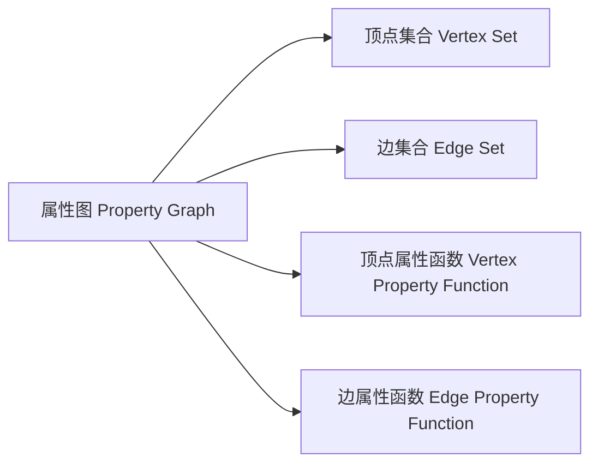
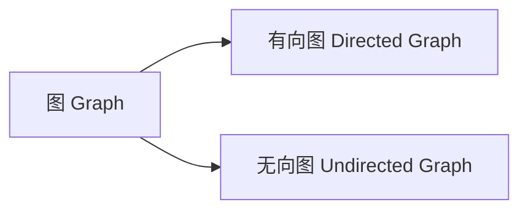
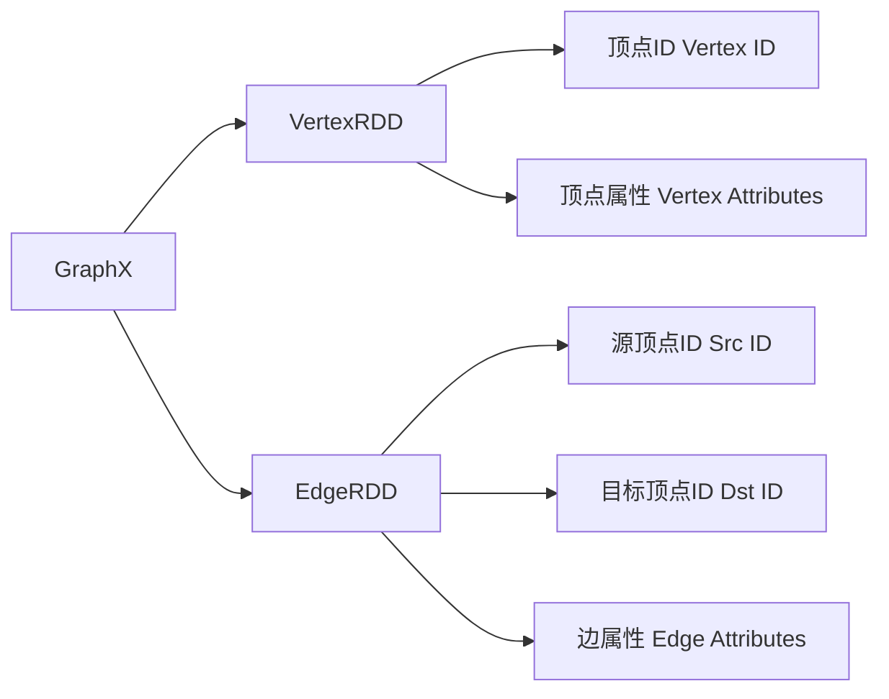
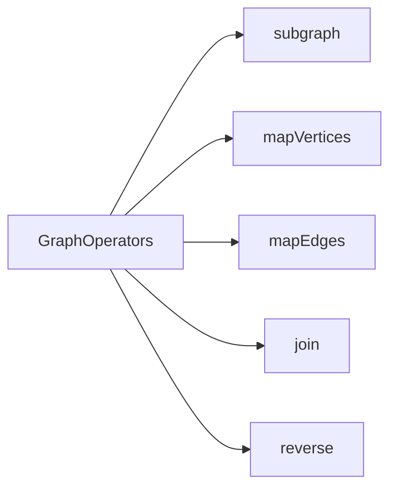
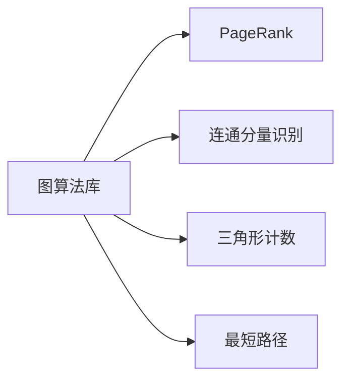
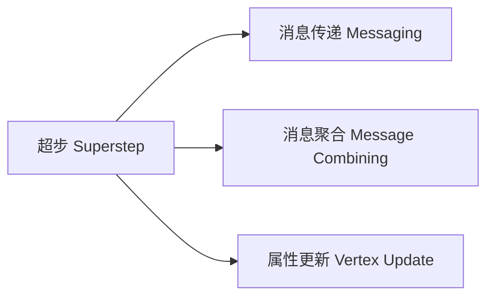
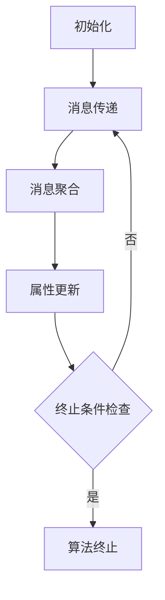

好的,我明白了您的要求。以下是《GraphX 原理与代码实例讲解》这篇技术博客文章的正文内容:

# GraphX 原理与代码实例讲解

## 1. 背景介绍

### 1.1 问题的由来

随着大数据时代的到来,海量的结构化和非结构化数据不断涌现,传统的数据处理方式已无法满足现有需求。图计算(Graph Computing)作为一种新兴的数据处理范式,可以高效地处理复杂的关系型数据,因此受到了广泛关注。

### 1.2 研究现状  

Apache Spark作为当前最流行的大数据处理引擎之一,提供了GraphX作为分布式图计算框架。GraphX构建在Spark RDD之上,能够高效地并行化执行图算法,并支持图数据的持久化存储。目前,GraphX已经成为处理大规模图数据的主流工具之一,被广泛应用于社交网络分析、推荐系统、生物信息学等诸多领域。

### 1.3 研究意义

深入理解GraphX的原理和实现机制,对于充分利用其强大的图计算能力至关重要。本文将全面解析GraphX的核心概念、算法原理、数学模型以及实际应用,为读者提供一个系统的GraphX学习指南。

### 1.4 本文结构

本文将从以下几个方面对GraphX进行全面讲解:

- 核心概念与联系
- 核心算法原理与具体操作步骤
- 数学模型与公式推导
- 项目实践:代码实例与详细解释
- 实际应用场景
- 工具与资源推荐
- 总结与展望

## 2. 核心概念与联系

在深入探讨GraphX的细节之前,我们需要先理解几个核心概念及它们之间的关系。

### 2.1 属性图(Property Graph)

GraphX中的主要数据结构是**属性图(Property Graph)**,它由一组顶点(Vertex)和边(Edge)组成,每个顶点和边都可以关联任意属性值。形式上,属性图可以表示为G=(V,E,Ψ,Λ),其中:

- V是顶点集合
- E是边集合 
- Ψ是顶点属性函数,将顶点映射到属性值
- Λ是边属性函数,将边映射到属性值

属性图能够自然地表示各种现实世界中的关系数据,如社交网络、知识图谱、交通网络等。

### 2.2 有向图与无向图

根据边的方向性,GraphX中的图可以分为**有向图(Directed Graph)**和**无向图(Undirected Graph)**两种。

- 有向图的边具有确定的方向,可以表示为有序对(u,v),表示从顶点u指向顶点v的边。
- 无向图的边没有确定的方向,可以表示为无序对{u,v},表示顶点u与v之间存在一条边。

GraphX支持在内部表示中将有向图视为无向图,反之亦然,从而实现了对两种图的统一处理。

### 2.3 RDD、VertexRDD和EdgeRDD

GraphX是建立在Spark的弹性分布式数据集(Resilient Distributed Dataset,RDD)之上的。具体来说:

- 顶点集合V由**VertexRDD**表示,其中每个元素是(vertexId, vertexAttributes)对。
- 边集合E由**EdgeRDD**表示,其中每个元素是Edge(srcId, dstId, edgeAttributes)。
- 属性函数Ψ和Λ分别作用于VertexRDD和EdgeRDD。

GraphX通过并行化操作VertexRDD和EdgeRDD,从而高效地执行图算法。

### 2.4 图算子(GraphOperators)

GraphX提供了一组丰富的**图算子(GraphOperators)**,用于对图数据执行各种转换和操作,例如:

- `subgraph`获取子图
- `mapVertices`对每个顶点执行转换
- `mapEdges`对每条边执行转换
- `join`连接两个图
- `reverse`反转边的方向

这些算子可以组合使用,从而构建出复杂的图分析工作流。

通过图算子,开发者可以方便地表达图数据的转换逻辑,而不必过多关注并行化细节。

### 2.5 图算法库

除了基本的图算子,GraphX还内置了一些常用的**图算法库**,如:

- PageRank用于计算网页重要性
- 连通分量识别算法
- 三角形计数
- 最短路径算法

开发者可以直接调用这些算法,也可以在此基础上构建自己的图分析应用。

总的来说,GraphX为开发者提供了完整的图计算解决方案,包括数据结构、算子、内置算法等,极大地简化了图处理的开发过程。

## 3. 核心算法原理与具体操作步骤

### 3.1 算法原理概述

GraphX的核心算法原理是基于**消息传递**和**聚合**的思想。具体来说,算法会遍历图中的每个顶点,并根据当前顶点的状态以及来自邻居的消息,计算出新的顶点属性值。这个过程会不断迭代,直到满足算法的终止条件。

GraphX借鉴了Google的Pregel系统的设计思路,将图算法的执行过程抽象为一个**"超步"(Superstep)**的序列。在每个超步中,GraphX会并行执行以下三个阶段:

1. **消息传递(Messaging)**:每个顶点根据当前状态发送消息给邻居顶点。
2. **消息聚合(Message Combining)**:GraphX将发往同一个顶点的所有消息聚合成一条消息。
3. **属性更新(Vertex Update)**:每个顶点根据收到的聚合消息,更新自身的属性值。

这种"思考-发送消息-更新"的模式使得许多复杂的图算法都可以用统一的方式高效实现。

### 3.2 算法步骤详解

以PageRank算法为例,我们来具体分析一下GraphX的执行过程。PageRank是用于计算网页重要性的经典算法,其核心思想是:一个网页的重要性取决于指向它的其他重要网页的数量和质量。

在GraphX中实现PageRank算法的步骤如下:

1. **初始化**:将图的每个顶点(网页)的PageRank值初始化为1/N(N为顶点总数)。

2. **消息传递**:对于每个顶点u,将其PageRank值平均分给所有出边的目标顶点v,生成消息(u,PR(u)/outdegree(u))发送给v。

3. **消息聚合**:GraphX将所有发往同一个顶点v的消息(u,PR(u)/outdegree(u))求和,得到v的新PageRank值之和。

4. **属性更新**:每个顶点v将其PageRank值更新为聚合后的新值,乘以阻尼系数(damping factor)并加上(1-阻尼系数)/N。

5. **终止条件检查**:如果所有顶点的PageRank值收敛(变化小于阈值),则算法终止;否则回到步骤2,进入下一个超步。

可以看出,PageRank算法可以自然地映射到GraphX的"超步"执行模型上。每个超步中,顶点根据当前PageRank值计算消息,发送给邻居;收到消息后,顶点聚合并更新自身的PageRank值。这种并行迭代的方式大大提高了算法的执行效率。

### 3.3 算法优缺点

GraphX基于消息传递和聚合的设计范式具有以下优点:

- **通用性强**:许多经典的图算法(如PageRank、连通分量、最短路径等)都可以用这种统一的方式高效实现。
- **并行性好**:算法的每个阶段都可以在Spark的RDD之上进行并行化,充分利用集群资源。
- **容错性强**:由于RDD的容错特性,GraphX可以很好地处理计算过程中的失败情况。
- **表达能力强**:通过组合丰富的图算子,开发者可以方便地表达复杂的图转换逻辑。

不过,GraphX也存在一些缺点和局限性:

- **内存开销大**:需要将整个图数据加载到内存中,对于超大规模图可能会导致内存溢出。
- **迭代次数多**:某些算法(如PageRank)需要大量迭代才能收敛,会影响性能。
- **动态图支持不足**:GraphX主要面向静态图,对于动态变化的图数据支持较弱。

总的来说,GraphX非常适合对中等规模的静态图进行分析,但对于超大规模或高度动态的图数据,可能需要其他更专门的图计算系统。

### 3.4 算法应用领域

GraphX及其核心算法原理在诸多领域都有广泛的应用,例如:

- **社交网络分析**:通过PageRank等算法发现关键人物、社区结构等。
- **推荐系统**:利用图表示用户-物品关系,找到相似用户或物品。
- **知识图谱**:构建大规模知识图谱,支持智能问答等应用。
- **交通网络分析**:通过最短路径等算法优化路线规划。
- **生物信息学**:分析蛋白质互作网络、基因调控网络等。
- **网络安全**:检测恶意网络活动、入侵检测等。

总之,图计算作为一种新兴的数据处理范式,在各个领域都展现出巨大的应用前景。

## 4. 数学模型和公式详细讲解与举例说明

### 4.1 数学模型构建

为了更好地理解和优化图算法,我们需要对其进行数学建模。以PageRank算法为例,其核心思想可以用线性代数模型表示。

设图G=(V,E)由N个顶点组成,定义:

- $\vec{r}$是N维列向量,表示每个顶点的PageRank值
- $M$是N*N的列随机转移矩阵(Column Stochastic Transition Matrix),其中$M_{i,j}$表示从顶点j指向i的边数占j的出边总数的比例

则PageRank值可以表示为:

$$\vec{r} = \alpha M^T\vec{r} + (1-\alpha)\frac{1}{N}\vec{e}$$

其中:

- $\alpha$是阻尼系数(damping factor),通常取0.85
- $\vec{e}$是全1向量,长度为N
- 第二项$(1-\alpha)\frac{1}{N}\vec{e}$是为了解决矩阵$M$的秩丢失问题

我们可以通过迭代计算上式,直到$\vec{r}$收敛为稳定的PageRank值。

### 4.2 公式推导过程

接下来,我们推导一下上面PageRank公式的具体过程。

首先,定义$\vec{p}^{(k)}$为第k次迭代时各顶点的PageRank值,则有:

$$\vec{p}^{(k+1)} = \alpha M^T\vec{p}^{(k)} + (1