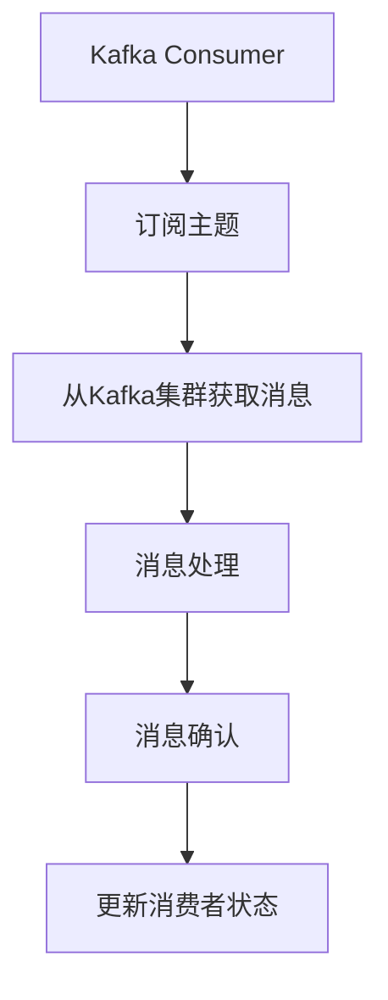

# Kafka Consumer原理与代码实例讲解

关键词：

## 1. 背景介绍

### 1.1 问题的由来

在现代的分布式系统中，消息队列扮演着至关重要的角色，用于实现服务间的解耦、状态传递以及数据流的处理。Kafka作为一款高性能的消息队列系统，因其高吞吐量、低延迟以及可靠的消息传递特性，已成为众多大型企业级应用的首选。Kafka Consumer正是Kafka生态中不可或缺的一部分，它负责接收生产者发送的消息，并根据业务需求进行处理。

### 1.2 研究现状

Kafka Consumer的设计旨在实现高并发、高可用的消息消费。为了支持这一特性，Kafka Consumer采用了多种机制，包括但不限于自动重试、分区均衡、消费者组协调以及消息幂等性保证。随着Kafka版本的不断更新，其功能日益完善，包括引入了Kafka Connect、Kafka Streams等组件，进一步增强了系统的灵活性和可扩展性。

### 1.3 研究意义

理解Kafka Consumer的工作原理对于开发分布式系统具有重要意义。掌握如何设计和实现健壮、高效的消费者逻辑，可以帮助开发者构建出能够应对高负载、高并发场景下的系统，同时确保消息的正确性和实时性。此外，Kafka Consumer的设计理念和最佳实践也为其他消息队列系统提供了参考和启示。

### 1.4 本文结构

本文将详细介绍Kafka Consumer的核心概念、工作原理、算法实现以及代码实例，旨在帮助读者深入理解Kafka Consumer在实际应用中的功能和实现细节。具体内容包括：

- **核心概念与联系**：阐述Kafka Consumer的基本概念、工作模式以及与其他组件的交互关系。
- **算法原理与操作步骤**：深入剖析Kafka Consumer的工作机制，包括数据分发、消息消费和状态管理等方面。
- **数学模型与案例分析**：通过数学模型和具体案例，进一步解释Kafka Consumer如何在不同场景下发挥作用。
- **代码实例与实践**：提供具体的代码实现，包括开发环境搭建、代码结构解析以及运行结果分析。
- **应用场景与展望**：探讨Kafka Consumer在实际业务中的应用案例以及未来的发展趋势。

## 2. 核心概念与联系

Kafka Consumer是Kafka系统中的消费者组件，主要负责从Kafka集群中读取消息并执行相应的处理逻辑。其核心概念包括：

- **消费者组（Consumer Group）**：一组Kafka Consumer共享相同的订阅主题列表，共同处理消息。通过消费者组可以实现消息的均衡消费和避免重复消费。
- **分区（Partition）**：主题中的消息被分成多个物理存储单元，称为分区。Kafka Consumer在消费时会根据配置选择具体的分区进行消费。
- **消费模式（Consumption Pattern）**：Kafka支持多种消费模式，包括轮询（Round Robin）、随机消费等，每种模式决定了消费者如何从分区中读取消息。
- **消息消费确认（Message Consumption Acknowledgment）**：消费者在成功处理消息后，需要向Kafka集群发送确认信息，表明已成功消费了该消息。

Kafka Consumer与Kafka集群的交互流程如下：



## 3. 核心算法原理 & 具体操作步骤

### 3.1 算法原理概述

Kafka Consumer通过以下步骤进行消息消费：

1. **订阅**：消费者首先需要通过配置文件或者API指定要订阅的主题列表。
2. **分配分区**：Kafka Broker根据消费者的请求和集群状态，为每个消费者分配相应的分区列表。分配策略通常基于公平性或性能考虑。
3. **拉取消息**：消费者根据分配的分区列表，从对应的Broker节点拉取消息。消息拉取策略可以是批量拉取（Pull）或推送到消费者（Push）。
4. **消息处理**：消费者接收到消息后，执行用户定义的业务逻辑进行处理。
5. **确认消息**：消息处理完成后，消费者向Broker发送确认信息，表示消息已被成功处理。确认信息包括消息ID和消费位置信息。

### 3.2 算法步骤详解

#### 步骤一：初始化

- **创建消费者实例**：通过Kafka提供的客户端库（如Java的Kafka Consumer API）创建消费者实例。
- **配置订阅**：指定要订阅的主题和分区，设置消费组ID（如果需要）。

#### 步骤二：分配分区

- **请求分配**：消费者向Kafka集群发起请求，请求分配特定主题的分区。
- **响应处理**：Kafka集群根据当前的集群状态和消费者请求，分配分区列表给消费者。

#### 步骤三：拉取消息

- **开始消费**：消费者开始从分配的分区中拉取消息。
- **消息处理**：拉取到的消息被传递给用户定义的处理逻辑进行处理。

#### 步骤四：消息确认

- **确认消息**：消息处理完成后，消费者向Kafka集群发送确认消息，表明消息已经被成功处理。

#### 步骤五：更新状态

- **更新消费者状态**：Kafka Consumer记录处理的消息状态，以便在故障恢复时保持一致性。

### 3.3 算法优缺点

#### 优点

- **高吞吐量**：Kafka Consumer能够处理大量的消息流，适合高并发场景。
- **容错性**：通过消息确认机制，确保消息的正确性，即使在异常情况下，也能保证消息不会丢失。
- **可扩展性**：Kafka Consumer易于横向扩展，能够随着业务流量增长而增加消费者实例。

#### 缺点

- **延迟敏感**：在极端情况下，消息处理延迟可能会成为一个问题，特别是对于实时性要求极高的场景。
- **配置复杂性**：配置消费者和协调消费组成员可能需要细致的操作和理解。

### 3.4 算法应用领域

Kafka Consumer广泛应用于：

- **日志收集**：收集来自不同来源的日志消息，用于监控、故障排查和数据分析。
- **数据处理管道**：在大数据处理流中，Kafka Consumer负责从源头接收数据，经过清洗、转换后流向下一个处理环节。
- **事件驱动架构**：在微服务架构中，Kafka Consumer用于接收事件驱动的通知，触发后续服务的动作。

## 4. 数学模型和公式 & 详细讲解 & 举例说明

### 4.1 数学模型构建

假设有一组消费者订阅了主题 `T` 的所有分区，我们用集合 `P` 表示所有分区：

\[ P = \{P_1, P_2, ..., P_n\} \]

其中，每个分区 `P_i` 包含一系列消息 `M_j`，我们可以用集合 `M` 表示所有消息：

\[ M = \{M_1, M_2, ..., M_m\} \]

消费者 `C` 在特定时刻的状态可以用以下数学模型表示：

\[ C = \{P_{i_1}, P_{i_2}, ..., P_{i_k}\} \]

这里，`C` 是消费者 `C` 订阅的分区集合，`k` 是 `C` 订阅的分区数量。

### 4.2 公式推导过程

在Kafka中，消息确认通常涉及到 `offset` 和 `timestamp`。假设消费者在处理消息时，使用以下公式更新消息状态：

\[ \text{newOffset} = \text{oldOffset} + \text{consumedMessages} \]

这里，`oldOffset` 是处理前的位置，`consumedMessages` 是处理的消息数量，`newOffset` 是处理后的新位置。

### 4.3 案例分析与讲解

#### 示例一：消息消费

假设消费者 `C` 需要消费主题 `T` 的分区 `P_1`，初始位置 `oldOffset = 100`。处理了10条消息后，`consumedMessages = 10`，则更新位置为：

\[ \text{newOffset} = 100 + 10 = 110 \]

#### 示例二：消息确认

消息确认时，消费者需要将处理后的状态（包括 `newOffset` 和 `timestamp`）发送给Kafka Broker，以确保消息的顺序性和完整性。

### 4.4 常见问题解答

#### Q：如何避免消息重复消费？

A：通过消费者组协调和分区均衡策略，Kafka设计了自动重试机制，确保同一消息只会被同一消费者组内的一个消费者处理。同时，消费者可以设置消息的幂等性（Idempotent）属性，确保即使消息重复消费，处理结果也是一致的。

#### Q：如何优化消费者性能？

A：优化Kafka Consumer性能可以通过以下途径：

- **调整拉取策略**：改变拉取消息的数量和频率，平衡拉取速度与处理能力。
- **优化网络配置**：减少网络延迟，提高消息传输效率。
- **合理配置内存和缓存**：确保足够的内存用于存储消息状态和缓存，提高处理速度。

## 5. 项目实践：代码实例和详细解释说明

### 5.1 开发环境搭建

#### 环境要求：

- **操作系统**：Linux 或 MacOS，Windows 用户可以使用虚拟机或 Docker。
- **软件**：Java Development Kit (`JDK`)，Kafka 客户端库（例如 Kafka Consumer API）。

#### 安装步骤：

1. **JDK**：确保已安装最新版本的 JDK。
2. **Kafka Client**：通过 Maven 或 Gradle 下载 Kafka 客户端库，或者直接从 Kafka GitHub 仓库下载源代码编译。

### 5.2 源代码详细实现

#### Java示例代码：

```java
import org.apache.kafka.clients.consumer.ConsumerConfig;
import org.apache.kafka.clients.consumer.ConsumerRecord;
import org.apache.kafka.clients.consumer.ConsumerRecords;
import org.apache.kafka.clients.consumer.KafkaConsumer;

public class KafkaConsumerExample {
    public static void main(String[] args) {
        String bootstrapServers = "localhost:9092";
        String groupId = "my-group";
        String topic = "my-topic";

        Properties props = new Properties();
        props.put(ConsumerConfig.BOOTSTRAP_SERVERS_CONFIG, bootstrapServers);
        props.put(ConsumerConfig.GROUP_ID_CONFIG, groupId);
        props.put(ConsumerConfig.KEY_DESERIALIZER_CLASS_CONFIG, StringDeserializer.class.getName());
        props.put(ConsumerConfig.VALUE_DESERIALIZER_CLASS_CONFIG, StringDeserializer.class.getName());

        KafkaConsumer<String, String> consumer = new KafkaConsumer<>(props);

        consumer.subscribe(topic);

        while (true) {
            ConsumerRecords<String, String> records = consumer.poll(Duration.ofMillis(100));
            for (ConsumerRecord<String, String> record : records) {
                System.out.printf("offset = %d, key = %s, value = %s%n", record.offset(), record.key(), record.value());
            }
        }

        consumer.close();
    }
}
```

#### 解释：

- **初始化**：设置Kafka客户端连接参数，包括服务器地址、组ID、序列化器等。
- **订阅**：指定要消费的主题。
- **循环消费**：通过`poll`方法接收消息，然后遍历消息并打印。

### 5.3 代码解读与分析

- **配置参数**：`bootstrapServers` 指定Kafka集群的地址，`groupId` 是消费者组的唯一标识。
- **消息处理**：`consumer.poll` 方法用于从Kafka中拉取消息，每次调用都会返回一个`ConsumerRecords`对象，包含了拉取到的所有消息。

### 5.4 运行结果展示

假设主题 `my-topic` 中包含以下消息：

```
offset = 0, key = null, value = Hello World
offset = 1, key = null, value = Another Message
```

消费者将会连续打印出这些消息及其偏移量。

## 6. 实际应用场景

Kafka Consumer在以下场景中有着广泛的应用：

#### 日志收集

收集系统运行过程中的日志信息，用于故障排查、性能监控和数据分析。

#### 数据处理流水线

在数据处理流程中，Kafka Consumer负责从源头接收数据，经过清洗、转换后流向下一个处理环节。

#### 事件驱动系统

在微服务架构中，Kafka Consumer接收外部事件（如HTTP请求、数据库变更等），触发业务逻辑执行。

## 7. 工具和资源推荐

### 7.1 学习资源推荐

- **官方文档**：访问Apache Kafka官方网站，查看详细的API文档和教程。
- **在线课程**：Coursera、Udemy等平台上的Kafka课程。

### 7.2 开发工具推荐

- **IDE**：Eclipse、IntelliJ IDEA、Visual Studio Code。
- **集成开发环境**：Apache Kafka Connect、Kafka Streams。

### 7.3 相关论文推荐

- **Kafka原始论文**：深入了解Kafka的设计和实现。
- **分布式系统相关论文**：探究分布式系统中的消息传递机制和可靠性保证。

### 7.4 其他资源推荐

- **社区论坛**：Stack Overflow、GitHub、Kafka社区论坛等，获取实践经验和技术支持。

## 8. 总结：未来发展趋势与挑战

### 8.1 研究成果总结

Kafka Consumer通过其高效、可靠的消息处理能力，为分布式系统提供了强大的支撑。从性能优化、容错机制到消费模式的选择，Kafka Consumer展现出了强大的适应性和可扩展性。

### 8.2 未来发展趋势

随着云原生、微服务架构的普及，Kafka Consumer将继续发展以适应更复杂、动态的业务场景。未来，Kafka可能引入更多自动化功能，如智能分区均衡、自动扩展能力，以及更高级别的数据处理能力，如内置的数据清洗、实时数据分析等功能。

### 8.3 面临的挑战

- **性能瓶颈**：在高并发、高负载场景下，如何进一步优化Kafka Consumer的性能成为了一大挑战。
- **数据安全**：在数据传输和存储过程中，如何确保数据的安全性和隐私保护是Kafka Consumer需要面对的问题。
- **可维护性**：随着业务的复杂性和规模的增长，如何保持Kafka Consumer的可维护性和可扩展性是持续改进的方向。

### 8.4 研究展望

未来，Kafka Consumer的研究将集中于提高效率、增强安全性和提升用户体验，同时探索与新兴技术（如AI、区块链）的融合，以满足不断变化的业务需求和技术趋势。

## 9. 附录：常见问题与解答

- **Q：如何处理大量并发消费者的情况？**

  A：可以通过调整Kafka集群配置、优化消费者代码、使用负载均衡策略等方式，提高系统的并发处理能力。

- **Q：如何在Kafka Consumer中实现消息幂等性？**

  A：在消息处理时，确保消息处理逻辑能够正确处理重复消息，同时记录处理过的消息以避免重复处理。通常通过消息ID、序列号或时间戳等机制来实现幂等性。

---

作者：禅与计算机程序设计艺术 / Zen and the Art of Computer Programming