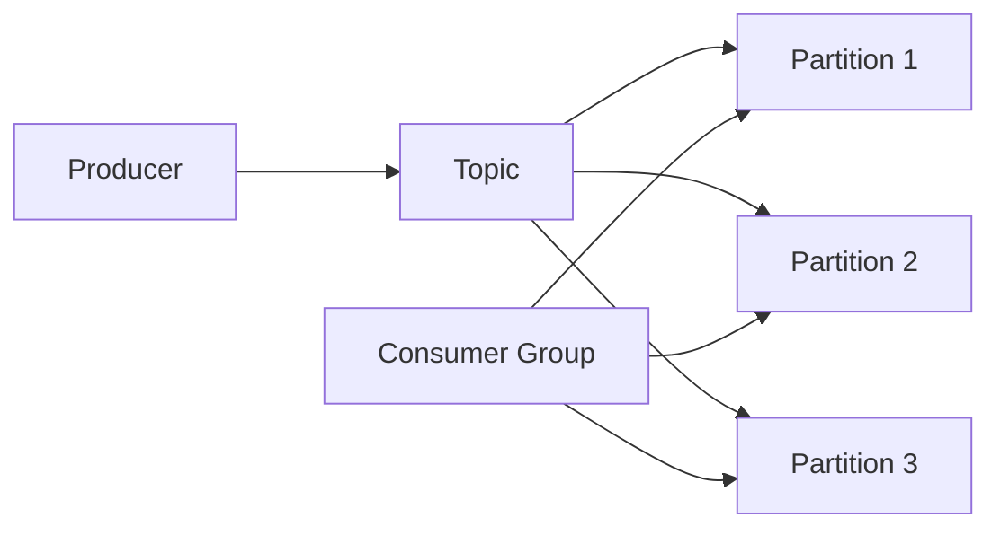

# Kafka Group原理与代码实例讲解

## 1. 背景介绍
### 1.1 问题的由来
在大数据时代，海量数据的实时处理和分析已成为许多企业的核心需求。传统的消息队列系统如ActiveMQ、RabbitMQ等，在面对高吞吐量和高并发的场景时，往往难以满足性能要求。而Kafka作为一个分布式的流处理平台，凭借其高吞吐、低延迟、高可靠等特点，在实时数据处理领域得到了广泛应用。

### 1.2 研究现状
目前，Kafka已经成为了许多大型互联网公司的核心基础设施，如LinkedIn、Netflix、Uber等都在使用Kafka来支撑其业务。同时，围绕Kafka的生态系统也日益完善，诸如Kafka Connect、Kafka Streams等组件的出现，进一步拓展了Kafka的应用场景。

### 1.3 研究意义
深入研究Kafka的原理和实现，对于我们理解和掌握分布式流处理平台的设计思想和关键技术具有重要意义。同时，通过实际的代码实例，我们可以更加直观地理解Kafka的使用方法，为日后在实际项目中应用Kafka打下坚实基础。

### 1.4 本文结构
本文将围绕Kafka Group这一核心概念展开，首先介绍Kafka的核心概念及其之间的关系，然后重点讲解Group的工作原理和算法实现，并给出详细的数学模型和公式推导。接着，我们将通过具体的代码实例，演示如何使用Kafka的Consumer API实现Group功能。最后，总结Kafka Group的实际应用场景和未来的发展趋势，并提供一些学习资源和工具推荐。

## 2. 核心概念与联系
在Kafka中，有几个核心概念需要理解：
- Broker：Kafka集群中的服务器节点，负责消息的存储和转发。
- Topic：消息的主题，生产者将消息发送到特定的Topic，消费者从Topic中读取消息。
- Partition：Topic的分区，每个Topic可以划分为多个Partition，以实现并行处理和负载均衡。
- Consumer Group：消费者组，属于同一个Group的消费者协调工作，共同消费一个Topic的多个Partition。

它们之间的关系如下图所示：



可以看出，Producer将消息发送到Topic，Topic按照Partition分布在多个Broker上。Consumer Group中的多个Consumer协调工作，分别消费不同的Partition，从而实现高效并行的消息处理。

## 3. 核心算法原理 & 具体操作步骤
### 3.1 算法原理概述
Kafka Group的核心是Consumer Rebalance算法，即如何在Group内的多个Consumer之间分配Topic的Partition，以实现负载均衡和容错。Rebalance过程可以分为以下几个步骤：
1. 当Consumer加入或退出Group时，触发Rebalance
2. 选举出一个Consumer作为Group Coordinator，负责协调
3. 各Consumer向Coordinator发送Join Group请求，并汇报自己订阅的Topic
4. Coordinator收集Consumer信息后，根据分配策略计算Partition分配方案
5. Coordinator将分配方案下发给各Consumer
6. 各Consumer根据分配方案进行Partition的消费

### 3.2 算法步骤详解
1. Consumer加入Group：Consumer启动后，向Kafka Broker发送JoinGroup请求，表明自己要加入某个Group。如果是Group第一个加入的Consumer，则它会被选为Group Coordinator。

2. 选举Group Coordinator：Kafka使用Zookeeper来协调Rebalance过程。多个Broker上的Consumer都在Zookeeper上注册Watcher，一旦Group信息发生变化，Zookeeper就会通知所有Consumer进行Rebalance。Coordinator的选举也是通过Zookeeper的临时节点实现的。

3. 各Consumer汇报Metadata：Consumer向Coordinator发送Join Group请求，请求中包含自己订阅的Topic信息。

4. 计算Partition分配方案：Coordinator收集到所有Consumer的Metadata后，根据一定的分配策略计算Partition的分配方案。Kafka内置了3种分配策略：Range、RoundRobin和Sticky。可以通过`partition.assignment.strategy`参数配置。

5. 下发分配方案：Coordinator将计算好的分配方案，通过SyncGroup请求下发给各Consumer。

6. Consumer执行分配方案：Consumer收到分配方案后，就开始消费自己分配到的Partition。同时，Consumer会定期向Coordinator发送Heartbeat请求，报告自己的消费进度，以实现Group内的消费者协调。

### 3.3 算法优缺点
Kafka Rebalance算法的优点是：
- 自动均衡：根据Consumer的数量和Partition的多少，自动实现最优的分配，避免数据倾斜。
- 容错性好：当个别Consumer故障时，会自动将其负责的Partition转移给其他Consumer，不影响整个Group的工作。 

但是，Rebalance算法也有一些缺点：
- 羊群效应：当个别Consumer频繁发生崩溃重启时，会导致整个Group频繁Rebalance，影响消费性能。
- 重平衡开销：Rebalance过程中，所有Consumer都要停止消费，等待新方案确定，会有一定的停顿时间。

### 3.4 算法应用领域
Kafka Rebalance算法广泛应用于各种实时数据处理场景，如日志聚合、消息推送、流式计算等。通过Consumer Group实现消费者的动态伸缩和负载均衡，可以显著提高系统的吞吐量和可用性。

## 4. 数学模型和公式 & 详细讲解 & 举例说明
### 4.1 数学模型构建
我们可以用一个二维矩阵来表示Partition的分配问题。假设有m个Consumer和n个Partition，定义一个m*n的01矩阵X，其中$X_{ij}=1$表示第i个Consumer分配到第j个Partition，否则$X_{ij}=0$。

同时，定义$C_i$为第i个Consumer的处理能力（如CPU核数），$P_j$为第j个Partition的流量大小。我们的目标是找到一个分配矩阵X，使得各Consumer的负载尽量均衡，即：

$$
\min \sum_{i=1}^m \left| \sum_{j=1}^n X_{ij}P_j - \frac{\sum_{j=1}^n P_j}{m} \right|
$$

其中，$\sum_{j=1}^n X_{ij}P_j$表示第i个Consumer分配到的Partition总流量，$\frac{\sum_{j=1}^n P_j}{m}$表示平均每个Consumer应当分配到的流量。

### 4.2 公式推导过程
上述优化问题可以转化为一个整数规划问题：

$$
\begin{aligned}
\min \quad & \sum_{i=1}^m d_i \\
s.t. \quad & \sum_{j=1}^n X_{ij}P_j - \frac{\sum_{j=1}^n P_j}{m} \leq d_i, \quad i=1,2,\cdots,m \\
& \frac{\sum_{j=1}^n P_j}{m} - \sum_{j=1}^n X_{ij}P_j \leq d_i, \quad i=1,2,\cdots,m \\
& \sum_{i=1}^m X_{ij} = 1, \quad j=1,2,\cdots,n \\
& X_{ij} \in \{0,1\}, \quad i=1,2,\cdots,m, \quad j=1,2,\cdots,n
\end{aligned}
$$

其中，$d_i$为第i个Consumer的负载偏差。通过引入$d_i$，将目标函数转化为最小化所有Consumer的负载偏差之和。约束条件的含义如下：
- 第一个约束表示实际负载不能超过平均负载+$d_i$
- 第二个约束表示实际负载不能低于平均负载-$d_i$
- 第三个约束表示每个Partition只能分配给一个Consumer
- 第四个约束表示分配矩阵X的元素只能取0或1

这样，原问题就转化为一个整数规划模型，可以用现成的优化求解器求解，如Gurobi、CPLEX等。

### 4.3 案例分析与讲解
我们来看一个具体的例子。假设有3个Consumer和6个Partition，各Partition的流量大小为：
```
P1: 100 MB/s
P2: 80 MB/s 
P3: 120 MB/s
P4: 90 MB/s
P5: 110 MB/s
P6: 150 MB/s
```

根据上面的整数规划模型，我们可以得到一个最优分配方案：
```
C1: P1, P4
C2: P2, P5  
C3: P3, P6
```

可以看出，这种分配方式下，各Consumer的负载非常接近，C1的负载为190 MB/s，C2为190 MB/s，C3为270 MB/s，基本实现了均衡分配。

当然，实际场景中的分配问题要复杂得多，还需要考虑Consumer的异构性、Partition的状态等因素，Kafka采用了启发式的算法来快速得到一个次优解，以权衡均衡性和计算开销。

### 4.4 常见问题解答
1. Rebalance的触发时机有哪些？
- Consumer加入或退出Group时
- Consumer下线时间超过`session.timeout.ms`参数配置的值时
- Consumer显式调用`unsubscribe()`方法主动取消订阅时
- Topic的Partition数量发生变化时

2. Rebalance过程中，Consumer会出现重复消费吗？
正常情况下不会。因为Rebalance前，Consumer会提交自己的位移（Offset），等Rebalance完成后，会从新分配到的Partition的上次提交位移处继续消费。但如果位移提交出现异常，则有可能导致重复消费。

3. 如何避免Rebalance带来的消费停顿？
可以采取以下措施：
- 将`max.poll.interval.ms`参数设置得大一些，避免Consumer长时间未拉取消息而触发Rebalance
- 调整`session.timeout.ms`和`heartbeat.interval.ms`参数，让Coordinator能及时发现Consumer的异常
- Consumer在处理消息时，如果预估耗时较长，可以主动调用`pause()`方法暂停拉取，处理完再恢复

## 5. 项目实践：代码实例和详细解释说明
### 5.1 开发环境搭建
首先我们需要搭建一个Kafka开发环境。可以在官网下载Kafka安装包，解压后按以下步骤启动：
1. 启动Zookeeper：
```
bin/zookeeper-server-start.sh config/zookeeper.properties
```

2. 启动Kafka Broker：
```
bin/kafka-server-start.sh config/server.properties
```

3. 创建Topic：
```
bin/kafka-topics.sh --create --topic test-topic -zookeeper localhost:2181 --replication-factor 1 --partitions 3
```

这里我们创建了一个名为`test-topic`的Topic，包含3个Partition。

### 5.2 源代码详细实现
下面我们用Java代码演示如何实现一个Kafka Consumer Group。

1. 添加Maven依赖：
```xml
<dependency>
    <groupId>org.apache.kafka</groupId>
    <artifactId>kafka-clients</artifactId>
    <version>2.8.0</version>
</dependency>
```

2. 编写Consumer代码：
```java
public class MyConsumer {
    
    private static final String TOPIC = "test-topic";
    private static final String GROUP_ID = "test-group";
    
    public static void main(String[] args) {
        Properties props = new Properties();
        props.put(ConsumerConfig.BOOTSTRAP_SERVERS_CONFIG, "localhost:9092");
        props.put(ConsumerConfig.GROUP_ID_CONFIG, GROUP_ID);
        props.put(ConsumerConfig.KEY_DESERIALIZER_CLASS_CONFIG, StringDeserializer.class.getName());
        props.put(ConsumerConfig.VALUE_DESERIALIZER_CLASS_CONFIG, StringDeserializer.class.getName());
        
        KafkaConsumer<String, String> consumer = new KafkaConsumer<>(props);
        consumer.subscribe(Arrays.asList(TOPIC));
        
        try {
            while (true) {
                ConsumerRecords<String, String> records = consumer.poll(Duration.ofMillis(100));
                for (ConsumerRecord<String, String> record : records) {
                    System.out.printf("Partition = %d, Offset = %d, Key = %s, Value = %s\n", 
                        record.partition(), record.offset(), record.key(), record.value());
                }
            }
        } finally {
            consumer.close();
        }
    }
}
```

这里我们创建了一个KafkaConsumer实例，订阅了`test-topic`，并在一个无限循环中不断拉取消息进行处理。

### 5.3 代码解读与分析
在上面的代码中，有几个关键点需