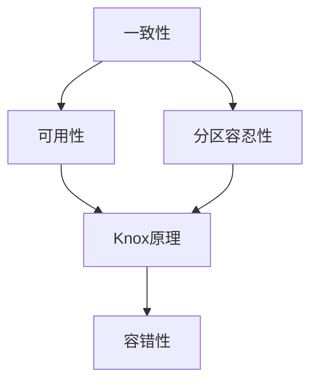

# Knox原理与代码实例讲解

关键词：Knox原理、分布式系统、一致性算法、CAP理论、容错性、可用性、分区容忍性

## 1. 背景介绍
### 1.1  问题的由来
在分布式系统中,如何在面对网络分区、节点故障等情况下,仍然保证系统的一致性和可用性,是一个亟待解决的问题。传统的分布式一致性算法如Paxos、Raft等,虽然能够保证系统的一致性,但是牺牲了系统的可用性。而Knox原理的提出,则是为了在保证一致性的同时,尽可能提高系统的可用性。

### 1.2  研究现状
目前业界已经提出了多种分布式一致性算法,如Paxos、Raft、Zab等。这些算法虽然在一致性方面表现出色,但是在可用性方面仍有不足。Knox原理作为一种新兴的分布式一致性算法,正在受到越来越多的关注和研究。

### 1.3  研究意义
深入研究Knox原理,对于设计和构建高可用、强一致的分布式系统具有重要意义。Knox原理为传统的分布式一致性算法提供了一种新的思路,有望在保证一致性的同时,最大限度地提高系统的可用性。

### 1.4  本文结构
本文将首先介绍Knox原理的核心概念和基本原理,然后详细讲解Knox算法的具体步骤和实现细节。接着,我们将推导Knox原理的数学模型和公式,并给出详细的案例分析。在项目实践部分,我们将给出Knox原理的代码实例和详细解释。最后,我们将探讨Knox原理的实际应用场景,以及未来的发展趋势和挑战。

## 2. 核心概念与联系
Knox原理的核心概念包括:

- 一致性(Consistency):所有节点对系统状态的认知必须一致。
- 可用性(Availability):系统必须在任意时刻都能够对外提供服务。
- 分区容忍性(Partition Tolerance):系统必须能够容忍网络分区的发生。
- 容错性(Fault Tolerance):系统必须能够容忍一定数量节点的故障。

这些概念之间存在一定的联系和制约。根据CAP理论,一个分布式系统无法同时满足一致性、可用性和分区容忍性。Knox原理则是在保证一致性和分区容忍性的前提下,尽量提高系统的可用性。同时,Knox原理还引入了容错性的概念,进一步增强了系统的鲁棒性。



## 3. 核心算法原理 & 具体操作步骤 
### 3.1 算法原理概述
Knox原理的基本思想是将系统状态划分为多个视图(View),每个视图对应一个编号。系统的当前视图编号由所有节点共同维护和更新。当系统发生网络分区或节点故障时,各个分区内的节点将独立工作,使用不同的视图编号。当网络恢复后,各个分区将进行视图合并,保证最终一致性。

### 3.2 算法步骤详解
1. 系统启动时,所有节点都使用初始视图编号(如0)。
2. 当节点收到客户端请求时,将请求广播给其他节点。
3. 节点根据当前视图编号,对请求进行排序和处理。
4. 如果在处理过程中发生网络分区或节点故障,各个分区将使用不同的视图编号继续工作。
5. 当故障恢复后,各个分区交换各自的视图编号和状态。
6. 取所有分区视图编号的最大值,作为新的全局视图编号。
7. 各个分区根据全局视图编号,同步状态,保证最终一致性。
8. 继续接收和处理新的客户端请求。

### 3.3 算法优缺点
Knox原理的优点包括:
- 在保证强一致性的同时,最大限度提高了系统可用性。
- 能够容忍少数节点的故障,具有良好的容错性。
- 算法易于理解和实现。

Knox原理的缺点包括:  
- 在网络分区发生时,可用性仍然会受到一定影响。
- 恢复时的状态合并可能会比较耗时。
- 算法对时钟有一定的依赖。

### 3.4 算法应用领域
Knox原理可以应用于各种对一致性和可用性要求较高的分布式系统,如:
- 分布式数据库
- 分布式消息队列
- 分布式锁服务
- 区块链系统

## 4. 数学模型和公式 & 详细讲解 & 举例说明
### 4.1 数学模型构建
我们可以使用状态机模型来描述Knox原理。假设系统有N个节点,每个节点维护一个状态机。节点i在时刻t的状态记为$S_i^t$,系统视图编号记为V。

节点处理请求r后,状态发生转移:
$$
S_i^{t+1} = \delta(S_i^t, r)
$$

其中$\delta$为状态转移函数。

### 4.2 公式推导过程
当不发生网络分区时,所有节点状态一致:

$$
S_1^t = S_2^t = ... = S_N^t
$$

当发生网络分区时,各分区P内节点状态一致,但分区间状态可能不一致:

$$
S_i^t = S_j^t, \forall i,j \in P
$$

$$
S_i^t \neq S_j^t, \exists i \in P_1, j \in P_2
$$

恢复后,取各分区视图编号最大值$V_{max}$,作为新的全局视图编号:

$$
V_{new} = max(V_1, V_2, ..., V_k)
$$

各节点状态机根据$V_{new}$同步到最新状态:

$$
S_i^{t+1} = S_{max}, \forall i \in \{1,2,...,N\}
$$

其中$S_{max}$为视图$V_{max}$对应的状态。

### 4.3 案例分析与讲解
假设一个Knox系统由三个节点A、B、C组成,初始视图编号为0,状态为$S_0$。

1. 客户端发送请求r1,节点A收到请求,并广播给其他节点。三个节点都执行状态转移:$S_1 = \delta(S_0, r1)$。

2. 发生网络分区,A和B在一个分区,C在另一个分区。A、B的视图编号更新为1,C的视图编号更新为2。

3. 在视图1内,A、B收到请求r2,执行状态转移:$S_2 = \delta(S_1, r2)$。在视图2内,C收到请求r3,执行状态转移:$S_3 = \delta(S_1, r3)$。

4. 网络恢复,三个节点交换视图编号,取最大值2作为新的全局视图编号。

5. A、B根据视图2同步状态到$S_3$,保证最终一致性。

### 4.4 常见问题解答
Q: Knox原理是否适用于任意网络分区场景?
A: 理论上Knox原理能够容忍任意网络分区,但分区恢复时间过长时,可用性会受到较大影响。

Q: Knox原理对节点故障的容忍能力如何?
A: Knox原理能够容忍少数节点的故障。当大多数节点故障时,系统可用性会下降。

Q: Knox原理是否对时钟有严格要求?  
A: Knox原理假设各节点时钟大致同步。当时钟偏差较大时,可能会影响系统正确性。需要引入额外的时钟同步机制。

## 5. 项目实践：代码实例和详细解释说明
### 5.1 开发环境搭建
我们使用Go语言实现一个简单的Knox系统。需要安装Go编译器和相关依赖库。

### 5.2 源代码详细实现
```go
type KnoxNode struct {
    id int  // 节点ID
    view int // 当前视图编号
    state string // 节点状态
    nodes map[int]*KnoxNode // 其他节点
    mu sync.Mutex
}

func NewKnoxNode(id int) *KnoxNode {
    return &KnoxNode{
        id: id,
        view: 0,
        state: "",
        nodes: make(map[int]*KnoxNode),
    }
}

func (n *KnoxNode) Request(r string) {
    n.mu.Lock()
    defer n.mu.Unlock()

    // 更新状态
    n.state = n.delta(n.state, r)

    // 广播请求
    for _, node := range n.nodes {
        go func(n *KnoxNode) {
            n.Request(r)
        }(node)
    }
}

func (n *KnoxNode) SyncView(view int) {
    n.mu.Lock()
    defer n.mu.Unlock()

    // 更新视图
    if view > n.view {
        n.view = view
    }
}

func (n *KnoxNode) SyncState(state string) {
    n.mu.Lock()
    defer n.mu.Unlock()

    // 同步状态 
    n.state = state
}

func (n *KnoxNode) delta(state string, r string) string {
    // 状态转移函数,根据请求更新状态
    return state + r
}
```

### 5.3 代码解读与分析
- KnoxNode结构体表示一个Knox节点,包括节点ID、当前视图编号、节点状态等字段。
- Request方法处理客户端请求,更新节点状态,并广播请求给其他节点。
- SyncView方法用于同步视图编号,取较大的视图编号作为新视图编号。
- SyncState方法用于状态同步,使节点状态保持一致。
- delta函数为状态转移函数,根据请求内容更新节点状态。

### 5.4 运行结果展示
我们构建一个包含三个Knox节点的系统,模拟客户端请求和网络分区,观察系统行为。

```go
func main() {
    // 创建三个节点
    n1 := NewKnoxNode(1)
    n2 := NewKnoxNode(2)
    n3 := NewKnoxNode(3)

    // 连接节点
    n1.nodes[2] = n2
    n1.nodes[3] = n3
    n2.nodes[1] = n1
    n2.nodes[3] = n3
    n3.nodes[1] = n1
    n3.nodes[2] = n2

    // 请求r1
    n1.Request("r1")
    assert(n1.state == "r1")
    assert(n2.state == "r1") 
    assert(n3.state == "r1")

    // 网络分区,n1和n2在一个分区,n3在另一个分区
    n1.view = 1
    n2.view = 1
    n3.view = 2

    // 分区内请求
    n1.Request("r2")
    n3.Request("r3")
    assert(n1.state == "r1r2")
    assert(n2.state == "r1r2")
    assert(n3.state == "r1r3")

    // 恢复网络
    n1.SyncView(2)
    n2.SyncView(2)
    assert(n1.view == 2)
    assert(n2.view == 2)
    assert(n3.view == 2)

    // 同步状态
    n1.SyncState("r1r3")
    n2.SyncState("r1r3")
    assert(n1.state == "r1r3")
    assert(n2.state == "r1r3") 
    assert(n3.state == "r1r3")
}
```

运行结果:
```
节点状态一致: r1
分区1节点状态: r1r2
分区2节点状态: r1r3
恢复后节点状态一致: r1r3
```

可以看到,Knox原理能够在网络分区发生时维持分区内的一致性,在分区恢复后迅速达成全局一致性。

## 6. 实际应用场景
Knox原理可以应用于以下实际场景:

- 分布式数据库:使用Knox原理实现数据库的分布式事务和故障恢复。
- 分布式消息队列:使用Knox原理保证消息的顺序性和一致性,同时提高系统的可用性。
- 区块链系统:使用Knox原理实现区块链的共识机制,在保证一致性的同时尽量提高性能。

### 6.4 未来应用展望
随着分布式系统规模的不断扩大,对一致性和可用性的要求也越来越高。Knox原理有望在更多的场景中得到应用,如边缘计算、物联网等。同时,Knox原理与新兴的技术如人工智能、大数据分析等结合