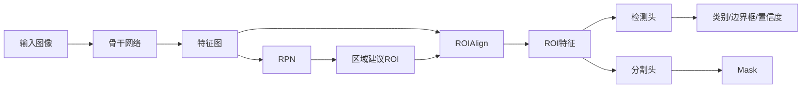

# MaskR-CNN原理与代码实例讲解

## 1. 背景介绍
### 1.1 问题的由来
对象检测是计算机视觉领域的一个基本问题,旨在从图像或视频中定位和识别感兴趣的对象。它在自动驾驶、安防监控、医学影像分析等众多领域有着广泛的应用。传统的对象检测方法主要基于手工设计的特征,如HOG、SIFT等,再结合分类器如SVM进行训练。这类方法存在特征表达能力不足、检测精度低等问题。

### 1.2 研究现状 
近年来,深度学习技术的发展极大地推动了对象检测的进步。基于深度卷积神经网络(CNN)的检测算法如R-CNN、Fast R-CNN、Faster R-CNN等,通过端到端的特征学习,在准确率和速度上都取得了显著提升。但这些算法主要针对矩形边界框(bounding box)的检测,对不规则形状的对象无能为力。

为了解决这一问题,何凯明等人在2017年提出了Mask R-CNN算法。它在Faster R-CNN的基础上增加了一个并行的分支,用于生成像素级别的分割掩码(mask),从而实现了对任意形状目标的精确分割。Mask R-CNN一经提出就受到了广泛关注,并迅速成为了图像分割领域的经典方法之一。

### 1.3 研究意义
Mask R-CNN的提出具有重要的理论和实践意义:

1. 它将检测和分割统一到了一个框架中,简化了模型结构,提高了训练和推理效率。
2. 通过引入RoIAlign等关键技术,解决了特征失准问题,大大提升了mask的精度。  
3. 实验表明,Mask R-CNN在COCO数据集上取得了当时最好的结果,展现了卓越的性能。
4. 它为后续的研究提供了新的思路,催生了一系列改进和变体,如Mask Scoring R-CNN、Hybrid Task Cascade等。

### 1.4 本文结构
本文将全面介绍Mask R-CNN的原理和实现。第2节阐述Mask R-CNN的核心概念;第3节详细讲解其算法流程;第4节给出数学模型和公式推导;第5节提供完整的代码实例;第6节讨论其应用场景;第7节推荐相关工具和资源;第8节总结全文并展望未来。希望通过本文,读者能够深入理解Mask R-CNN的精髓,掌握其实现要点,并将其应用到实际问题中。

## 2. 核心概念与联系
Mask R-CNN的核心概念包括:

- **骨干网络(Backbone)**: 通常采用ResNet-FPN(特征金字塔网络)作为骨干,用于提取多尺度的卷积特征。
- **区域建议网络(RPN)**: 在骨干网络的输出上滑动一个小网络,生成区域建议(ROI),即可能包含目标的候选框。
- **ROIAlign**: 一种对齐操作,将ROI映射到特征图上并提取定长特征,解决了量化误差问题。
- **检测头(Box Head)**: 在ROI特征上预测目标类别、边界框坐标和置信度得分。
- **分割头(Mask Head)**: 在ROI特征上生成像素级别的二值Mask。

它们的关系如下图所示:

可以看出,Mask R-CNN在Faster R-CNN的基础上增加了分割头,实现了检测和分割的统一。骨干网络负责特征提取,RPN负责生成候选区域,ROIAlign对齐ROI特征,检测头和分割头分别进行分类回归和Mask预测。这种架构设计简洁高效,代表了两阶段检测器的典范。

## 3. 核心算法原理 & 具体操作步骤
### 3.1 算法原理概述
Mask R-CNN的算法流程分为以下4个主要步骤:

1. **骨干网络提取特征**: 输入图像通过骨干网络(如ResNet-FPN),提取多尺度的卷积特征图。

2. **区域建议网络生成ROI**: 在特征图上应用区域建议网络(RPN),生成一系列矩形候选框(ROI)。

3. **ROIAlign提取ROI特征**: 利用ROIAlign将ROI映射到特征图上,并池化为定长的ROI特征。

4. **检测头和分割头并行预测**: ROI特征分别输入到检测头和分割头,检测头预测类别、坐标和分数,分割头预测Mask。

其中,步骤2-4在训练时同时进行,测试时则依次执行。相比Faster R-CNN,Mask R-CNN的创新主要在于ROIAlign和Mask分支,前者解决了Pooling的失准问题,后者实现了像素级分割。

### 3.2 算法步骤详解
下面详细讲解Mask R-CNN的每个步骤:

**步骤1:骨干网络提取特征**

首先,输入图像通过预训练的CNN骨干网络(如ResNet-50),提取多层次的卷积特征。为了兼顾速度和精度,Mask R-CNN采用FPN(特征金字塔网络)融合了高层语义信息和低层细节信息。具体地,取ResNet的{C2,C3,C4,C5}四个阶段的输出,自顶向下进行上采样和融合,得到{P2,P3,P4,P5}四个特征图,再在P5上生成P6作为RPN的输入。这种多尺度特征有利于检测不同大小的目标。

**步骤2:区域建议网络生成ROI**

RPN在每个特征图上滑动一个3x3的卷积核,接两个并行的全连接层,分别预测目标/非目标的概率和边界框坐标。对每个位置,RPN考虑k个不同大小和宽高比的候选框(称为anchor),因此输出通道数为2k(目标/非目标)和4k(坐标修正)。训练时按照anchor与真值框的IoU(交并比)划分正负样本,采用二元交叉熵和Smooth L1损失,使RPN能够有效筛选候选区域。测试时对每个特征图应用非极大值抑制,再汇总所有建议区域,选出前N个ROI输出。

**步骤3:ROIAlign提取ROI特征**

传统的ROI Pooling通过量化操作将ROI映射到特征图的整数坐标,再划分为固定大小的网格(如7x7)进行最大池化。这种量化会带来不可避免的误差,尤其对小目标和像素级分割影响很大。为此,Mask R-CNN提出了ROIAlign层,取消量化步骤,直接在浮点数坐标上应用双线性插值,精确地提取对应位置的特征。再用平均池化代替最大池化,可进一步降低偏差。实验表明,ROIAlign能显著提高Mask的精度。

**步骤4:检测头和分割头并行预测**

ROI特征在检测头和分割头中分别进行预测。检测头包含两个全连接层+预测层,分别输出K+1个类别概率(K为前景类别数)、4个边界框坐标和1个置信度得分。分割头采用FCN结构,先用4个3x3卷积提取局部特征,再上采样14x14,并用1x1卷积输出K个二值Mask(每个类别一个)。值得注意的是,分割头通过sigmoid函数预测像素为前景的概率,而不是softmax。这是因为Mask之间并不是互斥的,如身体和头部是包含关系。预测时只需对每个像素独立进行二值化即可。

### 3.3 算法优缺点
Mask R-CNN的主要优点有:

1. 采用FPN融合了多尺度特征,增强了小目标的检测效果。
2. 使用ROIAlign替代ROI Pooling,提高了像素级分割的准确性。
3. 实现了检测和分割的统一,简化了流程,提高了效率。
4. 引入了Mask分支,可生成高质量的分割结果。

同时,Mask R-CNN也存在一些局限:

1. 作为两阶段检测器,其推理速度不如单阶段方法(如YOLO、SSD)。
2. 对小目标和密集目标的检测效果有待提高。
3. Mask分支增加了模型复杂度和训练难度。
4. 端到端训练需要大量标注数据,对算力要求较高。

### 3.4 算法应用领域
凭借出色的性能,Mask R-CNN在众多领域得到了广泛应用,如:

- 自动驾驶:检测车辆、行人、交通标志等,为决策提供环境感知。
- 医学影像:分割肿瘤、器官、病变等,辅助诊断和手术规划。 
- 遥感图像:提取建筑、道路、植被等地物,用于制图和监测。
- 工业视觉:定位和分割工件缺陷,实现自动化质检。
- 视频监控:检测和跟踪行人、车辆,进行异常行为分析。
- 增强现实:识别和分割真实场景中的物体,实现虚拟交互。

此外,Mask R-CNN还为图像抠图、交互式分割等应用提供了新的思路。

## 4. 数学模型和公式 & 详细讲解 & 举例说明
### 4.1 数学模型构建
Mask R-CNN的数学模型主要包括以下几个部分:

**多任务损失函数**

Mask R-CNN的总体损失函数由三部分组成:
$$
L = L_{cls} + L_{box} + L_{mask}
$$
其中,$L_{cls}$是RPN和检测头的分类损失,$L_{box}$是边界框回归损失,$L_{mask}$是像素级分割损失。

具体地,RPN的分类损失采用二元交叉熵:
$$
L_{cls}(p_i, p_i^*) = -p_i^* \log p_i - (1-p_i^*) \log (1-p_i) 
$$
其中$p_i$是anchor $i$为前景的预测概率,$p_i^*$为真值标签(1为前景,0为背景)。

检测头的分类损失采用多元交叉熵(softmax):

$$
L_{cls}(p, u) = -\log \frac{\exp(p_u)}{\sum_i \exp(p_i)}
$$

其中$p$是预测的类别概率向量,$u$是真值类别索引。

边界框回归损失采用Smooth L1函数:

$$
L_{box}(t_i, v_i) = \sum_{i\in\{x,y,w,h\}} \text{Smooth}_{L1}(t_i - v_i)
$$

$$
\text{Smooth}_{L1}(x) = \begin{cases} 
0.5x^2 & \text{if } |x| < 1 \\
|x| - 0.5 & \text{otherwise}
\end{cases}
$$

其中$t_i$是预测的边界框坐标,$v_i$是真值坐标,分别对应框的中心坐标和宽高的对数值。Smooth L1相比L2损失对离群点更鲁棒。

Mask分支的损失采用逐像素的二元交叉熵:

$$
L_{mask} = -\frac{1}{m^2}\sum_{1\leq i,j\leq m} [y_{ij} \log \hat{y}_{ij} + (1-y_{ij}) \log (1-\hat{y}_{ij}) ]
$$

其中$y_{ij}$是位置$(i,j)$处像素的真值(0或1),$\hat{y}_{ij}$是预测值,$m$是Mask大小(如28)。与每个ROI关联的Mask损失在对应类别通道上计算,其他通道的损失被屏蔽。

**特征金字塔融合**

FPN利用横向连接和自顶向下的上采样融合了高低层特征。设骨干网络的多层特征为$\{C_2, C_3, C_4, C_5\}$,对应步长$\{4, 8, 16, 32\}$。FPN首先对$C_5$进行1x1卷积得到$P_5$,然后迭代以下步骤直到$P_2$:

1. 对$P_{i+1}$进行2倍上采样得到$U_i$。
2. 对$C_i$进行1x1卷积得到