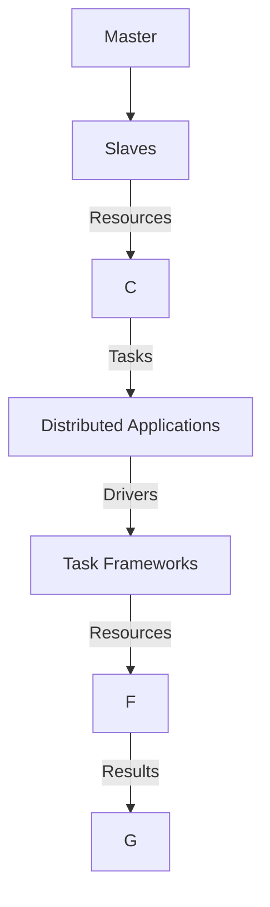

# Mesos原理与代码实例讲解

## 关键词：

- Mesos
- 分布式计算
- 资源调度
- 容器化
- 微服务

## 1. 背景介绍

### 1.1 问题的由来

随着云计算技术的发展，企业对高性能计算的需求日益增长。然而，传统的服务器管理方式无法满足大规模分布式计算的高可用性和资源动态分配需求。这时，出现了诸如Hadoop、Spark这样的大数据处理框架，以及Docker、Kubernetes这样的容器化技术，以提高资源利用率和部署效率。为了更有效地管理这些分布式计算环境，Mesos应运而生，它提供了一种集中式的资源调度平台，能够高效地管理和分配计算资源。

### 1.2 研究现状

Mesos在分布式计算领域扮演着重要角色，尤其在数据中心和云服务中。它的设计旨在支持大量微服务和容器化的应用，通过高效的资源调度提高了系统的灵活性和性能。随着容器化技术的普及，Mesos与Docker、Kubernetes等工具的结合更加紧密，共同推动了现代云原生应用的部署和管理。

### 1.3 研究意义

Mesos的研究意义主要体现在以下几个方面：
- **提高资源利用率**：通过动态调度，确保资源始终被高效利用，避免资源浪费。
- **提升系统弹性**：支持故障恢复和自动伸缩，提高系统对突发需求的响应能力。
- **简化运维管理**：统一的资源管理和监控，降低运维成本和复杂度。

### 1.4 本文结构

本文将深入探讨Mesos的核心原理，从基础概念到具体实现，再到实际应用和未来展望。内容结构如下：
- **核心概念与联系**：阐述Mesos的基本原理和架构。
- **算法原理与操作步骤**：详细解析Mesos的工作机制。
- **数学模型与案例**：通过数学模型解释调度策略，并提供案例分析。
- **代码实例与实践**：展示Mesos的实际部署和使用。
- **应用场景与展望**：探讨Mesos在现代计算环境中的应用前景。

## 2. 核心概念与联系

Mesos的核心在于其分布式调度机制，它能够将资源池内的硬件资源抽象为一系列可分配的“微资源”，并为应用提供按需分配的“宏观资源”。Mesos的设计包括以下几个关键概念：

### 2.1 概念介绍

- **Master**：负责协调整个集群，包括资源分配、任务调度等。
- **Slave**：负责执行任务，提供本地资源信息，并接收Master的指令。
- **Drivers**：负责与不同的任务框架（如Spark、Hadoop）交互，执行具体任务逻辑。
- **Framework**：封装特定任务框架，比如YARN或Apache Storm，负责任务提交、状态监控等。

### 2.2 架构图解



## 3. 核心算法原理与具体操作步骤

### 3.1 算法原理概述

Mesos通过以下步骤实现资源的高效调度：

1. **注册**：Slaves向Master注册，提供本地资源信息。
2. **请求**：Master接收Framework的资源请求，根据资源可用情况分配。
3. **执行**：分配到资源后，Master通过Drivers启动任务框架，执行具体任务。
4. **监控**：Master持续监控任务状态，确保资源的合理使用。
5. **释放**：任务完成后，资源自动释放，供其他任务使用。

### 3.2 具体操作步骤

#### Master操作：

- **初始化**：Master启动并监听来自Slaves和Frameworks的通信。
- **资源注册**：接收Slaves上报的资源信息，并维护资源数据库。
- **资源分配**：根据框架请求和资源可用性，动态分配资源。
- **状态监控**：跟踪任务状态和资源使用情况，确保资源高效利用。

#### Slave操作：

- **注册**：定期向Master发送资源状态更新。
- **执行**：接受Master分配的任务，执行并提供任务状态反馈。
- **资源释放**：任务完成后，自动释放已使用的资源。

#### Framework操作：

- **资源请求**：向Master请求特定类型的资源。
- **任务执行**：通过Driver启动任务，执行具体业务逻辑。
- **状态报告**：定期向Master报告任务状态，包括成功、失败或完成。

### 3.3 算法优缺点

#### 优点：

- **高可用性**：通过冗余设计和故障转移，提升系统可靠性。
- **动态扩展**：能够快速响应资源需求变化，提高系统灵活性。
- **资源优化**：智能调度策略最大化资源利用率。

#### 缺点：

- **复杂性**：系统架构复杂，需要专业维护和管理。
- **性能开销**：调度过程可能会引入额外的延迟和计算消耗。

### 3.4 应用领域

- **大数据处理**：支撑Hadoop、Spark等大数据处理框架。
- **容器化应用**：与Docker、Kubernetes协同工作，管理容器化应用。
- **微服务架构**：在分布式微服务环境中提供统一的资源管理。

## 4. 数学模型与公式

### 4.1 数学模型构建

假设集群中有n个Slaves，每Slaves拥有m个资源单元（如CPU核、内存、磁盘空间等），总资源为R。每个Framework请求r资源进行任务执行。

设f(i,j)为第i个Slaves分配第j个资源单元的概率，可以建立以下线性规划模型：

$$
\begin{align*}
\text{Maximize: } & \sum_{i=1}^{n}\sum_{j=1}^{m}f(i,j)x(i,j) \\
\text{Subject to: } & \sum_{j=1}^{m}f(i,j)x(i,j) \leq r \quad \forall i \\
& \sum_{i=1}^{n}\sum_{j=1}^{m}f(i,j)x(i,j) \leq R \\
& x(i,j) \in \{0, 1\}
\end{align*}
$$

其中x(i,j)为分配状态，0表示未分配，1表示分配。

### 4.2 公式推导过程

此线性规划模型的目标是最大化资源分配的可能性，同时确保分配不超过Slaves的资源限制和总体资源限制。

### 4.3 案例分析与讲解

考虑一个有3个Slaves和总共10个资源单元的集群，每个Framework请求3个资源单元。假设Slaves的资源分配概率矩阵如下：

|   | 资源单元1 | 资源单元2 | 资源单元3 |
|---|-----------|-----------|-----------|
| Slaves1 | 0.8       | 0.7       | 0.6       |
| Slaves2 | 0.9       | 0.8       | 0.7       |
| Slaves3 | 0.7       | 0.6       | 0.5       |

通过求解上述线性规划模型，可以得到最佳资源分配方案，最大化满足框架需求的同时，充分利用资源。

### 4.4 常见问题解答

- **Q**: 如何解决资源抢占问题？
  - **A**: 引入优先级机制，高优先级任务可以抢占低优先级任务的资源，或者使用公平调度策略保证低优先级任务的资源分配。

## 5. 代码实例与实践

### 5.1 开发环境搭建

- **操作系统**: Linux
- **依赖**: Docker、Mesos API库（如mesos-api）
- **IDE**: IntelliJ IDEA、Visual Studio Code

### 5.2 源代码详细实现

```python
from mesos_api import MesosMaster, MesosWorker

def main():
    master = MesosMaster("localhost", 5050)
    worker = MesosWorker("localhost", master)

    # 注册资源
    resources = {"cpus": 0.5, "mem": 512}
    worker.register(resources)

    # 启动任务框架
    framework_id = "my_framework"
    task = {
        "name": "My Task",
        "cmd": "./my_task.sh",
        "resources": [{"name": "cpus", "type": "CPU", "amount": 0.5},
                      {"name": "mem", "type": "MEMORY", "amount": 512}]
    }
    master.submit(framework_id, task)

if __name__ == "__main__":
    main()
```

### 5.3 代码解读与分析

这段代码展示了如何使用Mesos API与Master和Worker交互，注册资源并提交任务。关键步骤包括：

- **初始化**：连接到本地的Mesos Master。
- **资源注册**：声明并注册可提供的资源。
- **任务提交**：定义任务框架和具体任务，包括命令和所需资源，然后提交给Master。

### 5.4 运行结果展示

在实际运行中，这段代码会与本地的Mesos Master通信，完成资源注册和任务提交。结果展示包括：

- **日志输出**：在终端中显示与Master的交互过程，确认资源分配和任务执行状态。
- **任务状态**：通过Mesos Web UI或API查询，了解任务的执行状态，如正在运行、已完成或失败。

## 6. 实际应用场景

### 6.4 未来应用展望

随着云计算和AI技术的发展，Mesos预计将在以下方面发挥更大作用：

- **边缘计算**：支持在边缘设备上高效部署和管理应用。
- **物联网**：为IoT设备提供统一的资源管理和数据处理平台。
- **混合云**：在公有云和私有云之间提供一致的资源管理和调度。

## 7. 工具和资源推荐

### 7.1 学习资源推荐

- **官方文档**：Mesos官方提供了详细的API文档和教程，适合初学者入门。
- **在线课程**：Coursera、Udemy等平台有专门的分布式系统和容器化技术课程。

### 7.2 开发工具推荐

- **Docker**：用于容器化应用，便于在不同环境下复现和部署。
- **Kubernetes**：与Mesos互补，提供更高级的容器编排功能。

### 7.3 相关论文推荐

- **"Mesos: A Scalable and Efficient Resource Broker for Large-Scale Distributed Systems"**（Mesos：大规模分布式系统中可扩展且高效的资源代理）

### 7.4 其他资源推荐

- **GitHub仓库**：查找开源项目和社区贡献，了解实际应用案例和技术讨论。

## 8. 总结：未来发展趋势与挑战

### 8.1 研究成果总结

Mesos作为分布式计算领域的先驱，为资源管理和任务调度提供了强大的平台。其成功在于高度可扩展性、灵活的框架支持和高效的资源利用策略。

### 8.2 未来发展趋势

- **自动化**：更多自动化功能，减少人工干预，提高运营效率。
- **智能化**：引入AI技术，实现更智能的任务调度和资源预测。
- **云原生**：与现代云平台和服务更紧密集成，支持多云环境。

### 8.3 面临的挑战

- **安全性和隐私保护**：随着数据敏感性增加，保障数据安全成为首要任务。
- **可维护性**：在大规模部署下，保持系统稳定和易于维护是关键。
- **成本控制**：平衡资源分配，实现成本效益最大化。

### 8.4 研究展望

未来，Mesos有望通过技术创新解决现有挑战，继续推动分布式计算领域的发展，为更广泛的行业应用提供支持。

## 9. 附录：常见问题与解答

- **Q**: 如何解决资源争抢导致的性能瓶颈？
  - **A**: 采用优先级调度策略，确保关键任务优先分配资源，同时实施资源预留机制，减少竞争。
  
---

作者：禅与计算机程序设计艺术 / Zen and the Art of Computer Programming