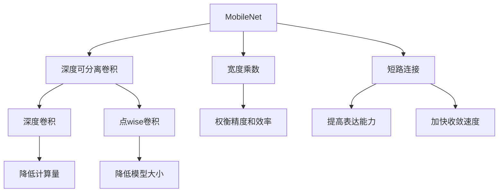

# MobileNet原理与代码实例讲解

## 1. 背景介绍

### 1.1 问题的由来

随着移动设备的普及和计算能力的不断提高,移动端的深度学习应用越来越受到重视。然而,传统的深度神经网络模型通常具有巨大的计算量和存储开销,这使得它们很难在资源受限的移动设备上高效运行。因此,如何在保持较高精度的同时,设计出高效、轻量级的神经网络模型,成为了移动端深度学习领域的一个重要挑战。

### 1.2 研究现状

为了解决上述问题,研究人员提出了多种模型压缩和加速技术,例如剪枝、量化、知识蒸馏等。同时,也有一些专门针对移动设备设计的轻量级神经网络模型,如SqueezeNet、MobileNet等。这些模型通过特殊的网络结构设计和优化策略,在保持较高精度的同时,大幅降低了计算量和模型大小。

### 1.3 研究意义

MobileNet作为谷歌公司推出的一种高效的轻量级神经网络模型,在移动端深度学习领域具有重要意义。它不仅可以在资源受限的移动设备上实现实时的计算机视觉任务,还为设计高效神经网络模型提供了新的思路和方法。深入理解MobileNet的原理和实现细节,对于开发高性能的移动端深度学习应用程序至关重要。

### 1.4 本文结构

本文将全面介绍MobileNet的核心概念、算法原理、数学模型、代码实现和实际应用场景。首先,我们将探讨MobileNet的设计思想和核心概念;接着详细阐述其算法原理和数学模型;然后通过代码实例讲解其具体实现细节;最后分析MobileNet在实际应用中的表现,并对其未来发展趋势进行展望。

## 2. 核心概念与联系

MobileNet的核心思想是在保持较高精度的同时,通过特殊的网络结构设计和优化策略,大幅降低计算量和模型大小。它主要包含以下几个关键概念:

1. **深度可分离卷积(Depthwise Separable Convolution)**:这是MobileNet的核心创新,它将传统的标准卷积分解为深度卷积(Depthwise Convolution)和点wise卷积(Pointwise Convolution)两个更小的卷积核,从而大幅减少计算量和模型大小。

2. **宽度乘数(Width Multiplier)**:通过引入一个缩小层数和通道数的超参数,可以在一定程度上权衡精度和效率。

3. **短路连接(Shortcut Connection)**:借鉴了ResNet中的思想,引入了残差连接,有助于提高模型的表达能力和收敛速度。

这些核心概念相互关联,共同构建了MobileNet高效、轻量级的网络结构。深度可分离卷积降低了计算量,宽度乘数进一步压缩了模型大小,而短路连接则提高了模型的性能。

## 3. 核心算法原理 & 具体操作步骤

### 3.1 算法原理概述

MobileNet的核心算法原理是基于深度可分离卷积(Depthwise Separable Convolution)的思想。传统的标准卷积操作包含了组合输入通道和组合权重的过程,计算量较大。而深度可分离卷积则将这一过程分解为两个更小的卷积核操作:深度卷积(Depthwise Convolution)和点wise卷积(Pointwise Convolution),从而大幅减少计算量。

具体来说,深度卷积首先在每个输入通道上独立应用单独的卷积核,生成与输入通道数相同的特征图。然后,点wise卷积在这些特征图上应用普通的卷积操作,组合不同通道的特征。这种分解方式可以极大地降低计算量,同时保留了标准卷积的表达能力。

### 3.2 算法步骤详解

MobileNet的算法步骤可以概括为以下几个关键步骤:

1. **标准卷积层**: 首先使用一个标准卷积层对输入图像进行特征提取,生成初始特征图。

2. **深度可分离卷积块**: 接下来是一系列深度可分离卷积块,每个块包含以下操作:
   - 深度卷积(Depthwise Convolution): 在每个输入通道上独立应用单独的卷积核。
   - BatchNorm和ReLU激活函数: 对深度卷积的输出进行批归一化和ReLU激活。
   - 点wise卷积(Pointwise Convolution): 在深度卷积的输出特征图上应用普通的卷积操作,组合不同通道的特征。
   - BatchNorm和ReLU激活函数: 对点wise卷积的输出进行批归一化和ReLU激活。

3. **平均池化层**: 在最后一个深度可分离卷积块之后,添加一个平均池化层,将特征图缩小为1x1大小。

4. **全连接层和Softmax**: 最后,使用一个全连接层和Softmax层,对特征进行分类预测。

在上述步骤中,深度可分离卷积块是MobileNet的核心部分,它通过分解标准卷积操作,大幅降低了计算量。同时,引入了BatchNorm和ReLU激活函数,以提高模型的非线性表达能力和收敛速度。

### 3.3 算法优缺点

**优点**:

1. **高效**: 通过深度可分离卷积,MobileNet大幅降低了计算量和模型大小,适合在资源受限的移动设备上运行。

2. **轻量级**: 引入宽度乘数超参数,可以进一步压缩模型大小,在一定程度上权衡精度和效率。

3. **高表达能力**: 借鉴了ResNet中的短路连接思想,有助于提高模型的表达能力和收敛速度。

**缺点**:

1. **精度损失**: 相比于传统的标准卷积神经网络,MobileNet在一定程度上牺牲了精度,尤其是在复杂任务和大型数据集上。

2. **非结构化稀疏性**: 深度可分离卷积虽然降低了计算量,但无法利用硬件加速器对卷积核的结构化稀疏性进行优化。

3. **内存访问开销**: 深度卷积和点wise卷积分别操作输入特征图,可能会增加内存访问开销。

### 3.4 算法应用领域

由于其高效、轻量级的特点,MobileNet在以下领域具有广泛的应用前景:

1. **移动设备计算机视觉**: 如移动端物体检测、图像分类、人脸识别等任务。

2. **嵌入式系统**: 可应用于物联网设备、无人机、机器人等资源受限的嵌入式系统中。

3. **边缘计算**: 在边缘设备上部署深度学习模型,实现边缘侧的智能计算和决策。

4. **云端服务**: 作为云端深度学习服务的一部分,为移动端提供高效的推理能力。

总的来说,MobileNet为在资源受限环境下部署深度学习模型提供了一种有效的解决方案,在各种移动和嵌入式应用中具有广阔的应用前景。

## 4. 数学模型和公式 & 详细讲解 & 举例说明

### 4.1 数学模型构建

为了更好地理解MobileNet的原理,我们需要构建其数学模型。首先,让我们定义一些基本符号:

- $X$: 输入特征图,维度为 $(N, H, W, C)$,分别表示批量大小、高度、宽度和通道数。
- $K$: 卷积核的大小,假设为 $K \times K$。
- $C$: 输入特征图的通道数。
- $M$: 输出特征图的通道数。
- $S$: 卷积操作的步长。

**标准卷积**

标准卷积的数学表达式如下:

$$
Y_{n,h,w,m} = \sum_{c=1}^{C} \sum_{i=1}^{K} \sum_{j=1}^{K} X_{n,h+i-1,w+j-1,c} \cdot W_{i,j,c,m}
$$

其中, $Y$ 表示输出特征图, $W$ 表示卷积核权重。可以看出,标准卷积需要组合输入通道和权重,计算量较大。

**深度可分离卷积**

深度可分离卷积则将上述过程分解为两个步骤:深度卷积和点wise卷积。

1. **深度卷积(Depthwise Convolution)**:

$$
Y_{n,h,w,c} = \sum_{i=1}^{K} \sum_{j=1}^{K} X_{n,h+i-1,w+j-1,c} \cdot W_{i,j,c}
$$

深度卷积在每个输入通道上独立应用单独的卷积核,生成与输入通道数相同的特征图。

2. **点wise卷积(Pointwise Convolution)**:

$$
Z_{n,h,w,m} = \sum_{c=1}^{C} Y_{n,h,w,c} \cdot V_{c,m}
$$

点wise卷积在深度卷积的输出特征图上应用普通的卷积操作,组合不同通道的特征,生成新的特征图。

通过上述分解,深度可分离卷积的计算量大约为标准卷积的 $\frac{1}{N} + \frac{1}{C}$,从而极大地降低了计算复杂度。

### 4.2 公式推导过程

接下来,我们将推导深度可分离卷积的计算量,并与标准卷积进行比较。

**标准卷积的计算量**:

对于一个 $K \times K$ 的卷积核,输入特征图的维度为 $(N, H, W, C)$,输出特征图的维度为 $(N, H', W', M)$,其中 $H' = \frac{H - K + 2P}{S} + 1$, $W' = \frac{W - K + 2P}{S} + 1$ ($P$ 为填充大小)。

则标准卷积的计算量为:

$$
H' \times W' \times M \times C \times K \times K \times N
$$

**深度可分离卷积的计算量**:

1. 深度卷积的计算量:

$$
H' \times W' \times C \times K \times K \times N
$$

2. 点wise卷积的计算量:

$$
H' \times W' \times M \times C \times 1 \times 1 \times N
$$

深度可分离卷积的总计算量为上述两项之和:

$$
H' \times W' \times (C \times K \times K + M \times C) \times N
$$

比较标准卷积和深度可分离卷积的计算量,我们可以发现:

$$
\frac{C \times K \times K + M \times C}{M \times C \times K \times K} = \frac{1}{M} + \frac{1}{K^2}
$$

当 $M = C$ 时,上式约等于 $\frac{2}{K^2}$。由于 $K$ 通常取较小的值(如3或5),所以深度可分离卷积的计算量大约为标准卷积的 $\frac{1}{N} + \frac{1}{C}$,从而极大地降低了计算复杂度。

### 4.3 案例分析与讲解

为了更好地理解深度可分离卷积的工作原理,我们来看一个具体的案例。假设输入特征图的维度为 $(1, 5, 5, 3)$,卷积核大小为 $3 \times 3$,输出特征图的通道数为 $4$,步长为 $1$,无填充。

**标准卷积**:

标准卷积需要将输入特征图的所有通道和卷积核的权重进行组合运算,计算量较大。具体来说,对于每个输出特征图位置 $(h, w, m)$,需要计算:

$$
Y_{1,h,w,m} = \sum_{c=1}^{3} \sum_{i=1}^{3} \sum_{j=1}^{3} X_{1,h+i-1,w+j-1,c} \cdot W_{i,j,c,m}
$$

**深度