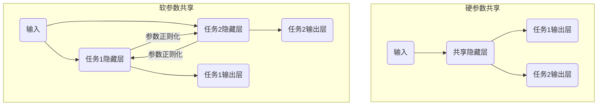

# Multi-Task Learning原理与代码实例讲解

## 1. 背景介绍
### 1.1  问题的由来
在现实世界中,我们经常需要同时解决多个相关的任务。例如,在自然语言处理领域,我们可能需要同时进行词性标注、命名实体识别和语义角色标注等任务。传统的机器学习方法通常是为每个任务单独训练一个模型,这种方法存在以下问题:

1. 忽略了任务之间的相关性,没有利用任务之间的共享信息。
2. 需要训练多个模型,训练成本高,推理速度慢。
3. 每个模型都需要大量的标注数据,数据收集和标注成本高。

为了解决这些问题,Multi-Task Learning(多任务学习)应运而生。

### 1.2  研究现状 
Multi-Task Learning(MTL)由Caruana等人于1997年首次提出,核心思想是通过学习多个相关任务,利用任务之间的相关性,来提高模型的泛化性能。近年来,随着深度学习的发展,MTL得到了广泛的应用,并取得了显著的效果。

目前MTL主要有两类方法:

1. 硬参数共享:多个任务共享部分网络参数,如共享隐藏层。代表工作有Sluice Networks等。

2. 软参数共享:每个任务有独立的参数,通过正则化项来鼓励不同任务的参数相似。代表工作有Cross-stitch Networks等。

此外还有一些将硬参数共享和软参数共享思想结合的工作,如MMoE等。

### 1.3  研究意义
MTL通过学习多个相关任务,可以显著提高模型性能,降低训练和推理成本,减少对标注数据的需求。具有重要的理论和实践意义:

1. 理论意义:MTL是迁移学习的一种形式,研究MTL有助于探索不同任务之间的相关性,促进迁移学习理论的发展。

2. 实践意义:MTL可以广泛应用于计算机视觉、自然语言处理、语音识别、推荐系统等领域,通过学习多个相关任务,大幅提升模型性能,降低开发和部署成本。

### 1.4  本文结构
本文将全面介绍MTL的原理和代码实现。内容安排如下:

1. 介绍MTL的核心概念与不同任务之间的关系
2. 详细讲解MTL的核心算法原理和具体操作步骤
3. 介绍MTL常用的数学模型和公式,并举例说明
4. 给出基于Pytorch的MTL代码实例,并详细解释
5. 讨论MTL的实际应用场景
6. 推荐MTL相关的工具和学习资源
7. 总结MTL的研究现状,并展望未来发展趋势和面临的挑战
8. 附录:常见问题解答

## 2. 核心概念与联系
MTL的核心概念是通过学习多个相关任务,利用任务之间的相关性,来提高模型的泛化性能。这里的关键是"相关性",如果任务之间没有相关性,则无法通过MTL获得性能提升。

那么如何刻画任务之间的相关性呢?一般来说,如果两个任务满足以下条件之一,则称它们是相关的:

1. 任务的输入数据分布相似
2. 任务的输出标签空间相似
3. 任务需要提取相似的特征
4. 任务需要类似的推理过程

例如,在自然语言处理中,词性标注和命名实体识别两个任务,它们的输入都是文本,输出都是单词的标签,需要提取单词和上下文的特征,因此是相关任务,可以用MTL联合学习。

从模型的角度看,MTL通过让多个任务共享部分网络参数,来实现参数级别的迁移学习。共享的参数负责提取通用的特征表示,每个任务再在此基础上用独立的参数进行任务特定的预测。下图展示了硬参数共享和软参数共享两种MTL结构:



可以看出,MTL通过共享参数的方式,将不同任务的知识转移到同一个模型中,实现了参数和知识的复用。

## 3. 核心算法原理 & 具体操作步骤
### 3.1  算法原理概述
MTL可以看作是一个多目标优化问题,每个任务对应一个目标函数,模型参数的学习过程就是去最小化所有任务的目标函数加权和:

$$
\mathcal{L}(\theta_s,\theta_1,\ldots,\theta_T)=\sum_{i=1}^T \lambda_i \mathcal{L}_i(\theta_s,\theta_i)
$$

其中 $\theta_s$ 表示共享参数,$\theta_i$ 表示任务 $i$ 的独立参数,$\mathcal{L}_i$ 表示任务 $i$ 的损失函数,$\lambda_i$ 为任务权重系数。

模型训练时,共享参数 $\theta_s$ 从所有任务中学习知识,独立参数 $\theta_i$ 只从对应任务学习。推理时,只需前向传播一次,即可同时得到所有任务的输出。

### 3.2  算法步骤详解
基于上述原理,MTL的训练过程可分为以下步骤:

1. 定义多任务模型结构,确定共享层和独立层
2. 准备每个任务的训练数据,构建数据加载器
3. 定义每个任务的损失函数,设置任务权重
4. 在每个训练步骤:
    - 从数据加载器采样一个批次的多任务数据 
    - 前向传播计算每个任务的输出和损失
    - 反向传播计算共享参数和独立参数的梯度
    - 梯度下降更新所有参数
5. 迭代进行步骤4,直到模型收敛
6. 在测试集上评估多任务模型的性能

可以看出,MTL的训练过程与单任务训练非常相似,主要区别在于前向传播和反向传播需要同时处理多个任务的数据和梯度。

### 3.3  算法优缺点
MTL算法的主要优点有:

1. 通过学习多个相关任务,可以提高模型的泛化性能
2. 共享参数可以减少模型总参数量,降低过拟合风险
3. 一次前向传播即可完成多个任务,提高了推理效率
4. 多任务数据的复用,缓解了标注数据稀缺的问题

但MTL也存在一些局限性:

1. 任务之间必须存在一定的相关性,否则会导致负迁移
2. 超参数(如任务权重)选择困难,需要反复调试
3. 任务难度差异大时,容易出现训练不平衡的问题
4. 模型结构设计需要针对具体任务,缺乏通用性

### 3.4  算法应用领域
MTL算法可以应用于多个领域,包括:

- 计算机视觉:图像分类、物体检测、语义分割等
- 自然语言处理:词性标注、命名实体识别、语义角色标注等 
- 语音识别:声学模型、语言模型、关键词检测等
- 推荐系统:评分预测、点击预测、转化预测等

## 4. 数学模型和公式 & 详细讲解 & 举例说明
### 4.1  数学模型构建
我们考虑一个包含 $T$ 个任务的MTL问题,任务 $t$ 的训练数据为 $\mathcal{D}_t=\{(x_i^t,y_i^t)\}_{i=1}^{N_t}$,其中 $x_i^t$ 为输入,$y_i^t$ 为标签。

定义任务 $t$ 的模型为 $f_t(x;\theta_s,\theta_t)$,其中 $\theta_s$ 为共享参数,$\theta_t$ 为独立参数。$f_t$ 通常基于神经网络实现。

任务 $t$ 的损失函数定义为:

$$
\mathcal{L}_t(\theta_s,\theta_t)=\frac{1}{N_t}\sum_{i=1}^{N_t}\ell(f_t(x_i^t;\theta_s,\theta_t),y_i^t)
$$

其中 $\ell(\cdot)$ 为样本损失函数,如交叉熵、均方误差等。

MTL的目标函数即所有任务损失的加权和:

$$
\mathcal{L}(\theta_s,\theta_1,\ldots,\theta_T)=\sum_{t=1}^T \lambda_t \mathcal{L}_t(\theta_s,\theta_t)
$$

其中 $\lambda_t$ 为任务权重系数,通常通过交叉验证选择。

### 4.2  公式推导过程
模型参数 $\theta_s,\theta_1,\ldots,\theta_T$ 可通过梯度下降算法学习,以最小化目标函数 $\mathcal{L}$。

根据链式法则,共享参数 $\theta_s$ 的梯度为:

$$
\nabla_{\theta_s}\mathcal{L}=\sum_{t=1}^T \lambda_t \nabla_{\theta_s}\mathcal{L}_t
$$

独立参数 $\theta_t$ 的梯度为:

$$
\nabla_{\theta_t}\mathcal{L}=\lambda_t \nabla_{\theta_t}\mathcal{L}_t
$$

梯度下降更新公式为($\alpha$ 为学习率):

$$
\begin{aligned}
\theta_s &\leftarrow \theta_s - \alpha\nabla_{\theta_s}\mathcal{L} \\
\theta_t &\leftarrow \theta_t - \alpha\nabla_{\theta_t}\mathcal{L}, \quad t=1,\ldots,T
\end{aligned}
$$

### 4.3  案例分析与讲解
下面我们以一个简单的两任务MTL问题为例,说明模型构建和训练过程。

考虑两个回归任务,任务1的目标是预测房价,任务2的目标是预测房龄。两个任务的输入特征都是房屋的面积、位置等信息。

我们构建一个共享底层的神经网络,顶层分别连接任务特定的输出层:

```python
class MTLNet(nn.Module):
    def __init__(self):
        super().__init__()
        self.shared_layer = nn.Sequential(
            nn.Linear(10, 32), 
            nn.ReLU(),
            nn.Linear(32, 16),
            nn.ReLU() 
        )
        self.task1_layer = nn.Linear(16, 1)
        self.task2_layer = nn.Linear(16, 1)
        
    def forward(self, x):
        h = self.shared_layer(x)
        y1 = self.task1_layer(h)
        y2 = self.task2_layer(h)
        return y1, y2
```

定义任务的损失函数为均方误差(MSE),任务权重分别为0.6和0.4:

```python
criterion1 = nn.MSELoss()
criterion2 = nn.MSELoss()
lambda1 = 0.6 
lambda2 = 0.4
```

在每个训练步骤,分别计算两个任务的损失,并加权求和作为总损失:

```python
y1_pred, y2_pred = model(x)
loss1 = criterion1(y1_pred, y1_true) 
loss2 = criterion2(y2_pred, y2_true)
loss = lambda1 * loss1 + lambda2 * loss2
```

然后进行梯度反向传播和参数更新:

```python
optim.zero_grad()
loss.backward()
optim.step()
```

经过多轮迭代,模型即可学会同时预测房价和房龄。

### 4.4  常见问题解答
**Q:** 如何选择MTL的任务权重?

**A:** 任务权重的选择需要根据具体问题,通过交叉验证等方法调优。一般来说,主要任务的权重应该大于辅助任务。如果任务难度相当,可以使用均等权重。

**Q:** 什么样的任务适合用MTL框架学习?

**A:** 相关性强的任务更适合MTL。如果两个任务的输入数据分布、特征表示、推理过程等非常相