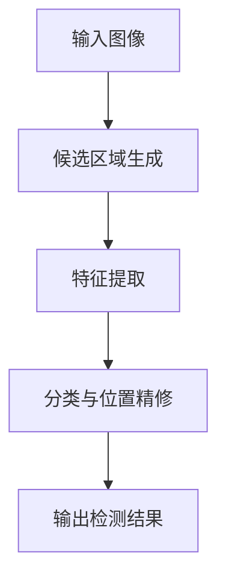
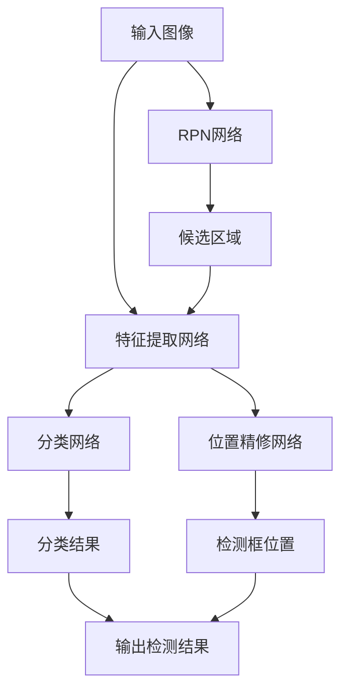
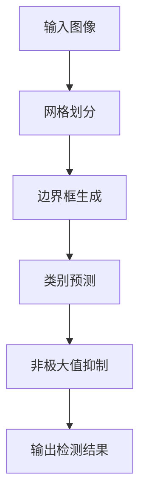

# Object Detection 原理与代码实战案例讲解

## 1. 背景介绍

### 1.1 问题的由来

在计算机视觉领域中,对象检测(Object Detection)是一个基础且极具挑战性的任务。它旨在自动定位图像或视频中的目标对象,并将它们与背景区分开来。对象检测广泛应用于安防监控、自动驾驶、机器人视觉、人脸识别等领域,是实现智能系统感知环境的关键技术。

随着深度学习技术的不断发展,基于深度卷积神经网络(CNN)的对象检测算法取得了长足进步,在准确率和速度上都有了显著提升。但同时,对象检测任务也面临着诸多挑战,如目标尺度变化、遮挡、视角变化等,这些问题都会影响检测的准确性。因此,设计出更加精确、鲁棒的对象检测算法,仍然是当前研究的重点和难点。

### 1.2 研究现状

传统的对象检测方法主要基于手工设计的特征提取和分类器,如Viola-Jones、HOG+SVM等。这些方法需要大量的人工参与,且泛化能力有限。

近年来,benefiting from大数据和强大的并行计算能力,基于深度学习的对象检测算法取得了突破性进展,主流方法可分为两大类:

1. **两阶段检测器**:代表算法有R-CNN系列(R-CNN、Fast R-CNN、Faster R-CNN等)。这类方法先生成候选区域,再对每个候选区域进行分类和精修,精度较高但速度较慢。

2. **单阶段检测器**:代表算法有YOLO系列、SSD等。这类方法将候选框的生成和分类合并为一个统一的网络,速度更快但精度略低。

目前,YOLO系列、RetinaNet等单阶段检测器在实时性和精度之间取得了较好的平衡,被广泛应用。但对小目标、密集目标的检测仍是一大挑战。

### 1.3 研究意义

对象检测技术是实现计算机视觉、智能系统等领域的基础,具有重要的理论意义和应用价值:

- **理论意义**:对象检测是计算机视觉的核心问题之一,涉及图像处理、模式识别、机器学习等多个领域,研究有助于推动相关理论的发展。
- **应用价值**:对象检测在安防监控、自动驾驶、人机交互等领域有广泛应用前景,能够极大提高系统的智能化水平。

因此,深入研究对象检测的原理及算法实现,对于推动人工智能技术的发展、促进智能系统的应用都具有重要意义。

### 1.4 本文结构  

本文将全面介绍对象检测的核心原理、主流算法、数学模型,并通过代码实例讲解具体的实现细节,同时分析实际应用场景和未来发展趋势。文章主要内容安排如下:

- 核心概念与联系
- 核心算法原理及具体操作步骤 
- 数学模型和公式详细讲解与案例分析
- 项目实践:代码实例和详细解释说明
- 实际应用场景及未来展望
- 工具和资源推荐
- 总结:未来发展趋势与挑战
- 附录:常见问题与解答

## 2. 核心概念与联系

对象检测是计算机视觉中的一个基础任务,其目标是从图像或视频中找出感兴趣的目标实例,并给出它们的精确位置。对象检测技术与图像分类、目标跟踪、语义分割等任务紧密相关:

- **图像分类(Image Classification)**: 判断一个图像属于哪个类别,是对象检测的基础。
- **目标跟踪(Object Tracking)**: 在视频序列中持续跟踪运动目标,需要先检测出目标。
- **语义分割(Semantic Segmentation)**: 对图像中的每个像素点进行分类,是对象检测的扩展。

对象检测的核心思路是:

1. 生成一组候选区域(Region Proposal)
2. 提取每个候选区域的特征  
3. 基于特征对候选区域进行分类和位置精修

下面用一个流程图直观展示对象检测的工作流程:

## 3. 核心算法原理及具体操作步骤

### 3.1 算法原理概述

对象检测算法可分为两大类:两阶段检测器和单阶段检测器。

**两阶段检测器**的核心思路是:先生成候选区域,再对每个候选区域进行分类和位置精修。代表算法有R-CNN系列(R-CNN、Fast R-CNN、Faster R-CNN等)。

**单阶段检测器**则将候选框生成和分类合并为一个统一的网络,端到端训练,速度更快。代表算法有YOLO系列、SSD等。

这两类算法各有优缺点,两阶段检测器精度更高,但速度较慢;单阶段检测器速度更快,但精度略低。我们分别介绍两种算法的核心原理。

### 3.2 算法步骤详解

#### 3.2.1 两阶段检测器

以Faster R-CNN为例,算法主要分为四个步骤:

1. **生成候选区域**

   使用Region Proposal Network(RPN)网络从图像中生成一组候选边界框。RPN是一个全卷积网络,可以高效地生成高质量的候选区域。

2. **特征提取** 

   将整个图像和生成的候选区域分别输入到共享卷积特征提取网络,提取出对应的特征图。

3. **分类** 

   将候选区域的特征输入到全连接层,判断该区域是否包含目标对象,如果包含则给出具体的类别。

4. **位置精修**

   同样使用全连接层对候选区域的位置进行精细修正,输出最终的检测框位置。

下面是Faster R-CNN的工作流程示意图:

#### 3.2.2 单阶段检测器

以YOLO(You Only Look Once)系列算法为例,算法步骤如下:

1. **网格划分**

   将输入图像划分为S×S个网格单元,每个单元负责预测该区域内的目标对象。

2. **边界框生成**

   每个网格单元会预测B个边界框,每个边界框包含5个预测值:(x,y,w,h,confidence),分别表示中心坐标、宽高和置信度。

3. **类别预测**

   同时,每个边界框还会预测C个条件类别概率,用于判断边界框内是否存在目标对象及其类别。

4. **非极大值抑制**

   使用非极大值抑制(NMS)算法去除重叠的冗余检测框,得到最终的检测结果。

YOLO算法的核心在于将检测任务转化为一个回归问题,端到端地预测目标的位置和类别,计算量较小,速度很快。下图展示了YOLO的工作原理:

### 3.3 算法优缺点

**两阶段检测器**:

- 优点:精度较高,对小目标、密集目标的检测效果较好。
- 缺点:速度较慢,不适合实时应用场景。

**单阶段检测器**:

- 优点:速度快,可满足实时性需求。
- 缺点:对小目标、密集目标的检测精度较低。

### 3.4 算法应用领域

对象检测算法在计算机视觉和人工智能领域有着广泛的应用,主要包括:

- **安防监控**: 用于智能视频分析,实现人员、车辆、违规行为的自动检测。
- **自动驾驶**: 对道路上的车辆、行人、障碍物等进行实时检测,为决策规划提供关键信息。
- **机器人视觉**: 用于机器人识别和抓取目标物体。
- **人脸识别**: 从图像或视频中检测和识别人脸。
- **无人机航拍**: 用于目标搜索、跟踪和识别。
- **医疗影像分析**: 辅助医生检测病灶、肿瘤等。
- **虚拟现实(VR)和增强现实(AR)**: 实时检测和跟踪目标对象,实现虚实融合。

总之,对象检测是实现智能系统感知环境的基础和关键,在各个领域都有广阔的应用前景。

## 4. 数学模型和公式及详细讲解与举例说明

### 4.1 数学模型构建

对于对象检测任务,我们可以将其建模为一个条件概率估计问题:给定一个图像$I$,我们需要估计每个可能的目标对象$o_i$的条件概率$P(o_i|I)$,即目标对象在图像中出现的概率。

具体来说,对于每个目标对象$o_i$,我们需要预测其类别$c_i$、位置$(x_i, y_i, w_i, h_i)$以及置信度$p_i$。因此,目标检测问题可以表示为:

$$P(c_i, x_i, y_i, w_i, h_i, p_i|I)$$

根据贝叶斯公式,上式可以改写为:

$$P(c_i, x_i, y_i, w_i, h_i, p_i|I) = \frac{P(I|c_i, x_i, y_i, w_i, h_i, p_i)P(c_i, x_i, y_i, w_i, h_i, p_i)}{P(I)}$$

其中:
- $P(I|c_i, x_i, y_i, w_i, h_i, p_i)$是似然项,表示在给定目标对象的情况下,观测到图像$I$的概率。
- $P(c_i, x_i, y_i, w_i, h_i, p_i)$是先验项,表示目标对象出现的先验概率。
- $P(I)$是证据项,是一个归一化常数。

由于直接对联合概率$P(c_i, x_i, y_i, w_i, h_i, p_i|I)$建模比较困难,一种常见的做法是假设目标对象的类别和位置是条件独立的,即:

$$P(c_i, x_i, y_i, w_i, h_i, p_i|I) = P(c_i|I)P(x_i, y_i, w_i, h_i, p_i|I)$$

这样,我们只需要分别对目标类别和位置建模即可。

### 4.2 公式推导过程

接下来,我们推导出目标检测算法的损失函数(Loss Function),用于优化网络参数。

首先,对于类别预测,我们可以使用交叉熵损失:

$$\mathcal{L}_{cls}(c_i, \hat{c}_i) = -\log P(\hat{c}_i|I)$$

其中$\hat{c}_i$是网络预测的类别。

对于位置预测,常用的是回归损失,例如平滑$L_1$损失:

$$\mathcal{L}_{reg}(t_i, \hat{t}_i) = \sum_i \text{smooth}_{L_1}(t_i - \hat{t}_i)$$

其中$t_i$是真实边界框的参数,如$(x, y, w, h)$;$\hat{t}_i$是网络预测的边界框参数。

最后,我们需要一个置信度损失,用于判断预测框内是否存在目标对象:

$$\mathcal{L}_{conf}(p_i, \hat{p}_i) = -p_i \log(\hat{p}_i) - (1 - p_i)\log(1 - \hat{p}_i)$$

其中$p_i$是真实置信度(0或1),$\hat{p}_i$是网络预测的置信度。

综合以上三个损失项,我们可以得到对象检测算法的总体损失函数:

$$\mathcal{L} =