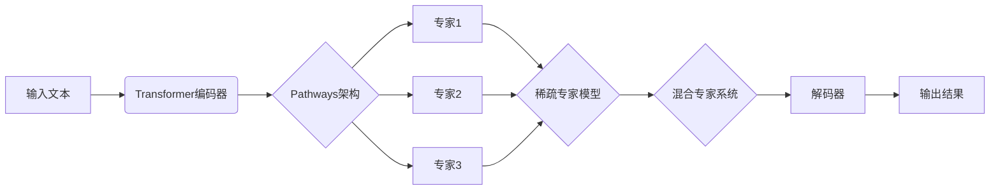

# PaLM原理与代码实例讲解

## 1. 背景介绍
### 1.1  问题的由来
近年来，随着深度学习技术的快速发展，大规模语言模型（Large Language Models, LLMs）在自然语言处理领域取得了突破性的进展。其中，谷歌的Pathways Language Model (PaLM)以其强大的性能和创新的架构设计引起了广泛关注。PaLM展示了在各种自然语言任务上的卓越表现，如问答、对话、文本生成等，为人工智能走向通用智能迈出了重要一步。

### 1.2  研究现状
目前，业界主流的大规模语言模型包括OpenAI的GPT系列、谷歌的BERT、T5以及最新的PaLM等。这些模型都采用了Transformer为基础的神经网络架构，并在海量文本数据上进行预训练，学习到了丰富的语言知识和语义表示。PaLM更进一步，引入了一些创新的技术，如Pathways架构、稀疏专家模型等，进一步提升了模型性能和泛化能力。

### 1.3  研究意义
深入研究和理解PaLM的原理与实现，对于推动自然语言处理技术的发展具有重要意义。一方面，PaLM为构建更加强大、高效的语言模型提供了新的思路和方法；另一方面，PaLM的成功经验也为其他人工智能领域，如计算机视觉、语音识别等，应用类似的技术路线指明了方向。同时，探索PaLM在实际应用场景中的潜力，有助于开发出更加智能、人性化的语言交互系统，造福人类社会。

### 1.4  本文结构
本文将全面介绍PaLM的原理与代码实现。首先，我们将介绍PaLM中的一些核心概念与技术要点。然后，重点剖析PaLM的核心算法原理，给出详细的操作步骤。接着，我们将从数学角度对PaLM的关键模型和公式进行推导与讲解。在实践部分，我们将给出PaLM的代码实例，并进行细致的解读与分析。此外，我们还将讨论PaLM的实际应用场景，并推荐一些学习PaLM的资源与工具。最后，本文将总结PaLM的研究现状，展望其未来发展趋势和面临的挑战。

## 2. 核心概念与联系

PaLM的核心概念包括：

- **Transformer架构**：PaLM采用了Transformer的编码器-解码器架构，使用自注意力机制来建模文本序列中的长距离依赖关系。
- **预训练**：PaLM在大规模无标注文本语料上进行自监督预训练，通过掩码语言建模等任务学习通用的语言表示。  
- **Pathways架构**：PaLM引入了Pathways架构，将模型划分为多个独立的专家子模型，每个专家负责处理不同的语言模式和任务。
- **稀疏专家模型**：PaLM采用了稀疏专家模型，即只有一部分专家子模型在每个样本上被激活，以提高计算效率和可扩展性。
- **混合专家系统**：PaLM使用混合专家系统来组合不同专家的输出，根据任务需求动态调整专家的权重和选择。

下图展示了PaLM的整体架构和各个核心概念之间的联系：

## 3. 核心算法原理 & 具体操作步骤
### 3.1  算法原理概述
PaLM的核心算法可以概括为以下几个关键步骤：

1. 将输入文本通过Transformer编码器映射为高维语义表示。
2. 使用Pathways架构，将编码后的表示分发给不同的专家子模型。 
3. 每个专家独立处理收到的语义表示，捕捉不同的语言模式和知识。
4. 通过稀疏专家模型，动态选择一部分专家参与计算，以提高效率。
5. 混合专家系统综合不同专家的输出，得到最终的语义表示。
6. 解码器根据语义表示生成目标文本序列。

### 3.2  算法步骤详解

**步骤1：Transformer编码**

首先，将输入文本 $X = (x_1, x_2, ..., x_n)$ 通过Transformer的编码器进行编码。编码器由多个自注意力层和前馈神经网络层组成，可以建模文本中的长距离依赖关系，将输入文本映射为高维语义表示 $H = (h_1, h_2, ..., h_n)$。

**步骤2：Pathways分发**

编码后的语义表示 $H$ 被送入Pathways架构中，均匀地分发给 $m$ 个专家子模型 $E = (E_1, E_2, ..., E_m)$。每个专家 $E_i$ 接收到一个子表示 $H_i$。

**步骤3：专家独立处理**

每个专家子模型 $E_i$ 独立地处理收到的子表示 $H_i$，利用自身的参数和结构，捕捉不同的语言模式和知识。专家内部可以采用不同的架构，如Transformer、前馈网络等。

$$E_i(H_i) = f_i(H_i; \theta_i)$$

其中，$f_i$ 表示第 $i$ 个专家的计算函数，$\theta_i$ 为其参数。

**步骤4：稀疏专家选择**

为了提高计算效率，PaLM引入了稀疏专家模型。对于每个输入样本，只有一部分专家会被选中并激活，参与后续的计算。选择专家的方式可以基于输入的相关性、专家的容量等因素。

设 $g(H)$ 为专家选择函数，$S$ 为选中的专家子集，则有：

$$S = g(H), \quad S \subseteq \{1,2,...,m\}$$

**步骤5：混合专家输出**

选中的专家子模型 $\{E_i | i \in S\}$ 的输出将通过混合专家系统进行综合。常见的混合方式包括加权平均、注意力机制等。混合后的语义表示 $\tilde{H}$ 将作为最终的编码结果。

$$\tilde{H} = \sum_{i \in S} w_i \cdot E_i(H_i)$$

其中，$w_i$ 为第 $i$ 个专家的混合权重。

**步骤6：解码生成**

最后，将混合后的语义表示 $\tilde{H}$ 送入Transformer的解码器中，通过自回归的方式生成目标文本序列 $Y = (y_1, y_2, ..., y_m)$。解码器在每个时间步根据之前生成的文本和编码表示，预测下一个词的概率分布。

$$P(Y|X) = \prod_{t=1}^m P(y_t | y_{<t}, \tilde{H})$$

生成过程通常使用束搜索、贪心搜索等策略，以得到最优的输出序列。

### 3.3  算法优缺点

PaLM算法的主要优点包括：

- 引入Pathways架构和稀疏专家模型，提高了模型的表达能力和计算效率。
- 通过预训练学习通用语言知识，可以轻松适应各种下游任务。
- 在多个自然语言任务上取得了sota的性能，展现了强大的语言理解和生成能力。

但PaLM也存在一些局限性：

- 训练和推理过程计算开销大，对算力和资源要求较高。  
- 模型参数量巨大，存在一定的过拟合风险，泛化性有待进一步验证。
- 对于一些复杂推理任务，如常识问答等，还有待进一步提升性能。

### 3.4  算法应用领域

PaLM算法可以应用于各种自然语言处理任务，包括但不限于：

- 问答系统：根据给定问题生成准确、连贯的答案。
- 对话系统：实现多轮、开放域的人机对话交互。  
- 文本生成：如写作助手、内容创作等，生成流畅、富有创意的文本。
- 语言翻译：在机器翻译任务上取得优异表现。
- 文本分类：对文本进行主题、情感等分类。
- 信息抽取：从非结构化文本中抽取结构化信息，如实体、关系等。

## 4. 数学模型和公式 & 详细讲解 & 举例说明
### 4.1  数学模型构建
PaLM的数学模型可以用如下的公式来表示：

$$\tilde{H} = \sum_{i \in S} w_i \cdot f_i(H_i; \theta_i)$$

其中，$\tilde{H}$ 表示最终的语义表示，$S$ 为选中的专家子集，$w_i$ 为第 $i$ 个专家的混合权重，$f_i$ 为第 $i$ 个专家的计算函数，$H_i$ 为第 $i$ 个专家接收到的子表示，$\theta_i$ 为第 $i$ 个专家的参数。

这个模型综合了Pathways架构、稀疏专家模型和混合专家系统的思想，通过多个专家的协同工作，实现了强大的语言理解和生成能力。

### 4.2  公式推导过程

我们对PaLM的核心公式进行详细推导。首先，考虑Transformer编码器对输入文本 $X$ 的编码过程：

$$H = Encoder(X)$$

然后，编码后的语义表示 $H$ 被分发给 $m$ 个专家子模型：

$$H_i = Dispatch(H), \quad i=1,2,...,m$$

每个专家独立地处理收到的子表示：

$$E_i(H_i) = f_i(H_i; \theta_i), \quad i=1,2,...,m$$

接着，通过稀疏专家模型选择一部分专家参与后续计算：

$$S = g(H), \quad S \subseteq \{1,2,...,m\}$$

选中的专家输出通过混合专家系统进行综合：

$$\tilde{H} = \sum_{i \in S} w_i \cdot E_i(H_i)$$

最终，解码器根据混合后的语义表示 $\tilde{H}$ 生成目标文本序列 $Y$：

$$P(Y|X) = \prod_{t=1}^m P(y_t | y_{<t}, \tilde{H})$$

综合起来，PaLM的端到端数学模型可以表示为：

$$P(Y|X) = \prod_{t=1}^m P(y_t | y_{<t}, \sum_{i \in g(Encoder(X))} w_i \cdot f_i(Dispatch(Encoder(X))_i; \theta_i))$$

### 4.3  案例分析与讲解

下面我们以一个具体的例子来说明PaLM的工作流程。假设输入文本 $X$ 为："What is the capital of France?"

1. 首先，$X$ 通过Transformer编码器得到语义表示 $H$。

2. 然后，$H$ 被均匀分发给 $m=4$ 个专家，每个专家接收到一个子表示 $H_i$。

3. 专家 $E_1$ 到 $E_4$ 分别处理自己收到的子表示。例如，$E_1$ 可能更擅长处理地理位置相关的查询，给出较高的相关性分数。

4. 通过稀疏专家选择，假设 $E_1$ 和 $E_3$ 被选中参与后续的计算，即 $S=\{1,3\}$。

5. 混合专家系统对 $E_1$ 和 $E_3$ 的输出进行加权平均，得到最终的语义表示 $\tilde{H}$。

6. 解码器以 $\tilde{H}$ 为条件，生成目标答案序列 $Y$："The capital of France is Paris."

通过这个例子，我们可以看到PaLM如何利用多个专家的协同工作，准确地理解问题并生成答案。

### 4.4  常见问题解答

**Q1: PaLM中的专家子模型是如何训练的？**

A1: PaLM采用了两阶段训练的方式。首先，在大规模无标注语料上进行预训练，学习通用的语言知识；