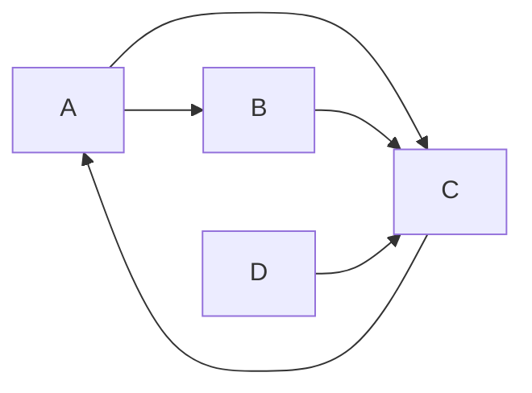

# PageRank 原理与代码实例讲解

## 1. 背景介绍
### 1.1 问题的由来
在互联网时代,搜索引擎已经成为人们获取信息的主要途径。然而,面对海量的网页数据,如何从中快速、准确地找到用户想要的信息,是每一个搜索引擎都必须解决的问题。早期的搜索引擎主要依靠关键词匹配的方式来检索网页,但这种方法往往会返回大量无关的结果,用户体验较差。直到1998年,斯坦福大学的两位博士生 Sergey Brin 和 Larry Page 提出了革命性的 PageRank 算法,奠定了现代搜索引擎的基础。

### 1.2 研究现状
PageRank 算法的提出,使得搜索引擎能够根据网页的重要性对搜索结果进行排序,大大提高了搜索的准确率。目前,PageRank 已成为搜索引擎排序的核心算法之一,被广泛应用于 Google、Baidu 等主流搜索引擎中。此外,PageRank 的思想也被引入到社交网络、推荐系统等领域,用于挖掘关键节点和热门信息。

### 1.3 研究意义
深入研究和理解 PageRank 算法,对于优化搜索引擎、提升用户体验具有重要意义。通过 PageRank,我们可以更好地理解网页之间的链接关系,挖掘出高质量、高权威的网页。同时,PageRank 的思想也为其他领域的关键节点挖掘提供了新的思路。因此,PageRank 不仅是搜索引擎领域的重要算法,也是数据挖掘、图论等领域的研究热点。

### 1.4 本文结构
本文将从以下几个方面对 PageRank 算法进行详细讲解：首先介绍 PageRank 的核心概念与基本原理；然后通过数学模型和公式推导,深入分析 PageRank 的计算过程；接着给出 PageRank 的代码实现,并解释其中的关键步骤；最后,讨论 PageRank 的实际应用场景和未来发展趋势。通过本文的学习,读者将全面掌握 PageRank 的原理和实现,并能够将其应用到实际项目中。

## 2. 核心概念与联系
PageRank 的核心思想是通过网页之间的链接关系,计算每个网页的重要性得分。一个网页如果被很多其他网页链接到,说明它是一个"重要"的网页,它的 PageRank 值就会较高；反之,如果一个网页没有其他网页的链接,它的 PageRank 值就会较低。同时,PageRank 还考虑了链接网页的重要性。重要网页的"投票"比不重要网页的"投票"更有价值。因此,被多个高 PageRank 值的网页链接到,要比被多个低 PageRank 值的网页链接到更有利。

PageRank 的计算过程可以看作是一个迭代的过程。初始时,假设所有网页的 PageRank 值都相同。然后,根据链接关系和当前的 PageRank 值,计算下一轮的 PageRank 值。经过多轮迭代后,每个网页的 PageRank 值会收敛到一个稳定值,即为最终的 PageRank 值。

总的来说,PageRank 通过链接关系,将网页之间的"推荐"和"投票"量化为一个 PageRank 值,并通过迭代计算的方式得到每个网页的最终得分,从而实现了对网页重要性的评估。

## 3. 核心算法原理 & 具体操作步骤
### 3.1 算法原理概述
PageRank 算法的基本思路是,将整个网络看作一个有向图,每个网页是图中的一个节点,网页之间的链接是有向边。初始时,假设每个网页的 PageRank 值相同,都为 1/N(N 为网页总数)。然后,通过迭代计算的方式,根据每个网页的链接关系,更新其 PageRank 值。

具体来说,PageRank 值的计算公式如下:

$$
PR(p_i) = \frac{1-d}{N} + d \sum_{p_j \in M(p_i)} \frac{PR(p_j)}{L(p_j)}
$$

其中,$PR(p_i)$ 表示网页 $p_i$ 的 PageRank 值,$N$ 为网页总数,$d$ 为阻尼因子(一般取0.85),M(pi) 为链接到网页 $p_i$ 的网页集合,$L(p_j)$ 为网页 $p_j$ 的出链数。

### 3.2 算法步骤详解
根据上述公式,PageRank 的计算步骤如下:

1. 初始化:假设每个网页的初始 PageRank 值为 1/N。

2. 迭代计算:
   - 对每个网页 $p_i$,计算由其他网页投票产生的 PageRank 值:
     $$
     \sum_{p_j \in M(p_i)} \frac{PR(p_j)}{L(p_j)}
     $$
   - 对每个网页 $p_i$,计算随机浏览产生的 PageRank 值:
     $$
     \frac{1-d}{N}
     $$
   - 将两部分的 PageRank 值相加,得到网页 $p_i$ 的新 PageRank 值。

3. 迭代多轮,直到每个网页的 PageRank 值收敛。

4. 将计算得到的 PageRank 值进行归一化处理,得到最终结果。

### 3.3 算法优缺点
PageRank 算法的优点在于:
- 能够客观、公正地评估网页的重要性,不易被人为操纵。
- 计算简单,易于实现。
- 对网页的评估更加全面,不仅考虑了链接数量,还考虑了链接质量。

但 PageRank 算法也存在一些局限性:
- 对新网页和孤立网页的评估效果较差。由于这些网页没有其他网页的链接,其 PageRank 值往往较低。
- 容易受到链接作弊的影响。一些网站通过刷链接的方式,试图提高自己的 PageRank 值。
- 计算量较大,对于大规模网络,需要较长的计算时间。

### 3.4 算法应用领域 
PageRank 最初是为了解决网页排序的问题而提出的,但其思想可以应用到很多其他领域:
- 社交网络分析:通过 PageRank 思想,可以发现社交网络中的关键节点和影响力节点。
- 文本挖掘:将文本看作一个词与词之间的有向图,通过类似 PageRank 的计算,可以得到关键词和核心句子。
- 推荐系统:通过 PageRank,可以对用户和物品的重要性进行评估,从而给出更加准确的推荐。
- 网络影响力分析:在舆情分析、病毒营销等领域,PageRank 可以用来发现网络中的关键节点和传播路径。

## 4. 数学模型和公式 & 详细讲解 & 举例说明
### 4.1 数学模型构建
我们可以将网页之间的链接关系表示为一个矩阵 $M$,称为链接矩阵。其中,$M_{ij}$ 表示网页 $j$ 是否链接到网页 $i$。如果有链接,则 $M_{ij}=1$,否则 $M_{ij}=0$。

同时,我们用向量 $R$ 表示每个网页的 PageRank 值,初始时 $R$ 的每个分量都为 $1/N$。

根据 PageRank 的计算公式,我们可以将其写成矩阵的形式:

$$
R = (1-d) \frac{1}{N} I + d M^T D^{-1} R
$$

其中,$I$ 为单位矩阵,$D$ 为对角矩阵,对角线上的元素为每个网页的出链数。

### 4.2 公式推导过程
为了求解上述方程,我们可以将其变形为:

$$
R = (1-d) \frac{1}{N} (I - d M^T D^{-1})^{-1}
$$

这样,问题就转化为求解一个线性方程组。我们可以使用 Jacobi 迭代法或 Gauss-Seidel 迭代法等数值计算方法求解。

具体来说,Jacobi 迭代法的计算公式为:

$$
R^{(k+1)} = (1-d) \frac{1}{N} I + d M^T D^{-1} R^{(k)}
$$

其中,$R^{(k)}$ 表示第 $k$ 轮迭代的 PageRank 值。

### 4.3 案例分析与讲解
下面我们以一个简单的例子来说明 PageRank 的计算过程。假设有4个网页 A、B、C、D,它们之间的链接关系如下图所示:



我们可以得到链接矩阵 $M$:

$$
M = \begin{bmatrix}
0 & 0 & 1 & 0\\
1 & 0 & 0 & 0\\
1 & 1 & 0 & 1\\
0 & 0 & 1 & 0
\end{bmatrix}
$$

初始时,每个网页的 PageRank 值为 $1/4$,即:

$$
R^{(0)} = \begin{bmatrix}
0.25\\
0.25\\
0.25\\
0.25
\end{bmatrix}
$$

取 $d=0.85$,利用 Jacobi 迭代公式,我们可以计算出第一轮迭代后的 PageRank 值:

$$
R^{(1)} = 0.15 \begin{bmatrix}
0.25\\
0.25\\
0.25\\
0.25
\end{bmatrix} + 0.85 \begin{bmatrix}
0 & 1 & 1 & 0\\
0 & 0 & 1 & 0\\
1 & 0 & 0 & 1\\
0 & 0 & 1/3 & 0
\end{bmatrix} \begin{bmatrix}
0.25\\
0.25\\
0.25\\
0.25
\end{bmatrix} = \begin{bmatrix}
0.283\\
0.171\\
0.362\\
0.184
\end{bmatrix}
$$

重复迭代多次,PageRank 值最终会收敛到:

$$
R^{*} = \begin{bmatrix}
0.328\\
0.195\\
0.359\\
0.117
\end{bmatrix}
$$

从结果可以看出,网页 C 的 PageRank 值最高,其次是网页 A,网页 B 和 D 的 PageRank 值较低。这与它们在网络中的链接关系是一致的。

### 4.4 常见问题解答
Q:PageRank 值是否唯一?
A:理论上,只要网络结构不变,PageRank 值就是唯一的。但在实际计算中,由于数值误差的存在,不同的迭代方法可能得到略有不同的结果。但只要迭代次数足够多,结果就会非常接近。

Q:PageRank 能否处理死循环的问题?
A:PageRank 可以通过引入阻尼因子 $d$ 来解决死循环问题。$d$ 表示用户继续向下浏览的概率,引入阻尼因子后,即使存在死循环,也能保证 PageRank 值收敛。

Q:如何加快 PageRank 的计算?
A:可以考虑以下几种优化方法:
- 对稀疏矩阵进行压缩存储,减小空间开销。
- 采用 Gauss-Seidel 迭代等更快的迭代方法。
- 对 PageRank 值进行分块计算,减小每次迭代的计算量。
- 利用 MapReduce 等分布式计算框架,实现并行计算。

## 5. 项目实践：代码实例和详细解释说明
### 5.1 开发环境搭建
本项目使用 Python 实现 PageRank 算法,需要安装 Python 3.x 以及 NumPy、SciPy 等第三方库。可以使用 pip 进行安装:

```bash
pip install numpy scipy
```

### 5.2 源代码详细实现
下面是 PageRank 算法的 Python 实现:

```python
import numpy as np

def pagerank(M, eps=1.0e-8, d=0.85):
    N = M.shape[0]
    v = np.random.rand(N, 1)
    v = v / np.linalg.norm(v, 1)
    last_v = np.ones((N, 1), dtype=np.float32) * 100
    M_hat = (d * M + (1 - 