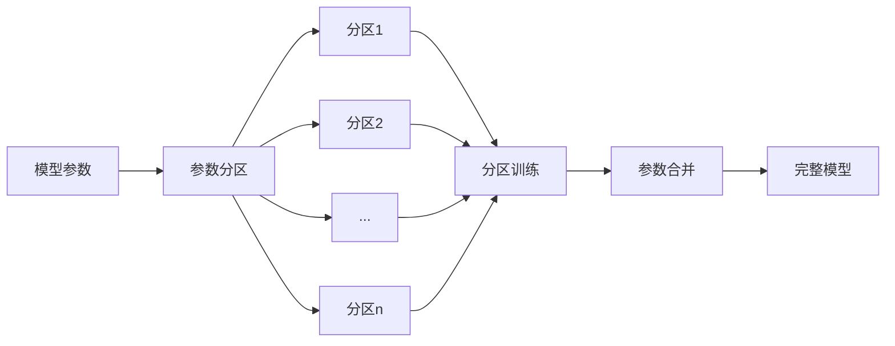

# Parti原理与代码实例讲解

## 1. 背景介绍
### 1.1 问题的由来
近年来，随着人工智能技术的飞速发展，大语言模型(LLM)在自然语言处理领域取得了突破性进展。然而，传统的LLM存在诸多局限性，如参数量巨大、训练成本高昂、推理速度慢等问题。为了突破这些瓶颈，业界亟需一种高效、轻量级的LLM训练方法。

### 1.2 研究现状 
目前，业界主流的LLM训练方法主要包括：
- GPT系列模型：如GPT-2、GPT-3等，采用Transformer架构，参数量巨大，训练成本高。
- BERT系列模型：如BERT、RoBERTa等，采用MLM预训练任务，但推理速度较慢。
- Mixture-of-Experts(MoE)：通过将模型划分为多个专家子模型，并根据输入动态选择子模型，提高训练和推理效率。但MoE的路由机制较为复杂。

### 1.3 研究意义
Parti作为一种新兴的LLM训练方法，通过将模型参数划分为多个独立的分区(Partition)，每个分区独立训练，最后再将各分区参数合并得到完整模型。这种分区训练的思想可以显著提升训练效率，降低资源消耗。深入研究Parti原理，对于推动LLM的技术进步具有重要意义。

### 1.4 本文结构
本文将围绕Parti原理展开深入探讨，内容涵盖Parti的核心概念、数学原理、代码实现、应用场景等方面。全文结构如下：

- 第2节：介绍Parti的核心概念与内在联系
- 第3节：详细阐述Parti算法原理与具体操作步骤
- 第4节：建立Parti的数学模型，给出关键公式推导与案例分析
- 第5节：提供Parti的代码实例，并逐行解读分析
- 第6节：探讨Parti在实际场景中的应用现状与未来展望
- 第7节：推荐Parti相关的学习资源、开发工具与文献资料
- 第8节：总结Parti的研究现状、发展趋势与面临的挑战
- 第9节：梳理Parti领域的常见问题，给出专业解答

## 2. 核心概念与联系
Parti的核心思想是将神经网络模型的参数矩阵划分为多个独立的子矩阵(即分区)，每个分区可以使用不同的硬件设备进行训练，从而实现并行化加速。相比传统的数据并行和模型并行，Parti采用了更细粒度的并行策略。

下面介绍Parti的几个关键概念：
- 参数分区(Parameter Partitioning)：将模型参数矩阵划分为多个互不相交的子矩阵，每个子矩阵称为一个分区。
- 分区训练(Partition Training)：每个参数分区独立进行训练，互不干扰。分区训练可以显著提升训练效率。
- 参数合并(Parameter Merging)：当所有分区训练完成后，将各分区的参数合并为完整的模型参数。
- 通信开销(Communication Overhead)：由于各分区间需要同步梯度信息，因此Parti需要考虑分区间通信带来的开销。

下图展示了Parti的总体架构：

Parti的核心概念环环相扣，缺一不可：首先需要对模型参数进行分区，然后各分区独立训练，最后再将分区参数合并得到完整模型。Parti的关键在于如何设计最优的分区方案，以在提升训练效率的同时，又能控制通信开销，保证模型性能。

## 3. 核心算法原理 & 具体操作步骤
### 3.1 算法原理概述
Parti算法可以分为三个主要步骤：
1. 参数分区：将模型参数矩阵划分为多个分区。常见的分区策略有行分区、列分区、块分区等。
2. 分区训练：每个分区使用单独的硬件设备进行训练，并行执行前向传播和反向传播。
3. 参数合并：所有分区训练完成后，将各分区参数合并为完整的模型参数。

### 3.2 算法步骤详解
下面以行分区为例，详细介绍Parti的具体操作步骤。

给定模型参数矩阵 $W \in \mathbb{R}^{m \times n}$，将其均匀划分为 $p$ 个行分区 $\{W_1, W_2, ..., W_p\}$，其中 $W_i \in \mathbb{R}^{\frac{m}{p} \times n}$。

对于第 $i$ 个分区 $W_i$，其前向传播过程为：

$$
\begin{aligned}
a_i &= W_i x \\
z_i &= f(a_i)
\end{aligned}
$$

其中 $x \in \mathbb{R}^{n}$ 为输入向量，$f$ 为激活函数。反向传播过程为：

$$
\begin{aligned}
\delta_i &= \frac{\partial L}{\partial z_i} \odot f'(a_i) \\
\frac{\partial L}{\partial W_i} &= \delta_i x^T
\end{aligned}
$$

其中 $L$ 为损失函数，$\odot$ 为 Hadamard 积。

各分区独立进行训练，并行计算梯度信息 $\frac{\partial L}{\partial W_i}$。当所有分区训练完成后，将梯度信息进行聚合：

$$
\frac{\partial L}{\partial W} = \sum_{i=1}^p \frac{\partial L}{\partial W_i}
$$

最后根据梯度下降法更新完整的模型参数：

$$
W \leftarrow W - \eta \frac{\partial L}{\partial W}
$$

其中 $\eta$ 为学习率。

以上就是Parti算法的核心步骤。通过将参数矩阵划分为多个独立的分区，Parti实现了细粒度的并行训练，大大提升了训练效率。

### 3.3 算法优缺点
Parti算法的主要优点包括：
- 并行化程度高：通过参数分区，实现了细粒度的并行训练，显著提升训练速度。
- 通信开销低：各分区只需同步梯度信息，通信量远小于参数量，因此开销较小。
- 易于实现：Parti的核心思想简单明了，代码实现也较为容易。

但Parti也存在一些局限性：
- 适用场景有限：Parti适用于参数矩阵规模较大的模型，对于小模型可能无法发挥并行优势。
- 负载均衡问题：不同分区所需计算量可能不均衡，导致部分设备空闲浪费。
- 超参数调优难度大：如何设置最优的分区数、批大小等超参数需要大量实验。

### 3.4 算法应用领域
Parti算法在诸多领域得到了广泛应用，如：
- 大规模语言模型训练：如GPT-3、PaLM等百亿级参数的语言模型训练。
- 推荐系统：训练海量用户-物品交互数据，提供个性化推荐服务。
- 图神经网络：处理大规模图结构数据，进行节点分类、链接预测等任务。

此外，Parti还可以与数据并行、模型并行等其他并行策略联合使用，进一步提升训练效率。

## 4. 数学模型和公式 & 详细讲解 & 举例说明
### 4.1 数学模型构建
为了刻画Parti的并行训练过程，我们构建如下数学模型。

假设模型参数矩阵 $W$ 被划分为 $p$ 个行分区 $\{W_1, W_2, ..., W_p\}$，其中：

$$
W = 
\begin{bmatrix}
W_1 \\ 
W_2 \\
\vdots \\
W_p
\end{bmatrix}
$$

令 $x$ 为输入向量，$z$ 为输出向量，则前向传播过程可表示为：

$$
z = f(Wx) = f(\sum_{i=1}^p W_i x)
$$

其中 $f$ 为激活函数。反向传播时，损失函数 $L$ 对各分区参数 $W_i$ 的梯度为：

$$
\frac{\partial L}{\partial W_i} = \delta_i x^T
$$

其中 $\delta_i = \frac{\partial L}{\partial z_i} \odot f'(a_i)$，$a_i = W_i x$。

各分区梯度计算完成后，需要进行梯度聚合：

$$
\frac{\partial L}{\partial W} = \sum_{i=1}^p \frac{\partial L}{\partial W_i}
$$

最后根据梯度下降法更新模型参数：

$$
W \leftarrow W - \eta \frac{\partial L}{\partial W}
$$

其中 $\eta$ 为学习率。

### 4.2 公式推导过程
下面我们详细推导反向传播中梯度计算的公式。

根据链式法则，损失函数 $L$ 对分区参数 $W_i$ 的梯度为：

$$
\frac{\partial L}{\partial W_i} = \frac{\partial L}{\partial z_i} \frac{\partial z_i}{\partial a_i} \frac{\partial a_i}{\partial W_i}
$$

其中 $z_i = f(a_i)$，$a_i = W_i x$。

对于第一项 $\frac{\partial L}{\partial z_i}$，由于 $z = \sum_{i=1}^p z_i$，因此有：

$$
\frac{\partial L}{\partial z_i} = \frac{\partial L}{\partial z}
$$

对于第二项 $\frac{\partial z_i}{\partial a_i}$，由激活函数 $f$ 的定义可知：

$$
\frac{\partial z_i}{\partial a_i} = f'(a_i)
$$

对于第三项 $\frac{\partial a_i}{\partial W_i}$，由 $a_i = W_i x$ 可知：

$$
\frac{\partial a_i}{\partial W_i} = x^T
$$

将以上三项结果代入，即可得到：

$$
\frac{\partial L}{\partial W_i} = \frac{\partial L}{\partial z} \odot f'(a_i) x^T = \delta_i x^T
$$

其中 $\delta_i = \frac{\partial L}{\partial z_i} \odot f'(a_i)$，这就是反向传播中分区梯度的计算公式。

### 4.3 案例分析与讲解
下面我们以一个简单的案例来说明Parti的计算过程。

假设模型参数矩阵 $W \in \mathbb{R}^{4 \times 3}$，输入向量 $x \in \mathbb{R}^{3}$，批大小为1。将 $W$ 划分为2个行分区：

$$
W = 
\begin{bmatrix}
W_1 \\ W_2
\end{bmatrix}
=
\begin{bmatrix}
1 & 2 & 3 \\
4 & 5 & 6 \\
\hline
7 & 8 & 9 \\
10 & 11 & 12
\end{bmatrix}
$$

输入向量为：

$$
x = 
\begin{bmatrix}
1 \\ 2 \\ 3
\end{bmatrix}
$$

前向传播时，各分区的计算结果为：

$$
\begin{aligned}
a_1 &= W_1 x = 
\begin{bmatrix}
1 & 2 & 3 \\
4 & 5 & 6
\end{bmatrix}
\begin{bmatrix}
1 \\ 2 \\ 3
\end{bmatrix}
=
\begin{bmatrix}
14 \\ 32
\end{bmatrix}
\\
a_2 &= W_2 x =
\begin{bmatrix}
7 & 8 & 9 \\
10 & 11 & 12
\end{bmatrix}
\begin{bmatrix}
1 \\ 2 \\ 3
\end{bmatrix}
=
\begin{bmatrix}
50 \\ 68
\end{bmatrix}
\end{aligned}
$$

假设激活函数为ReLU，则输出向量为：

$$
z = 
\begin{bmatrix}
f(a_1) \\ f(a_2)
\end{bmatrix}
=
\begin{bmatrix}
14 \\ 32 \\ 50 \\ 68
\end{bmatrix}
$$

反向传播时，假设损失函数