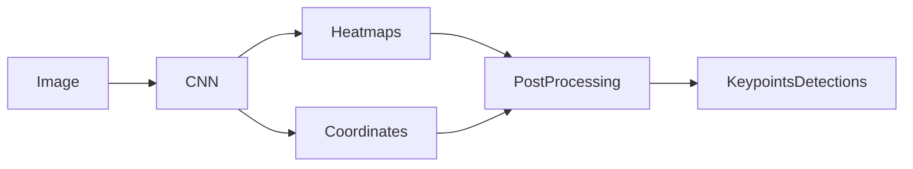

# Pose Estimation原理与代码实例讲解

## 1. 背景介绍
### 1.1 问题的由来
人体姿态估计(Pose Estimation)是计算机视觉领域的一个重要研究方向,旨在从图像或视频中检测和定位人体关键点,如头部、肩部、肘部、手腕、髋部、膝盖和脚踝等。准确估计人体姿态对于许多应用场景都具有重要意义,如人机交互、动作识别、智能监控等。

### 1.2 研究现状 
近年来,随着深度学习技术的发展,人体姿态估计取得了显著进展。主流方法大多基于卷积神经网络(CNN),通过端到端学习从图像中直接回归关键点坐标。一些经典的网络结构如Hourglass、CPM、CPN等,在标准数据集上取得了优异的性能。但目前仍面临着精度和实时性的挑战。

### 1.3 研究意义
人体姿态估计是实现智能人机交互的关键技术之一。准确、实时地检测人体关键点,可以为上层应用提供丰富的人体运动信息,如身体动作、手势、表情等。这对于开发智能助理、体感游戏、增强现实等人机交互系统具有重要价值。同时在安防监控、运动分析等领域也有广泛应用前景。

### 1.4 本文结构
本文将全面介绍人体姿态估计的原理和实现。第2节介绍姿态估计涉及的核心概念。第3节重点讲解经典的姿态估计算法原理和步骤。第4节给出算法背后的数学模型和公式推导。第5节通过代码实例演示如何使用深度学习框架实现姿态估计模型。第6节讨论姿态估计的应用场景。第7节推荐相关学习资源。第8节总结全文并展望未来研究方向。

## 2. 核心概念与联系

人体姿态估计涉及以下核心概念:

- 关键点(Keypoint):人体骨骼结构的关节点,如头顶、颈部、肩部、肘部、手腕、髋部、膝盖、脚踝等。
- 骨架(Skeleton):由关键点及其连接构成的人体骨骼拓扑结构。
- 姿态(Pose):通过骨架表示的人体空间形态和运动状态。
- 单人姿态估计(Single-Person Pose Estimation):从图像中检测单个人体的关键点坐标。 
- 多人姿态估计(Multi-Person Pose Estimation):从图像中检测多个人体的关键点,需先检测人体位置再进行关键点定位。
- 2D姿态估计:在图像平面内定位关键点的像素坐标。
- 3D姿态估计:在三维空间内恢复人体关键点的空间坐标。

姿态估计的目标是定位人体关键点坐标。传统方法通过手工设计特征+分类器/回归器实现,如HOG+SVM、DPM等。深度学习方法利用CNN强大的特征提取和映射能力,从图像直接回归关键点热图(heatmap)或坐标,再通过后处理(如NMS)得到最终预测结果。



## 3. 核心算法原理 & 具体操作步骤
### 3.1 算法原理概述
主流的人体姿态估计算法大多基于卷积神经网络(CNN)。输入RGB图像,通过主干网络提取特征,然后经过上采样得到特征图,再通过1x1卷积产生关键点热图或坐标回归。单人姿态估计可直接从图像回归,多人姿态估计需先检测人体再回归。训练时通过关键点的真值监督CNN学习,推理时输入图像即可预测关键点。

### 3.2 算法步骤详解
以单人姿态估计为例,典型的算法步骤如下:

1. 数据准备:收集人体图像及关键点标注作为训练数据。常用数据集有MPII、COCO、AI Challenger等。
2. 网络设计:构建用于姿态估计的CNN网络。可选用成熟的主干网络如ResNet、HRNet提取特征,然后接上采样和热图回归分支。
3. 定义损失函数:使用热图的MSE损失或坐标的L1/L2损失作为训练目标,引导CNN学习。
4. 模型训练:输入图像和热图真值,通过反向传播不断优化CNN参数,使预测结果逼近真值。
5. 模型测试:用训练好的CNN对新图像进行推理,得到热图预测,再用NMS等后处理方法提取最终关键点坐标。
6. 性能评估:在验证集或测试集上评估模型性能,常用PCK、mAP等指标衡量关键点定位的准确性。

多人姿态估计的步骤类似,只是先使用目标检测得到人体框,再对每个框内的图像RoI进行单人姿态估计,最后组合结果输出多人关键点。

### 3.3 算法优缺点
基于CNN的姿态估计算法优点如下:

- 端到端学习:可直接从图像回归关键点,无需手工设计特征,训练和推理高效。
- 强泛化能力:训练好的模型可很好地适应新场景,对复杂背景、遮挡、多人等情况鲁棒。
- 高精度:在标准数据集上可取得很高的关键点定位精度,满足大多数应用要求。

但也存在一些局限:

- 计算开销大:CNN模型计算量大,对硬件要求高,难以在低功耗设备上实时运行。
- 需大量标注数据:模型训练需要大量带关键点标注的图像数据,获取成本高。
- 鲁棒性有待提高:对于异常姿态、极端视角、人体部分缺失等困难样本,姿态估计的精度仍有待提升。

### 3.4 算法应用领域
人体姿态估计算法可应用于以下领域:

- 人机交互:通过识别人体姿态实现基于肢体动作的人机自然交互,如体感游戏、手势控制等。
- 行为识别:分析视频中人物的姿态变化,可识别动作、行为事件,用于智能监控、辅助驾驶等。
- 运动分析:对运动员的姿态进行精细建模和分析,为体育训练、康复治疗提供数据支持。
- 增强现实:实时捕捉人体姿态并叠加虚拟信息,用于虚拟试衣、AR游戏等互动应用。

## 4. 数学模型和公式 & 详细讲解 & 举例说明
### 4.1 数学模型构建
人体姿态估计可建模为一个回归问题。给定图像$I$,目标是学习一个映射函数$\phi$,将图像映射为$K$个关键点的坐标$Y$:

$$Y = \phi(I;\Theta), Y \in \mathcal{R}^{K \times 2}$$

其中$\Theta$为待学习的参数。$\phi$通常用CNN来实现。

另一种常见建模是将关键点表示为热图(heatmap),即关键点位置为1,其他为0的2D高斯分布图。CNN学习回归热图$\hat{H}$而非直接坐标:

$$\hat{H} = \phi(I;\Theta), \hat{H} \in \mathcal{R}^{K \times H \times W}$$

$H$和$W$为热图的高宽。$\hat{H}$与热图真值$H$的差异作为损失函数来优化。

### 4.2 公式推导过程
对于热图回归,可用MSE(均方误差)作为损失函数:

$$\mathcal{L}_{mse} = \frac{1}{K}\sum_{k=1}^K\sum_{i,j}(\hat{H}_{k,i,j} - H_{k,i,j})^2$$

$\hat{H}_k$和$H_k$分别为第$k$个关键点的预测热图和真值热图。

另一种损失函数是关键点坐标的L2损失:

$$\mathcal{L}_{l2} = \frac{1}{K}\sum_{k=1}^K(\hat{y}_k - y_k)^2$$

$\hat{y}_k$和$y_k$为第$k$个关键点的预测坐标和真值坐标。

CNN的参数$\Theta$通过梯度下降法来优化,使损失函数最小化:

$$\Theta^* = \arg\min_{\Theta}\mathcal{L}(\hat{Y},Y)$$

### 4.3 案例分析与讲解
以上半身姿态估计为例。假设要检测头、颈、肩、肘、腕5个关键点,则$K=5$。输入一张人体图像,CNN输出5个关键点的热图,每个热图分辨率为64x64。

用高斯核函数生成热图真值$H$,将关键点坐标$(x,y)$处的值设为1,其余为0,再用高斯核平滑。预测热图$\hat{H}$与$H$的MSE损失用于训练CNN。

推理时,输入图像求得5个预测热图,每个热图上值最大处的坐标即为对应关键点的预测坐标。若用坐标回归,则CNN直接输出一个5x2的坐标矩阵,每行对应一个关键点的x,y坐标。

### 4.4 常见问题解答
- Q: 热图回归和坐标回归哪个更好?

  A: 两种方法各有优劣。热图回归可提供关键点的空间分布信息,预测更稳定,但分辨率受限。坐标回归直接输出坐标,精度更高但对局部特征更敏感。

- Q: 多人姿态估计如何处理人体重叠?

  A: 通过为每个人分配一组热图/坐标回归,以区分不同人的关键点。先用目标检测定位人体框,再对每个框预测关键点,就能处理重叠问题。

- Q: 3D姿态估计与2D的区别?
  
  A: 3D姿态估计需预测关键点的深度信息,比2D更有挑战。通常先估计2D关键点,再回归Z坐标;或直接回归3D坐标。需要3D标注数据如MuCo-3DHP来训练。
  
## 5. 项目实践：代码实例和详细解释说明
### 5.1 开发环境搭建
首先搭建深度学习开发环境。需要安装:

- Python 3.x
- PyTorch 1.x
- OpenCV
- Numpy等基础库

推荐使用Anaconda创建虚拟环境,方便管理依赖。

### 5.2 源代码详细实现
以下代码演示如何用PyTorch实现一个简单的姿态估计模型,用MPII数据集训练并测试。

导入需要的库:

```python
import torch
import torch.nn as nn
import torchvision.transforms as transforms
from torch.utils.data import Dataset, DataLoader
import cv2
import numpy as np
import os
```

定义姿态估计模型:

```python
class PoseNet(nn.Module):
    def __init__(self, num_keypoints=16):
        super(PoseNet, self).__init__()
        self.num_keypoints = num_keypoints
        
        self.conv1 = nn.Conv2d(3, 64, kernel_size=3, stride=1, padding=1)
        self.conv2 = nn.Conv2d(64, 64, kernel_size=3, stride=1, padding=1) 
        self.pool = nn.MaxPool2d(kernel_size=2, stride=2)
        
        self.conv3 = nn.Conv2d(64, 128, kernel_size=3, stride=1, padding=1)
        self.conv4 = nn.Conv2d(128, 128, kernel_size=3, stride=1, padding=1)
        
        self.conv5 = nn.Conv2d(128, 256, kernel_size=3, stride=1, padding=1)
        self.conv6 = nn.Conv2d(256, 256, kernel_size=3, stride=1, padding=1)
        
        self.conv7 = nn.Conv2d(256, 256, kernel_size=3, stride=1, padding=1)
        self.conv8 = nn.Conv2d(256, 512, kernel_size=3, stride=1, padding=1) 
        
        self.conv9 = nn.Conv2d(512, 512, kernel_size=3, stride=1, padding=1)
        self.conv10 = nn.Conv2d(512, 512, kernel_size=3, stride=1, padding=1)
        
        self.fc1 = nn.Linear(512*7*7, 4096) 
        self.fc2 = nn.Linear(4096, 4096)
        self.fc3 