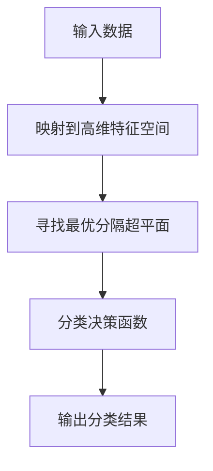

好的,我会按照您的要求,以"Python机器学习实战：支持向量机(SVM)的原理与使用"为主题,写一篇深入全面的技术博客文章。文章将遵循您列出的约束条件和内容结构模板,确保逻辑清晰、内容专业、有深度和见解。请耐心等待,我将尽最大努力完成这篇高质量的技术博客。

# Python机器学习实战：支持向量机(SVM)的原理与使用

## 1. 背景介绍

### 1.1 问题的由来

在现代数据密集型应用中,机器学习已成为不可或缺的核心技术。作为监督学习算法的一种,支持向量机(Support Vector Machine, SVM)因其出色的泛化能力而备受推崇。无论是在模式识别、数据挖掘还是其他领域,SVM都展现出了优秀的性能表现。

然而,SVM并非一蹴而就的算法,它源于20世纪90年代的统计学习理论研究。作为核心思想,SVM旨在寻求将不同类别的数据samples最大程度分隔开的超平面。这种以"最大化边界"为目标的学习策略,使SVM能够在高维特征空间中获得更好的泛化能力。

### 1.2 研究现状  

自从1995年被引入以来,SVM理论和应用研究就一直是机器学习领域的热点。无论是在算法优化、核函数选择,还是大规模数据处理等方面,SVM都有着广泛而深入的研究。

当前,SVM已广泛应用于文本分类、图像识别、生物信息学等诸多领域。同时,结合深度学习等新兴技术,SVM也展现出了新的发展方向。不过,SVM的"奥秘"并未被完全揭开,如何进一步提高其性能、扩展应用场景等,仍是值得探索的课题。

### 1.3 研究意义

全面掌握SVM的原理及应用技巧,对于数据科学从业者来说是非常有价值的。一方面,SVM作为经典的监督学习算法,其思想和方法对于理解和应用其他机器学习算法有着重要的借鉴意义;另一方面,掌握SVM也为解决实际问题提供了行之有效的工具。

此外,SVM的发展历程也为我们展示了算法是如何不断完善优化的。通过剖析SVM,我们可以领略算法设计的精髓,为创新性算法研究提供有益的思路。

### 1.4 本文结构

本文将全面介绍SVM的理论基础、算法细节、实战应用等内容。

- 第2部分将阐述SVM的核心概念,并说明其与其他算法的联系;
- 第3部分将深入探讨SVM算法的原理和具体实现步骤;
- 第4部分将推导SVM的数学模型,并结合案例进行讲解;
- 第5部分将通过实战项目,展示如何使用Python代码实现SVM;
- 第6部分将介绍SVM在不同领域的应用现状及前景;
- 第7部分将推荐相关的学习资源和开发工具;
- 第8部分将总结SVM的发展趋势,并指出其面临的挑战;
- 第9部分将解答一些常见的问题。

通过本文,您将对SVM有一个全面深入的理解,为将来的学习研究奠定扎实基础。

## 2. 核心概念与联系

支持向量机(SVM)作为一种有监督的机器学习算法,其核心思想是在高维特征空间中构建一个超平面,将不同类别的数据samples分隔开,并使正负样本到超平面的距离最大化。这种"最大边界"的策略赋予了SVM很强的泛化能力。

SVM的工作原理可以概括为:

1. 将输入数据映射到高维特征空间
2. 在该特征空间中寻找能够将两类数据最大程度分隔开的超平面
3. 基于该超平面构建分类决策函数
4. 利用决策函数对新的数据样本进行分类

这种基于"最大化边界"的学习策略,使SVM在高维空间具有良好的泛化能力,避免了过拟合的风险。同时,SVM还具有内存效率高、计算复杂度低等优点。

SVM与其他经典算法也有一些联系:

- 与感知机(Perceptron)类似,都是线性分类器,但SVM寻求的是最优分隔超平面而非任意分隔超平面
- 与逻辑回归(Logistic Regression)相似,都可用于二分类问题,但SVM基于"间隔最大化"的原理,泛化性能通常更优
- 与核方法(Kernel Methods)紧密相关,通过核技巧可将SVM推广到非线性分类
- 与正则化(Regularization)方法相通,SVM的目标函数包含了正则化项,可防止过拟合

总的来说,SVM集合了统计学习理论的多种智慧结晶,是一种极具影响力的机器学习算法。掌握SVM,不仅可以解决实际问题,更有助于理解和应用其他算法。

## 3. 核心算法原理与具体操作步骤

### 3.1 算法原理概述

SVM算法的核心思想是在高维特征空间中构造一个最优分隔超平面,将不同类别的数据samples分隔开,并使正负样本到超平面的距离最大化。这种"最大化边界"的策略,使SVM获得了良好的泛化能力。

具体来说,SVM算法包含以下几个关键步骤:

1. **数据映射** 将输入数据映射到高维特征空间
2. **构造间隔最大化目标**  在特征空间中寻找能最大程度分隔两类数据的超平面,即最大化正负样本到超平面的距离
3. **核函数技巧** 通过核函数,可在不显式计算高维映射的情况下,等效地在高维空间中构造最优分隔超平面
4. **求解最优化问题** 将最大化间隔目标转化为凸二次规划问题,通过优化算法求解获得最优超平面
5. **构建分类决策函数** 基于最优超平面,构造分类决策函数,对新样本进行分类预测

SVM算法的优势在于:

- 基于VC理论,具有很强的理论基础,避免了过拟合
- 通过核函数技巧,可隐式地在高维特征空间构造非线性决策边界
- 最优化问题是凸二次规划,有许多成熟的高效算法可用
- 对缺失数据和噪声数据有一定鲁棒性
- 泛化能力强,在小样本情况下也可以获得良好性能

### 3.2 算法步骤详解

#### 3.2.1 线性可分SVM

我们首先考虑线性可分的简单情况。假设训练数据集为$\{(x_1,y_1),(x_2,y_2),...,(x_n,y_n)\}$,其中$x_i \in \mathbb{R}^d$为$d$维特征向量,$y_i \in \{-1,+1\}$为类别标记。

SVM的目标是找到一个超平面$w^Tx + b = 0$,将两类数据分隔开,并使正负样本到超平面的距离最大化。这个最大化间隔的目标可以形式化为以下约束最优化问题:

$$
\begin{aligned}
& \underset{w,b}{\text{minimize}}
& & \frac{1}{2}||w||^2 \\
& \text{subject to}
& & y_i(w^Tx_i + b) \geq 1, \quad i=1,2,...,n
\end{aligned}
$$

其中$\frac{1}{2}||w||^2$是正则化项,用于控制模型复杂度;约束条件$y_i(w^Tx_i + b) \geq 1$确保每个样本至少距离超平面有间隔$\frac{1}{||w||}$。

这是一个凸二次规划问题,可以通过拉格朗日对偶性质转化为对偶问题,并使用高效的优化算法求解,得到最优解$w^*,b^*$。

#### 3.2.2 非线性SVM

对于非线性可分的情况,我们可以引入核函数$K(x_i,x_j)$,隐式地将数据映射到高维特征空间。在特征空间中,SVM的目标函数和约束条件为:

$$
\begin{aligned}
& \underset{w,b,\xi}{\text{minimize}}
& & \frac{1}{2}||w||^2 + C\sum_{i=1}^{n}\xi_i\\
& \text{subject to}
& & y_i(w^T\phi(x_i) + b) \geq 1 - \xi_i, \quad i=1,2,...,n\\
& & & \xi_i \geq 0
\end{aligned}
$$

其中$\phi(x)$是非线性映射函数，将输入数据映射到高维特征空间；$\xi_i$是松弛变量，允许某些样本位于超平面的间隔边界内；$C$是惩罚参数，用于权衡最大化间隔和minimizing误分类的权重。

通过核函数技巧，我们可以在不显式计算$\phi(x)$的情况下，利用核函数$K(x_i,x_j)=\phi(x_i)^T\phi(x_j)$等效地在高维空间中构造最优分隔超平面。常用的核函数包括线性核、多项式核、高斯核等。

求解该优化问题后，我们可以得到最优解$w^*,b^*$,从而构造出非线性分类决策函数:

$$
f(x) = \text{sign}\left(\sum_{i=1}^{n}y_i\alpha_i^*K(x_i,x) + b^*\right)
$$

其中$\alpha_i^*$是对偶问题的最优解,只有部分支持向量对应的$\alpha_i^*$非零。这种表达形式被称为"支持向量展开"。

#### 3.2.3 软间隔与正则化

在现实问题中,数据通常不是理想的线性可分的,会存在噪声和异常点。为了提高SVM对异常数据的鲁棒性,我们引入了松弛变量$\xi_i$,允许某些样本位于超平面的间隔边界内,从而使SVM具有一定的"软间隔"。

同时,SVM的目标函数中也包含了正则化项$\frac{1}{2}||w||^2$,这不仅可以增加模型的简单性,还具有防止过拟合的作用。惩罚参数$C$用于权衡最大化间隔和minimizing误分类的权重,从而控制模型的复杂度。

通过合理设置惩罚参数$C$,SVM可以在偏差(bias)和方差(variance)之间达到一个平衡,从而获得良好的泛化性能。

### 3.3 算法优缺点

**优点:**

1. **泛化能力强** SVM基于VC理论的统计学习框架,通过最大化边界的策略,可以在高维特征空间获得良好的泛化性能,避免过拟合。
2. **可解释性好** SVM的决策边界由支持向量决定,支持向量往往只占训练数据的一小部分,因此模型较为简单,可解释性强。
3. **核函数技巧** 通过核函数,SVM可以隐式地在高维空间构造非线性决策边界,而无需显式计算高维映射,大大提高了计算效率。
4. **凸优化问题** SVM的训练过程可以转化为凸二次规划问题,存在许多成熟的高效优化算法。
5. **鲁棒性强** 通过引入松弛变量和正则化项,SVM对缺失数据和噪声数据有较强的鲁棒性。

**缺点:**

1. **对大规模数据表现不佳** 当训练样本量很大时,SVM的训练过程会变得非常缓慢,因为它需要在整个训练集上求解一个优化问题。
2. **对参数选择敏感** SVM的性能很大程度上依赖于核函数、惩罚参数等参数的选择,参数选择不当会导致性能下降。
3. **对非凸数据分布表现不佳** SVM在寻找最大间隔超平面时,假设了数据是凸分布的,对于非凸数据分布可能无法