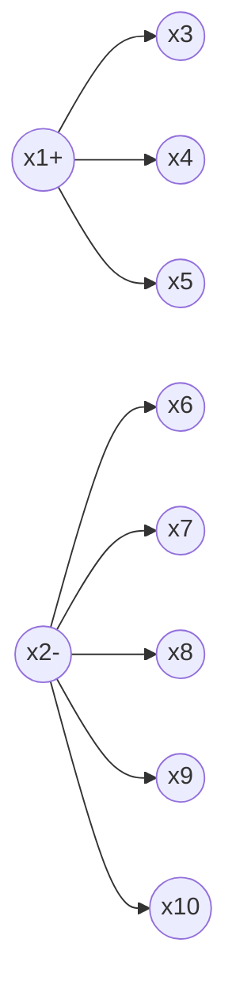
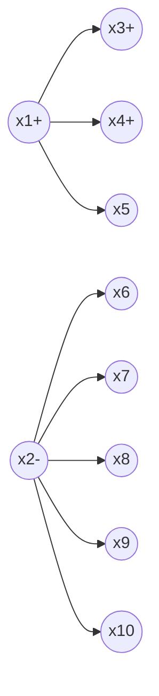

# Python深度学习实践：半监督学习减少数据标注成本

关键词：深度学习、半监督学习、数据标注、Python、TensorFlow

## 1. 背景介绍
### 1.1  问题的由来
深度学习在计算机视觉、自然语言处理等领域取得了巨大成功,但是其通常需要大量的标注数据来训练模型。然而,人工标注数据非常耗时耗力,成本很高。如何在标注数据较少的情况下,充分利用未标注数据来训练高性能的深度学习模型,是一个亟待解决的问题。
### 1.2  研究现状
目前业界主要采用数据增强、迁移学习、主动学习等方法来减少标注数据需求。近年来,半监督学习作为一种利用少量标注数据和大量未标注数据进行模型训练的方法,受到了广泛关注。一些经典的半监督学习算法如自训练、协同训练、生成式对抗网络等,在图像分类、语义分割等任务上取得了不错的效果。
### 1.3  研究意义 
探索在深度学习中应用半监督学习技术,可以大幅降低人工标注数据的成本,加速AI模型的开发和落地。同时,半监督学习的思想对于解决小样本学习、无监督学习等问题也有重要启示意义。
### 1.4  本文结构
本文将重点介绍几种经典的半监督学习算法,并基于Python和TensorFlow框架给出具体的实现示例。全文分为三个部分:第一部分介绍半监督学习的基本概念和主要方法;第二部分详细讲解自训练、协同训练、GANs等算法的原理和数学模型;第三部分给出基于MNIST和CIFAR-10数据集的代码实践。

## 2. 核心概念与联系
半监督学习处于监督学习和无监督学习之间,通过利用少量的标注数据和大量的未标注数据来训练模型。其核心思想是通过标注数据训练一个初始模型,然后用该模型对未标注数据进行"伪标注",再把高置信度的伪标注样本加入训练集进行新一轮训练,如此迭代直到模型收敛。

半监督学习主要有生成式方法和判别式方法两大类。生成式方法通过显式地建模数据的生成过程,来利用未标注数据估计类别条件分布,代表算法有高斯混合模型、生成对抗网络等。判别式方法则直接对后验概率或决策边界建模,代表算法有自训练、协同训练、图半监督学习等。

## 3. 核心算法原理 & 具体操作步骤
### 3.1  算法原理概述
本节重点介绍三种经典的半监督学习算法:自训练、协同训练和生成对抗网络。
#### 3.1.1 自训练(Self-Training)
自训练是最简单直观的半监督学习算法,过程如下:
1. 用标注数据训练一个初始模型
2. 用该模型对未标注数据预测,选出置信度高的样本赋予"伪标签"
3. 将伪标签样本加入到原始标注集中,重新训练模型
4. 重复2-3步骤,直到模型收敛

#### 3.1.2 协同训练(Co-Training)
协同训练通过训练多个互补的模型,然后让它们互相教导,从而提升性能。算法步骤为:
1. 将数据的特征划分为两个视图,构建两个初始模型
2. 每个模型用一个视图的标注数据训练
3. 每个模型挑选自己未标注池中置信度高的样本,教给另一个模型
4. 两个模型重复2-3,直到收敛

#### 3.1.3 生成式对抗网络(GANs)
GANs通过一个生成器和一个判别器的对抗学习,来利用未标注数据。其中生成器试图生成以假乱真的样本欺骗判别器,判别器则要尽力区分真实样本和生成样本。算法流程为:
1. 生成器从随机噪声生成样本,判别器尽力判别真假样本
2. 生成器调整参数,试图让判别器把生成样本判断为真
3. 判别器调整参数,试图提高真假判别的准确率
4. 两个网络互相博弈,最终希望达到纳什均衡,生成的样本与真实样本无法区分

### 3.2  算法步骤详解
下面以自训练为例,详细说明算法实现步骤。

给定标注数据集 $D_L = \{(x_1,y_1),...,(x_l,y_l)\}$ 和未标注数据集 $D_U = \{x_{l+1},...,x_{l+u}\}$,其中 $x_i$ 为数据, $y_i$ 为标签, $l$ 和 $u$ 分别为标注/未标注样本数量。记模型为 $f_\theta$ , $\theta$ 为参数。则自训练算法可描述为:

1. 用有标注数据训练初始模型:
$$\theta = \arg \min_{\theta} \frac{1}{l} \sum_{i=1}^l L(f_\theta(x_i), y_i)$$

2. 用 $f_\theta$ 对未标注数据预测,对于每个样本 $x_j \in D_U$:  
$$\hat{y}_j = f_\theta(x_j), \quad c_j = \max_{k} P(y=k|x_j;\theta)$$
其中 $\hat{y}_j$ 为预测标签, $c_j$ 为置信度。

3. 选择置信度大于阈值 $\tau$ 的样本组成新的标注集 $\hat{D}_L$:
$$\hat{D}_L = \{(x_j,\hat{y}_j)| c_j > \tau, x_j \in D_U\}$$

4. 合并原始标注集和新标注集: $D_L = D_L \cup \hat{D}_L$,返回步骤1重新训练模型,直至收敛。

### 3.3  算法优缺点
自训练的优点是简单易实现,对模型架构没有限制,适用范围广。但其缺点是容易受噪声样本影响,错误标注会被放大。

协同训练需要数据有两个互补视图,因此适用范围较窄。但通过两个模型互相教导,可减少噪声影响。

GANs利用生成对抗博弈来学习数据分布,是一种很有前景的无监督和半监督学习范式。但其训练不稳定,超参数调节困难。

### 3.4  算法应用领域
半监督学习在多个领域都有成功应用,例如:
- 计算机视觉:物体检测、语义分割、行人重识别等
- 自然语言处理:文本分类、情感分析、命名实体识别等  
- 语音识别:声学模型训练
- 网页分类:利用网页结构和内容进行分类
- 生物信息:蛋白质功能预测,基因表达分析等

## 4. 数学模型和公式 & 详细讲解 & 举例说明
### 4.1  数学模型构建
半监督学习的数学模型可统一表示为最小化如下损失函数:

$$\mathcal{L} = \mathcal{L}_s + \lambda \mathcal{L}_u + \Omega(\theta)$$

其中 $\mathcal{L}_s$ 是有标注数据的监督损失, $\mathcal{L}_u$ 是无标注数据的无监督损失, $\lambda$ 为平衡二者的系数, $\Omega(\theta)$ 为正则化项。

对于自训练,可将 $\mathcal{L}_u$ 定义为伪标签的监督损失:

$$\mathcal{L}_u = \frac{1}{u} \sum_{j=1}^u \mathbf{1}(c_j>\tau) L(f_\theta(x_j), \hat{y}_j)$$

对于协同训练,设两个模型为 $f_{\theta_1}$ 和 $f_{\theta_2}$,则 $\mathcal{L}_u$ 可定义为两个模型预测的一致性损失:

$$\mathcal{L}_u = \frac{1}{u} \sum_{j=1}^u ||f_{\theta_1}(x_j) -  f_{\theta_2}(x_j)||^2$$

对于GANs,设生成器为 $G$,判别器为 $D$,则目标函数可写为:

$$\min_G \max_D V(D,G) = \mathbb{E}_{x \sim p_{data}(x)} [\log D(x)] + \mathbb{E}_{z \sim p_z(z)} [\log (1-D(G(z)))]$$

### 4.2  公式推导过程
以协同训练为例,假设每个样本 $x$ 可以划分为两个视图 $x^1$ 和 $x^2$,分别对应模型 $f_{\theta_1}$ 和 $f_{\theta_2}$,其联合分布为 $P(x^1,x^2)$。若两个视图条件独立,即:
$$P(x^1|y) = P(x^1|x^2,y), \quad P(x^2|y) = P(x^2|x^1,y)$$
则可证明最小化一致性损失 $\mathcal{L}_u$ 等价于最大化两个模型在未标注数据上的互信息。由互信息公式:
$$I(f_{\theta_1}(x^1);f_{\theta_2}(x^2)) = \sum_{y_1} \sum_{y_2} P(f_{\theta_1}(x^1)=y_1, f_{\theta_2}(x^2)=y_2) \log \frac{P(f_{\theta_1}(x^1)=y_1, f_{\theta_2}(x^2)=y_2)}{P(f_{\theta_1}(x^1)=y_1) P(f_{\theta_2}(x^2)=y_2)}$$
将其展开可得:
$$I(f_{\theta_1}(x^1);f_{\theta_2}(x^2)) = H(f_{\theta_1}(x^1)) - H(f_{\theta_1}(x^1)|f_{\theta_2}(x^2)) = H(f_{\theta_2}(x^2)) - H(f_{\theta_2}(x^2)|f_{\theta_1}(x^1))$$
其中 $H(·)$ 为信息熵。要最大化互信息,需要最小化条件熵,也即最小化给定一个模型输出下另一个模型输出的不确定性,这与最小化一致性损失 $\mathcal{L}_u$ 的目标是一致的。

### 4.3  案例分析与讲解
下面以一个简单的二分类任务为例,说明自训练的过程。假设我们有2个标注样本(正例和负例各1个),8个未标注样本,如下图所示:

初始模型 $f_\theta$ 在标注样本上训练后,对未标注样本预测,结果为:

| 样本   | x3  | x4  | x5  | x6  | x7  | x8  | x9  | x10 |
|--------|-----|-----|-----|-----|-----|-----|-----|-----|
| 预测   | 0.8 | 0.7 | 0.6 | 0.4 | 0.3 | 0.2 | 0.1 | 0.2 |

假设置信度阈值 $\tau=0.7$,则 x3 和 x4 被选为新的正例,没有新负例。新的训练集变为:

此时重新训练模型,然后再预测未标注样本,