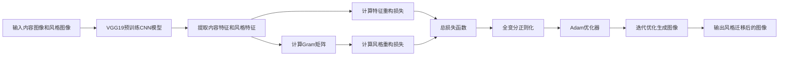

# Python深度学习实践：风格迁移网络让照片变艺术品

## 1. 背景介绍
### 1.1 问题的由来
近年来，随着深度学习技术的飞速发展，计算机视觉领域取得了巨大的突破。其中，一个非常有趣且富有创意的应用就是艺术风格迁移(Style Transfer)。它能够将一幅普通的照片转换成梵高、毕加索等大师级别的艺术风格，让人们在日常生活中也能欣赏到艺术的魅力。这一切都要归功于深度学习中的卷积神经网络(Convolutional Neural Network, CNN)模型。

### 1.2 研究现状
目前，基于深度学习的风格迁移已经成为了计算机视觉研究的一个热点方向。自从2015年Gatys等人首次提出利用CNN进行风格迁移以来，大量的研究工作涌现出来，不断推动着该领域的发展。比较经典的工作有Johnson等人提出的前馈网络、Chen等人的StyleBank等。这些方法在保证生成图像质量的同时，大幅提升了风格迁移的速度，使得实时风格迁移成为可能。

### 1.3 研究意义
风格迁移技术不仅仅是一个有趣的应用，更是计算机模拟人类艺术创作的一次有益尝试。通过研究风格迁移的原理和算法，我们可以更加深入地理解人类视觉系统和艺术创作过程的奥秘。同时，风格迁移也为传统的图像处理和计算机图形学带来了新的思路和方法。将风格迁移与其他任务如图像修复、超分辨率等结合，有望进一步提升相关技术的性能。

### 1.4 本文结构
本文将全面介绍利用Python实现基于深度学习的风格迁移。第2部分介绍风格迁移涉及的核心概念。第3部分重点讲解风格迁移的算法原理和步骤。第4部分给出风格迁移背后的数学模型和公式推导。第5部分通过详细的代码实例，演示如何用Python实现一个完整的风格迁移网络。第6部分讨论风格迁移技术的应用场景。第7部分推荐风格迁移相关的学习资源。第8部分总结全文，并展望风格迁移未来的发展方向和挑战。

## 2. 核心概念与联系
在开始详细讲解风格迁移算法之前，我们先来了解几个核心概念：

- 卷积神经网络(CNN)：一种常用于图像识别等任务的深度学习模型，能够自动提取图像中的多层次特征。CNN是实现风格迁移的基础。
- Gram矩阵：一种衡量不同特征图之间相关性的矩阵，反映了图像的纹理和风格信息。风格迁移的关键就是匹配Gram矩阵。
- 特征重构损失：衡量生成图像与内容图像在CNN特征层面的相似性，保证生成图像的内容与原图一致。
- 风格重构损失：衡量生成图像与风格图像在Gram矩阵层面的相似性，保证生成图像的风格与艺术图像一致。
- 全变分正则化：一种常用的图像去噪方法，通过惩罚生成图像的总变差，使其更加平滑自然。

下图展示了这些概念在风格迁移网络中的位置和作用：

这些概念环环相扣，共同构建起了风格迁移的理论和实践基础。接下来的章节将逐一详细展开。

## 3. 核心算法原理 & 具体操作步骤
### 3.1 算法原理概述
基于深度学习的风格迁移可以用下面这个优化问题来描述：

给定内容图像 $I_c$ 和风格图像 $I_s$，找到一幅生成图像 $I_g$，使其在内容上接近 $I_c$，在风格上接近 $I_s$。用数学语言表达就是：

$$
I_g = \arg \min_{I} \alpha \mathcal{L}_c(I, I_c) + \beta \mathcal{L}_s(I, I_s) + \gamma \mathcal{R}(I)
$$

其中 $\mathcal{L}_c$ 和 $\mathcal{L}_s$ 分别是内容损失和风格损失，$\mathcal{R}$ 是正则化项，$\alpha$、$\beta$ 和 $\gamma$ 是平衡三者的权重系数。

算法的核心思想是：先用一个预训练的CNN提取内容图像和风格图像在不同层的特征，然后定义并最小化内容损失、风格损失和正则化项，通过梯度下降等优化算法迭代更新生成图像，最终得到兼顾内容和风格的风格迁移图像。

### 3.2 算法步骤详解
风格迁移算法可以分为以下几个关键步骤：

1. 加载预训练的VGG19网络模型，并选择用于提取内容特征和风格特征的层。一般选择较高层的卷积层如conv4_2提取内容特征，选择多个低层到高层的卷积层提取风格特征。
2. 将内容图像、风格图像和初始生成图像(通常用内容图像的副本)输入VGG19网络，提取对应的内容特征和风格特征。
3. 基于提取的特征，计算内容损失和风格损失：
   - 内容损失通过生成图像和内容图像在内容特征层上的均方差来定义。
   - 风格损失通过生成图像和风格图像在多个风格特征层上的Gram矩阵均方差之和来定义。
4. 加入全变分正则化项，一般通过生成图像相邻像素差的平方和来计算。
5. 将内容损失、风格损失和正则化项按照权重系数加权求和，得到总损失函数。
6. 利用Adam、L-BFGS等优化算法对总损失函数进行梯度下降，迭代更新生成图像的像素值，直到损失函数达到最小或满足一定条件为止。
7. 输出最终的风格迁移生成图像。

### 3.3 算法优缺点
基于深度学习的风格迁移具有以下优点：
- 效果出众，能够生成艺术感很强的图像。
- 通用性好，可以处理任意内容图像和风格图像。
- 可控性强，通过调节损失函数权重可以灵活控制内容和风格的相对重要性。

同时也存在一些局限性：
- 计算开销大，需要较长的迭代优化时间。
- 对风格图像的语义理解能力有限，难以精准捕捉高层次的艺术特征。
- 缺乏理论解释，难以从原理上分析算法的内在机制。

### 3.4 算法应用领域
风格迁移作为一种通用的图像生成技术，在很多领域都有实际或潜在的应用，例如：

- 艺术创作：自动生成各种风格的艺术图像，辅助设计师和艺术家的创作。
- 图像处理：作为一种图像增强和图像滤波的工具，美化图像视觉效果。
- 游戏、动漫：快速生成个性化的游戏场景、角色材质和动漫风格图像。
- 虚拟现实：为虚拟场景添加艺术风格，提升沉浸感和艺术体验。
- 用户交互：提供图像风格化的趣味性应用，增强用户互动体验。

随着算法的不断发展和完善，风格迁移有望在更广阔的领域发挥独特价值。

## 4. 数学模型和公式 & 详细讲解 & 举例说明
### 4.1 数学模型构建
风格迁移的数学模型可以用下面的优化问题来刻画：

$$
I_g = \arg \min_{I} \alpha \mathcal{L}_c(I, I_c) + \beta \mathcal{L}_s(I, I_s) + \gamma \mathcal{R}(I)
$$

其中，$I_g$、$I_c$ 和 $I_s$ 分别表示生成图像、内容图像和风格图像。$\mathcal{L}_c$、$\mathcal{L}_s$ 和 $\mathcal{R}$ 分别表示内容损失函数、风格损失函数和正则化项。$\alpha$、$\beta$ 和 $\gamma$ 是三者的权重系数。

目标就是找到一个最优的生成图像 $I_g$，使其与内容图像 $I_c$ 在内容上接近，与风格图像 $I_s$ 在风格上接近，同时又足够平滑自然。

### 4.2 公式推导过程
接下来我们详细推导内容损失、风格损失和正则化项的数学表达式。

设 $F_c$ 和 $F_g$ 分别表示内容图像和生成图像在VGG19网络第 $l$ 层卷积层的特征图，则内容损失定义为两个特征图的均方差：

$$
\mathcal{L}_c(I_g, I_c) = \frac{1}{2} \sum_{i,j} (F_g^l(i,j) - F_c^l(i,j))^2
$$

设 $F_s$ 和 $F_g$ 分别表示风格图像和生成图像在VGG19网络第 $l$ 层卷积层的特征图，$G_s^l$ 和 $G_g^l$ 表示对应的Gram矩阵：

$$
G^l(i,j) = \sum_k F^l(i,k) F^l(j,k)
$$

则风格损失定义为两个Gram矩阵的均方差之和：

$$
\mathcal{L}_s(I_g, I_s) = \sum_{l=0}^L w_l \frac{1}{4N_l^2M_l^2} \sum_{i,j} (G_g^l(i,j) - G_s^l(i,j))^2
$$

其中 $w_l$ 是第 $l$ 层的权重，$N_l$ 和 $M_l$ 是特征图的高度和宽度。

正则化项采用全变分正则化，定义为生成图像梯度的平方和：

$$
\mathcal{R}(I_g) = \sum_{i,j} ((I_g(i,j+1) - I_g(i,j))^2 + (I_g(i+1,j) - I_g(i,j))^2)
$$

将内容损失、风格损失和正则化项代入总损失函数，再利用梯度下降等优化算法对生成图像 $I_g$ 的像素值进行迭代更新，最终得到最优的风格迁移结果。

### 4.3 案例分析与讲解
我们以一个简单的例子直观感受一下风格迁移的数学原理。

假设我们要将一张普通的风景照片转换为梵高的《星夜》风格。首先，我们将风景照片作为内容图像 $I_c$，将《星夜》作为风格图像 $I_s$，随机生成一张噪声图像作为初始的生成图像 $I_g$。

然后，我们将三张图像输入预训练的VGG19网络，提取conv4_2层作为内容特征，提取conv1_1、conv2_1、conv3_1、conv4_1、conv5_1层作为风格特征。

接着，我们计算生成图像与内容图像在conv4_2层上的内容损失 $\mathcal{L}_c$，以及生成图像与风格图像在5个层上的风格损失 $\mathcal{L}_s$。再加上全变分正则化项 $\mathcal{R}$，将三者加权求和得到总损失函数。

最后，我们利用Adam优化器对总损失函数进行梯度下降，不断迭代更新生成图像的像素值。随着迭代次数的增加，我们会观察到生成图像逐渐呈现出《星夜》的风格特征，如旋转的笔触、鲜艳的色彩等，同时又保留了原始风景照片的内容轮廓。

当损失函数降到一个较低的值或达到预设的迭代次数时