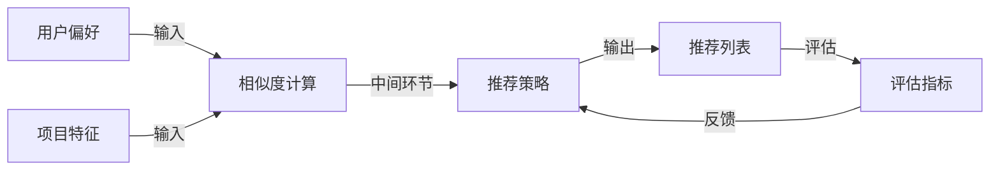

# Recommendation Systems原理与代码实例讲解

## 1. 背景介绍

### 1.1 问题的由来

在当今信息时代,我们每天都会遇到大量的数据和信息。然而,这些数据和信息中只有一小部分与我们的兴趣和需求相关。如何从海量的信息中找到对我们有价值的内容,成为一个亟待解决的问题。推荐系统(Recommendation System)应运而生,旨在为用户提供个性化的内容推荐,帮助用户发现感兴趣的项目。

推荐系统的概念最早可以追溯到20世纪90年代初期。1992年,Goldberg等人在Xerox公司提出了基于协同过滤的推荐系统的概念。1994年,Amazon成为首家在电子商务网站上应用推荐系统的公司,通过推荐相关产品来增加销售额。1998年,Netflix推出了基于协同过滤的电影推荐系统。自此,推荐系统在电子商务、社交媒体、视频网站等多个领域得到了广泛应用。

### 1.2 研究现状

推荐系统是一个跨学科的研究领域,涉及机器学习、数据挖掘、信息检索、人工智能等多个领域。目前,推荐系统的主要研究方向包括:

1. **协同过滤(Collaborative Filtering)**:基于用户之间的相似性或项目之间的相似性进行推荐。
2. **基于内容的推荐(Content-based Recommendation)**:根据项目的内容特征和用户的偏好进行推荐。
3. **混合推荐(Hybrid Recommendation)**:结合协同过滤和基于内容的推荐,综合多种推荐策略。
4. **上下文感知推荐(Context-aware Recommendation)**:考虑用户的上下文信息,如时间、地点等,进行更加个性化的推荐。
5. **深度学习推荐(Deep Learning for Recommendation)**:利用深度学习技术,从复杂的用户行为和项目特征中挖掘隐含的模式,提高推荐效果。

### 1.3 研究意义

推荐系统在现代社会中扮演着越来越重要的角色,具有广泛的应用前景和重大的理论意义:

1. **信息过滤**:帮助用户从海量信息中发现感兴趣的内容,提高信息获取效率。
2. **个性化服务**:根据用户的偏好和行为习惯,提供个性化的推荐,提升用户体验。
3. **增加收益**:为电子商务、视频网站等提供精准的商品或内容推荐,提高转化率和收益。
4. **社会影响**:推荐系统可能会影响人们的决策和行为,对社会产生深远影响。

### 1.4 本文结构

本文将全面介绍推荐系统的核心概念、算法原理、数学模型、代码实现和实际应用。文章主要包括以下几个部分:

1. 核心概念与联系
2. 核心算法原理与具体操作步骤
3. 数学模型和公式详细讲解与举例说明
4. 项目实践:代码实例和详细解释说明
5. 实际应用场景
6. 工具和资源推荐
7. 总结:未来发展趋势与挑战
8. 附录:常见问题与解答

## 2. 核心概念与联系

推荐系统涉及多个核心概念,这些概念相互关联,共同构建了推荐系统的理论基础。本节将介绍推荐系统中的主要概念及其联系。

### 2.1 用户(User)

用户是推荐系统的服务对象,推荐系统需要根据用户的偏好和行为来进行个性化推荐。用户可以是个人用户,也可以是一个组织或群体。

### 2.2 项目(Item)

项目是推荐系统中需要被推荐的对象,可以是商品、电影、音乐、新闻等任何可以被推荐的内容。每个项目都有一些描述其特征的属性,如类别、标题、描述等。

### 2.3 用户偏好(User Preference)

用户偏好反映了用户对不同项目的喜好程度,是推荐系统进行推荐的关键依据。用户偏好可以通过显式反馈(如评分)或隐式反馈(如浏览历史)来获取。

### 2.4 相似度(Similarity)

相似度是衡量两个对象之间相似程度的指标,在推荐系统中通常用于计算用户之间的相似度或项目之间的相似度。常用的相似度计算方法包括余弦相似度、皮尔逊相关系数等。

### 2.5 推荐策略(Recommendation Strategy)

推荐策略是推荐系统根据用户偏好和相似度计算,生成推荐列表的算法。常见的推荐策略包括协同过滤、基于内容的推荐、混合推荐等。

### 2.6 评估指标(Evaluation Metrics)

评估指标用于衡量推荐系统的性能,常用的评估指标包括准确率(Accuracy)、覆盖率(Coverage)、多样性(Diversity)、新颖性(Novelty)等。

### 2.7 核心概念关系

上述核心概念相互关联,构成了推荐系统的理论框架。用户偏好和项目特征是推荐系统的输入,相似度计算是中间环节,推荐策略则是核心算法,最终生成推荐列表。评估指标用于衡量推荐系统的性能,并反馈给算法进行优化。



## 3. 核心算法原理 & 具体操作步骤

推荐系统的核心在于推荐算法,本节将介绍几种常见的推荐算法的原理和具体操作步骤。

### 3.1 算法原理概述

#### 3.1.1 协同过滤(Collaborative Filtering)

协同过滤是推荐系统中最常用的一种算法,基于这样一个假设:如果两个用户对某些项目有相似的偏好,那么他们对其他项目的偏好也可能相似。协同过滤算法主要分为两类:

1. **基于用户的协同过滤(User-based Collaborative Filtering)**:通过计算用户之间的相似度,找到与目标用户偏好相似的其他用户,并根据这些相似用户的偏好,为目标用户生成推荐列表。

2. **基于项目的协同过滤(Item-based Collaborative Filtering)**:通过计算项目之间的相似度,找到与目标用户喜欢的项目相似的其他项目,并将这些相似项目推荐给目标用户。

#### 3.1.2 基于内容的推荐(Content-based Recommendation)

基于内容的推荐算法利用项目的内容特征(如文本、图像等)和用户的偏好,为用户推荐与其过去喜欢的项目内容相似的新项目。这种算法通常包括以下步骤:

1. 从项目的内容中提取特征向量。
2. 构建用户偏好模型,表示用户对不同特征的偏好程度。
3. 计算候选项目与用户偏好模型的相似度,并根据相似度排序推荐。

#### 3.1.3 混合推荐(Hybrid Recommendation)

混合推荐算法是将协同过滤和基于内容的推荐相结合,试图利用两种算法的优势,弥补各自的缺陷。常见的混合推荐策略包括:

1. **加权hybri d**:对协同过滤和基于内容的推荐结果进行加权组合。
2. **切换hybrid**:根据特定条件选择使用协同过滤或基于内容的推荐。
3. **级联hybrid**:先使用一种算法生成候选集,再使用另一种算法从候选集中进行排序和推荐。
4. **特征组合hybrid**:将协同过滤和基于内容的推荐的特征进行融合,构建统一的推荐模型。

### 3.2 算法步骤详解

接下来,我们将详细介绍基于用户的协同过滤算法的具体操作步骤。

#### 3.2.1 数据准备

首先,我们需要获取用户对项目的评分数据,通常以用户-项目评分矩阵的形式存储。例如:

```
       项目1 项目2 项目3 项目4
用户A    5     ?     4     ?
用户B    ?     3     ?     5
用户C    4     ?     4     ?
用户D    ?     3     ?     4
```

其中,`?`表示用户未对该项目进行评分。

#### 3.2.2 计算用户相似度

接下来,我们需要计算用户之间的相似度。常用的相似度计算方法包括:

1. **欧几里得距离**:两个用户评分向量之间的欧几里得距离,距离越小,相似度越高。
2. **皮尔逊相关系数**:衡量两个用户评分向量之间的线性相关程度,相关系数越高,相似度越高。
3. **余弦相似度**:计算两个用户评分向量的夹角余弦值,余弦值越大,相似度越高。

假设我们使用皮尔逊相关系数计算相似度,则用户A与用户C的相似度为:

$$sim(A,C) = \frac{\sum_{i \in I}(r_{A,i} - \overline{r_A})(r_{C,i} - \overline{r_C})}{\sqrt{\sum_{i \in I}(r_{A,i} - \overline{r_A})^2}\sqrt{\sum_{i \in I}(r_{C,i} - \overline{r_C})^2}}$$

其中,$r_{A,i}$表示用户A对项目i的评分,$\overline{r_A}$表示用户A的平均评分,I是两个用户都评分过的项目集合。

#### 3.2.3 生成推荐列表

对于目标用户,我们可以找到与其最相似的K个用户,称为该用户的邻居。然后,根据这些邻居对项目的评分,预测目标用户对未评分项目的兴趣程度,并将兴趣程度最高的项目推荐给目标用户。

常用的预测方法是计算加权平均评分:

$$\hat{r}_{u,i} = \overline{r_u} + \frac{\sum_{v \in N(u)}sim(u,v)(r_{v,i} - \overline{r_v})}{\sum_{v \in N(u)}sim(u,v)}$$

其中,$\hat{r}_{u,i}$表示对用户u对项目i的预测评分,$\overline{r_u}$表示用户u的平均评分,N(u)表示用户u的邻居集合,sim(u,v)表示用户u与用户v的相似度。

### 3.3 算法优缺点

协同过滤算法的优点包括:

1. 无需了解项目的内容特征,只需要用户的历史行为数据。
2. 可以发现用户的隐含兴趣,而不仅仅是基于显式的用户偏好。
3. 算法简单,易于实现和扩展。

缺点包括:

1. 冷启动问题:对于新用户或新项目,由于缺乏历史数据,无法进行有效推荐。
2. 稀疏问题:当用户对项目的评分数据较少时,难以找到相似的用户或项目。
3. 灰黑名单问题:推荐系统可能会持续推荐某些用户已经不感兴趣的项目。

### 3.4 算法应用领域

协同过滤算法广泛应用于以下领域:

1. **电子商务**:推荐感兴趣的商品给用户,提高销售额。
2. **视频网站**:推荐感兴趣的视频内容,增加用户粘性。
3. **音乐服务**:推荐新的音乐作品,满足用户的音乐需求。
4. **社交网络**:推荐感兴趣的人或内容,增强用户互动。
5. **新闻推荐**:推荐用户感兴趣的新闻资讯,提高用户体验。

## 4. 数学模型和公式 & 详细讲解 & 举例说明

推荐系统中使用了多种数学模型和公式,本节将详细讲解其中的几种核心模型和公式,并给出具体的案例分析。

### 4.1 数学模型构建

#### 4.1.1 矩阵分