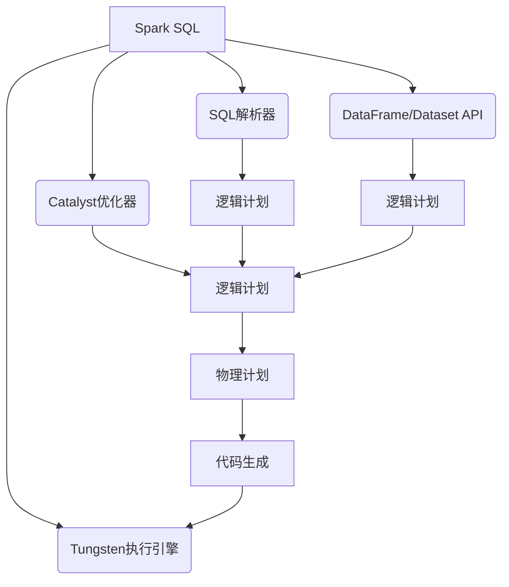
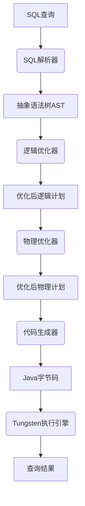

好的，我会按照您提供的要求和结构，撰写一篇高质量的技术博客文章《Spark SQL原理与代码实例讲解》。让我们开始吧！

# Spark SQL原理与代码实例讲解

## 1. 背景介绍

### 1.1 问题的由来

在大数据时代，海量的结构化和非结构化数据的存储和处理成为了一个巨大的挑战。传统的数据库系统在处理大规模数据集时往往会遇到性能瓶颈和可扩展性问题。为了解决这一难题,Apache Spark作为一种新兴的大数据处理框架应运而生。

Spark SQL作为Spark生态系统中的重要组成部分,旨在为结构化数据处理提供高性能、高可扩展性的解决方案。它集成了SQL查询引擎,支持使用SQL或者DataFrame/Dataset API来查询和处理各种数据源中的结构化数据。

### 1.2 研究现状

目前,Spark SQL已经成为大数据领域中广泛使用的SQL查询引擎之一。它不仅支持标准的SQL语法,还提供了丰富的数据源连接器、优化器和执行引擎等功能,可以高效地处理TB甚至PB级别的大数据集。

然而,Spark SQL的内部原理和实现细节对于很多开发者来说仍然是一个黑盒子。深入理解其核心概念、算法原理和代码实现,对于更好地利用Spark SQL、优化查询性能和解决实际问题至关重要。

### 1.3 研究意义

本文将深入探讨Spark SQL的核心原理和实现细节,旨在帮助读者全面了解这一强大的SQL查询引擎。通过剖析核心概念、算法原理、数学模型、代码实例等,读者可以更好地掌握Spark SQL的使用技巧,优化查询性能,并将其应用于实际的大数据处理场景中。

### 1.4 本文结构

本文将按照以下结构进行阐述:

1. 背景介绍
2. 核心概念与联系
3. 核心算法原理与具体操作步骤
4. 数学模型和公式详细讲解与举例说明
5. 项目实践:代码实例和详细解释说明
6. 实际应用场景
7. 工具和资源推荐
8. 总结:未来发展趋势与挑战
9. 附录:常见问题与解答

## 2. 核心概念与联系

在深入探讨Spark SQL的核心算法原理之前,我们需要先了解一些基本的核心概念及它们之间的关系。这些概念构成了Spark SQL的基础框架,对于理解后续内容至关重要。



### 2.1 Catalyst优化器

Catalyst优化器是Spark SQL的查询优化器,负责将SQL查询或DataFrame/Dataset操作转换为高效的执行计划。它包含多个优化阶段,如逻辑优化、代价模型优化和物理优化等,以生成高度优化的执行计划。

### 2.2 Tungsten执行引擎

Tungsten执行引擎是Spark SQL的新一代执行引擎,旨在提高CPU效率和内存利用率。它采用了多种技术,如整个管道代码生成、缓存内核数据以及支持off-heap内存等,从而显著提升了查询执行的性能。

### 2.3 DataFrame/Dataset API

DataFrame和Dataset API提供了一种类似于关系数据库的编程抽象,支持结构化和半结构化数据的处理。它们在内部被转换为逻辑计划,并由Catalyst优化器进行优化和执行。

### 2.4 SQL解析器

SQL解析器负责将SQL查询语句解析为抽象语法树(AST),然后将AST转换为逻辑计划,供Catalyst优化器进一步优化和执行。

### 2.5 逻辑计划和物理计划

逻辑计划描述了要执行的查询操作,而物理计划则描述了如何执行这些操作。Catalyst优化器将逻辑计划转换为高度优化的物理计划,最终由Tungsten执行引擎执行。

### 2.6 代码生成

代码生成是Tungsten执行引擎的一个关键特性。它将物理计划转换为高度优化的Java字节码,以提高CPU效率和内存利用率,从而显著提升查询执行的性能。

## 3. 核心算法原理与具体操作步骤

### 3.1 算法原理概述

Spark SQL的核心算法原理可以概括为以下几个关键步骤:

1. **SQL解析**: 将SQL查询语句解析为抽象语法树(AST)。
2. **逻辑优化**: 对AST进行一系列逻辑优化,如谓词下推、投影剪裁等,生成优化后的逻辑计划。
3. **物理优化**: 根据代价模型和规则,将逻辑计划转换为高度优化的物理计划。
4. **代码生成**: 将物理计划转换为高度优化的Java字节码,供Tungsten执行引擎执行。
5. **执行**: 执行生成的字节码,并返回查询结果。



### 3.2 算法步骤详解

#### 3.2.1 SQL解析

SQL解析器负责将SQL查询语句解析为抽象语法树(AST)。它首先使用ANTLR等工具将SQL语句转换为词法和语法树,然后进行语义分析和解析,生成AST。

#### 3.2.2 逻辑优化

逻辑优化阶段对AST进行一系列优化,以生成更高效的逻辑计划。常见的优化规则包括:

- **谓词下推**: 将过滤条件尽可能下推到数据源,以减少需要处理的数据量。
- **投影剪裁**: 仅选择需要的列,减少内存和CPU开销。
- **常量折叠**: 预计算常量表达式,减少运行时计算。
- **空值优化**: 优化处理空值的逻辑。
- **规则重写**: 根据等价规则重写查询,以生成更优的计划。

#### 3.2.3 物理优化

物理优化阶段根据代价模型和规则,将逻辑计划转换为高度优化的物理计划。常见的优化策略包括:

- **连接重排**: 根据代价模型和数据统计信息,确定最优的连接顺序。
- **分区剪裁**: 利用数据分区信息,剪裁不需要的分区,减少数据读取量。
- **数据倾斜优化**: 通过重分区或采样等方式,缓解数据倾斜问题。
- **算子选择**: 根据数据特征和查询模式,选择最优的算子实现。

#### 3.2.4 代码生成

代码生成阶段将优化后的物理计划转换为高度优化的Java字节码,供Tungsten执行引擎执行。这一过程包括以下几个步骤:

1. **构建Volcano模型**: 将物理计划转换为Volcano模型,即一种树形的查询计划表示。
2. **生成字节码**: 遍历Volcano模型,为每个算子生成高度优化的Java字节码。
3. **编译和优化**: 使用JIT编译器编译生成的字节码,并进行进一步的优化,如循环展开、向量化等。

#### 3.2.5 执行

Tungsten执行引擎执行生成的高度优化的Java字节码,并返回查询结果。在执行过程中,它还采用了多种技术来提高性能,如缓存内核数据、支持off-heap内存等。

### 3.3 算法优缺点

Spark SQL的核心算法具有以下优点:

- **高度优化**: 通过多阶段优化,生成高度优化的执行计划,提高查询性能。
- **代码生成**: 使用代码生成技术,避免解释器开销,提高CPU效率。
- **内存优化**: 采用缓存内核数据、支持off-heap内存等技术,提高内存利用率。

然而,它也存在一些缺点和局限性:

- **优化开销**: 多阶段优化过程可能会带来一定的开销,对于简单查询可能不太合适。
- **代码生成限制**: 代码生成技术目前仍有一些限制,无法覆盖所有查询场景。
- **内存压力**: 虽然采用了内存优化技术,但对于内存密集型查询,内存压力仍然是一个挑战。

### 3.4 算法应用领域

Spark SQL的核心算法广泛应用于以下领域:

- **大数据分析**: 利用Spark SQL高效地处理TB甚至PB级别的结构化大数据集。
- **数据湖查询**: Spark SQL可以高效地查询各种数据源中的结构化数据,如Hive、Parquet等。
- **交互式数据分析**: 借助Spark SQL的DataFrame/Dataset API,可以进行交互式的数据探索和分析。
- **机器学习**: Spark SQL可以为机器学习工作流提供高效的数据处理和特征工程支持。

## 4. 数学模型和公式详细讲解与举例说明

在Spark SQL的核心算法中,数学模型和公式扮演着重要的角色,尤其是在查询优化和代价模型方面。本节将详细讲解一些关键的数学模型和公式,并通过具体案例进行说明。

### 4.1 数学模型构建

#### 4.1.1 代价模型

代价模型是查询优化器中的一个关键组件,用于估计不同执行计划的代价,并选择最优的执行计划。Spark SQL采用了基于代价的优化(CBO)策略,其代价模型主要考虑以下几个因素:

- 数据量: 需要处理的数据量直接影响查询的执行时间。
- 数据分布: 数据在集群中的分布情况会影响数据传输和shuffle的开销。
- CPU和内存开销: 不同算子的CPU和内存开销不同,需要在代价模型中进行估计和考虑。

代价模型通常采用以下公式来估计查询的执行代价:

$$
Cost = \sum_{i=1}^{n} Cost_i(data\_volume, data\_distribution, cpu\_cost, memory\_cost)
$$

其中,$$Cost_i$$表示第$$i$$个算子的代价,$$n$$是算子的总数。每个算子的代价函数$$Cost_i$$取决于数据量、数据分布、CPU开销和内存开销等因素。

#### 4.1.2 数据统计信息

为了准确估计代价模型中的各个参数,Spark SQL需要收集和维护数据统计信息。常见的统计信息包括:

- 行数: 每个表或中间结果的行数。
- 数据大小: 每个表或中间结果的数据大小。
- 列统计信息: 每个列的非空值数、最大值、最小值、数据分布等。
- 分区信息: 表或中间结果的分区信息,如分区数、分区键等。

Spark SQL通过采样或者直接扫描等方式收集这些统计信息,并在查询优化过程中加以利用。

### 4.2 公式推导过程

接下来,我们将通过一个具体的案例,推导出一个常见的代价公式,并说明其中的数学原理。

#### 4.2.1 案例背景

假设我们需要对一个大型表进行聚合操作,计算每个部门的员工总工资。表的结构如下:

```
员工表(员工ID, 部门ID, 工资)
```

我们将研究两种不同的执行计划:

1. 全局聚合: 首先对整个表进行shuffle,然后在单个节点上进行聚合计算。
2. 部分聚合: 首先在每个节点上进行本地聚合,然后对本地聚合结果进行shuffle和最终聚合。

我们需要推导出这两种执行计划的代价公式,并比较它们的效率。

#### 4.2.2 