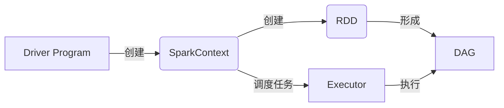

# Spark原理与代码实例讲解

## 1. 背景介绍

### 1.1 问题的由来
在大数据时代,海量数据的处理和分析已成为各行各业面临的重大挑战。传统的数据处理框架如Hadoop MapReduce,虽然能够处理大规模数据集,但在迭代计算和交互式查询等场景下,其性能和效率存在明显不足。为了应对这些问题,Spark应运而生。

### 1.2 研究现状
自2009年诞生以来,Spark凭借其出色的性能和易用性,迅速成为大数据处理领域的主流工具之一。目前,Spark已被广泛应用于数据分析、机器学习、图计算等诸多领域,并在实践中取得了显著成效。国内外学术界和工业界对Spark的研究热度持续高涨,涌现出大量优秀的研究成果。

### 1.3 研究意义
深入研究Spark的原理和应用,对于推动大数据技术的发展和实际应用具有重要意义。一方面,梳理Spark的技术架构和算法原理,有助于我们更好地理解其内在机制,为进一步优化和改进Spark提供理论基础。另一方面,通过实际的代码实例和应用场景分析,可以帮助开发者更高效地使用Spark解决实际问题,提升大数据处理和分析的效率。

### 1.4 本文结构
本文将从以下几个方面对Spark进行深入探讨：首先介绍Spark的核心概念和基本原理;然后重点剖析Spark的核心算法,并给出详细的操作步骤;接着构建Spark的数学模型,推导关键公式,并结合案例进行讲解;在此基础上,通过代码实例和详细的注释说明,演示Spark的具体实现;同时,讨论Spark在实际场景中的应用,并展望其未来发展前景;最后,推荐一些有助于深入学习和应用Spark的工具和资源。

## 2. 核心概念与联系

在正式介绍Spark原理之前,我们有必要先了解几个核心概念：

- RDD(Resilient Distributed Dataset):Spark的基本计算单元,表示一个不可变、可分区、里面元素可并行计算的数据集。RDD是Spark框架的核心抽象。
- DAG(Directed Acyclic Graph):有向无环图,反映RDD之间的依赖关系,是Spark任务调度和执行的基础。  
- Executor:运行在工作节点(Worker Node)上的一个进程,负责执行任务,并为执行任务提供内存存储。
- Driver Program:用户编写的Spark应用程序,通过SparkContext对象来调度任务的执行。
- SparkContext:Spark功能的主要入口,表示与Spark集群的连接,用于创建RDD、累加器和广播变量,以及执行操作。

下图展示了这些核心概念之间的联系:



可以看出,Driver Program通过SparkContext来创建RDD,形成DAG,并调度任务到Executor上执行。RDD是Spark编程的核心,Executor负责实际执行任务。理解这些概念之间的联系,是掌握Spark原理的基础。

## 3. 核心算法原理 & 具体操作步骤

### 3.1 算法原理概述
Spark的核心是RDD,提供了一组丰富的操作算子,包括转换(Transformation)和行动(Action)两大类。Spark采用了惰性计算的策略,转换算子只是记录转换逻辑,而不会立即执行,只有遇到行动算子时,才会触发真正的计算。这种设计使得Spark能够更好地优化计算过程。

### 3.2 算法步骤详解
下面以词频统计(Word Count)为例,详细讲解Spark的工作流程:

1. 根据输入数据集创建RDD。可以从HDFS、本地文件系统、HBase等创建RDD。例如: `val lines = sc.textFile("hdfs://input.txt")`
2. 对RDD应用一系列转换算子,构建处理逻辑。比如先用flatMap分割单词,再用map将每个单词映射为(word, 1)的形式,最后用reduceByKey进行单词计数。
3. 遇到行动算子如collect时,触发实际计算。Spark根据RDD的依赖关系构建DAG图,划分Stage,再进一步划分为多个Task,分发到Executor上执行。
4. 在Executor上执行Task,计算和存储中间结果。Shuffle操作会引入数据的跨节点传输。
5. 将所有Task的执行结果回送到Driver端,组装为最终的结果。

### 3.3 算法优缺点
Spark相比MapReduce的优势主要体现在:

- 基于内存计算,中间结果能够缓存在内存中,避免了不必要的磁盘IO。
- DAG引擎和延迟计算,可以更好地优化任务调度和执行。
- 提供了大量高级算子如join、groupBy等,使用更加灵活方便。

但Spark也存在一些局限:

- 对内存的要求较高,内存资源往往成为瓶颈。
- 任务调度开销相对较大,实时性较差。
- 吞吐量不如专门的流处理框架如Flink。

### 3.4 算法应用领域
得益于其强大的计算能力和灵活性,Spark被广泛应用于以下领域:

- 批处理:海量数据离线处理,如日志分析、用户行为分析等。
- 流处理:处理实时数据流,如实时推荐、异常检测等。
- 图计算:进行复杂的图形数据分析,如社交网络、金融风控等。
- 机器学习:实现大规模机器学习算法,如分类、聚类、协同过滤等。

## 4. 数学模型和公式 & 详细讲解 & 举例说明

### 4.1 数学模型构建
Spark的很多算法都基于统计和机器学习模型。这里以协同过滤(Collaborative Filtering)推荐算法为例,介绍其数学模型。

协同过滤的核心思想是:利用用户的历史行为数据,发掘用户的潜在兴趣偏好,进而给用户推荐感兴趣的物品。其数学模型可表示为:

$$\hat{r}_{ui} = \mu + b_u + b_i + q_i^Tp_u$$

其中:
- $\hat{r}_{ui}$表示预测用户u对物品i的评分。
- $\mu$是全局平均评分。
- $b_u$和$b_i$分别是用户u和物品i的偏置。
- $p_u$和$q_i$分别是用户u和物品i的隐语义向量。

模型的目标是最小化预测评分与实际评分之间的误差:

$$\min_{b_*,p_*,q_*} \sum_{(u,i) \in K} (r_{ui} - \hat{r}_{ui})^2 + \lambda(b_u^2 + b_i^2 + ||p_u||^2 + ||q_i||^2)$$

其中$K$为训练集,即用户-物品评分矩阵中已知的元素。$\lambda$是正则化系数,用于控制过拟合。

### 4.2 公式推导过程
求解上述最优化问题,可采用随机梯度下降法(Stochastic Gradient Descent)。

对于$(u,i) \in K$,记预测误差为:

$$e_{ui} = r_{ui} - \hat{r}_{ui}$$

则各参数的梯度为:

$$\begin{aligned} 
\frac{\partial}{\partial b_u} &= -2e_{ui} + 2\lambda b_u \\
\frac{\partial}{\partial b_i} &= -2e_{ui} + 2\lambda b_i \\
\frac{\partial}{\partial p_u} &= -2e_{ui} \cdot q_i + 2\lambda p_u \\
\frac{\partial}{\partial q_i} &= -2e_{ui} \cdot p_u + 2\lambda q_i
\end{aligned}$$

每次迭代,随机选取一个$(u,i)$,沿梯度的反方向更新参数:

$$\begin{aligned}
b_u &\leftarrow b_u + \alpha (2e_{ui} - 2\lambda b_u) \\
b_i &\leftarrow b_i + \alpha (2e_{ui} - 2\lambda b_i) \\ 
p_u &\leftarrow p_u + \alpha (2e_{ui} \cdot q_i - 2\lambda p_u) \\
q_i &\leftarrow q_i + \alpha (2e_{ui} \cdot p_u - 2\lambda q_i)
\end{aligned}$$

其中$\alpha$为学习率。迭代多轮直至收敛,即可得到模型参数。

### 4.3 案例分析与讲解
下面以电影推荐为例,说明协同过滤算法的应用。

假设有5个用户和4部电影,已知部分用户对电影的评分(5分制),如下表所示:

| 用户\电影 | 电影1 | 电影2 | 电影3 | 电影4 |
|:---:|:---:|:---:|:---:|:---:|
| 用户1 | 4 | ? | 3 | 5 |
| 用户2 | 2 | 3 | ? | ? |
| 用户3 | ? | 4 | 2 | ? |
| 用户4 | 5 | 1 | ? | 2 |
| 用户5 | ? | ? | 4 | 3 |

我们的目标是预测缺失的评分,为用户推荐感兴趣的电影。

首先根据已知评分,计算得到全局平均评分$\mu=3.2$。

然后利用随机梯度下降法学习模型参数。假设隐语义向量维度取10,正则化系数$\lambda=0.1$,学习率$\alpha=0.05$,迭代50轮,最终得到各参数如下:

```
用户偏置:
b_1 = 0.32, b_2 = -0.17, b_3 = 0.08, b_4 = -0.25, b_5 = 0.02

电影偏置:  
b_1 = 0.21, b_2 = -0.14, b_3 = -0.03, b_4 = -0.04

用户隐语义向量:
p_1 = [0.12, ..., -0.09]
p_2 = [-0.21, ..., 0.14]
...

电影隐语义向量:
q_1 = [0.15, ..., -0.08]  
q_2 = [-0.05, ..., 0.11]
...
```

最后,利用学习到的参数,我们可以预测用户对电影的评分。例如,预测用户1对电影2的评分:

$$\hat{r}_{12} = \mu + b_1 + b_2 + q_2^Tp_1 = 3.2 + 0.32 + (-0.14) + q_2^Tp_1 = 3.41$$

可见用户1可能会对电影2感兴趣。类似地,我们可以预测其他缺失的评分,从而实现个性化电影推荐。

### 4.4 常见问题解答

问:协同过滤存在哪些问题?

答:协同过滤主要面临以下问题:
- 冷启动:对新用户和新物品缺乏足够的行为数据,难以做出准确推荐。
- 稀疏性:用户对物品的评分通常非常稀疏,数据缺失严重。
- 扩展性:当用户和物品数量很大时,模型训练的计算开销大。
- 攻击性:恶意用户可通过刷评分等手段,影响推荐结果。

针对这些问题,学术界提出了多种改进方法,如引入社交网络信息缓解冷启动问题,利用矩阵分解等技术处理稀疏评分矩阵,采用分布式计算框架提高扩展性等。

## 5. 项目实践：代码实例和详细解释说明

### 5.1 开发环境搭建
首先需要搭建Spark开发环境。以下是在Ubuntu系统上安装和配置Spark的主要步骤:

1. 安装JDK,配置JAVA_HOME环境变量。
2. 下载Spark安装包,解压到适当目录如/usr/local/spark。
3. 配置SPARK_HOME环境变量,将Spark的bin目录添加到PATH。
4. 下载Hadoop,配置HADOOP_HOME,将Hadoop的bin目录添加到PATH。
5. 修改Spark配置文件spark-env.sh,设置JAVA_HOME、SPARK_DIST_CLASSPATH等。
6. 启动Spark Shell进行测试,确保环境正确安装。

详细的安装配置教程