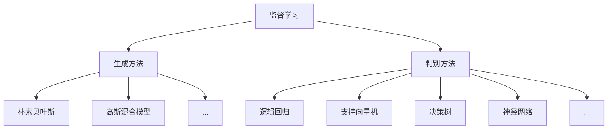

# Supervised Learning 原理与代码实战案例讲解

## 1. 背景介绍

### 1.1 问题的由来

在当今数据时代,海量数据的产生使得数据挖掘和机器学习技术变得越来越重要。作为机器学习的一个核心分支,监督学习(Supervised Learning)已经广泛应用于各个领域,如图像识别、自然语言处理、金融预测等。监督学习的目标是基于已知的输入数据及其对应的标签(label),学习出一个模型,使其能够对新的输入数据做出准确的预测或分类。

### 1.2 研究现状  

监督学习算法主要分为两大类:生成方法(Generative Methods)和判别方法(Discriminative Methods)。生成方法试图学习输入数据的联合概率分布,然后基于该分布对新的输入数据进行预测,典型代表有朴素贝叶斯和高斯混合模型等。判别方法则直接学习输入数据与标签之间的条件概率分布映射,常见的算法有逻辑回归、支持向量机、决策树、神经网络等。近年来,随着深度学习的兴起,基于神经网络的监督学习模型在计算机视觉、自然语言处理等领域取得了突破性的进展。

### 1.3 研究意义

监督学习作为机器学习的基础,对于解决实际问题具有重要意义。准确的监督学习模型可以有效地从复杂的数据中提取有价值的信息,为决策提供依据。同时,监督学习也是其他机器学习任务(如无监督学习、强化学习等)的基础。因此,深入研究监督学习的原理和方法,不仅可以提高模型的预测精度,而且对于推动人工智能的发展也具有重要意义。

### 1.4 本文结构

本文将全面介绍监督学习的核心概念、算法原理、数学模型以及实战案例。第2节阐述监督学习的基本概念和不同算法之间的联系;第3节详细讲解常见监督学习算法的原理和具体操作步骤;第4节推导监督学习中的数学模型及公式,并结合案例进行讲解;第5节通过代码实例展示算法的具体实现;第6节列举监督学习在实际中的应用场景;第7节推荐相关的学习资源和开发工具;最后第8节总结监督学习的发展趋势和面临的挑战。

## 2. 核心概念与联系

监督学习(Supervised Learning)是机器学习中一个重要的任务,其目标是基于已知的输入数据及其对应的标签,学习出一个模型,使其能够对新的输入数据做出准确的预测或分类。根据模型的学习方式,监督学习算法可以分为两大类:

1. **生成方法(Generative Methods)**

生成方法试图学习输入数据的联合概率分布 $P(X,Y)$,然后根据贝叶斯公式得到条件概率分布 $P(Y|X)$,进而对新的输入数据 $X$ 做出预测。典型的生成方法算法包括:

- **朴素贝叶斯(Naive Bayes)**: 基于贝叶斯定理与特征条件独立假设,计算条件概率分布进行预测。
- **高斯混合模型(Gaussian Mixture Model)**: 假设数据服从多个高斯分布的混合,使用期望最大化算法估计模型参数。
- **...** 

2. **判别方法(Discriminative Methods)**

判别方法则直接学习输入数据与标签之间的条件概率分布映射 $P(Y|X)$,无需估计联合概率分布。常见的判别方法算法包括:

- **逻辑回归(Logistic Regression)**: 对数几率回归模型,将输入特征的线性组合映射到 $(0,1)$ 区间,用于二分类问题。
- **支持向量机(Support Vector Machine)**: 寻找最大间隔超平面将数据分开,具有良好的泛化能力。
- **决策树(Decision Tree)**: 根据特征对数据空间进行递归分割,构建决策树模型。
- **神经网络(Neural Network)**: 模拟生物神经网络,通过多层非线性变换拟合输入与输出的映射关系。
- **...**

生成方法和判别方法各有优缺点。生成方法能够较好地解释数据的产生过程,但是往往基于一些较强的先验假设,如果假设不满足,预测效果可能不佳。而判别方法直接对条件概率建模,预测性能通常更好,但缺乏对数据潜在结构的解释。在实践中,需要根据具体问题的特点选择合适的算法。

## 3. 核心算法原理 & 具体操作步骤  

在这一节,我们将详细介绍几种常见的监督学习算法的原理和具体操作步骤。

### 3.1 算法原理概述

1. **逻辑回归(Logistic Regression)**

逻辑回归是一种广义线性模型,通过对数几率函数将输入特征的线性组合映射到 $(0,1)$ 区间,从而解决二分类问题。模型的目标是最小化负对数似然函数,可以使用梯度下降等优化算法求解。

2. **支持向量机(Support Vector Machine)**

支持向量机的基本思想是在特征空间中寻找一个最大间隔超平面,将不同类别的数据分开。对于线性可分的情况,支持向量机能够找到全局最优解;对于非线性情况,可以通过核技巧将数据映射到高维空间,从而在新的特征空间中寻找最优超平面。

3. **决策树(Decision Tree)** 

决策树是一种基于递归分割的监督学习算法。它从根节点开始,根据某个特征将数据空间分割为若干子空间,在子空间上继续递归分割,直到满足停止条件。最终构建出一棵决策树,对新的输入数据,只需从根节点遍历到叶节点,即可得到其类别预测。常用的决策树算法包括ID3、C4.5和CART等。

4. **神经网络(Neural Network)**

神经网络是一种模拟生物神经网络的监督学习模型。它由多个层次构成,每一层由多个神经元组成。输入层接收输入数据,然后经过多层非线性变换,最终在输出层得到预测结果。神经网络的训练过程是一个反向传播的过程,通过优化算法(如梯度下降)不断调整网络参数,使损失函数最小化。

### 3.2 算法步骤详解

1. **逻辑回归算法步骤**

输入: 训练数据集 $\mathcal{D}=\{(x_i,y_i)\}_{i=1}^N$,其中 $x_i\in\mathbb{R}^d$ 为 $d$ 维特征向量, $y_i\in\{0,1\}$ 为二分类标签。
输出: 逻辑回归模型参数 $\theta$。

步骤:
1) 定义逻辑回归模型: $P(Y=1|X=x)=\sigma(\theta^Tx)$, 其中 $\sigma(z)=\frac{1}{1+e^{-z}}$ 为 Sigmoid 函数。
2) 定义模型的负对数似然函数(Loss Function): $J(\theta)=-\frac{1}{N}\sum_{i=1}^N\big[y_i\log\sigma(\theta^Tx_i)+(1-y_i)\log(1-\sigma(\theta^Tx_i))\big]$
3) 使用优化算法(如梯度下降)最小化损失函数: $\theta^*=\arg\min_\theta J(\theta)$
4) 对新的输入数据 $x$, 使用训练得到的模型参数 $\theta^*$ 进行预测: $\hat{y}=\begin{cases}1&\text{if }\sigma(\theta^{*T}x)\geq0.5\\0&\text{otherwise}\end{cases}$

2. **支持向量机算法步骤**  

输入: 训练数据集 $\mathcal{D}=\{(x_i,y_i)\}_{i=1}^N$, 其中 $x_i\in\mathbb{R}^d$ 为 $d$ 维特征向量, $y_i\in\{-1,1\}$ 为二分类标签。
输出: 支持向量机模型参数 $w,b$。

步骤:
1) 构造拉格朗日函数:
$$
L(w,b,\alpha)=\frac{1}{2}\|w\|^2-\sum_{i=1}^N\alpha_i\big[y_i(w^Tx_i+b)-1\big]
$$
其中 $\alpha_i\geq0$ 为拉格朗日乘子。
2) maksimize 拉格朗日对偶函数:
$$
\max_\alpha\min_{w,b}L(w,b,\alpha)\quad\text{s.t. }\sum_{i=1}^N\alpha_iy_i=0,\alpha_i\geq0
$$
3) 求解得到最优 $\alpha^*$, 从而可以计算出 $w^*=\sum_{i=1}^N\alpha_i^*y_ix_i$, 以及 $b^*$ 通过任意支持向量计算得到。
4) 对新的输入数据 $x$, 使用训练得到的模型参数 $w^*,b^*$ 进行预测: $\hat{y}=\text{sign}(w^{*T}x+b^*)$

3. **决策树算法步骤(以ID3算法为例)** 

输入: 训练数据集 $\mathcal{D}$, 特征集 $\mathcal{A}$, 阈值参数 $\epsilon$
输出: 决策树模型 $\mathcal{T}$

步骤:
1) 计算数据集 $\mathcal{D}$ 的经验熵 $H(\mathcal{D})$
2) 对每个特征 $A\in\mathcal{A}$ 计算信息增益 $\text{Gain}(A)=H(\mathcal{D})-H(\mathcal{D}|A)$
3) 选择信息增益最大的特征 $A_g$, 将 $\mathcal{D}$ 按照 $A_g$ 的取值分割为若干子集 $\{\mathcal{D}_j\}$
4) 对每个子集 $\mathcal{D}_j$:
    - 如果 $\mathcal{D}_j$ 中实例属于同一类别,则将 $\mathcal{D}_j$ 标记为该类别的叶节点
    - 如果 $\mathcal{A}=\emptyset$ 或 $H(\mathcal{D}_j)<\epsilon$, 则将 $\mathcal{D}_j$ 标记为majorityCLASS的叶节点
    - 否则,从 $\mathcal{A}$ 中选择最优特征,对 $\mathcal{D}_j$ 递归构建子树
5) 返回构建完成的决策树 $\mathcal{T}$

4. **神经网络算法步骤**

输入: 训练数据集 $\mathcal{D}=\{(x_i,y_i)\}_{i=1}^N$, 神经网络结构(层数、神经元数等)
输出: 神经网络模型参数 $\Theta$  

步骤:
1) 初始化神经网络权重参数 $\Theta$
2) 定义损失函数 $J(\Theta)$ (如交叉熵损失)
3) 使用优化算法(如梯度下降)最小化损失函数:
    - 前向传播计算输出 $\hat{y}=f(x;\Theta)$  
    - 计算损失函数 $J(\Theta)$
    - 反向传播计算梯度 $\nabla_\Theta J(\Theta)$
    - 更新参数 $\Theta\leftarrow\Theta-\eta\nabla_\Theta J(\Theta)$
4) 重复3)直到收敛或满足停止条件
5) 得到训练好的神经网络模型参数 $\Theta^*$
6) 对新输入 $x$, 使用 $\Theta^*$ 进行预测 $\hat{y}=f(x;\Theta^*)$

### 3.3 算法优缺点

1. **逻辑回归**
    - 优点: 模型简单,可解释性强,计算高效
    - 缺点: 对于非线性决策边界的问题,效果不佳
    
2. **支持向量机**
    - 