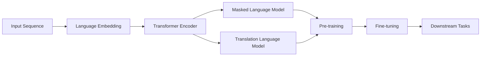

# Transformer大模型实战 对XLM模型的评估

## 1. 背景介绍
### 1.1 问题的由来
随着深度学习技术的不断发展,自然语言处理(NLP)领域也取得了巨大的进步。Transformer作为一种新型的神经网络结构,凭借其强大的建模能力和并行计算能力,在机器翻译、文本分类、问答系统等NLP任务中取得了显著的效果提升。而近年来,预训练语言模型如BERT、GPT等的出现,进一步推动了NLP技术的发展。

在这一背景下,Facebook AI Research提出了跨语言语言模型XLM(Cross-lingual Language Model),旨在通过大规模多语言语料的预训练,构建一个通用的跨语言语义表示空间,从而实现零样本和少样本的跨语言迁移学习。XLM在多个跨语言NLP任务上取得了state-of-the-art的效果。

### 1.2 研究现状
目前,Transformer已经成为NLP领域的主流模型架构。各大科技公司和研究机构纷纷推出了基于Transformer的大规模预训练语言模型,如谷歌的BERT、OpenAI的GPT系列、Facebook的RoBERTa等。这些模型通过在大规模无监督语料上进行预训练,可以学习到语言的通用表示,再通过Fine-tuning的方式应用到下游任务,大幅提升了模型性能。

在跨语言NLP研究方面,传统方法主要基于词典或者平行语料进行映射,但效果有限。近年来,研究者开始探索利用多语言预训练模型来实现跨语言迁移。除了Facebook的XLM,谷歌也提出了多语言版BERT。这些模型在多个跨语言任务如XNLI、MLQA等上取得了显著的效果提升。

### 1.3 研究意义
评估XLM等跨语言预训练模型具有重要的研究意义:

1. 探索Transformer在跨语言场景下的建模能力,推动跨语言NLP的发展。
2. 研究如何更好地利用多语言无监督语料,提升模型的语言理解和生成能力。
3. 为构建通用的语言理解系统奠定基础,推动人工智能走向通用人工智能。
4. 评估不同语言之间的差异和相似性,加深对人类语言的认知。

### 1.4 本文结构
本文将全面评估XLM模型在跨语言场景下的效果。第2部分介绍XLM的核心概念和原理。第3部分详细阐述XLM的预训练和Fine-tuning算法。第4部分建立XLM的数学模型并推导相关公式。第5部分通过实践代码演示XLM的实现细节。第6部分讨论XLM的实际应用场景。第7部分推荐XLM相关的学习资源和工具。第8部分总结全文,展望XLM的未来发展方向和挑战。第9部分列举XLM的常见问题解答。

## 2. 核心概念与联系
XLM的核心思想是利用Transformer构建一个跨语言的语义表示空间。其关键概念包括:

- Transformer编码器:使用多头注意力和前馈网络对输入序列进行编码,学习输入的上下文表示。XLM沿用了Transformer的编码器结构。
- 语言嵌入:将不同语言统一映射到同一嵌入空间,消除语言差异。XLM使用了语言嵌入和共享词嵌入的方式。
- 掩码语言模型:通过随机Mask输入序列的一部分Token,预测这些Token,学习上下文信息。XLM使用MLM作为预训练任务之一。
- 翻译语言模型:通过拼接不同语言的平行句子,预测下一个Token,学习语言之间的对齐关系。TLM是XLM的另一个预训练任务。

下图展示了XLM的整体架构:

## 3. 核心算法原理 & 具体操作步骤
### 3.1 算法原理概述
XLM的训练分为两个阶段:预训练阶段和Fine-tuning阶段。

在预训练阶段,XLM使用两个任务:MLM和TLM。MLM任务随机Mask输入序列的一部分Token,让模型去预测这些Token。TLM任务将两种语言的平行句子拼接在一起,让模型预测下一个Token。通过这两个任务,XLM可以学习到语言内部和语言之间的关系。

在Fine-tuning阶段,XLM在下游任务的训练集上进行微调,根据任务的不同输入输出形式,在Transformer编码器后接入不同的输出层,如分类、序列标注等。Fine-tuning可以快速适应具体任务,获得更好的效果。

### 3.2 算法步骤详解
1. 语料预处理:将多语言语料进行Tokenize,统一词表。对于TLM任务,需要构建平行句子对。
2. 输入表示:对每个Token,使用词嵌入、位置嵌入和语言嵌入的加和作为输入表示。
3. Transformer编码:使用多层Transformer编码器对输入序列进行编码,每一层包括多头注意力、残差连接、LayerNorm和前馈网络。
4. MLM任务:随机Mask输入的一部分Token,用`[MASK]`替换,让模型预测这些位置的词。损失函数为被Mask位置的交叉熵损失。
5. TLM任务:将两种语言的平行句子拼接在一起,让模型预测下一个Token。损失函数为语言建模的交叉熵损失。
6. 预训练:在MLM和TLM任务上对XLM进行预训练,学习跨语言的语义表示。采用AdamW优化器,设置学习率Warmup和衰减策略。
7. Fine-tuning:根据下游任务的输入输出形式,在Transformer编码器后接入任务特定的输出层,在任务训练集上进行微调。
8. 推理:对测试集进行推理,根据任务的评价指标计算模型效果。

### 3.3 算法优缺点
XLM算法的优点:
- 利用Transformer学习语言内部和语言之间的深层关系
- 使用MLM和TLM任务,可以有效利用无监督的多语言语料
- 通过Fine-tuning的方式,可以快速适应不同的下游任务
- 在多个跨语言理解任务上取得了state-of-the-art的效果

XLM算法的缺点:
- 模型参数量大,训练和推理成本高
- 对低资源语言的建模效果有限,需要更多的平行语料支持
- 在生成任务如机器翻译上的效果还有待提高
- 解释性差,难以分析模型内部的工作机制

### 3.4 算法应用领域
XLM算法可以应用到多种跨语言NLP任务中,包括但不限于:
- 跨语言文本分类:如情感分析、新闻分类等
- 跨语言文本匹配:如自然语言推理、问答、语义相似度等
- 跨语言命名实体识别:识别文本中的人名、地名、机构名等
- 跨语言关系抽取:抽取文本中的实体关系
- 零样本/少样本跨语言学习:利用源语言的标注数据,对目标语言进行迁移学习

## 4. 数学模型和公式 & 详细讲解 & 举例说明
### 4.1 数学模型构建
对于输入序列$\mathbf{x}=(x_1,\ldots,x_n)$,XLM的数学模型可以表示为:

$$
\begin{aligned}
\mathbf{h}_0 &= \mathrm{Embedding}(\mathbf{x}) \\
\mathbf{h}_l &= \mathrm{Transformer}\_\mathrm{Encoder}(\mathbf{h}_{l-1}), l=1,\ldots,L \\
p(\mathrm{MASK}|\mathbf{h}_L) &= \mathrm{softmax}(\mathbf{W}_{\mathrm{MLM}}\mathbf{h}_L + \mathbf{b}_{\mathrm{MLM}}) \\
p(x_{t+1}|\mathbf{h}_L) &= \mathrm{softmax}(\mathbf{W}_{\mathrm{TLM}}\mathbf{h}_L + \mathbf{b}_{\mathrm{TLM}})
\end{aligned}
$$

其中,$\mathrm{Embedding}$表示输入嵌入,$\mathrm{Transformer}\_\mathrm{Encoder}$表示Transformer编码器,$L$为编码器层数,$\mathbf{W}_{\mathrm{MLM}},\mathbf{b}_{\mathrm{MLM}}$为MLM任务的输出参数,$\mathbf{W}_{\mathrm{TLM}},\mathbf{b}_{\mathrm{TLM}}$为TLM任务的输出参数。

Transformer编码器的计算公式为:

$$
\begin{aligned}
\mathbf{a}_l &= \mathrm{MultiHead}(\mathbf{h}_{l-1}, \mathbf{h}_{l-1}, \mathbf{h}_{l-1}) \\
\mathbf{h}'_l &= \mathrm{LayerNorm}(\mathbf{h}_{l-1} + \mathbf{a}_l) \\ 
\mathbf{h}_l &= \mathrm{LayerNorm}(\mathbf{h}'_l + \mathrm{FeedForward}(\mathbf{h}'_l))
\end{aligned}
$$

其中,$\mathrm{MultiHead}$为多头注意力机制,$\mathrm{LayerNorm}$为层归一化,$\mathrm{FeedForward}$为前馈网络。

### 4.2 公式推导过程
MLM任务的损失函数为被Mask位置的交叉熵损失:

$$
\mathcal{L}_{\mathrm{MLM}} = -\sum_{x_t \in \mathrm{MASK}} \log p(x_t|\mathbf{h}_L)
$$

TLM任务的损失函数为语言建模的交叉熵损失:

$$
\mathcal{L}_{\mathrm{TLM}} = -\sum_{t=1}^{n-1} \log p(x_{t+1}|\mathbf{h}_L)
$$

XLM的总体损失为两个任务损失的加权和:

$$
\mathcal{L} = \alpha \mathcal{L}_{\mathrm{MLM}} + (1-\alpha) \mathcal{L}_{\mathrm{TLM}}
$$

其中,$\alpha$为MLM任务的权重系数。

### 4.3 案例分析与讲解
我们以一个简单的例子来说明XLM的训练过程。假设我们有一个英语-法语的平行句子对:

- 英语:The cat sat on the mat.
- 法语:Le chat s'est assis sur le tapis.

首先,我们将两个句子Tokenize,并添加语言嵌入和位置嵌入:

$$
\begin{aligned}
\mathbf{x}^{en} &= [x^{en}_1,\ldots,x^{en}_7] \\
\mathbf{x}^{fr} &= [x^{fr}_1,\ldots,x^{fr}_8] \\
\mathbf{e}^{en} &= [\mathrm{Emb}^{en}_1,\ldots,\mathrm{Emb}^{en}_7] \\
\mathbf{e}^{fr} &= [\mathrm{Emb}^{fr}_1,\ldots,\mathrm{Emb}^{fr}_8] \\
\mathbf{p}^{en} &= [\mathrm{Pos}^{en}_1,\ldots,\mathrm{Pos}^{en}_7] \\
\mathbf{p}^{fr} &= [\mathrm{Pos}^{fr}_1,\ldots,\mathrm{Pos}^{fr}_8] \\
\mathbf{h}^{en}_0 &= \mathbf{e}^{en} + \mathbf{p}^{en} \\
\mathbf{h}^{fr}_0 &= \mathbf{e}^{fr} + \mathbf{p}^{fr}
\end{aligned}
$$

然后,我们将两个句子拼接在一起,作为TLM任务的输入:

$$
\mathbf{x} = [\mathrm{CLS}^{en}, x^{en}_1,\ldots,x^{en}_7, \mathrm{SEP}^{en}, \mathrm{CLS}^{fr}, x^{fr}_1,\ldots,x^{fr}_8, \mathrm{SEP}^{fr}]
$$

接下来,我们随机Mask输入序列的一部分Token,如将sat替换为`[MASK]