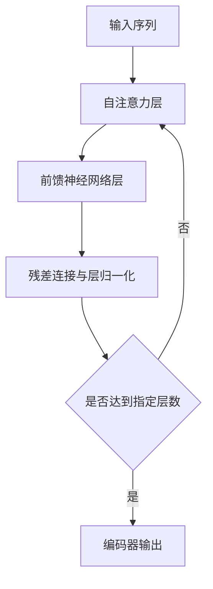

# Transformer大模型实战 编码器总览

作者：禅与计算机程序设计艺术 / Zen and the Art of Computer Programming

## 1. 背景介绍
### 1.1 问题的由来
近年来，随着深度学习的快速发展，自然语言处理(NLP)领域取得了突破性进展。从早期的循环神经网络(RNN)，到后来的长短期记忆网络(LSTM)和门控循环单元(GRU)，再到如今风靡一时的Transformer模型，NLP技术不断迭代升级。尤其是Transformer模型的出现，引领了NLP进入"预训练+微调"的新时代。

### 1.2 研究现状 
自从2017年谷歌提出Transformer模型以来，各大科技公司和研究机构纷纷开展Transformer相关研究。Transformer最初应用于机器翻译领域，后来逐渐扩展到文本分类、命名实体识别、问答系统、文本摘要等多个NLP任务。近两年，以BERT、GPT、XLNet为代表的预训练语言模型相继问世，进一步提升了Transformer的性能和应用范围。

### 1.3 研究意义
深入研究Transformer编码器，对于理解Transformer的内部机制、改进模型性能、拓展应用场景都具有重要意义。通过剖析编码器的结构细节，我们可以洞察其强大性能的奥秘所在。在此基础上，可以尝试优化编码器，如引入新的注意力机制、改进层归一化等，以进一步提升模型效果。此外，编码器作为Transformer的核心组件，直接决定了下游任务的表现，因此深入理解编码器对于开发Transformer新应用至关重要。

### 1.4 本文结构
本文将重点介绍Transformer编码器，内容涵盖编码器的整体架构、自注意力机制、前馈神经网络、残差连接与层归一化等关键组件。同时，本文将通过数学推导、代码实现、案例分析等方式，帮助读者全面掌握编码器的原理和实战技巧。文章结构如下：

第2部分介绍编码器的核心概念；第3部分阐述编码器的算法原理；第4部分给出编码器涉及的数学模型和公式；第5部分提供编码器的代码实现；第6部分讨论编码器的应用场景；第7部分推荐编码器相关的学习资源；第8部分总结全文并展望编码器的未来发展。

## 2. 核心概念与联系

Transformer编码器的核心概念包括：

1. 自注意力机制(Self-Attention Mechanism)：允许编码器的每个位置关注输入序列的所有位置，捕捉长距离依赖关系。
2. 多头注意力(Multi-Head Attention)：将自注意力机制独立执行多次，增强模型的表示能力。
3. 前馈神经网络(Feed-Forward Network)：由两个线性变换和一个非线性激活函数组成，增加模型的非线性。  
4. 残差连接(Residual Connection)：将前一层的输出与当前层的输出相加，缓解梯度消失问题。
5. 层归一化(Layer Normalization)：对每个样本进行归一化，加速模型收敛。

这些概念环环相扣，共同构建了编码器的计算流程。输入首先经过自注意力计算，捕捉序列内部的依赖关系；然后通过前馈神经网络引入非线性变换；接着利用残差连接缓解梯度消失；最后使用层归一化加速收敛。多个编码器层的堆叠，进一步提升了模型的表示能力。

## 3. 核心算法原理 & 具体操作步骤
### 3.1 算法原理概述
Transformer编码器采用自注意力机制和前馈神经网络的组合，逐层提取输入序列的特征表示。下面给出编码器的总体计算流程：



### 3.2 算法步骤详解

1. 输入表示：将输入序列X映射为嵌入向量E，并加上位置编码P得到最终输入H0。

2. 自注意力计算：
   - 将输入 $H_{i-1}$ 通过线性变换得到查询矩阵Q、键矩阵K、值矩阵V；
   - 计算Q与K的点积并除以 $\sqrt{d_k}$，得到注意力分数矩阵 $A=softmax(\frac{QK^T}{\sqrt{d_k}})$；
   - 将注意力分数矩阵A与值矩阵V相乘，得到自注意力输出 $Att(H_{i-1}) = AV$;
   - 将多头注意力的结果拼接并线性变换，得到 $H_i'$。

3. 前馈神经网络：
   - 将 $H_i'$ 通过两个线性变换和ReLU激活，得到 $FFN(H_i')$。

4. 残差连接与层归一化：
   - 将前一层输出 $H_{i-1}$ 与 $H_i'$ 相加，再做层归一化，得到 $H_i$。

5. 重复步骤2~4，直到达到指定的编码器层数N。

6. 输出层归一化后的 $H_N$ 作为编码器的最终输出。

### 3.3 算法优缺点

优点：
- 自注意力机制能够捕捉长距离依赖，对位置不敏感；
- 多头注意力增强了模型的表示能力；
- 残差连接缓解了梯度消失问题，加深了网络深度；
- 层归一化加速了模型收敛。

缺点：
- 计算复杂度随着序列长度呈平方级增长，难以处理超长文本；
- 缺乏先验知识，需要大规模数据进行预训练；
- 推理速度慢，不适合实时场景。

### 3.4 算法应用领域
Transformer编码器可以应用于几乎所有的NLP任务，如文本分类、命名实体识别、语义角色标注、文本摘要、阅读理解等。此外，编码器还可以作为预训练模型BERT的骨干网络，进一步扩大其应用范围。

## 4. 数学模型和公式 & 详细讲解 & 举例说明
### 4.1 数学模型构建
Transformer编码器可以表示为一个函数 $f(X)$，将输入序列 $X=(x_1,\cdots,x_n)$ 映射为隐藏状态序列 $H=(h_1,\cdots,h_n)$，其中 $x_i,h_i \in \mathbb{R}^d$。

编码器由N个相同的层堆叠而成，每一层包含两个子层：自注意力层和前馈神经网络层。

令 $H_0=E+P$，其中 $E \in \mathbb{R}^{n \times d}$ 为词嵌入矩阵，$P \in \mathbb{R}^{n \times d}$ 为位置编码矩阵。对于第 $i(1 \leq i \leq N)$ 层，有：

$$
\begin{aligned}
H_i' &= MultiHead(LayerNorm(H_{i-1})) + H_{i-1} \\
H_i &= FFN(LayerNorm(H_i')) + H_i'
\end{aligned}
$$

其中，$MultiHead(\cdot)$ 为多头自注意力层，$FFN(\cdot)$ 为前馈神经网络层，$LayerNorm(\cdot)$ 为层归一化。最终，编码器输出 $H_N$ 作为输入序列X的特征表示。

### 4.2 公式推导过程

1. 自注意力层

自注意力层首先将输入 $H_{i-1} \in \mathbb{R}^{n \times d}$ 通过线性变换得到查询矩阵 $Q$、键矩阵 $K$ 和值矩阵 $V$：

$$
\begin{aligned}
Q &= H_{i-1}W_Q \\
K &= H_{i-1}W_K \\
V &= H_{i-1}W_V
\end{aligned}
$$

其中，$W_Q, W_K, W_V \in \mathbb{R}^{d \times d_k}$ 为可学习的参数矩阵，$d_k=d/h$，$h$ 为自注意力头数。

接着，计算查询矩阵 $Q$ 和键矩阵 $K$ 的相似度得分，并除以 $\sqrt{d_k}$ 进行缩放：

$$
A = \frac{QK^T}{\sqrt{d_k}} \in \mathbb{R}^{n \times n}
$$

然后，对得分矩阵 $A$ 进行 Softmax 归一化，得到注意力权重矩阵：

$$
\alpha = Softmax(A) \in \mathbb{R}^{n \times n}
$$

最后，将注意力权重矩阵 $\alpha$ 与值矩阵 $V$ 相乘，得到自注意力输出：

$$
Att(H_{i-1}) = \alpha V \in \mathbb{R}^{n \times d_k}
$$

多头自注意力的计算可以表示为：

$$
MultiHead(H_{i-1}) = Concat(head_1, \cdots, head_h)W_O
$$

其中，$head_j = Att(H_{i-1})$，$W_O \in \mathbb{R}^{hd_k \times d}$ 为可学习的参数矩阵。

2. 前馈神经网络层

前馈神经网络层包含两个线性变换和一个ReLU激活函数：

$$
FFN(x) = max(0, xW_1 + b_1)W_2 + b_2
$$

其中，$W_1 \in \mathbb{R}^{d \times d_{ff}}, b_1 \in \mathbb{R}^{d_{ff}}$，$W_2 \in \mathbb{R}^{d_{ff} \times d}, b_2 \in \mathbb{R}^d$ 为可学习的参数，$d_{ff}$ 为前馈神经网络的隐藏层维度。

3. 残差连接与层归一化

残差连接将前一层的输出与当前层的输出相加，有助于缓解梯度消失问题：

$$
x + Sublayer(LayerNorm(x))
$$

其中，$Sublayer(\cdot)$ 表示自注意力层或前馈神经网络层。

层归一化对每个样本进行归一化，加速模型收敛：

$$
LayerNorm(x) = \frac{x-\mu}{\sqrt{\sigma^2+\epsilon}} \odot \gamma + \beta
$$

其中，$\mu,\sigma^2$ 分别为样本的均值和方差，$\gamma,\beta$ 为可学习的缩放和偏移参数，$\epsilon$ 为平滑项。

### 4.3 案例分析与讲解
下面以一个简单的例子来说明编码器的计算过程。假设输入序列X为：

```
[CLS] 今天 天气 真 好 [SEP]
```

对应的词嵌入矩阵 $E \in \mathbb{R}^{6 \times d}$，位置编码矩阵 $P \in \mathbb{R}^{6 \times d}$。首先，将 $E$ 与 $P$ 相加得到输入表示 $H_0$：

$$
H_0 = E + P =
\begin{bmatrix}
e_{[CLS]} \\
e_{今天} \\
e_{天气} \\
e_{真} \\
e_{好} \\
e_{[SEP]} 
\end{bmatrix} +
\begin{bmatrix}
p_0 \\
p_1 \\
p_2 \\
p_3 \\
p_4 \\
p_5
\end{bmatrix}
$$

然后，$H_0$ 通过自注意力层，计算查询矩阵 $Q$、键矩阵 $K$ 和值矩阵 $V$：

$$
Q = H_0W_Q, \quad K = H_0W_K, \quad V = H_0W_V
$$

接着，计算自注意力输出 $Att(H_0)$：

$$
Att(H_0) = Softmax(\frac{QK^T}{\sqrt{d_k}})V
$$

再经过前馈神经网络层、残差连接和层归一化，得到第一层的输出 $H_1$：

$$
H_1 = FFN(LayerNorm(Att(H_0) + H_0)) + Att(H_0) + H_0
$$

以此类推，最终得到编码器的输出 $H_N$，作为输入序列X的特征表示。

### 4.4 常见问题解答
问：自注意力机制为什么要对点