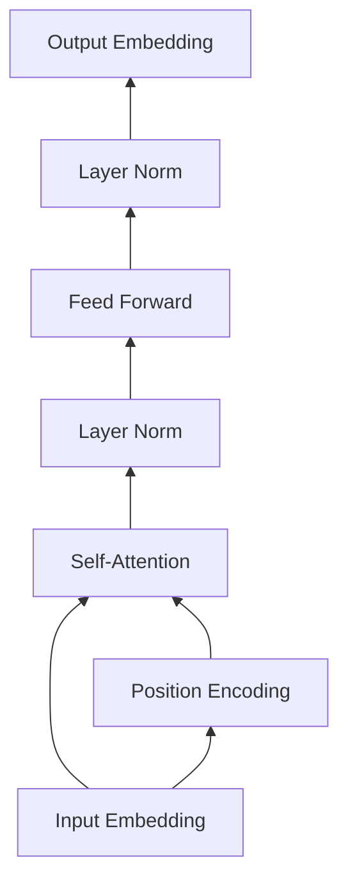

# Transformer大模型实战 预训练过程

## 1. 背景介绍
### 1.1 问题的由来
近年来,随着深度学习技术的飞速发展,自然语言处理(NLP)领域取得了突破性的进展。Transformer作为一种革命性的神经网络架构,在机器翻译、文本分类、问答系统等众多NLP任务中表现出色。尤其是基于Transformer架构的大规模预训练语言模型,如BERT、GPT等,进一步推动了NLP技术的发展。然而,训练一个高质量的Transformer大模型并非易事,其中预训练过程是至关重要的一环。

### 1.2 研究现状
当前,业界主流的Transformer预训练方法主要包括:
- 基于自回归语言模型的预训练,如GPT系列模型。
- 基于去噪自编码器的预训练,如BERT、RoBERTa等。 
- 基于对比学习的预训练,如ELECTRA、COCO-LM等。

不同的预训练方法各有优劣,如何选择合适的预训练策略,并进行高效的预训练,是当前研究的热点问题。

### 1.3 研究意义
深入研究Transformer大模型的预训练过程,对于理解其工作原理,提高预训练效率,改进预训练效果具有重要意义。一方面,优化的预训练策略可以降低计算资源消耗,缩短训练时间;另一方面,更好的预训练效果意味着下游任务精度的提升,这将极大促进NLP技术在各领域的应用。

### 1.4 本文结构
本文将围绕Transformer大模型预训练展开深入探讨,内容涵盖以下几个方面:

1. Transformer的核心概念与原理
2. 主流的Transformer预训练方法详解
3. 预训练过程中的关键技术与优化策略  
4. 动手实践:基于Hugging Face的预训练实战
5. 预训练模型的评估与应用

## 2. 核心概念与联系
在探讨Transformer预训练之前,我们有必要回顾一下Transformer的核心概念:

- Self-Attention:自注意力机制是Transformer的核心,使其能够捕捉文本中长距离的依赖关系。
- Multi-Head Attention:多头注意力通过引入多个Self-Attention并行计算,增强模型的表达能力。
- Positional Encoding:位置编码为输入序列引入位置信息,使Transformer能够建模序列的顺序特征。
- Layer Normalization:层归一化有助于稳定模型训练,加速收敛。
- Residual Connection:残差连接使得网络可以构建更深的结构,有效缓解梯度消失问题。

下图展示了Transformer的整体架构:

可以看到,Self-Attention、Layer Normalization、Feed Forward Network等模块的堆叠构成了Transformer的主体结构,Positional Encoding则为输入提供了位置信息。

这些概念环环相扣,共同构建了Transformer强大的特征提取和建模能力,为其在NLP领域的广泛应用奠定了基础。而大规模预训练则进一步释放了Transformer的潜力,使其在下游任务上取得了突破性的表现。

## 3. 核心算法原理 & 具体操作步骤
### 3.1 算法原理概述
Transformer的预训练本质上是一个自监督学习的过程,通过设计巧妙的预训练任务,让模型从大规模无标注语料中自动学习语言知识和通用特征表示。常见的预训练任务包括:

- 语言模型:通过让模型预测下一个单词,学习语言的统计规律和上下文信息。代表模型如GPT系列。
- 去噪自编码:通过随机遮挡部分输入,让模型恢复原始文本,学习语义相关的鲁棒特征。代表模型如BERT系列。
- 对比学习:通过正负样本对比,让模型学习语义一致的文本应具有相似的特征表示。代表模型如ELECTRA。

这些预训练任务的共同点是构建了一个自监督的学习信号,使模型能够在无需人工标注的情况下,自动学习语言知识。

### 3.2 算法步骤详解
以BERT的预训练为例,其主要步骤如下:

1. 语料准备:收集大规模无标注的文本语料,进行清洗和预处理。
2. 输入表示:对输入文本进行Token化,映射为词嵌入向量,并加入位置编码和片段嵌入。
3. Masking:对输入序列进行随机Mask,即以一定概率将部分Token替换为[MASK]占位符。
4. Transformer编码:将Mask后的输入送入Transformer的多层编码器,提取上下文相关的特征表示。
5. MLM任务:以Mask位置的输出作为分类特征,通过一个全连接层预测Mask位置的原始Token。
6. NSP任务:将两个片段拼接为一个序列输入,通过特殊的[CLS]位置输出进行二分类,判断两个片段是否连续。
7. 损失计算:将MLM和NSP任务的预测结果与真实标签进行交叉熵损失计算,得到总的损失函数。
8. 参数更新:利用反向传播算法计算梯度,并使用优化器(如Adam)更新模型参数。

重复以上步骤,直到模型收敛或达到预设的训练轮数,即完成了预训练过程。预训练得到的模型可以在下游任务上进行微调,或作为特征提取器供其他模型使用。

### 3.3 算法优缺点

BERT预训练的优点在于:
- 引入了双向建模,可以更好地捕捉上下文信息。
- Mask机制使模型学习到更鲁棒的特征表示。
- 引入NSP任务有助于建模句间关系。

但它也存在一些缺点:
- 预训练计算量大,对算力要求高。
- 固定长度输入限制了对长文本的建模能力。
- 预训练和微调的不一致性可能影响模型性能。

因此,后续的一些工作如RoBERTa、ELECTRA等,在此基础上进行了改进和优化。

### 3.4 算法应用领域
基于Transformer的预训练语言模型已经成为NLP领域的标配,其应用领域十分广泛,包括但不限于:

- 机器翻译:将预训练模型应用于编码器-解码器框架,显著提升翻译质量。
- 文本分类:利用预训练模型提取文本特征,再接分类器,可以胜任各种分类任务。
- 命名实体识别:将预训练模型用于序列标注,识别文本中的实体类别。
- 问答系统:利用预训练模型理解问题和上下文,从而给出准确的答案。
- 文本生成:基于GPT等预训练模型,可以进行开放域的文本生成。

随着预训练技术的不断发展,其应用领域也在不断扩展,为NLP注入了新的活力。

## 4. 数学模型和公式 & 详细讲解 & 举例说明
### 4.1 数学模型构建
Transformer的预训练可以用如下数学模型来描述:

给定一个无标注的语料库 $\mathcal{D} = \{x_1, x_2, ..., x_n\}$,其中 $x_i$ 表示一个文本序列。我们的目标是学习一个Transformer编码器 $f_{\theta}$,使其能够从语料中提取有效的特征表示。

对于BERT的预训练,主要包括两个任务:MLM和NSP。

MLM任务可以表示为:

$$
\mathcal{L}_{MLM} = -\sum_{i=1}^{n}\sum_{j=1}^{m} \mathbb{I}(x_j^i = [MASK]) \log p(x_j^i | \hat{x}^i, \theta)
$$

其中 $\mathbb{I}$ 为指示函数, $x_j^i$ 表示序列 $x_i$ 的第 $j$ 个Token, $\hat{x}^i$ 表示Mask后的输入序列。

NSP任务可以表示为:

$$
\mathcal{L}_{NSP} = -\sum_{i=1}^{n} y_i \log p(y_i | x_i, \theta) + (1 - y_i) \log (1 - p(y_i | x_i, \theta))
$$

其中 $y_i$ 表示两个片段是否连续的标签。

最终的预训练损失为两个任务损失的加权和:

$$
\mathcal{L} = \mathcal{L}_{MLM} + \lambda \mathcal{L}_{NSP}
$$

通过最小化该损失函数,我们可以得到一个预训练的Transformer编码器 $f_{\theta}$。

### 4.2 公式推导过程
MLM任务的损失函数可以进一步推导为:

$$
\begin{aligned}
\mathcal{L}_{MLM} &= -\sum_{i=1}^{n}\sum_{j=1}^{m} \mathbb{I}(x_j^i = [MASK]) \log p(x_j^i | \hat{x}^i, \theta) \\
&= -\sum_{i=1}^{n}\sum_{j=1}^{m} \mathbb{I}(x_j^i = [MASK]) \log \frac{\exp(e(x_j^i)^T f_{\theta}(\hat{x}^i)_j)}{\sum_{k=1}^{|V|} \exp(e(k)^T f_{\theta}(\hat{x}^i)_j)}
\end{aligned}
$$

其中 $e(x)$ 表示Token $x$ 的词嵌入向量, $f_{\theta}(\hat{x}^i)_j$ 表示Transformer编码器在位置 $j$ 的输出, $|V|$ 为词表大小。

可以看到,MLM任务本质上是一个多分类问题,通过最小化交叉熵损失来学习Transformer编码器的参数。

NSP任务的损失函数则是一个二分类交叉熵损失:

$$
\mathcal{L}_{NSP} = -\sum_{i=1}^{n} y_i \log \sigma(w^T f_{\theta}(x_i)_{[CLS]}) + (1 - y_i) \log (1 - \sigma(w^T f_{\theta}(x_i)_{[CLS]}))
$$

其中 $\sigma$ 为Sigmoid函数, $w$ 为分类器参数, $f_{\theta}(x_i)_{[CLS]}$ 表示 $[CLS]$ 位置的Transformer输出。

通过最小化以上两个任务的损失函数,即可完成BERT的预训练过程。

### 4.3 案例分析与讲解
下面我们以一个简单的例子来说明BERT预训练的过程:

假设我们有以下两个文本片段:
- $x_1$ = "The quick brown fox jumps over the lazy dog"
- $x_2$ = "The lazy dog sleeps in the sun"

对于MLM任务,我们随机Mask其中的几个单词,例如:
- $\hat{x}_1$ = "The quick [MASK] fox jumps over the [MASK] dog"
- $\hat{x}_2$ = "The lazy dog [MASK] in the sun"

Transformer编码器将提取Mask位置的上下文特征,并预测被Mask单词的概率分布。例如对于 $\hat{x}_1$ 的第一个[MASK],模型可能输出:
- $p(brown | \hat{x}_1, \theta) = 0.8$
- $p(black | \hat{x}_1, \theta) = 0.1$
- $p(red | \hat{x}_1, \theta) = 0.05$
- ...

我们将这个概率分布与真实标签 "brown" 进行交叉熵损失计算,得到MLM任务的损失。

对于NSP任务,我们将两个片段拼接为一个序列,并在开头添加[CLS]标记:
- $x = $ "[CLS] The quick brown fox jumps over the lazy dog [SEP] The lazy dog sleeps in the sun"

Transformer编码器提取整个序列的特征,并在[CLS]位置输出一个分类特征。我们将其送入分类器,预测两个片段是否连续:
- $p(y = 1 | x, \theta) = \sigma(w^T f_{\theta}(x)_{[CLS]}) = 0.2$

表明模型认为这两个片段不太可能是连续的。我们将这个概率与真实标签(这里为0)进行交叉熵损失计算,得到NSP任务的损失。

最后,我们将MLM和NSP任务的损失相加,得到总的预训练损失,并通过反向传播算法更新模型参