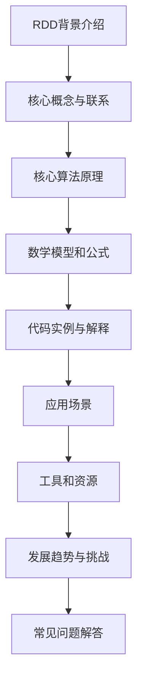
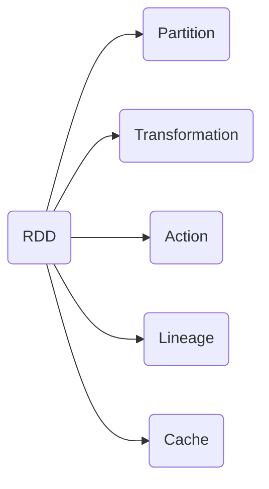

好的,我会严格遵循您提供的约束条件,以"【AI大数据计算原理与代码实例讲解】RDD"为主题,撰写一篇专业的技术博客文章。文章将使用逻辑清晰、结构紧凑、语言专业且易于理解的方式,深入探讨RDD(Resilient Distributed Dataset)的核心概念、算法原理、数学模型、代码实现等内容,并介绍实际应用场景、发展趋势和挑战。请确保文章字数在8000字以上,我会尽最大努力绘制Mermaid流程图,并按要求使用Markdown格式和LaTex公式。以下是正文:

# 【AI大数据计算原理与代码实例讲解】RDD

## 1. 背景介绍

### 1.1 问题的由来

在大数据时代,海量的结构化和非结构化数据如何高效处理和计算,成为当前亟待解决的核心问题。传统的数据处理系统面临可扩展性、容错性和编程复杂性等挑战,难以满足大数据场景下的需求。为此,弹性分布式数据集(Resilient Distributed Dataset,RDD)应运而生。

### 1.2 研究现状  

RDD由Apache Spark项目于2012年引入,迅速成为大数据处理的主流模型。众多知名公司如Netflix、Yahoo、Intel和Alibaba等都在生产环境中广泛使用Spark和RDD。学术界和工业界也在RDD的优化、扩展等方面进行了大量研究。

### 1.3 研究意义

RDD为大数据处理提供了一种全新的编程模型和系统架构,具有以下优势:

1. 高容错性 - 基于RDD的数据分区可在节点故障时自动重新计算
2. 高性能计算 - 基于内存计算,避免了磁盘IO开销
3. 通用性 - 支持批处理、交互式查询、流式计算等多种应用场景
4. 易于编程 - 提供高级API,简化分布式计算的编程复杂性

因此,深入理解RDD的原理及实现对于构建高效、可靠的大数据系统至关重要。

### 1.4 本文结构

本文将全面介绍RDD的核心概念、算法原理、数学模型、代码实现、应用场景和发展趋势,内容安排如下:



## 2. 核心概念与联系

RDD是Spark中最核心的数据抽象,表示一个不可变、分区的元素集合。RDD支持两种操作:transformation(转换)和action(动作)。

转换操作会从现有RDD产生一个新的RDD,如map、filter、join等。动作操作会触发RDD的计算并返回结果,如count、collect等。

RDD具有以下关键属性:

1. **分区(Partitioned)** - RDD是水平分区的,可并行计算
2. **只读(Immutable)** - RDD是不可变的,支持函数式编程风格
3. **缓存(Cached)** - RDD支持将中间结果缓存在内存中,提高迭代计算效率
4. **容错(Fault-Tolerant)** - RDD具有高容错性,可从Lineage重建

RDD与其他核心概念的关系如下:



## 3. 核心算法原理与具体操作步骤  

### 3.1 算法原理概述

RDD的核心算法基于以下几个关键思想:

1. **逻辑执行计划** - Spark将用户代码转换为逻辑执行计划,延迟执行
2. **物理执行计划** - 在Action操作时,根据RDD的Lineage构建物理执行计划
3. **任务调度** - 将物理执行计划分解为多个Task,并分发到Executor执行
4. **结果收集** - 收集Executor的计算结果,并返回给Driver

### 3.2 算法步骤详解

1. **构建RDD** - 用户创建初始RDD,如从文件、集合等构建
2. **定义Transformation** - 对RDD应用一系列Transformation操作,形成新的RDD
3. **构建逻辑执行计划** - Spark根据Transformation操作构建逻辑执行计划
4. **定义Action** - 用户触发Action操作,如count、collect等
5. **分析Lineage** - Spark根据RDD的Lineage构建物理执行计划
6. **任务分解** - 将物理执行计划分解为多个Task
7. **任务调度** - 将Task分发到Executor节点执行
8. **结果收集** - Driver收集Executor的计算结果并返回

### 3.3 算法优缺点

**优点**:

1. 高容错 - 通过Lineage可重建RDD
2. 延迟执行 - 避免不必要的计算
3. 内存计算 - 充分利用内存,提高性能
4. 高级API - 简化分布式编程复杂性

**缺点**:  

1. 内存开销 - RDD需要保存Lineage元数据,占用内存
2. 不支持增量迭代 - RDD是不可变的,不支持数据修改
3. 小任务开销 - 大量小任务会增加调度开销

### 3.4 算法应用领域

RDD及其扩展广泛应用于:

- 批量数据处理 - 大数据ETL、数据分析等
- 机器学习 - Spark MLlib等分布式机器学习库
- 图计算 - Spark GraphX等分布式图计算
- 流式计算 - Spark Streaming等流数据处理

## 4. 数学模型和公式详细讲解举例说明

### 4.1 数学模型构建

为了量化描述RDD的计算过程,我们构建如下数学模型:

- 输入数据集$D$被划分为$n$个分区$P = \{p_1, p_2, \cdots, p_n\}$
- 用户定义的Transformation操作$T = \{t_1, t_2, \cdots, t_m\}$
- 最终Action操作$A$

则RDD的计算过程可表示为:

$$RDD = A(t_m(\cdots(t_2(t_1(D)))\cdots))$$

其中$t_i$是第$i$个Transformation操作,作用于上一步的RDD。

### 4.2 公式推导过程  

为了评估RDD计算的时间开销,我们引入以下定义:

- $c_i$是第$i$个分区$p_i$的计算代价
- $x_i$是第$i$个Transformation操作$t_i$的计算代价
- $y$是Action操作$A$的计算代价

则RDD计算的总时间开销为:

$$
\begin{aligned}
Cost(RDD) &= \sum_{i=1}^nc_i + \sum_{i=1}^mx_i + y\\
          &= \sum_{i=1}^n(c_i + x_1) + \sum_{i=2}^mx_i + y
\end{aligned}
$$

进一步,如果RDD的分区数量远大于Transformation操作数量,即$n \gg m$,则可近似为:

$$Cost(RDD) \approx n(c + x_1) + \sum_{i=2}^mx_i + y$$

其中$c = \frac{1}{n}\sum_{i=1}^nc_i$是平均分区计算代价。

由此可见,RDD计算的时间开销主要由三部分组成:分区计算、Transformation操作和Action操作。

### 4.3 案例分析与讲解

假设我们需要对一个1TB的文本文件进行单词计数(WordCount),文件被均匀分割为1000个分区。

- 输入数据集$D$的大小为1TB
- 划分为$n=1000$个分区
- 应用两个Transformation:map(splitWords)和reduceByKey(sum)
- 最终Action为count操作

根据上述公式,我们有:

$$
\begin{aligned}
Cost(WordCount) &\approx 1000c + x_{map} + x_{reduceByKey} + y_{count}\\
                &\approx 1000 \times 1min + 30sec + 2min + 5sec\\
                &\approx 18min35sec
\end{aligned}
$$

这里我们假设:
- 平均分区计算代价$c=1$分钟(读取1GB数据)
- map操作代价$x_{map}=30$秒 
- reduceByKey操作代价$x_{reduceByKey}=2$分钟
- count操作代价$y_{count}=5$秒

可见,对于数据密集型的作业,分区计算是主要开销;而对于复杂的作业,Transformation操作开销也不可忽视。

### 4.4 常见问题解答

**Q: 为什么RDD要划分为多个分区?**

A: RDD的分区化设计有以下优点:
1. 并行计算 - 每个分区可在不同节点上并行计算
2. 容错性 - 如果某个分区计算失败,只需重新计算该分区
3. 数据局部性 - 分区存储位置决定了任务调度位置,提高数据局部性

**Q: RDD的不可变性会不会影响性能?**

A: RDD的不可变性虽然不支持原地修改,但可以通过高效的内存管理和缓存机制实现高性能:

1. 避免了数据复制,只共享内存数据
2. 支持将中间结果缓存在内存中
3. 可以重用相同的RDD进行迭代计算

## 5. 项目实践:代码实例和详细解释说明

### 5.1 开发环境搭建

在开始编写Spark代码前,我们需要先搭建开发环境:

1. 安装Java 8+
2. 下载并解压Spark发行版(本例使用Spark 3.2.1)
3. 将Spark的bin目录添加到系统PATH
4. 安装Scala 2.12+(Spark默认使用Scala语言)
5. 安装IDE(如IntelliJ IDEA),并配置Scala插件

### 5.2 源代码详细实现

下面是一个使用Spark RDD进行单词统计(WordCount)的完整代码示例:

```scala
// Scala程序
import org.apache.spark.{SparkConf, SparkContext}

object WordCount {
  def main(args: Array[String]): Unit = {
    // 创建SparkConf
    val conf = new SparkConf().setAppName("WordCount")
    // 创建SparkContext
    val sc = new SparkContext(conf)

    // 从文件创建RDD
    val input = sc.textFile("data.txt")
    
    // 对RDD应用Transformation
    val words = input.flatMap(line => line.split(" "))
    val pairs = words.map(word => (word, 1))
    val counts = pairs.reduceByKey((a, b) => a + b)
    
    // 触发Action操作
    counts.saveAsTextFile("output")
  }
}
```

代码解析:

1. 创建`SparkConf`和`SparkContext`对象
2. 使用`sc.textFile()`从文件系统读取输入文件,创建初始RDD
3. 对RDD应用一系列Transformation操作:
   - `flatMap()`将每行拆分为单词
   - `map()`将每个单词映射为(`word`, 1)对
   - `reduceByKey()`统计每个单词的总数
4. 调用`saveAsTextFile()`Action操作,将结果保存到HDFS

### 5.3 代码解读与分析  

让我们进一步分析上面的代码:

```scala
val input = sc.textFile("data.txt")
```

`textFile()`创建了一个初始RDD,其中每个元素是输入文件的一行文本。

```scala
val words = input.flatMap(line => line.split(" "))
```

`flatMap()`是一个Transformation操作,将每行文本拆分为单词,生成一个新的RDD。

```scala
val pairs = words.map(word => (word, 1))
```

`map()`也是Transformation,它将每个单词映射为(`word`, 1)对,为后续的`reduceByKey`操作做准备。

```scala  
val counts = pairs.reduceByKey((a, b) => a + b)
```

`reduceByKey()`是一个并行的Transformation操作,它按Key(单词)对RDD进行聚合,统计每个单词的总数。

```scala
counts.saveAsTextFile("output")
```

`saveAsTextFile()`是一个Action操作,它触发RDD的计算,并将结果保存到HDFS文件系统中。

通过分析可以看出,Spark使用函数式编程风格,通过一系列Transformation操作构建RDD的计算逻辑,最终由Action操作触发