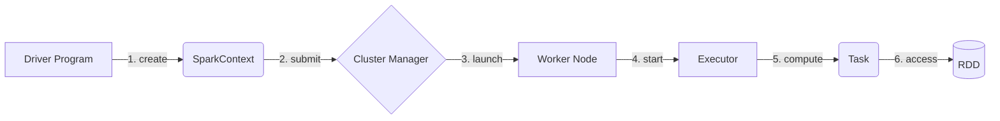
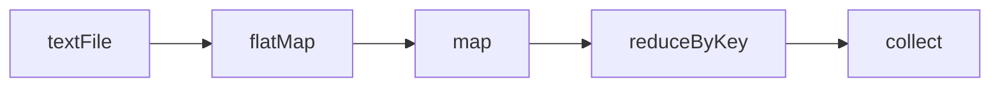

# 【AI大数据计算原理与代码实例讲解】Spark

关键词：Spark, 大数据, 分布式计算, RDD, Spark SQL, Spark Streaming, 机器学习, 图计算

## 1. 背景介绍
### 1.1 问题的由来
随着互联网、物联网、移动互联网等技术的快速发展,数据正在以前所未有的速度增长。IDC预测,到2025年,全球数据总量将达到163ZB。面对如此海量的大数据,传统的数据处理和分析方法已经无法满足实时性、高效性的要求。因此,迫切需要一种新的大数据处理技术来应对这一挑战。
### 1.2 研究现状
目前,大数据计算领域涌现出了多种技术和框架,如Hadoop、Spark、Flink等。其中,Spark凭借其快速、通用、易用等特点,已成为最流行的大数据处理框架之一。Spark诞生于加州大学伯克利分校AMP实验室,2013年成为Apache基金会的顶级项目。目前已被广泛应用于各大互联网公司,如阿里、腾讯、百度、优酷土豆等。
### 1.3 研究意义
深入研究Spark的原理和应用,对于掌握大数据处理技术,提升数据分析效率,实现数据价值最大化具有重要意义。通过学习Spark的设计思想、核心概念、编程模型等,可以帮助我们建立大数据计算的知识体系,培养分布式计算思维。同时,研究Spark在实际场景中的应用案例,有助于我们把握最新的行业动态,找到技术创新的结合点。
### 1.4 本文结构
本文将从以下几个方面对Spark进行深入讲解：
- 首先介绍Spark的核心概念与基本原理,包括RDD、DAG、Executor等
- 然后重点讲解Spark的核心算法,包括RDD转换算子、行动算子的实现原理
- 接着通过数学模型和公式,对Spark的Shuffle、缓存、容错等机制进行建模分析
- 之后给出Spark核心组件的代码实例,并进行详细的解释说明
- 最后总结Spark的实际应用场景,并展望其未来的发展趋势与挑战

## 2. 核心概念与联系
Spark是一个基于内存的分布式计算框架,其核心是弹性分布式数据集(RDD)编程模型。RDD是Spark最基本的数据抽象,表示一个被分区、只读、容错的数据集合。RDD可以通过两种方式创建:
1. 在驱动程序中并行化一个已有的集合
2. 从外部存储系统如HDFS、HBase读取数据生成

RDD支持两种类型的操作:转换(Transformation)和行动(Action)。转换操作用于将RDD转换为一个新的RDD,如map、filter、join等。行动操作用于触发RDD的计算并返回结果给Driver程序或写入外部存储,如count、collect、saveAsTextFile等。Spark使用惰性计算模型,转换操作只记录如何计算,只有遇到行动操作时才会触发真正的计算。

Spark的基本架构由以下几个核心组件构成:

- Driver Program:Spark的驱动程序,负责创建SparkContext,构建DAG图,分发任务到Executor
- Cluster Manager:集群资源管理器,如Standalone、Mesos、YARN
- Worker Node:集群中的工作节点,负责管理计算资源和启动Executor进程  
- Executor:运行在工作节点上的进程,负责执行计算任务和存储RDD数据

下图展示了Spark的基本架构:



Spark的整个工作流程如下:
1. 用户编写Driver程序,创建SparkContext对象
2. Driver向集群管理器申请资源,启动Executor进程
3. Driver将任务以Task的形式发送给Executor
4. Executor执行Task,访问RDD数据并进行计算
5. 计算结果返回给Driver程序或写入外部存储系统

## 3. 核心算法原理 & 具体操作步骤
### 3.1 算法原理概述
Spark的核心是RDD编程模型,围绕RDD的转换和行动操作展开。RDD的转换算子可分为Value类型和Key-Value类型。Value类型的转换算子包括:map、flatMap、filter、distinct、sample等。Key-Value类型的转换算子包括:reduceByKey、groupByKey、sortByKey、join等。RDD的行动算子主要包括:reduce、collect、count、first、take、saveAsTextFile等。
### 3.2 算法步骤详解  
下面以常见的词频统计WordCount程序为例,详细讲解RDD转换和行动算子的工作原理。WordCount的Spark实现主要分为以下几个步骤:
1. 使用textFile算子从HDFS读取文本文件,创建初始RDD
2. 对初始RDD执行flatMap算子,将每一行文本切分为单词,生成新的RDD
3. 使用map算子将每个单词映射为(word, 1)的二元组形式
4. 使用reduceByKey算子对二元组按单词进行分组聚合,累加出现次数
5. 使用collect算子将结果RDD的数据收集到Driver程序中,打印输出

整个流程可用下面的DAG图表示:

其中,textFile、flatMap、map是转换算子,collect是行动算子。每个RDD的计算结果只有在执行collect算子时才会真正触发。
### 3.3 算法优缺点
Spark相比传统的MapReduce计算模型,具有如下优点:
- 基于内存计算,中间结果可缓存到内存中,避免不必要的磁盘IO
- 支持DAG图的任务调度,转换算子之间可以形成流水线,减少了数据落地
- 提供多种语言API,包括Scala、Java、Python、R等
- 支持交互式数据分析,可在Shell中即时查看计算结果
- 提供80多种RDD算子,使用简单灵活

但Spark也存在一些局限性:
- 不适合流式数据的实时处理,微批次架构会引入一定的延迟
- 不支持细粒度的状态管理,状态数据的高效存储和容错是个挑战
- 调优参数较多,需要对源码和原理有深入理解才能优化性能

### 3.4 算法应用领域
Spark在众多领域得到广泛应用,主要包括:
- 电商:用户行为分析、商品推荐、广告点击率预测等
- 金融:风险模型训练、实时欺诈检测、股票行情分析等
- 物联网:传感器数据处理、设备健康管理、工业生产优化等 
- 电信:通话记录分析、流量预测、网络异常检测等
- 交通:轨迹数据挖掘、交通流量预测、智能调度等

## 4. 数学模型和公式 & 详细讲解 & 举例说明
### 4.1 数据模型构建
Spark的数学建模主要体现在以下几个方面:
1. RDD的数据结构可以用分布式的链表或数组表示,每个分区对应一个数据块
2. Lineage(血统)机制可以用有向无环图DAG建模,每个RDD节点记录转换关系
3. Shuffle洗牌过程可以用排列组合的思想建模,数据量和分区数决定Shuffle的代价
4. 缓存和CheckPoint可以用集合论的思想建模,内存和磁盘的数据集是原RDD的子集

举个例子,假设有一个RDD数据集,包含1到100共100个整数,分布在10个分区中。现在要对其应用map算子,把每个元素乘以2,然后用reduce算子对所有元素求和。这个计算过程可以用数学公式表示如下:

$$
\begin{aligned}
&map:\{x_1,x_2,...,x_{100}\} \rightarrow \{2x_1,2x_2,...,2x_{100}\} \\
&reduce:\sum_{i=1}^{100} 2x_i = 2\sum_{i=1}^{100} x_i = 2\frac{(1+100)\times100}{2}=10100
\end{aligned}
$$

### 4.2 公式推导过程
对于WordCount程序,我们也可以用数学语言描述其计算过程。假设输入数据集D中共有m个单词,其中有n个不同的单词,第i个单词出现的次数为$c_i$。那么WordCount的数学描述如下:
1. 输入数据集: $D=\{w_1,w_2,...,w_m\}$
2. flatMap后的数据集: $D'=\{w_1,w_2,...,w_m\}$
3. map后的数据集: $D''=\{(w_1,1),(w_2,1),...,(w_m,1)\}$
4. reduceByKey后的数据集: $D'''=\{(w_1,c_1),(w_2,c_2),...,(w_n,c_n)\}$
5. 最终结果: $R=\{(w_1,c_1),(w_2,c_2),...,(w_n,c_n)\}$

其中,单词$w_i$出现的概率$p_i$和信息熵$H(D)$可以计算如下:

$$
p_i=\frac{c_i}{m}, \quad H(D)=\sum_{i=1}^n p_i\log\frac{1}{p_i}
$$

### 4.3 案例分析与讲解
下面我们以一个实际的WordCount例子来说明。假设输入数据集为:

```
hello world
hello spark 
hadoop world
```

经过flatMap和map操作后,得到的中间数据集为:

```
(hello, 1), (world, 1), (hello, 1), (spark, 1), (hadoop, 1), (world, 1)
```

经过reduceByKey操作后,得到的结果数据集为:

```
(hello, 2), (world, 2), (spark, 1), (hadoop, 1)  
```

这里共有6个单词,4个不同的单词,每个单词出现的次数为:

$$
c_{hello}=2,c_{world}=2,c_{spark}=1,c_{hadoop}=1
$$

每个单词出现的概率为:

$$
p_{hello}=\frac{1}{3},p_{world}=\frac{1}{3},p_{spark}=\frac{1}{6},p_{hadoop}=\frac{1}{6}
$$

数据集的信息熵为:

$$
\begin{aligned}
H(D) &= \frac{1}{3}\log 3+\frac{1}{3}\log 3+\frac{1}{6}\log 6+\frac{1}{6}\log 6 \\
     &\approx 1.9183\ bit
\end{aligned}
$$

### 4.4 常见问题解答
1. 什么是RDD的Lineage机制?
Lineage记录了RDD之间的依赖关系,用于容错恢复。窄依赖表示一个父RDD的分区只被一个子RDD使用,宽依赖表示被多个子RDD使用。

2. Spark有哪些共享变量?分别适用什么场景?
Spark提供了两种共享变量:Broadcast Variable和Accumulator。Broadcast Variable用于在所有节点间高效地广播一个较大的只读值。Accumulator用于在工作节点上累加计数器,只能在Driver程序中读取。

3. Spark的缓存和CheckPoint有什么区别?
缓存将RDD数据存储在内存或磁盘,但不切断Lineage,可以重新计算。CheckPoint将RDD数据存储到可靠的存储系统如HDFS,切断Lineage,是一种粗粒度的容错机制。

4. Spark有哪些常见的调优参数?
num-executors:配置Executor的数量
executor-memory:配置每个Executor的内存大小
executor-cores:配置每个Executor的CPU核数
driver-memory:配置Driver的内存大小
spark.default.parallelism:配置每个Stage的默认任务数
spark.storage.memoryFraction:配置RDD缓存可占用的内存比例

## 5. 项目实践:代码实例和详细解释说明
### 5.1 开发环境搭建
Spark应用程序可以使用Scala、Java、Python、R等多种语言编写。这里我们以Scala为例,介绍Spark的开发环境搭建步骤:
1. 安装JDK,推荐1.8以上版本
2. 安装Scala,推荐2.12以上版本
3. 下载Spark,推荐2.4以上版本
4. 安装IDE,推