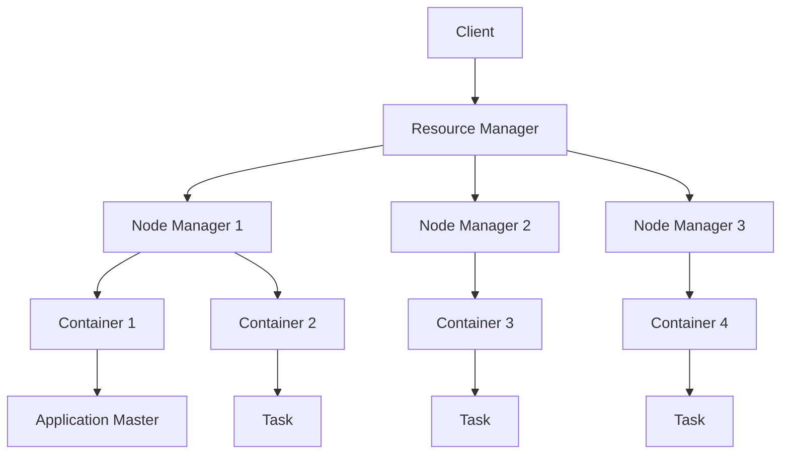

# 【AI大数据计算原理与代码实例讲解】Yarn

关键词：Yarn、资源管理、任务调度、大数据计算、Hadoop

## 1. 背景介绍
### 1.1  问题的由来
随着大数据时代的到来,数据的规模和复杂性不断增加,传统的计算模式已经无法满足海量数据处理的需求。Hadoop作为一个开源的分布式计算框架,为大数据处理提供了强大的支持。然而,随着Hadoop生态系统的不断发展,其内置的资源管理和任务调度系统MapReduce已经难以适应日益复杂的大数据应用场景。因此,急需一个更加灵活、高效、可扩展的资源管理和任务调度系统。
### 1.2  研究现状
为了解决MapReduce面临的问题,Apache Hadoop社区推出了下一代资源管理和任务调度系统——Yarn(Yet Another Resource Negotiator)。Yarn将资源管理和任务调度功能从MapReduce中剥离出来,形成了一个通用的资源管理平台。目前,Yarn已经成为Hadoop生态系统中的核心组件之一,被广泛应用于各种大数据计算场景中。
### 1.3  研究意义
深入研究Yarn的原理和应用,对于掌握大数据计算的核心技术具有重要意义。通过学习Yarn的架构设计、资源管理机制、任务调度算法等,可以更好地理解现代分布式计算系统的工作原理。同时,通过实践Yarn的部署和应用开发,可以提升大数据处理的效率和性能,为解决实际问题提供有力支撑。
### 1.4  本文结构
本文将从以下几个方面对Yarn进行深入探讨：
- 首先,介绍Yarn的核心概念和基本架构,阐述其在Hadoop生态系统中的地位和作用。 
- 然后,重点分析Yarn的资源管理和任务调度机制,包括资源请求和分配、任务提交和执行等关键流程。
- 接着,通过数学建模和公式推导,揭示Yarn调度算法的核心原理,并给出具体的案例分析。
- 此外,本文还将提供Yarn的代码实例和详细解释,帮助读者深入理解其实现细节。
- 最后,探讨Yarn在实际应用场景中的优势和挑战,展望其未来的发展趋势。

## 2. 核心概念与联系

在正式介绍Yarn之前,我们先来了解一下其核心概念：

- Resource Manager(RM):全局资源管理器,负责整个集群的资源管理和分配。
- Node Manager(NM):节点管理器,负责单个节点的资源管理和任务执行。
- Application Master(AM):应用管理器,负责单个应用程序的管理和任务调度。
- Container:资源容器,是Yarn中资源分配和任务执行的基本单位。

下图展示了Yarn的基本架构和各个组件之间的关系:



从图中可以看出,Client提交应用程序后,Resource Manager会为其分配资源并启动Application Master。Application Master再向Resource Manager申请资源,并与Node Manager通信,在获得的Container中执行具体的任务(Task)。

Yarn的这种架构设计有效地解耦了资源管理和任务调度,提供了一个通用的资源管理平台。不同的计算框架(如MapReduce、Spark等)可以基于Yarn构建自己的Application Master,实现灵活的任务调度和执行。

## 3. 核心算法原理 & 具体操作步骤
### 3.1  算法原理概述
Yarn的核心是其资源管理和任务调度机制,主要涉及以下几个关键算法:
1. 资源请求和分配算法
2. 任务提交和执行算法
3. 任务优先级和队列管理算法
4. 任务故障恢复和重试算法

这些算法共同构成了Yarn的计算引擎,保证了集群资源的高效利用和任务的正确执行。
### 3.2  算法步骤详解
下面以资源请求和分配算法为例,详细说明其工作步骤:
1. Application Master向Resource Manager提交资源请求,包括所需的CPU、内存等参数。
2. Resource Manager根据集群的资源状态和应用的优先级,决定是否满足该请求。
3. 如果有足够的资源,Resource Manager会在集群中选择合适的Node Manager,为应用分配Container。
4. Application Master获取到Container后,与对应的Node Manager通信,启动任务执行进程。
5. Node Manager定期向Resource Manager汇报Container的使用情况,以便及时释放空闲资源。

可以看到,资源请求和分配过程涉及到多个组件的协调和通信,需要综合考虑集群资源、应用需求、任务优先级等因素。
### 3.3  算法优缺点
Yarn的资源管理和任务调度算法具有以下优点:
- 解耦资源管理和任务调度,提供了通用的计算平台。
- 支持多种调度策略,如容量调度、公平调度等,满足不同场景的需求。
- 实现了细粒度的资源分配和任务调度,提高了集群利用率。
- 具备较好的容错性和可扩展性,能够处理大规模集群和复杂任务。

同时,Yarn也存在一些局限性:
- 对于短任务和实时计算场景,调度开销相对较大。
- 对资源的抢占和隔离支持有限,可能影响任务的性能和公平性。
- 应用程序需要实现特定的API和协议,开发和迁移成本较高。
### 3.4  算法应用领域
Yarn的资源管理和任务调度算法已经在多个领域得到广泛应用,如:
- 大数据处理:Hadoop、Spark等计算框架都基于Yarn构建。
- 机器学习:TensorFlow、MXNet等深度学习平台也支持Yarn调度。
- 流式计算:Storm、Flink等流处理框架可以运行在Yarn之上。

此外,Yarn还被用于图计算、内存计算、批处理等多种计算场景,展现出强大的适应性和通用性。

## 4. 数学模型和公式 & 详细讲解 & 举例说明
### 4.1  数学模型构建
为了深入理解Yarn的资源分配机制,我们可以建立一个简化的数学模型。假设集群中有$n$个节点,每个节点的资源向量为$R_i(1\leq i\leq n)$,包含CPU、内存等维度。当前有$m$个应用,每个应用的资源请求向量为$Q_j(1\leq j\leq m)$。我们的目标是找到一个资源分配矩阵$X$,使得:

$$
\begin{aligned}
\max &\sum_{j=1}^m\sum_{i=1}^n x_{ij}U(Q_j,R_i) \\
s.t. &\sum_{j=1}^m x_{ij}Q_j \leq R_i, \forall i \\
&x_{ij}\in\{0,1\}, \forall i,j
\end{aligned}
$$

其中,$x_{ij}$表示是否将应用$j$分配到节点$i$上,$U(Q_j,R_i)$表示分配的效用函数。目标是在满足资源约束的情况下,最大化整个集群的效用。
### 4.2  公式推导过程
上述模型可以进一步简化和求解。假设效用函数为线性的,即$U(Q_j,R_i)=Q_j^TR_i$,则目标函数可以改写为:

$$
\max \sum_{j=1}^m\sum_{i=1}^n x_{ij}Q_j^TR_i
$$

这样,原问题就转化为一个典型的整数规划问题。考虑到实际场景中的各种约束和优化目标,可以采用启发式算法或近似算法来求解,如贪心算法、动态规划等。
### 4.3  案例分析与讲解
下面我们通过一个简单的例子来说明Yarn的资源分配过程。假设集群中有3个节点,每个节点的CPU和内存资源如下:

| 节点 | CPU(核) | 内存(GB) |
|------|--------|----------|
| N1   | 8      | 16       |
| N2   | 12     | 24       |
| N3   | 16     | 32       |

现在有2个应用提交到集群,它们的资源请求如下:

| 应用 | CPU(核) | 内存(GB) |
|------|--------|----------|
| A1   | 4      | 8        |
| A2   | 6      | 12       |

根据Yarn的调度算法,可能的一种分配方案是:
- 将A1分配到N1节点,占用4核CPU和8GB内存。
- 将A2分配到N2节点,占用6核CPU和12GB内存。

这样,集群的资源利用率得到了提高,同时也满足了应用的资源需求。当然,实际场景中的资源分配要复杂得多,需要考虑任务优先级、队列容量、动态资源调整等因素。
### 4.4  常见问题解答
1. Yarn支持哪些调度策略?
   Yarn支持多种调度策略,包括容量调度(Capacity Scheduler)、公平调度(Fair Scheduler)、FIFO调度等。不同的调度策略适用于不同的场景,如容量调度适合多租户环境,公平调度适合共享集群等。
2. Yarn如何处理资源抢占和任务优先级?
   Yarn通过队列和任务优先级来实现资源的分配和抢占。每个队列可以配置一定的资源容量和最大资源限制,不同优先级的任务在队列内部进行调度。当高优先级任务到来时,Yarn会尝试抢占低优先级任务的资源,以保证重要任务的及时执行。
3. Yarn的容错机制是怎样的?
   Yarn通过多种机制来保证任务的容错性。首先,Application Master和任务进程都可以配置重试和恢复策略,如失败重试、备用资源等。其次,Resource Manager和Node Manager也有一定的容错能力,如RM的主备切换、NM的心跳检测等。此外,Yarn还支持任务的数据本地化和推测执行,减少失败的影响。

## 5. 项目实践：代码实例和详细解释说明
### 5.1  开发环境搭建
要进行Yarn应用开发,首先需要搭建一个Hadoop开发环境。以下是基于Ubuntu系统的搭建步骤:
1. 安装JDK:
   ```bash
   sudo apt-get install openjdk-8-jdk
   ```
2. 下载并解压Hadoop:
   ```bash
   wget https://archive.apache.org/dist/hadoop/common/hadoop-3.3.0/hadoop-3.3.0.tar.gz
   tar -zxvf hadoop-3.3.0.tar.gz
   ```
3. 配置环境变量:
   ```bash
   export HADOOP_HOME=/path/to/hadoop-3.3.0
   export PATH=$HADOOP_HOME/bin:$HADOOP_HOME/sbin:$PATH
   ```
4. 配置Hadoop参数,如`core-site.xml`、`hdfs-site.xml`、`yarn-site.xml`等。
5. 启动Hadoop集群:
   ```bash
   start-dfs.sh
   start-yarn.sh
   ```

至此,Hadoop开发环境就搭建完成了,可以开始编写Yarn应用程序了。
### 5.2  源代码详细实现
下面是一个简单的Yarn应用程序示例,实现了基本的资源请求和任务提交流程:

```java
public class YarnExample {
    public static void main(String[] args) throws Exception {
        Configuration conf = new Configuration();
        String[] otherArgs = new GenericOptionsParser(conf, args).getRemainingArgs();
        if (otherArgs.length < 2) {
            System.err.println("Usage: yarn jar <jar> [mainClass] args...");
            System.exit(2);
        }
        
        // 创建Yarn客户端
        YarnClient yarnClient = YarnClient.createYarnClient();
        yarnClient.init(conf);
        yarnClient.start();
        
        // 创建应用程序
        YarnClientApplication app = yarnClient.createApplication();
        GetNewApplicationResponse appResponse = app.getNewApplicationResponse();
        
        // 设置应用程序参数
        ApplicationSubmissionContext appContext = app.getApplicationSubmissionContext();
        ApplicationId appId = appResponse.getApplicationId();
        appContext.setApplicationName("YarnExample");
        appContext.setApplicationId(appId);
        
        // 设置资源请求
        Resource capability = Resource.newInstance(4096, 1);