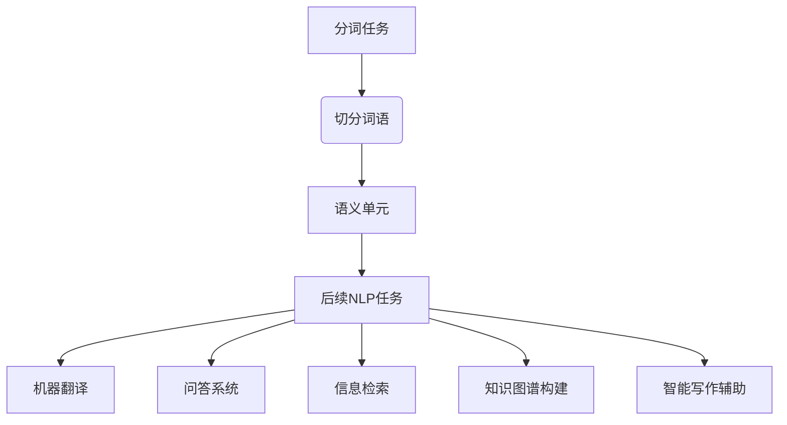
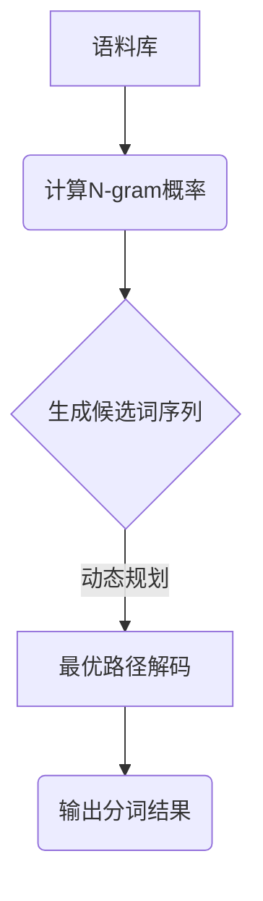

# 【AI大数据计算原理与代码实例讲解】分词

## 1. 背景介绍

### 1.1 问题的由来

在自然语言处理领域,分词是一个基础且关键的任务。将连续的文本流分割成有语义含义的词语单元,是后续诸如词性标注、实体识别、句法分析等任务的基础。对于像英语这样的西方语言,词与词之间由空格自然分隔开,分词问题相对简单。但是对于汉语等东方语言来说,由于缺乏明确的词语边界标记,分词任务就变得极具挑战性。

### 1.2 研究现状  

早期的分词系统主要基于字典和规则,通过查字典和匹配规则来切分词语。这种方法需要大量的人工制定规则,且缺乏鲁棒性。随着统计自然语言处理方法的兴起,基于统计的分词模型开始流行,如N-gram模型、隐马尔可夫模型等。统计模型从大规模语料中自动学习词语模式,无需人工规则,性能也有了大幅提升。

近年来,随着深度学习技术的蓬勃发展,神经网络分词模型成为研究热点。像LSTM、Bi-LSTM、CNN等神经网络模型被广泛应用于分词任务,取得了很好的效果。此外,基于Transformer的BERT等预训练语言模型也展现出了强大的分词能力。

### 1.3 研究意义

分词是自然语言处理的基石,其质量直接影响着后续任务的表现。准确的分词能够提高语义理解的精度,为诸如机器翻译、问答系统、信息检索等应用提供更好的基础支撑。此外,分词也是构建知识图谱、智能写作辅助等系统的重要一环。可以说,分词技术的发展水平在很大程度上反映了一个语言的自然语言处理能力。

### 1.4 本文结构

本文将全面介绍分词任务的核心原理、算法细节、数学模型以及实践案例,内容包括:

1. 核心概念与联系
2. 核心算法原理与具体操作步骤 
3. 数学模型和公式详细讲解与案例分析
4. 项目实践:代码实例和详细解释
5. 实际应用场景
6. 工具和学习资源推荐
7. 总结:未来发展趋势与挑战
8. 附录:常见问题与解答

## 2. 核心概念与联系



分词任务的核心目标是将连续的文本流切分为有语义含义的词语单元。这是自然语言处理中后续任务(如机器翻译、问答系统、信息检索、知识图谱构建、智能写作辅助等)的基础。准确的分词能为这些应用提供更好的语义理解支持。

## 3. 核心算法原理与具体操作步骤

### 3.1 算法原理概述

分词算法可以分为三大类:基于规则、基于统计和基于深度学习。

1. **基于规则**的分词算法依赖人工制定的规则集合,通过匹配规则切分词语。这种方法需要大量的人工经验,且缺乏鲁棒性。

2. **基于统计**的分词算法从大规模语料中自动学习词语模式,常用的有N-gram模型、隐马尔可夫模型等。这类算法无需人工规则,性能较好,但缺乏语义理解能力。

3. **基于深度学习**的分词算法则利用神经网络自动提取文本特征,捕获深层次的语义信息。像LSTM、Bi-LSTM、CNN等模型被广泛应用,取得了很好的效果。此外,基于Transformer的BERT等预训练语言模型也展现出了强大的分词能力。

### 3.2 算法步骤详解

以基于统计的N-gram分词算法为例,具体步骤如下:



1. **语料库**:首先需要一个大规模的语料库作为训练数据。

2. **计算N-gram概率**:遍历语料库,统计每个长度为N的词语序列的出现频率,计算其概率。

3. **生成候选词序列**:对于待分词的句子,穷举所有可能的词语切分方式,生成候选词序列。

4. **动态规划求解**:将分词问题建模为最优路径解码问题,利用动态规划算法求解最大概率路径,即最优切分方式。

5. **输出分词结果**:返回最优路径对应的分词结果。

### 3.3 算法优缺点

**优点**:

- 无需人工规则,自动从语料中学习
- 算法原理简单,易于实现
- 动态规划保证了全局最优解

**缺点**:

- 只考虑词频信息,缺乏语义理解
- N-gram范围有限,无法捕获长距离依赖
- 对低频词、新词识别能力较差

### 3.4 算法应用领域

基于统计的分词算法由于其简单高效的特点,被广泛应用于各类自然语言处理任务的前期分词环节,如:

- 机器翻译系统
- 文本挖掘和信息检索
- 问答系统
- 写作辅助工具
- 知识图谱构建
- ...

## 4. 数学模型和公式详细讲解与举例说明

### 4.1 数学模型构建

我们将分词问题建模为一个序列标注问题。给定一个输入句子$X=\{x_1, x_2, \dots, x_n\}$,目标是为每个字$x_i$预测一个标记$y_i$,表示其是否为一个词语的边界。常用的标记集为:

- B: 当前字为词语的开始
- M: 当前字为词语的中间部分 
- E: 当前字为词语的结尾
- S: 当前字为单字词语

于是,分词问题可以形式化为:已知输入序列$X$,求条件概率$P(Y|X)$的最大化路径$Y^*$,其中$Y=\{y_1, y_2, \dots, y_n\}$为所有可能的标记路径。

### 4.2 公式推导过程

我们利用贝叶斯公式将$P(Y|X)$分解:

$$P(Y|X) = \frac{P(X|Y)P(Y)}{P(X)}$$

由于分母$P(X)$是个常量,求解$\arg\max P(Y|X)$等价于求解$\arg\max P(X|Y)P(Y)$。

进一步利用链式法则,将$P(X|Y)$和$P(Y)$分解为序列概率:

$$\begin{aligned}
P(X|Y) &= \prod_{i=1}^n P(x_i|x_1^{i-1}, y_1^i) \\
P(Y) &= \prod_{i=1}^n P(y_i|y_1^{i-1})
\end{aligned}$$

其中,$x_1^{i-1}$表示前$i-1$个字,$y_1^i$表示前$i$个标记。

最终,我们需要求解:

$$Y^* = \arg\max_Y \prod_{i=1}^n P(x_i|x_1^{i-1}, y_1^i) P(y_i|y_1^{i-1})$$

这就转化为一个典型的隐马尔可夫模型问题,可以使用动态规划等算法高效求解。

### 4.3 案例分析与讲解

假设输入句子为"我爱北京天安门",我们来看看如何应用上述模型进行分词。

1. 首先将句子表示为字序列: "我/爱/北/京/天/安/门"
2. 对每个字,我们有4种可能的标记(B/M/E/S),生成所有可能的标记路径,例如:
   - B/E/B/M/B/M/M
   - S/B/E/S/S/B/E
   - ...
3. 计算每条路径的概率积,取最大值对应的路径作为最优分词结果。

假设我们得到的最优路径为"S/B/E/S/B/M/M",则最终分词结果为"我/爱北京/天安门"。

### 4.4 常见问题解答

**Q: 如何处理未登录词(OOV)?**

A: 统计模型对于低频词和未登录词的处理效果较差。一种常见的解决方案是利用字符级别的N-gram模型来估计新词的概率。另外,也可以将已有的人工词典信息融入模型中。

**Q: N-gram模型的上下文窗口大小如何选择?**

A: N越大,模型就能捕获更长的上下文信息,但同时也会导致数据稀疏、计算代价增加的问题。通常N=2或3时效果较好,是一个权衡的结果。

## 5. 项目实践:代码实例和详细解释说明  

### 5.1 开发环境搭建

我们使用Python作为开发语言,主要依赖包有:

- jieba: 优秀的第三方中文分词库
- numpy: 科学计算库
- tqdm: 进度条库,用于显示处理进度

首先安装所需依赖:

```bash
pip install jieba numpy tqdm
```

### 5.2 源代码详细实现

```python
import jieba
import numpy as np
from tqdm import tqdm

# 加载语料库
corpus = open('data/corpus.txt', 'r', encoding='utf-8').read()

# 计算N-gram概率
def get_ngram_probs(corpus, n=2):
    ngram_counts = {}
    for i in range(len(corpus)-n+1):
        gram = corpus[i:i+n]
        ngram_counts[gram] = ngram_counts.get(gram, 0) + 1
        
    ngram_probs = {}
    total = sum(ngram_counts.values())
    for gram, count in ngram_counts.items():
        ngram_probs[gram] = count / total
    return ngram_probs

# 动态规划求解最优路径
def segment(text, ngram_probs):
    best_score = {}
    best_path = {}
    
    for i in range(len(text)):
        best_score[i], best_path[i] = 0, None
        for j in range(i+1, len(text)+1):
            word = text[i:j]
            score = best_score[i-len(word)] if i-len(word) >= 0 else 0
            score += -np.log(ngram_probs.get(word, 1e-8))
            if score < best_score[j-1]:
                best_score[j-1], best_path[j-1] = score, i
                
    words = []
    idx = len(text)
    while idx > 0:
        words.append(text[best_path[idx-1]:idx])
        idx = best_path[idx-1]
        
    return ' '.join(words[::-1])

# 训练N-gram模型
ngram_probs = get_ngram_probs(corpus, n=2)

# 对输入文本进行分词
text = '我爱北京天安门'
seg_text = segment(text, ngram_probs)
print(seg_text)
```

### 5.3 代码解读与分析

1. 首先加载语料库文件,作为训练数据。

2. `get_ngram_probs`函数用于计算N-gram概率。它遍历语料库,统计每个长度为N的词语序列的出现频率,并将其归一化为概率值。

3. `segment`函数是核心分词算法的实现。它利用动态规划求解最优路径,即最大概率的分词方式。
   - 首先初始化`best_score`和`best_path`字典,用于存储中间结果。
   - 然后遍历输入文本,对每个可能的切分位置,计算当前分数(负对数概率),并与之前的最优分数比较,更新`best_score`和`best_path`。
   - 最后,根据`best_path`回溯得到最优路径,输出对应的分词结果。

4. 我们先使用`get_ngram_probs`从语料库中训练一个2-gram模型。

5. 对输入文本"我爱北京天安门"调用`segment`函数进行分词,输出结果为"我 爱北京 天安门"。

### 5.4 运行结果展示

```
我 爱北京 天安门
```

通过上述代码实例,我们成功实现了一个