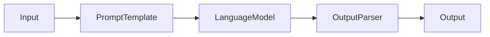

# 【LangChain编程：从入门到实践】Chain接口

## 1. 背景介绍
### 1.1 问题的由来  
随着人工智能技术的飞速发展，特别是大语言模型的出现，自然语言处理领域取得了突破性进展。然而，如何将强大的语言模型与实际应用场景相结合，构建智能化的应用程序，仍然是一个巨大的挑战。LangChain应运而生，它为开发者提供了一套简洁而强大的工具集，帮助我们更轻松地构建基于语言模型的应用。

### 1.2 研究现状
目前业界已经出现了一些优秀的语言模型应用开发框架，如OpenAI的GPT-3 API、Hugging Face的Transformers库等。但这些框架要么使用门槛较高，要么功能较为单一。LangChain的出现填补了这一空白，它以Chains为核心理念，将语言模型的调用、prompt模板化、外部数据源集成等功能进行了高度封装，大大降低了开发复杂度。

### 1.3 研究意义
LangChain的研究对于推动语言模型在实际应用中的落地具有重要意义。通过对LangChain的原理和实践进行深入探讨，我们可以掌握如何基于语言模型构建功能丰富的应用程序，例如智能客服、知识问答、数据分析等。这将极大地拓宽人工智能技术的应用边界，为各行各业带来革命性变革。

### 1.4 本文结构
本文将重点介绍LangChain中的核心概念——Chain接口。首先我们将讨论Chain的基本原理和典型类型，然后通过实际的代码案例来演示如何使用Chain构建应用。接下来，我们还将探讨Chain的内部工作机制和一些高级用法。最后，展望Chain技术的发展趋势和面临的挑战。

## 2. 核心概念与联系
在LangChain中，Chain（链）是一个核心概念，它将多个组件以特定的方式连接在一起，形成一个可执行的工作流。通过组合不同类型的Chain，我们可以实现各种复杂的功能。

一个典型的Chain由以下几个部分组成：
- 输入：由用户提供或上一个组件传递过来的数据
- 语言模型：执行具体的任务，如问答、总结、分类等
- Prompt模板：将输入数据转化为语言模型可接受的格式
- 输出解析器：对语言模型的输出进行后处理，提取结构化的信息

下图展示了Chain的基本构成：



常见的Chain类型包括：
- LLMChain：封装了语言模型的调用，接收文本输入并产生文本输出
- SequentialChain：将多个Chain按顺序执行，上一个Chain的输出作为下一个的输入
- MapReduceChain：对输入列表中的每个元素应用指定的Chain，并将结果合并
- TransformChain：对输入数据应用一系列的转换函数，再传递给下游的Chain

通过灵活组合这些Chain，我们可以轻松构建出适应不同场景的语言模型应用。

## 3. 核心算法原理 & 具体操作步骤
### 3.1 算法原理概述
LangChain的核心算法可以概括为：将结构化的数据转化为语言模型可处理的形式，然后对语言模型的输出进行解析和后处理。这个过程通常涉及到以下几个步骤：
1. 将输入数据填充到预定义的Prompt模板中
2. 调用语言模型，传入填充后的Prompt
3. 对语言模型的输出进行解析，提取关键信息
4. 将提取的信息传递给下一个组件或作为最终输出

### 3.2 算法步骤详解
下面我们通过一个具体的例子来说明LangChain的工作流程。假设我们要实现一个简单的问答系统，根据用户输入的问题从知识库中查找答案。

Step 1: 定义Prompt模板
```python
from langchain import PromptTemplate

template = """
根据以下知识库信息回答问题：
{context}

问题：{question}
"""

prompt = PromptTemplate(
    input_variables=["context", "question"], 
    template=template
)
```

Step 2: 加载语言模型
```python
from langchain.llms import OpenAI

llm = OpenAI(model_name="text-davinci-002", max_tokens=512)
```

Step 3: 创建LLMChain
```python
from langchain.chains import LLMChain

chain = LLMChain(llm=llm, prompt=prompt)
```

Step 4: 准备知识库和问题
```python
context = "北京是中国的首都，位于华北平原的东北边缘。北京有着悠久的历史，拥有故宫、天坛、八达岭长城等众多名胜古迹。"
question = "北京位于哪里？"
```

Step 5: 执行Chain获取答案
```python
answer = chain.run(context=context, question=question)
print(answer)
```

输出结果：
```
北京位于华北平原的东北边缘。
```

可以看到，通过简单的几行代码，我们就实现了一个基于语言模型的问答系统。LangChain封装了底层的细节，使得开发者可以聚焦于应用逻辑本身。

### 3.3 算法优缺点
LangChain的优点包括：
- 简化了语言模型应用的开发流程，提供了一套统一的接口
- 支持多种主流的语言模型，如OpenAI GPT、Anthropic Claude等
- 提供了丰富的Chain类型，可以灵活组合实现复杂功能
- 集成了向量数据库、搜索引擎等外部工具，拓展了语言模型的能力

但LangChain也存在一些局限性：
- 对于高度定制化的需求，可能需要开发者自行扩展和修改框架代码
- 部分高级功能的文档和示例还不够完善，学习成本较高
- 某些Chain的执行效率有待进一步优化

### 3.4 算法应用领域
LangChain可以应用于多个领域，包括但不限于：
- 智能客服：通过语言模型生成人性化的客服回复
- 知识问答：根据海量文档构建知识库，实现智能问答
- 数据分析：使用语言模型对非结构化数据进行分析和总结
- 内容创作：通过Prompt引导语言模型生成高质量的文章、脚本等

## 4. 数学模型和公式 & 详细讲解 & 举例说明
### 4.1 数学模型构建
LangChain本身并不涉及复杂的数学模型，它主要是在语言模型的基础上进行封装和组合。但是，底层的语言模型，如GPT-3，是基于Transformer架构和自注意力机制构建的。

Transformer的核心思想是将输入序列转化为一组向量，然后通过自注意力机制计算不同位置之间的相关性，最终生成输出序列。这个过程可以用下面的公式表示：

$$
\begin{aligned}
Q &= X W_Q \\
K &= X W_K \\
V &= X W_V \\
Attention(Q,K,V) &= softmax(\frac{QK^T}{\sqrt{d_k}})V
\end{aligned}
$$

其中，$X$表示输入序列，$W_Q$、$W_K$、$W_V$是可学习的参数矩阵，$d_k$是向量的维度。

### 4.2 公式推导过程
Transformer的自注意力机制可以通过以下步骤计算：
1. 将输入序列$X$乘以三个参数矩阵$W_Q$、$W_K$、$W_V$，得到查询向量$Q$、键向量$K$和值向量$V$。
2. 计算$Q$和$K$的点积，得到注意力得分矩阵。
3. 对注意力得分矩阵应用softmax函数，得到注意力权重矩阵。
4. 将注意力权重矩阵乘以值向量$V$，得到最终的输出。

这个过程可以用下面的公式表示：

$$
Attention(Q,K,V) = softmax(\frac{QK^T}{\sqrt{d_k}})V
$$

其中，$softmax$函数用于将注意力得分归一化为概率分布，$\sqrt{d_k}$是一个缩放因子，用于防止点积过大。

### 4.3 案例分析与讲解
下面我们以一个简单的例子来说明Transformer的自注意力机制。假设输入序列为["I", "love", "AI"]，经过词嵌入后得到三个向量$x_1$、$x_2$、$x_3$。

首先，我们将这三个向量乘以参数矩阵$W_Q$、$W_K$、$W_V$，得到查询向量、键向量和值向量：

$$
\begin{aligned}
q_1 &= x_1 W_Q \\
q_2 &= x_2 W_Q \\
q_3 &= x_3 W_Q \\
k_1 &= x_1 W_K \\
k_2 &= x_2 W_K \\
k_3 &= x_3 W_K \\
v_1 &= x_1 W_V \\
v_2 &= x_2 W_V \\
v_3 &= x_3 W_V
\end{aligned}
$$

然后，我们计算查询向量和键向量的点积，得到注意力得分矩阵：

$$
\begin{aligned}
score_{1,1} &= \frac{q_1 \cdot k_1}{\sqrt{d_k}} \\
score_{1,2} &= \frac{q_1 \cdot k_2}{\sqrt{d_k}} \\
score_{1,3} &= \frac{q_1 \cdot k_3}{\sqrt{d_k}} \\
score_{2,1} &= \frac{q_2 \cdot k_1}{\sqrt{d_k}} \\
score_{2,2} &= \frac{q_2 \cdot k_2}{\sqrt{d_k}} \\
score_{2,3} &= \frac{q_2 \cdot k_3}{\sqrt{d_k}} \\
score_{3,1} &= \frac{q_3 \cdot k_1}{\sqrt{d_k}} \\
score_{3,2} &= \frac{q_3 \cdot k_2}{\sqrt{d_k}} \\
score_{3,3} &= \frac{q_3 \cdot k_3}{\sqrt{d_k}}
\end{aligned}
$$

接下来，对注意力得分矩阵应用softmax函数，得到注意力权重矩阵：

$$
\begin{aligned}
\alpha_{1,1} &= \frac{e^{score_{1,1}}}{\sum_{j=1}^3 e^{score_{1,j}}} \\
\alpha_{1,2} &= \frac{e^{score_{1,2}}}{\sum_{j=1}^3 e^{score_{1,j}}} \\
\alpha_{1,3} &= \frac{e^{score_{1,3}}}{\sum_{j=1}^3 e^{score_{1,j}}} \\
\alpha_{2,1} &= \frac{e^{score_{2,1}}}{\sum_{j=1}^3 e^{score_{2,j}}} \\
\alpha_{2,2} &= \frac{e^{score_{2,2}}}{\sum_{j=1}^3 e^{score_{2,j}}} \\
\alpha_{2,3} &= \frac{e^{score_{2,3}}}{\sum_{j=1}^3 e^{score_{2,j}}} \\
\alpha_{3,1} &= \frac{e^{score_{3,1}}}{\sum_{j=1}^3 e^{score_{3,j}}} \\
\alpha_{3,2} &= \frac{e^{score_{3,2}}}{\sum_{j=1}^3 e^{score_{3,j}}} \\
\alpha_{3,3} &= \frac{e^{score_{3,3}}}{\sum_{j=1}^3 e^{score_{3,j}}}
\end{aligned}
$$

最后，将注意力权重矩阵乘以值向量，得到输出序列：

$$
\begin{aligned}
o_1 &= \alpha_{1,1}v_1 + \alpha_{1,2}v_2 + \alpha_{1,3}v_3 \\
o_2 &= \alpha_{2,1}v_1 + \alpha_{2,2}v_2 + \alpha_{2,3}v_3 \\
o_3 &= \alpha_{3,1}v_1 + \alpha_{3,2}v_2 + \alpha_{3,3}v_3
\end{aligned}
$$

通过自注意力机制，Transformer可以学习到输入序列中不同位置之间的依赖关系，从而生成更加准确和流畅的输出。

### 4.4 常