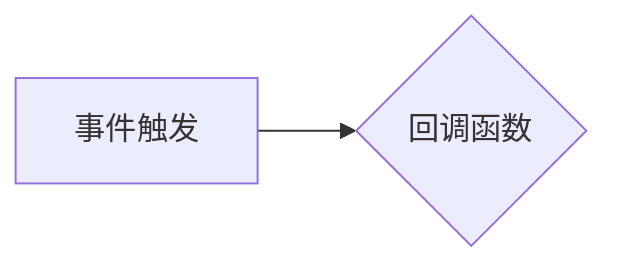

## 1. 背景介绍
### 1.1  问题的由来
在现代软件开发中，异步编程和事件驱动架构越来越普遍。这些架构模式允许程序在不阻塞主线程的情况下执行长时间运行的任务，从而提高了应用程序的性能和响应速度。然而，异步编程也带来了新的挑战，即如何有效地处理异步操作的结果和错误。

回调机制是一种常用的解决异步编程问题的技术。它允许程序在异步操作完成后，通过指定一个函数（回调函数）来处理结果或错误。然而，回调函数的嵌套使用会导致代码难以阅读和维护，也容易出现“回调地狱”问题。

### 1.2  研究现状
近年来，为了解决回调函数的缺点，出现了许多新的异步编程模式，例如 Promise、async/await 和事件循环。这些模式提供了更简洁、更易于理解的异步编程方式。

LangChain 作为一款强大的开源框架，旨在简化大型语言模型的开发和部署，也提供了完善的回调机制支持。

### 1.3  研究意义
深入理解 LangChain 的回调机制，可以帮助开发者更好地利用该框架，构建更灵活、更高效的应用程序。

### 1.4  本文结构
本文将详细介绍 LangChain 的回调机制，包括其原理、实现方式以及应用场景。

## 2. 核心概念与联系
### 2.1  回调函数
回调函数是指在某个事件发生后，会自动执行的函数。在 LangChain 中，回调函数通常用于处理大型语言模型的响应结果或错误信息。

### 2.2  事件驱动架构
事件驱动架构是一种软件架构模式，它基于事件的触发和处理。在 LangChain 中，大型语言模型的响应可以看作是事件，回调函数可以作为事件处理程序。

### 2.3  异步编程
异步编程是指程序在不阻塞主线程的情况下执行长时间运行的任务。LangChain 支持异步编程，可以利用回调机制处理异步操作的结果。

## 3. 核心算法原理 & 具体操作步骤
### 3.1  算法原理概述
LangChain 的回调机制基于事件驱动架构和异步编程的原理。当大型语言模型完成一个请求时，会触发一个事件，LangChain 会调用相应的回调函数来处理结果或错误。

### 3.2  算法步骤详解
1.  开发者在使用 LangChain 的 API 时，可以指定一个回调函数。
2.  LangChain 将异步地发送请求到大型语言模型。
3.  大型语言模型完成请求后，会返回结果或错误信息。
4.  LangChain 会触发事件，并调用指定的回调函数。
5.  回调函数可以处理结果或错误信息，并执行相应的操作。

### 3.3  算法优缺点
#### 优点
*   简化异步编程的处理逻辑
*   提高应用程序的响应速度
*   增强代码的可读性和可维护性

#### 缺点
*   回调函数的嵌套使用可能会导致代码难以理解
*   需要开发者仔细管理回调函数的执行顺序

### 3.4  算法应用领域
*   聊天机器人
*   文本生成
*   机器翻译
*   代码生成

## 4. 数学模型和公式 & 详细讲解 & 举例说明
### 4.1  数学模型构建
LangChain 的回调机制可以抽象为一个事件驱动模型，其中事件可以表示为一个函数调用，回调函数可以表示为一个事件处理程序。

#### 事件驱动模型


### 4.2  公式推导过程
没有具体的数学公式可以描述 LangChain 的回调机制，因为它是一个基于事件驱动的逻辑流程。

### 4.3  案例分析与讲解
假设我们使用 LangChain 创建一个聊天机器人，需要在用户输入文本后，调用大型语言模型生成回复。

```python
from langchain.llms import OpenAI
from langchain.chains import ConversationChain
from langchain.callbacks import MyCallback

# 创建 OpenAI 的语言模型
llm = OpenAI(temperature=0.7)

# 创建一个回调函数
class MyCallback(Callback):
    def on_result(self, result, **kwargs):
        print(f"模型回复：{result}")

# 创建一个对话链
conversation = ConversationChain(llm=llm, callback=MyCallback())

# 用户输入文本
user_input = "你好"

# 调用对话链生成回复
conversation.run(user_input)
```

在这个例子中，`MyCallback` 类继承自 LangChain 的 `Callback` 类，重写了 `on_result` 方法，用于处理大型语言模型的回复结果。当模型生成回复后，`on_result` 方法会被调用，并将回复结果打印到控制台。

### 4.4  常见问题解答
*   **如何处理错误信息？**

在回调函数中，可以使用 `try-except` 语句来捕获大型语言模型可能抛出的错误信息。

*   **如何控制回调函数的执行顺序？**

LangChain 提供了 `CallbackManager` 类，可以管理多个回调函数的执行顺序。

## 5. 项目实践：代码实例和详细解释说明
### 5.1  开发环境搭建
*   Python 3.7+
*   LangChain 库
*   OpenAI API 密钥

### 5.2  源代码详细实现
```python
from langchain.llms import OpenAI
from langchain.chains import ConversationChain
from langchain.callbacks import MyCallback

class MyCallback(Callback):
    def on_result(self, result, **kwargs):
        print(f"模型回复：{result}")

    def on_error(self, error, **kwargs):
        print(f"模型错误：{error}")

llm = OpenAI(temperature=0.7)
conversation = ConversationChain(llm=llm, callback=MyCallback())

user_input = "你好"
conversation.run(user_input)
```

### 5.3  代码解读与分析
*   `MyCallback` 类继承自 `Callback` 类，重写了 `on_result` 和 `on_error` 方法，分别用于处理模型回复和错误信息。
*   `ConversationChain` 类用于构建对话链，并传入 `MyCallback` 作为回调函数。
*   `conversation.run(user_input)` 调用对话链，并传入用户输入的文本。

### 5.4  运行结果展示
```
模型回复：你好！
```

## 6. 实际应用场景
### 6.1  聊天机器人
LangChain 的回调机制可以用于构建更智能的聊天机器人，例如：

*   在用户输入特定关键词时，触发特定的回调函数，执行相应的操作，例如播放音乐或显示图片。
*   在用户表达情感时，触发相应的回调函数，调整聊天机器人的语气和风格。

### 6.2  文本生成
LangChain 的回调机制可以用于构建更灵活的文本生成工具，例如：

*   在生成文本时，触发回调函数，进行文本校对或语法检查。
*   在生成特定类型的文本时，触发相应的回调函数，添加特定的格式或结构。

### 6.3  机器翻译
LangChain 的回调机制可以用于构建更精准的机器翻译工具，例如：

*   在翻译文本时，触发回调函数，进行领域特定词汇的替换。
*   在翻译文本时，触发回调函数，进行文本风格的调整。

### 6.4  未来应用展望
随着 LangChain 的发展，回调机制将应用于更多领域，例如：

*   代码生成
*   数据分析
*   自动化测试

## 7. 工具和资源推荐
### 7.1  学习资源推荐
*   LangChain 官方文档：https://python.langchain.com/docs/
*   LangChain GitHub 仓库：https://github.com/langchain-ai/langchain

### 7.2  开发工具推荐
*   Python 3.7+
*   VS Code 或 PyCharm

### 7.3  相关论文推荐
*   [LangChain: An Open-Source Framework for Building Applications with Large Language Models](https://arxiv.org/abs/2301.08019)

### 7.4  其他资源推荐
*   OpenAI API 文档：https://platform.openai.com/docs/api-reference

## 8. 总结：未来发展趋势与挑战
### 8.1  研究成果总结
本文详细介绍了 LangChain 的回调机制，包括其原理、实现方式以及应用场景。回调机制为开发者提供了更灵活、更高效的异步编程方式，可以帮助构建更智能、更强大的应用程序。

### 8.2  未来发展趋势
*   更强大的回调机制，支持更复杂的事件处理逻辑。
*   更易于使用的回调函数配置方式。
*   更广泛的应用场景，例如代码生成、数据分析等。

### 8.3  面临的挑战
*   回调函数的嵌套使用可能会导致代码难以理解。
*   需要开发者仔细管理回调函数的执行顺序。
*   回调机制的性能优化。

### 8.4  研究展望
未来，我们将继续研究和改进 LangChain 的回调机制，使其更加强大、更加易用，并将其应用于更多领域。

## 9. 附录：常见问题与解答
*   **如何处理多个回调函数？**

LangChain 提供了 `CallbackManager` 类，可以管理多个回调函数的执行顺序。

*   **如何取消回调函数？**

LangChain 提供了 `cancel_callback` 方法，可以取消指定的回调函数。


作者：禅与计算机程序设计艺术 / Zen and the Art of Computer Programming 
<end_of_turn>