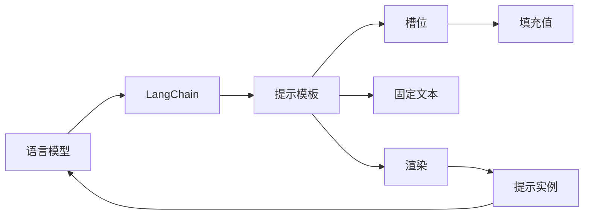

# 【LangChain编程：从入门到实践】提示模板组件

## 1. 背景介绍
### 1.1  问题的由来
在人工智能和自然语言处理领域，提示工程（Prompt Engineering）是一个新兴且重要的研究方向。它旨在设计和优化提示（Prompt），以更好地引导语言模型（如GPT-3、BERT等）生成高质量、符合特定要求的文本。然而，设计高效的提示需要大量的经验和技巧，且目前缺乏系统化的工具和框架来支持提示工程。

### 1.2  研究现状
目前，提示工程主要依赖于人工设计和反复试验，效率较低且质量不稳定。一些研究者提出了基于搜索和优化的方法来自动生成提示[1]，但仍然缺乏通用性和可扩展性。LangChain作为一个新兴的语言模型应用开发框架，为提示工程提供了一定的支持，但其提示模板组件还比较基础，缺乏高级功能和最佳实践指南[2]。

### 1.3  研究意义
提示工程是实现语言模型价值的关键，高质量的提示可以显著提升语言模型在各种任务上的表现，如问答、摘要、翻译、创作等。系统研究LangChain的提示模板组件，总结其使用模式和优化策略，可以帮助开发者更高效地设计和实现基于语言模型的应用，加速人工智能技术的落地。

### 1.4  本文结构
本文将首先介绍LangChain框架和提示模板的核心概念，然后详细讲解其提示模板组件的原理和使用方法，给出具体的代码实例和应用场景。最后，本文将总结提示模板优化的最佳实践，展望其未来的发展方向和挑战。

## 2. 核心概念与联系
- LangChain：一个用于开发语言模型应用的开源框架，提供了端到端的抽象和工具[2]。
- 语言模型：以自然语言文本为输入和输出的深度学习模型，如GPT-3、BERT等。
- 提示（Prompt）：输入给语言模型的文本序列，引导其生成所需的输出文本。
- 提示模板：包含固定文本和可填充槽位的提示结构，可以动态生成具体的提示实例。
- 提示工程：设计和优化提示的过程，目标是最大化语言模型的性能和输出质量。

下图展示了LangChain框架中提示模板组件的核心概念和关系：



## 3. 核心算法原理 & 具体操作步骤
### 3.1  算法原理概述
LangChain的提示模板组件基于Python的字符串格式化和模板引擎实现。它允许定义包含固定文本和槽位的模板，然后通过填充槽位生成具体的提示实例。这种方式可以最大限度地复用提示结构，灵活生成各种提示。

### 3.2  算法步骤详解
1. 定义提示模板：使用f-string或模板引擎定义包含固定文本和槽位的模板。
2. 创建提示模板实例：将模板字符串传入PromptTemplate类构造函数。
3. 填充槽位：调用prompt方法，传入槽位填充值，生成具体的提示实例。
4. 将提示输入给语言模型，获取输出结果。

### 3.3  算法优缺点
优点：
- 复用提示结构，减少重复工作
- 支持动态生成提示，灵活性高
- 简单易用，与Python原生字符串格式化一致

缺点：
- 缺乏槽位类型检查和约束
- 缺乏槽位填充的高级功能，如条件填充、迭代填充等
- 没有内置的提示优化和测试机制

### 3.4  算法应用领域
提示模板广泛应用于各种语言模型应用，如：
- 问答系统：根据问题类型和上下文动态生成提示
- 文本生成：根据主题、风格、长度等条件动态生成提示
- 数据增强：根据原始数据和变换规则生成增强样本的提示
- 多轮对话：根据对话历史和用户输入动态生成下一轮回复的提示

## 4. 数学模型和公式 & 详细讲解 & 举例说明
### 4.1  数学模型构建
设提示模板为$T$，其中包含$n$个槽位$S_i$和$m$段固定文本$F_j$，则$T$可表示为：

$$
T = F_0 + S_1 + F_1 + S_2 + ... + S_n + F_m
$$

其中，$+$表示字符串拼接操作。当给定槽位填充值$V_i$时，提示实例$P$可表示为：

$$
P = F_0 + V_1 + F_1 + V_2 + ... + V_n + F_m
$$

### 4.2  公式推导过程
令槽位填充值的集合为$V={V_1, V_2, ..., V_n}$，则生成提示实例的过程可表示为函数$f$：

$$
f(T, V) = P
$$

其中，$f$函数的实现基于字符串格式化或模板引擎。

### 4.3  案例分析与讲解
考虑一个简单的提示模板：

```python
template = "What is the capital of {country}?"
```

其中，`{country}`是一个槽位。当给定填充值`"France"`时，生成的提示实例为：

```python
prompt = "What is the capital of France?"
```

将该提示输入给语言模型，可以得到类似以下的输出：

```
The capital of France is Paris.
```

### 4.4  常见问题解答
- 问：如何在提示模板中使用条件语句或循环？
  答：可以使用模板引擎（如Jinja2）提供的控制结构，如``、``等。

- 问：如何在提示模板中使用变量或函数？
  答：可以在槽位填充值中传入变量或函数，在模板渲染时进行计算或调用。

- 问：如何优化提示模板以提高语言模型的性能？
  答：可以通过实验和分析不同的提示模板，选择最优的结构和措辞。也可以使用一些启发式规则，如避免歧义、保持简洁等。

## 5. 项目实践：代码实例和详细解释说明
### 5.1  开发环境搭建
首先，安装LangChain库：

```bash
pip install langchain
```

然后，导入所需的模块：

```python
from langchain import PromptTemplate
```

### 5.2  源代码详细实现
下面是一个使用LangChain提示模板组件的完整示例：

```python
from langchain import PromptTemplate

# 定义提示模板
template = """
I want you to act as a naming consultant for new companies.
What is a good name for a company that makes {product}?
"""

# 创建提示模板实例
prompt = PromptTemplate(
    input_variables=["product"],
    template=template,
)

# 填充槽位生成提示实例
prompt_instance = prompt.format(product="colorful socks")

print(prompt_instance)
```

### 5.3  代码解读与分析
- 第5-8行：使用三引号定义了一个多行字符串作为提示模板，其中`{product}`是一个槽位。
- 第11-14行：创建了一个PromptTemplate实例，指定了槽位名称和模板字符串。
- 第17行：调用prompt.format方法，传入槽位填充值，生成具体的提示实例。
- 第19行：打印生成的提示实例。

### 5.4  运行结果展示
运行上述代码，输出结果为：

```
I want you to act as a naming consultant for new companies.
What is a good name for a company that makes colorful socks?
```

可以看到，提示模板中的`{product}`槽位被替换为了`"colorful socks"`，生成了一个完整的提示实例。

## 6. 实际应用场景
提示模板组件在许多实际应用中发挥着重要作用，例如：

- 个性化推荐：根据用户的个人信息和偏好动态生成推荐提示。
- 智能客服：根据客户的问题和历史记录动态生成回复提示。
- 创意写作：根据主题、体裁、风格等条件动态生成写作提示。
- 代码生成：根据编程语言、功能需求、上下文等动态生成代码提示。

### 6.4  未来应用展望
随着语言模型的不断发展和提示工程的日益成熟，提示模板组件有望在更广泛的领域得到应用，如科研辅助、教育培训、游戏娱乐等。同时，提示模板也将与其他技术（如知识图谱、强化学习等）结合，实现更加智能和个性化的交互体验。

## 7. 工具和资源推荐
### 7.1  学习资源推荐
- [LangChain官方文档](https://langchain.readthedocs.io/)：提供了详尽的API参考和使用指南。
- [LangChain Github仓库](https://github.com/hwchase17/langchain)：包含了LangChain的源代码和示例。
- [提示工程指南](https://www.promptingguide.ai/)：一个全面介绍提示工程的在线教程。

### 7.2  开发工具推荐
- [OpenAI GPT-3](https://beta.openai.com/)：目前最先进的语言模型之一，可用于提示工程实验。
- [Hugging Face Transformers](https://huggingface.co/transformers/)：一个流行的NLP库，提供了多种预训练语言模型。
- [Streamlit](https://streamlit.io/)：一个快速构建交互式Web应用的工具，可用于提示工程的演示和测试。

### 7.3  相关论文推荐
- [Prompt Programming for Large Language Models: Beyond the Few-Shot Paradigm](https://arxiv.org/abs/2102.07350)
- [Prefix-Tuning: Optimizing Continuous Prompts for Generation](https://arxiv.org/abs/2101.00190)
- [AutoPrompt: Eliciting Knowledge from Language Models with Automatically Generated Prompts](https://arxiv.org/abs/2010.15980)

### 7.4  其他资源推荐
- [OpenPrompt](https://github.com/thunlp/OpenPrompt)：一个用于提示学习的开源框架。
- [PromptSource](https://github.com/bigscience-workshop/promptsource)：一个提示数据集的集合，包括多个NLP任务。
- [Awesome Prompt Engineering](https://github.com/promptslab/Awesome-Prompt-Engineering)：一个提示工程相关资源的列表。

## 8. 总结：未来发展趋势与挑战
### 8.1  研究成果总结
本文系统介绍了LangChain的提示模板组件，阐述了其核心概念、算法原理、使用方法和优化策略。通过具体的代码实例和应用场景，展示了提示模板在语言模型应用开发中的重要作用。本文的研究成果可以帮助开发者更高效地设计和实现基于提示的交互系统。

### 8.2  未来发展趋势
未来，提示工程领域有望出现以下发展趋势：

- 提示模板的标准化和模块化，支持跨平台和跨模型的复用。
- 提示优化技术的自动化，通过搜索、强化学习等方法自动生成最优提示。
- 提示的个性化和上下文化，根据用户特征和交互历史动态调整提示。
- 提示与知识的结合，利用知识图谱等外部知识增强提示的表达能力。

### 8.3  面临的挑战
尽管提示工程取得了长足的进步，但仍然面临着诸多挑战：

- 缺乏大规模、高质量的提示数据集，难以进行系统的评测和优化。
- 提示的泛化能力有限，难以适应新的任务和领域。
- 提示的可解释性和可控性不足，难以保证生成结果的安全性和合规性。
- 提示工程的理论基础薄弱，缺乏成熟的形式化方法和评价指标。

### 8.4  研究展望
为了应对上述挑战，未来的提示工程研究可以在以下方向深入探索：

- 构建大规模、多样化的提示数据集，支持不同任务和领域的评测。
- 研究提示的泛化和迁移机制